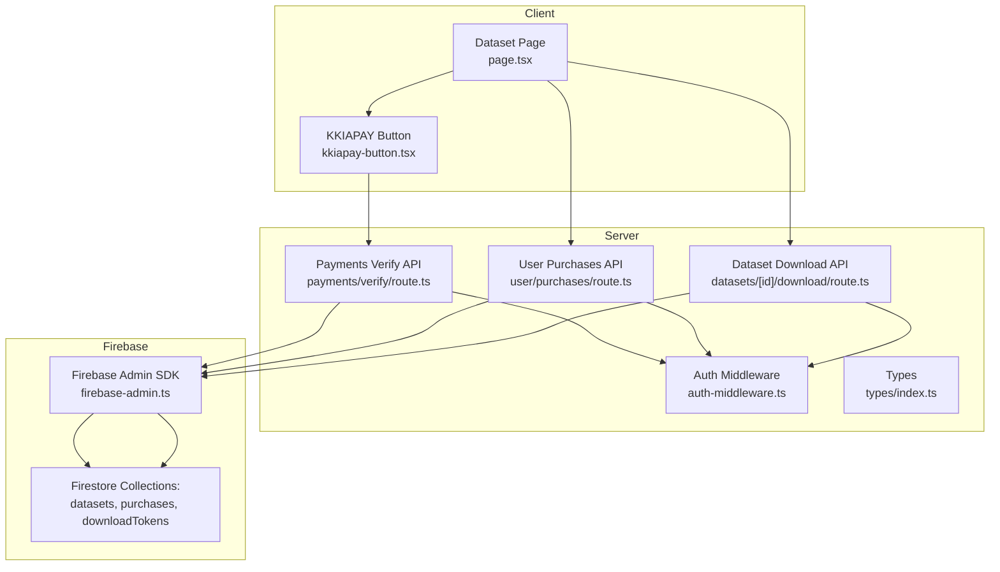
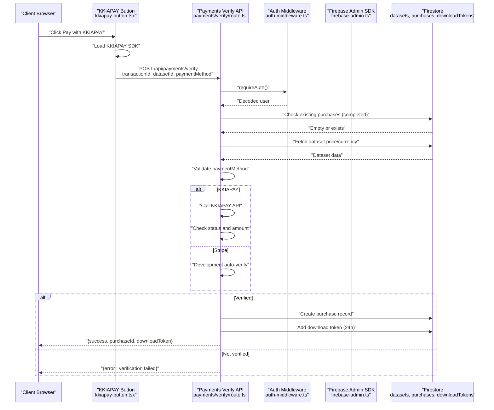
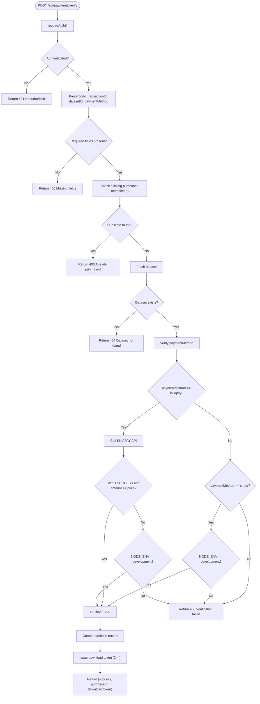
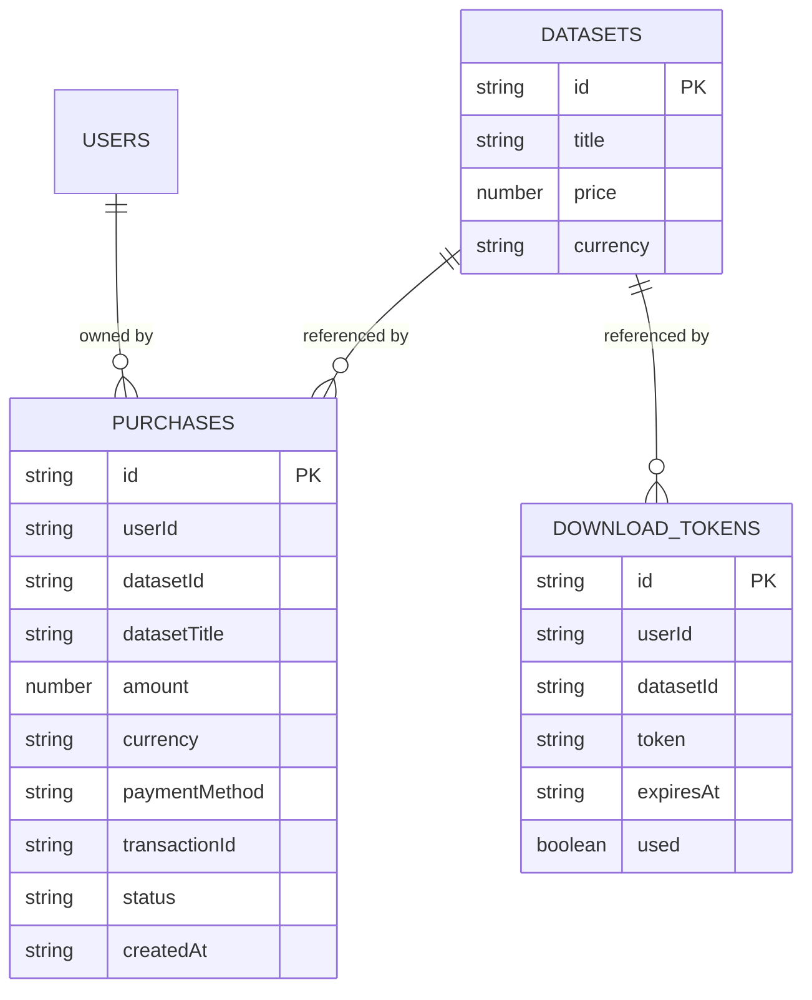
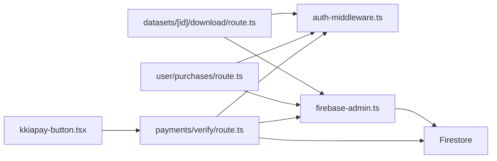

# Payment Verification

<cite>
**Referenced Files in This Document**
- [route.ts](file://src/app/api/payments/verify/route.ts)
- [route.ts](file://src/app/api/user/purchases/route.ts)
- [route.ts](file://src/app/api/datasets/[id]/download/route.ts)
- [kkiapay-button.tsx](file://src/components/payment/kkiapay-button.tsx)
- [page.tsx](file://src/app/datasets/[id]/page.tsx)
- [auth-middleware.ts](file://src/lib/auth-middleware.ts)
- [firebase-admin.ts](file://src/lib/firebase-admin.ts)
- [index.ts](file://src/types/index.ts)
</cite>

## Table of Contents
1. [Introduction](#introduction)
2. [Project Structure](#project-structure)
3. [Core Components](#core-components)
4. [Architecture Overview](#architecture-overview)
5. [Detailed Component Analysis](#detailed-component-analysis)
6. [Dependency Analysis](#dependency-analysis)
7. [Performance Considerations](#performance-considerations)
8. [Troubleshooting Guide](#troubleshooting-guide)
9. [Conclusion](#conclusion)

## Introduction
This document describes the payment verification system for confirming KKIAPAY transactions and updating purchase records. It explains the end-to-end workflow from initial payment confirmation through database updates and access permission granting, including transaction validation, duplicate payment prevention, error handling, and integration with Firebase Firestore. Security measures to prevent fraud and unauthorized access are documented, along with debugging strategies and performance considerations for high-volume processing.

## Project Structure
The payment verification system spans several Next.js API routes and client components:
- Payment verification endpoint: verifies KKIAPAY transactions and creates purchase records
- Purchase history endpoint: lists a user's completed purchases
- Download endpoint: grants access to datasets after verifying purchase and optional token
- Client-side payment widget: initiates KKIAPAY payments and triggers verification
- Authentication middleware: validates JWT tokens and enforces access control
- Firebase Admin SDK: server-side Firestore access and authentication utilities

**Diagram sources**
- [route.ts:1-135](file://src/app/api/payments/verify/route.ts#L1-L135)
- [route.ts:1-31](file://src/app/api/user/purchases/route.ts#L1-L31)
- [route.ts:1-97](file://src/app/api/datasets/[id]/download/route.ts#L1-L97)
- [kkiapay-button.tsx:1-109](file://src/components/payment/kkiapay-button.tsx#L1-L109)
- [page.tsx:93-120](file://src/app/datasets/[id]/page.tsx#L93-L120)
- [auth-middleware.ts:1-48](file://src/lib/auth-middleware.ts#L1-L48)
- [firebase-admin.ts:1-50](file://src/lib/firebase-admin.ts#L1-L50)
- [index.ts:1-90](file://src/types/index.ts#L1-L90)

**Section sources**
- [route.ts:1-135](file://src/app/api/payments/verify/route.ts#L1-L135)
- [route.ts:1-31](file://src/app/api/user/purchases/route.ts#L1-L31)
- [route.ts:1-97](file://src/app/api/datasets/[id]/download/route.ts#L1-L97)
- [kkiapay-button.tsx:1-109](file://src/components/payment/kkiapay-button.tsx#L1-L109)
- [page.tsx:93-120](file://src/app/datasets/[id]/page.tsx#L93-L120)
- [auth-middleware.ts:1-48](file://src/lib/auth-middleware.ts#L1-L48)
- [firebase-admin.ts:1-50](file://src/lib/firebase-admin.ts#L1-L50)
- [index.ts:1-90](file://src/types/index.ts#L1-L90)

## Core Components
- Payments Verify API: Validates payment method, checks for duplicates, verifies KKIAPAY transaction status, persists purchase, and issues a temporary download token
- User Purchases API: Lists a user's completed purchases for dashboard and history views
- Dataset Download API: Verifies purchase and optional token before allowing dataset downloads
- KKIAPAY Button: Client-side widget that loads the KKIAPAY SDK, collects payment details, and reports transaction ID to trigger verification
- Authentication Middleware: Enforces Bearer token authentication and decodes Firebase ID tokens
- Firebase Admin SDK: Provides Firestore access and lazy initialization of Firebase Admin services

**Section sources**
- [route.ts:1-135](file://src/app/api/payments/verify/route.ts#L1-L135)
- [route.ts:1-31](file://src/app/api/user/purchases/route.ts#L1-L31)
- [route.ts:1-97](file://src/app/api/datasets/[id]/download/route.ts#L1-L97)
- [kkiapay-button.tsx:1-109](file://src/components/payment/kkiapay-button.tsx#L1-L109)
- [auth-middleware.ts:1-48](file://src/lib/auth-middleware.ts#L1-L48)
- [firebase-admin.ts:1-50](file://src/lib/firebase-admin.ts#L1-L50)

## Architecture Overview
The payment verification workflow integrates client-side payment initiation with server-side transaction validation and database persistence. The system ensures:
- Authentication via Firebase ID tokens
- Duplicate purchase prevention using Firestore queries
- Transaction verification against KKIAPAY API
- Purchase record creation and temporary download token issuance
- Access control enforcement for dataset downloads

**Diagram sources**
- [route.ts:1-135](file://src/app/api/payments/verify/route.ts#L1-L135)
- [auth-middleware.ts:1-48](file://src/lib/auth-middleware.ts#L1-L48)
- [firebase-admin.ts:1-50](file://src/lib/firebase-admin.ts#L1-L50)
- [kkiapay-button.tsx:1-109](file://src/components/payment/kkiapay-button.tsx#L1-L109)

## Detailed Component Analysis

### Payments Verify API
Responsibilities:
- Authenticate request using Bearer token
- Validate presence of transactionId, datasetId, and paymentMethod
- Prevent duplicate purchases by checking completed purchases for the same user and dataset
- Fetch dataset metadata to verify price and currency
- Verify KKIAPAY transaction via external API and ensure amount meets or exceeds dataset price
- In development mode, auto-verify for testing
- Persist purchase record with payment metadata
- Issue a temporary download token with expiration

Key validations and flows:
- Authentication failure returns 401 Unauthorized
- Missing fields return 400 Bad Request
- Duplicate purchase detection returns 400 with alreadyPurchased flag
- Dataset not found returns 404 Not Found
- KKIAPAY verification errors are handled gracefully; in development, verification is bypassed
- On success, returns purchaseId and downloadToken

**Diagram sources**
- [route.ts:1-135](file://src/app/api/payments/verify/route.ts#L1-L135)

**Section sources**
- [route.ts:1-135](file://src/app/api/payments/verify/route.ts#L1-L135)

### User Purchases API
Responsibilities:
- Authenticate request using Bearer token
- Query Firestore purchases collection for the authenticated user
- Order results by creation date descending
- Return serialized purchases array

Security and error handling:
- Unauthorized requests return 401
- General errors return 500 with message

**Section sources**
- [route.ts:1-31](file://src/app/api/user/purchases/route.ts#L1-L31)

### Dataset Download API
Responsibilities:
- Authenticate request using Bearer token
- Verify that the user has a completed purchase for the requested dataset
- Optionally validate a download token if provided:
  - Match token, datasetId, and userId
  - Ensure token is unused and not expired
  - Mark token as used after successful validation
- Fetch dataset and associated data from Firestore
- Stream or return dataset in requested format (CSV, Excel, JSON)

Access control:
- No purchase record returns 403 Forbidden
- Invalid/expired token returns 403 Forbidden
- Dataset not found returns 404 Not Found

**Section sources**
- [route.ts:1-97](file://src/app/api/datasets/[id]/download/route.ts#L1-L97)

### KKIAPAY Button (Client)
Responsibilities:
- Dynamically loads the KKIAPAY SDK script
- Opens the payment widget with dataset price, currency, and user context
- Listens for successful payment events and extracts transactionId
- Invokes the server verification endpoint with the transactionId

Integration points:
- Uses NEXT_PUBLIC_KKIAPAY_PUBLIC_KEY for widget configuration
- Uses NODE_ENV to enable sandbox mode
- Calls the server verification endpoint after successful payment

**Section sources**
- [kkiapay-button.tsx:1-109](file://src/components/payment/kkiapay-button.tsx#L1-L109)
- [page.tsx:93-120](file://src/app/datasets/[id]/page.tsx#L93-L120)

### Authentication Middleware
Responsibilities:
- Extract Bearer token from Authorization header
- Verify Firebase ID token via Admin SDK
- Return decoded token or null on failure
- Provide requireAuth wrapper that returns 401 Unauthorized when missing or invalid

**Section sources**
- [auth-middleware.ts:1-48](file://src/lib/auth-middleware.ts#L1-L48)

### Firebase Admin SDK
Responsibilities:
- Lazy initialization of Firebase Admin App
- Provide Firestore, Auth, and Storage instances via proxy getters
- Configure credentials from environment variables

**Section sources**
- [firebase-admin.ts:1-50](file://src/lib/firebase-admin.ts#L1-L50)

### Data Models
Core Firestore collections and documents used by the payment system:
- datasets: stores dataset metadata including price and currency
- purchases: stores purchase records with payment metadata and status
- downloadTokens: stores temporary tokens for dataset downloads

**Diagram sources**
- [index.ts:1-90](file://src/types/index.ts#L1-L90)
- [route.ts:38-44](file://src/app/api/payments/verify/route.ts#L38-L44)
- [route.ts:22-36](file://src/app/api/datasets/[id]/download/route.ts#L22-L36)

## Dependency Analysis
The payment verification system exhibits clear separation of concerns:
- Client components depend on Next.js runtime and React
- API routes depend on authentication middleware and Firebase Admin SDK
- Firestore collections are accessed through Admin SDK proxies
- Payment method verification is delegated to external APIs (KKIAPAY) with local fallbacks in development

**Diagram sources**
- [kkiapay-button.tsx:1-109](file://src/components/payment/kkiapay-button.tsx#L1-L109)
- [route.ts:1-135](file://src/app/api/payments/verify/route.ts#L1-L135)
- [route.ts:1-31](file://src/app/api/user/purchases/route.ts#L1-L31)
- [route.ts:1-97](file://src/app/api/datasets/[id]/download/route.ts#L1-L97)
- [auth-middleware.ts:1-48](file://src/lib/auth-middleware.ts#L1-L48)
- [firebase-admin.ts:1-50](file://src/lib/firebase-admin.ts#L1-L50)

**Section sources**
- [kkiapay-button.tsx:1-109](file://src/components/payment/kkiapay-button.tsx#L1-L109)
- [route.ts:1-135](file://src/app/api/payments/verify/route.ts#L1-L135)
- [route.ts:1-31](file://src/app/api/user/purchases/route.ts#L1-L31)
- [route.ts:1-97](file://src/app/api/datasets/[id]/download/route.ts#L1-L97)
- [auth-middleware.ts:1-48](file://src/lib/auth-middleware.ts#L1-L48)
- [firebase-admin.ts:1-50](file://src/lib/firebase-admin.ts#L1-L50)

## Performance Considerations
- KKIAPAY API calls: External network latency and rate limits apply; consider adding retry logic and circuit breaker patterns for production
- Firestore queries: Indexes on userId, datasetId, and status improve query performance; ensure composite indexes exist for purchase lookups
- Caching strategies:
  - Cache recent verification results keyed by transactionId to reduce repeated external API calls
  - Cache dataset metadata to minimize repeated reads for frequently purchased datasets
  - Use short-lived cache TTLs to balance freshness and performance
- Concurrency: Implement optimistic concurrency control when creating purchase records; handle conflicts gracefully
- Token management: Reuse download tokens where safe and avoid issuing redundant tokens
- Monitoring: Add metrics for verification success rates, latency, and error rates; alert on anomalies

[No sources needed since this section provides general guidance]

## Troubleshooting Guide
Common issues and resolutions:
- Authentication failures:
  - Verify Authorization header format and token validity
  - Confirm Firebase Admin SDK credentials and project configuration
- Missing required fields:
  - Ensure frontend sends transactionId, datasetId, and paymentMethod
- Duplicate purchase errors:
  - Confirm user has not previously completed a purchase for the same dataset
- Dataset not found:
  - Verify datasetId exists in Firestore and is accessible
- KKIAPAY verification failures:
  - Check KKIAPAY private/secret/public keys in environment variables
  - Review external API response and logs for status and amount mismatches
  - In development, confirm NODE_ENV is set appropriately for auto-verification
- Download access denied:
  - Verify purchase exists and is completed
  - Validate download token if provided (not expired, unused, and matches user/dataset)
- Manual intervention:
  - Manually create purchase records in Firestore for failed verifications
  - Invalidate or regenerate download tokens if compromised
  - Monitor logs for recurring error patterns and adjust retry/backoff policies

**Section sources**
- [route.ts:15-20](file://src/app/api/payments/verify/route.ts#L15-L20)
- [route.ts:31-36](file://src/app/api/payments/verify/route.ts#L31-L36)
- [route.ts:40-42](file://src/app/api/payments/verify/route.ts#L40-L42)
- [route.ts:31-36](file://src/app/api/datasets/[id]/download/route.ts#L31-L36)
- [route.ts:49-54](file://src/app/api/datasets/[id]/download/route.ts#L49-L54)

## Conclusion
The payment verification system provides a robust, secure mechanism for confirming KKIAPAY transactions, preventing duplicate purchases, and granting dataset access via temporary tokens. By leveraging Firebase Admin SDK for server-side Firestore operations and enforcing strict authentication, the system maintains data integrity and user privacy. Extending support for Stripe and implementing caching strategies will further enhance reliability and performance for high-volume scenarios.