# Purchase Management

<cite>
**Referenced Files in This Document**
- [route.ts](file://src/app/api/user/purchases/route.ts)
- [route.ts](file://src/app/api/payments/verify/route.ts)
- [route.ts](file://src/app/api/datasets/[id]/download/route.ts)
- [route.ts](file://src/app/api/payments/paydunya/create/route.ts)
- [route.ts](file://src/app/api/payments/paydunya/webhook/route.ts)
- [route.ts](file://src/app/api/payments/provider/route.ts)
- [route.ts](file://src/app/api/admin/payment-settings/route.ts)
- [index.ts](file://src/types/index.ts)
- [auth-middleware.ts](file://src/lib/auth-middleware.ts)
- [firebase-admin.ts](file://src/lib/firebase-admin.ts)
- [page.tsx](file://src/app/datasets/[id]/page.tsx)
- [page.tsx](file://src/app/dashboard/page.tsx)
- [page.tsx](file://src/app/admin/analytics/page.tsx)
- [route.ts](file://src/app/api/admin/analytics/route.ts)
- [route.ts](file://src/app/api/admin/users/route.ts)
- [payment-button.tsx](file://src/components/payment/payment-button.tsx)
- [kkiapay-button.tsx](file://src/components/payment/kkiapay-button.tsx)
- [page.tsx](file://src/app/admin/payments/page.tsx)
- [package.json](file://package.json)
</cite>

## Update Summary
**Changes Made**
- Enhanced payment provider support to include PayDunya alongside existing KKiaPay support
- Updated purchase model to include 'paydunya' in paymentMethod enum
- Added dynamic provider selection system with active provider configuration
- Implemented PayDunya checkout invoice creation and webhook handling
- Enhanced payment settings management with provider switching capabilities
- Updated payment button component to support multiple payment providers

## Table of Contents
1. [Introduction](#introduction)
2. [Project Structure](#project-structure)
3. [Core Components](#core-components)
4. [Architecture Overview](#architecture-overview)
5. [Detailed Component Analysis](#detailed-component-analysis)
6. [Dependency Analysis](#dependency-analysis)
7. [Performance Considerations](#performance-considerations)
8. [Troubleshooting Guide](#troubleshooting-guide)
9. [Conclusion](#conclusion)
10. [Appendices](#appendices)

## Introduction
This document describes the enhanced purchase management system that enables users to browse datasets, complete secure payments through multiple providers, track purchase history, and download datasets. The system now supports both PayDunya (mobile money and cards for West Africa) and KKiaPay (mobile money and cards across Africa), with dynamic provider selection and configuration management. It covers the API endpoints for verifying transactions, generating download tokens, retrieving purchase records, and the data models used. Administrative capabilities for analytics, provider configuration, and user management are documented alongside privacy and audit considerations.

## Project Structure
The purchase management system spans frontend pages, UI components, and backend API routes. Authentication is enforced via Firebase Admin, and Firestore stores purchases, datasets, download tokens, downloads, and payment settings. The system now supports multiple payment providers with dynamic configuration.

```mermaid
graph TB
subgraph "Frontend"
DS["Dataset Detail Page<br/>src/app/datasets/[id]/page.tsx"]
Dash["Dashboard Page<br/>src/app/dashboard/page.tsx"]
AdminUI["Admin Payments Page<br/>src/app/admin/payments/page.tsx"]
AdminAnalytics["Admin Analytics Page<br/>src/app/admin/analytics/page.tsx"]
PayButton["Payment Button Component<br/>src/components/payment/payment-button.tsx"]
KKIAPAY["KKiaPay Button Component<br/>src/components/payment/kkiapay-button.tsx"]
end
subgraph "Backend APIs"
PURCH_API["GET /api/user/purchases<br/>src/app/api/user/purchases/route.ts"]
VERIFY_API["POST /api/payments/verify<br/>src/app/api/payments/verify/route.ts"]
DOWNLOAD_API["GET /api/datasets/[id]/download<br/>src/app/api/datasets/[id]/download/route.ts"]
PAYDUNYA_CREATE["POST /api/payments/paydunya/create<br/>src/app/api/payments/paydunya/create/route.ts"]
PAYDUNYA_WEBHOOK["POST /api/payments/paydunya/webhook<br/>src/app/api/payments/paydunya/webhook/route.ts"]
PROVIDER_API["GET /api/payments/provider<br/>src/app/api/payments/provider/route.ts"]
PAYMENT_SETTINGS["GET/PUT /api/admin/payment-settings<br/>src/app/api/admin/payment-settings/route.ts"]
ADMIN_ANALYTICS["GET /api/admin/analytics<br/>src/app/api/admin/analytics/route.ts"]
ADMIN_USERS["GET/PATCH /api/admin/users<br/>src/app/api/admin/users/route.ts"]
end
subgraph "Data Layer"
AUTH["Auth Middleware<br/>src/lib/auth-middleware.ts"]
FIREBASE["Firebase Admin SDK<br/>src/lib/firebase-admin.ts"]
TYPES["Types & Enums<br/>src/types/index.ts"]
SETTINGS["Payment Settings Collection<br/>Firestore"]
end
DS --> PayButton
DS --> VERIFY_API
DS --> DOWNLOAD_API
Dash --> PURCH_API
Dash --> DOWNLOAD_API
AdminUI --> PAYMENT_SETTINGS
AdminUI --> PROVIDER_API
AdminAnalytics --> ADMIN_ANALYTICS
AdminAnalytics --> ADMIN_USERS
VERIFY_API --> AUTH
DOWNLOAD_API --> AUTH
PURCH_API --> AUTH
PAYDUNYA_CREATE --> AUTH
PAYDUNYA_WEBHOOK --> FIREBASE
PROVIDER_API --> SETTINGS
PAYMENT_SETTINGS --> SETTINGS
ADMIN_ANALYTICS --> AUTH
ADMIN_USERS --> AUTH
VERIFY_API --> FIREBASE
DOWNLOAD_API --> FIREBASE
PURCH_API --> FIREBASE
PAYDUNYA_CREATE --> FIREBASE
PAYDUNYA_WEBHOOK --> FIREBASE
TYPES --> DS
TYPES --> Dash
TYPES --> AdminUI
```

**Diagram sources**
- [route.ts:1-31](file://src/app/api/user/purchases/route.ts#L1-L31)
- [route.ts:1-171](file://src/app/api/payments/verify/route.ts#L1-L171)
- [route.ts:1-148](file://src/app/api/datasets/[id]/download/route.ts#L1-L148)
- [route.ts:1-129](file://src/app/api/payments/paydunya/create/route.ts#L1-L129)
- [route.ts:1-96](file://src/app/api/payments/paydunya/webhook/route.ts#L1-L96)
- [route.ts:1-26](file://src/app/api/payments/provider/route.ts#L1-L26)
- [route.ts:1-120](file://src/app/api/admin/payment-settings/route.ts#L1-L120)
- [page.tsx:1-382](file://src/app/datasets/[id]/page.tsx#L1-L382)
- [page.tsx:1-275](file://src/app/dashboard/page.tsx#L1-L275)
- [page.tsx:1-228](file://src/app/admin/analytics/page.tsx#L1-L228)
- [page.tsx:1-442](file://src/app/admin/payments/page.tsx#L1-L442)
- [route.ts:1-78](file://src/app/api/admin/analytics/route.ts#L1-L78)
- [route.ts:1-54](file://src/app/api/admin/users/route.ts#L1-L54)
- [payment-button.tsx:1-171](file://src/components/payment/payment-button.tsx#L1-L171)
- [kkiapay-button.tsx:1-110](file://src/components/payment/kkiapay-button.tsx#L1-L110)
- [auth-middleware.ts:1-48](file://src/lib/auth-middleware.ts#L1-L48)
- [firebase-admin.ts:1-50](file://src/lib/firebase-admin.ts#L1-L50)
- [index.ts:1-112](file://src/types/index.ts#L1-L112)

**Section sources**
- [route.ts:1-31](file://src/app/api/user/purchases/route.ts#L1-L31)
- [route.ts:1-171](file://src/app/api/payments/verify/route.ts#L1-L171)
- [route.ts:1-148](file://src/app/api/datasets/[id]/download/route.ts#L1-L148)
- [route.ts:1-129](file://src/app/api/payments/paydunya/create/route.ts#L1-L129)
- [route.ts:1-96](file://src/app/api/payments/paydunya/webhook/route.ts#L1-L96)
- [route.ts:1-26](file://src/app/api/payments/provider/route.ts#L1-L26)
- [route.ts:1-120](file://src/app/api/admin/payment-settings/route.ts#L1-L120)
- [page.tsx:1-382](file://src/app/datasets/[id]/page.tsx#L1-L382)
- [page.tsx:1-275](file://src/app/dashboard/page.tsx#L1-L275)
- [page.tsx:1-228](file://src/app/admin/analytics/page.tsx#L1-L228)
- [page.tsx:1-442](file://src/app/admin/payments/page.tsx#L1-L442)
- [route.ts:1-78](file://src/app/api/admin/analytics/route.ts#L1-L78)
- [route.ts:1-54](file://src/app/api/admin/users/route.ts#L1-L54)
- [payment-button.tsx:1-171](file://src/components/payment/payment-button.tsx#L1-L171)
- [kkiapay-button.tsx:1-110](file://src/components/payment/kkiapay-button.tsx#L1-L110)
- [auth-middleware.ts:1-48](file://src/lib/auth-middleware.ts#L1-L48)
- [firebase-admin.ts:1-50](file://src/lib/firebase-admin.ts#L1-L50)
- [index.ts:1-112](file://src/types/index.ts#L1-L112)

## Core Components
- Authentication middleware enforces Bearer token authentication and admin checks.
- Purchase retrieval API returns a user's purchase history ordered by creation date.
- Payment verification API validates transactions against multiple external providers (PayDunya, KKiaPay, Stripe) and creates purchase records and download tokens.
- Dynamic provider selection system allows switching between payment providers with active provider configuration.
- PayDunya checkout invoice creation and webhook handling for mobile money payments.
- Download API verifies purchase eligibility, optional token usage, and streams dataset exports.
- Enhanced payment button component supports multiple payment providers with automatic SDK loading.
- Frontend pages integrate purchase history, payment initiation, and download actions.
- Admin analytics and user management APIs support reporting, provider configuration, and role administration.

**Section sources**
- [auth-middleware.ts:1-48](file://src/lib/auth-middleware.ts#L1-L48)
- [route.ts:1-31](file://src/app/api/user/purchases/route.ts#L1-L31)
- [route.ts:1-171](file://src/app/api/payments/verify/route.ts#L1-L171)
- [route.ts:1-148](file://src/app/api/datasets/[id]/download/route.ts#L1-L148)
- [route.ts:1-129](file://src/app/api/payments/paydunya/create/route.ts#L1-L129)
- [route.ts:1-96](file://src/app/api/payments/paydunya/webhook/route.ts#L1-L96)
- [route.ts:1-26](file://src/app/api/payments/provider/route.ts#L1-L26)
- [route.ts:1-120](file://src/app/api/admin/payment-settings/route.ts#L1-L120)
- [payment-button.tsx:1-171](file://src/components/payment/payment-button.tsx#L1-L171)
- [page.tsx:1-382](file://src/app/datasets/[id]/page.tsx#L1-L382)
- [page.tsx:1-275](file://src/app/dashboard/page.tsx#L1-L275)
- [page.tsx:1-228](file://src/app/admin/analytics/page.tsx#L1-L228)
- [page.tsx:1-442](file://src/app/admin/payments/page.tsx#L1-L442)
- [route.ts:1-78](file://src/app/api/admin/analytics/route.ts#L1-L78)
- [route.ts:1-54](file://src/app/api/admin/users/route.ts#L1-L54)

## Architecture Overview
The system uses Next.js App Router with server-side API routes. Authentication relies on Firebase ID tokens verified by the auth middleware. Data persistence uses Firestore collections for purchases, datasets, download tokens, downloads, and payment settings. The frontend communicates with APIs using Bearer tokens obtained via Firebase Auth. The system now supports multiple payment providers with dynamic configuration and switching capabilities.

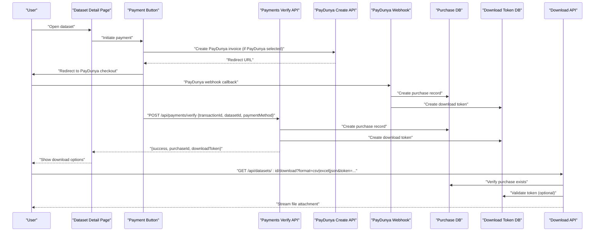

**Diagram sources**
- [page.tsx:84-120](file://src/app/datasets/[id]/page.tsx#L84-L120)
- [payment-button.tsx:99-131](file://src/components/payment/payment-button.tsx#L99-L131)
- [route.ts:6-171](file://src/app/api/payments/verify/route.ts#L6-L171)
- [route.ts:5-129](file://src/app/api/payments/paydunya/create/route.ts#L5-L129)
- [route.ts:6-96](file://src/app/api/payments/paydunya/webhook/route.ts#L6-L96)
- [route.ts:7-148](file://src/app/api/datasets/[id]/download/route.ts#L7-L148)

## Detailed Component Analysis

### Multi-Provider Payment System
- **Supported Providers**: PayDunya (mobile money and cards for West Africa), KKiaPay (mobile money and cards across Africa), Stripe (placeholder).
- **Dynamic Provider Selection**: Active provider configured in Firestore settings and fetched via `/api/payments/provider`.
- **Provider Configuration**: Admin can switch between providers and configure API keys for each provider.
- **Payment Flow**: Users can choose their preferred payment method, with automatic SDK loading for KKiaPay and redirect-based checkout for PayDunya.

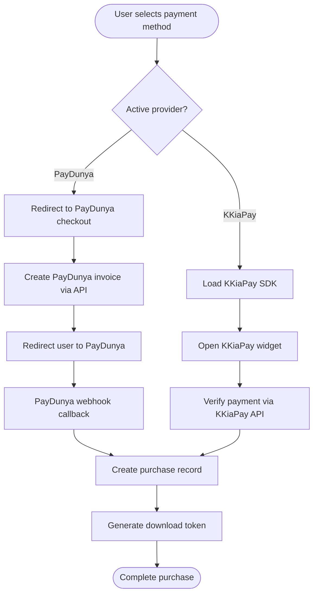

**Diagram sources**
- [route.ts:1-26](file://src/app/api/payments/provider/route.ts#L1-L26)
- [route.ts:1-120](file://src/app/api/admin/payment-settings/route.ts#L1-L120)
- [route.ts:1-129](file://src/app/api/payments/paydunya/create/route.ts#L1-L129)
- [route.ts:1-96](file://src/app/api/payments/paydunya/webhook/route.ts#L1-L96)
- [payment-button.tsx:1-171](file://src/components/payment/payment-button.tsx#L1-L171)

**Section sources**
- [route.ts:1-26](file://src/app/api/payments/provider/route.ts#L1-L26)
- [route.ts:1-120](file://src/app/api/admin/payment-settings/route.ts#L1-L120)
- [route.ts:1-129](file://src/app/api/payments/paydunya/create/route.ts#L1-L129)
- [route.ts:1-96](file://src/app/api/payments/paydunya/webhook/route.ts#L1-L96)
- [payment-button.tsx:1-171](file://src/components/payment/payment-button.tsx#L1-L171)

### Enhanced Purchase History Retrieval API
- Endpoint: GET /api/user/purchases
- Purpose: Return the authenticated user's purchase history ordered by creation time.
- Authentication: Requires Bearer token via Firebase ID token.
- Data source: Firestore collection "purchases" filtered by userId.
- Response: JSON object containing an array of purchase records with paymentMethod field.

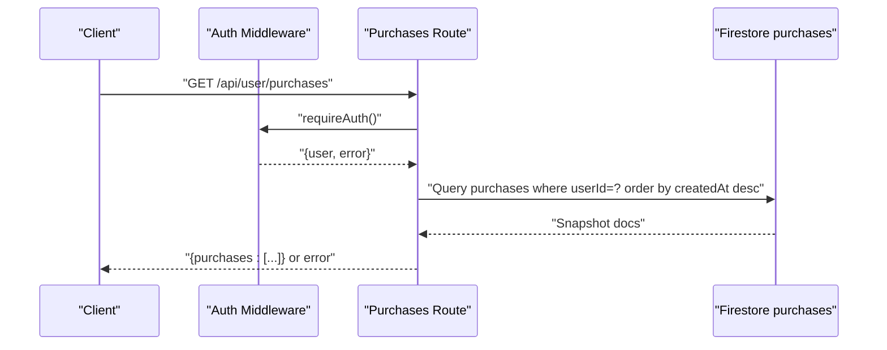

**Diagram sources**
- [route.ts:5-31](file://src/app/api/user/purchases/route.ts#L5-L31)
- [auth-middleware.ts:19-28](file://src/lib/auth-middleware.ts#L19-L28)

**Section sources**
- [route.ts:1-31](file://src/app/api/user/purchases/route.ts#L1-L31)
- [auth-middleware.ts:1-48](file://src/lib/auth-middleware.ts#L1-L48)

### Enhanced Payment Verification and Purchase Creation
- Endpoint: POST /api/payments/verify
- Purpose: Verify payment via external provider, prevent duplicate purchases, create purchase record, and issue a download token.
- Supported payment methods: kkiapay, paydunya, stripe (placeholder).
- Dynamic provider selection: paymentMethod parameter determines verification approach.
- Validation steps:
  - Check for missing fields.
  - Prevent duplicate completed purchases for the same user and dataset.
  - Fetch dataset to confirm price and metadata.
  - Verify transaction status and amount (provider-specific).
  - Support for PayDunya invoice confirmation and KKiaPay transaction verification.
  - In development mode, auto-verification is enabled.
- Persistence:
  - Insert purchase record with status "completed".
  - Insert a download token with expiration and non-used flag.

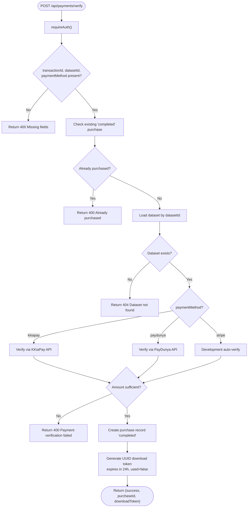

**Diagram sources**
- [route.ts:6-171](file://src/app/api/payments/verify/route.ts#L6-L171)

**Section sources**
- [route.ts:1-171](file://src/app/api/payments/verify/route.ts#L1-L171)

### PayDunya Checkout Invoice System
- Endpoint: POST /api/payments/paydunya/create
- Purpose: Create a PayDunya checkout invoice for mobile money payments.
- Configuration: Uses PayDunya settings from Firestore or environment variables.
- Flow: Creates invoice via PayDunya API, returns redirect URL for user payment.
- Error handling: Validates configuration and handles API errors gracefully.
- Integration: Used by payment button component when PayDunya is active provider.

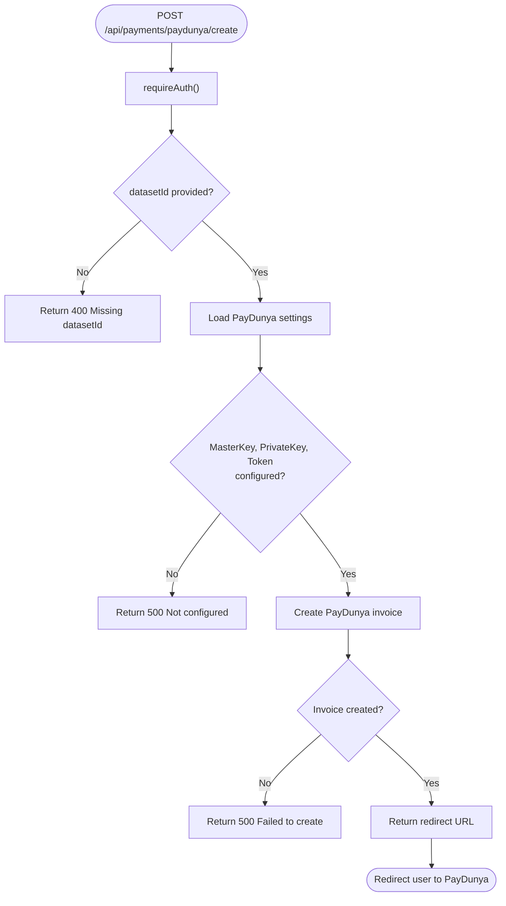

**Diagram sources**
- [route.ts:1-129](file://src/app/api/payments/paydunya/create/route.ts#L1-L129)

**Section sources**
- [route.ts:1-129](file://src/app/api/payments/paydunya/create/route.ts#L1-L129)

### PayDunya Webhook Handling
- Endpoint: POST /api/payments/paydunya/webhook
- Purpose: Handle PayDunya payment completion notifications (IPN).
- Security: Verifies webhook hash using SHA-512 with master key.
- Processing: Creates purchase records and download tokens for completed payments.
- Fallback: Handles cases where purchase records don't exist yet.
- Metadata: Extracts dataset information from custom_data payload.

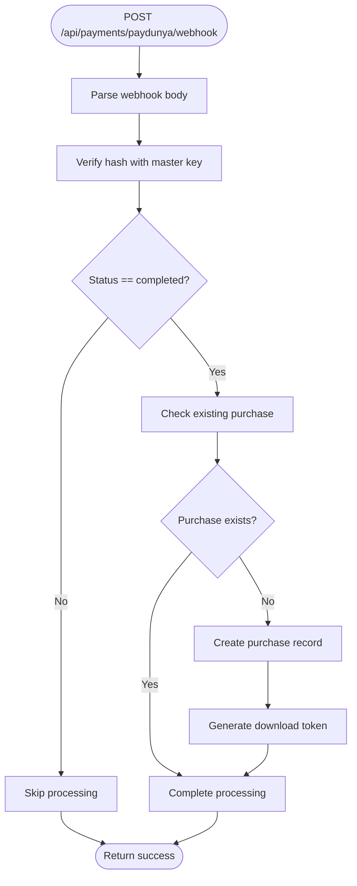

**Diagram sources**
- [route.ts:1-96](file://src/app/api/payments/paydunya/webhook/route.ts#L1-L96)

**Section sources**
- [route.ts:1-96](file://src/app/api/payments/paydunya/webhook/route.ts#L1-L96)

### Download Access Management
- Endpoint: GET /api/datasets/[id]/download
- Purpose: Stream dataset export (CSV, Excel, JSON) to authenticated users who have purchased the dataset.
- Access control:
  - Authentication required.
  - Must have a completed purchase for the dataset.
  - Optional token validation: token must match user, dataset, not used, and not expired.
- Data sourcing:
  - Prefer dataset's "fullData" subcollection if present; otherwise fallback to preview data.
- Persistence:
  - Record a download event with user, dataset, and format.

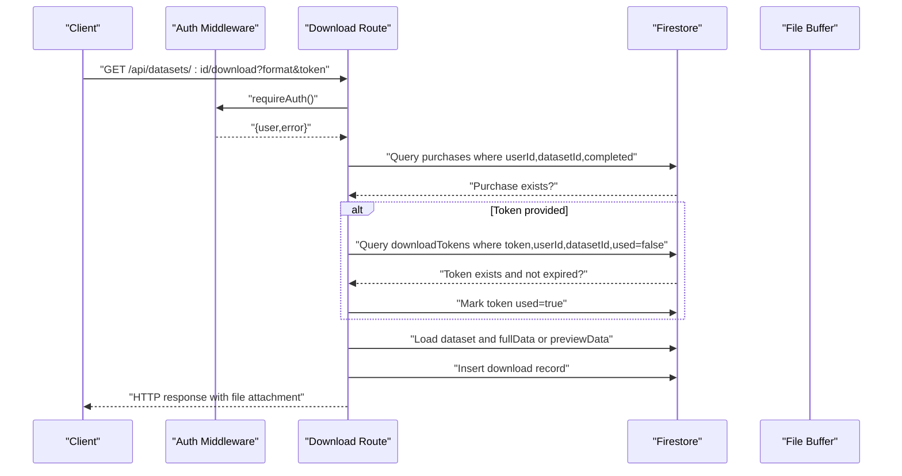

**Diagram sources**
- [route.ts:7-148](file://src/app/api/datasets/[id]/download/route.ts#L7-L148)

**Section sources**
- [route.ts:1-148](file://src/app/api/datasets/[id]/download/route.ts#L1-L148)

### Enhanced Data Model and Relationships
- Purchase record fields include identifiers, pricing, payment metadata, and timestamps.
- Enhanced paymentMethod enum: "kkiapay" | "paydunya" | "stripe".
- PaymentProvider type: "paydunya" | "kkiapay".
- Foreign keys:
  - userId references the user who made the purchase.
  - datasetId references the purchased dataset.
- Additional related collections:
  - datasets: dataset metadata and preview data.
  - downloadTokens: per-user, per-dataset tokens with expiry and usage flag.
  - downloads: audit trail of user downloads with format and timestamp.
  - settings: payment provider configurations with master keys and API credentials.

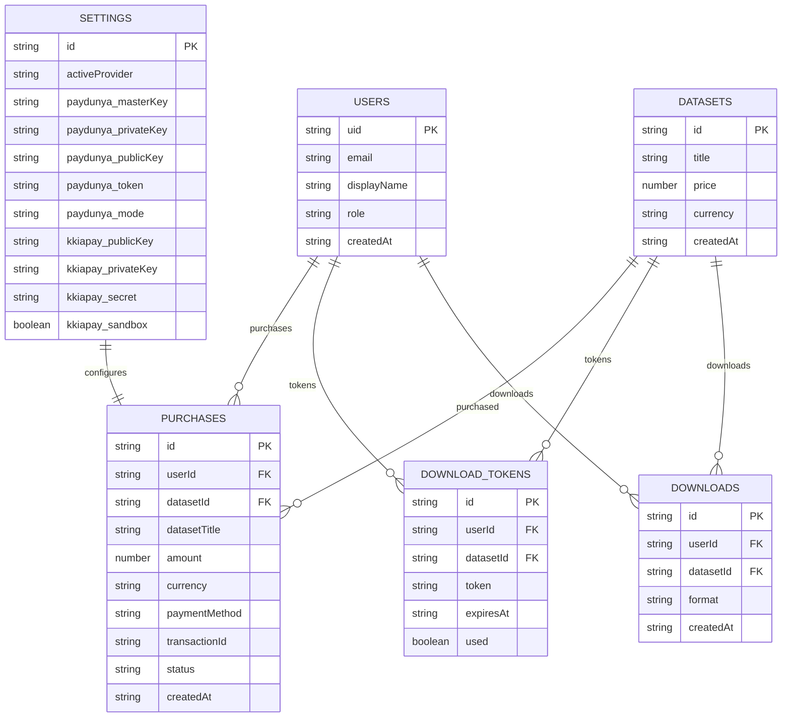

**Diagram sources**
- [index.ts:32-62](file://src/types/index.ts#L32-L62)
- [route.ts:98-120](file://src/app/api/payments/verify/route.ts#L98-L120)
- [route.ts:99-105](file://src/app/api/datasets/[id]/download/route.ts#L99-L105)
- [route.ts:1-120](file://src/app/api/admin/payment-settings/route.ts#L1-L120)

**Section sources**
- [index.ts:1-112](file://src/types/index.ts#L1-L112)
- [route.ts:98-120](file://src/app/api/payments/verify/route.ts#L98-L120)
- [route.ts:99-105](file://src/app/api/datasets/[id]/download/route.ts#L99-L105)
- [route.ts:1-120](file://src/app/api/admin/payment-settings/route.ts#L1-L120)

### Enhanced Download Token System
- Generation: UUID-based token created upon successful payment verification.
- Expiration: 24 hours from creation.
- Usage: Optional query parameter token validated against user, dataset, and state.
- Security: Tokens are single-use and marked used after successful download.

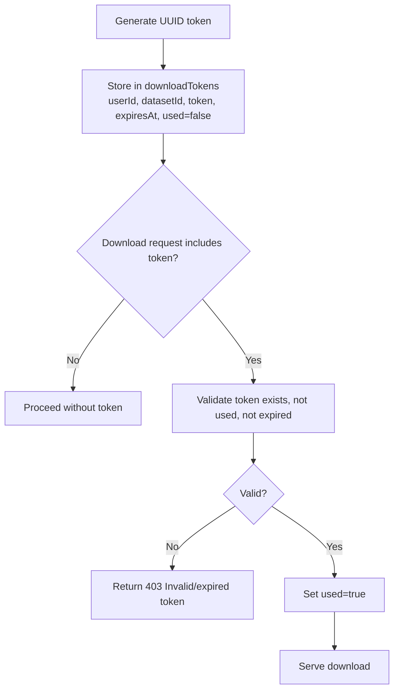

**Diagram sources**
- [route.ts:112-120](file://src/app/api/payments/verify/route.ts#L112-L120)
- [route.ts:38-68](file://src/app/api/datasets/[id]/download/route.ts#L38-L68)

**Section sources**
- [route.ts:112-120](file://src/app/api/payments/verify/route.ts#L112-L120)
- [route.ts:38-68](file://src/app/api/datasets/[id]/download/route.ts#L38-L68)

### Enhanced User Interface Integration
- Dataset Detail Page:
  - Shows purchase status and enables download buttons after purchase.
  - Supports multiple payment providers with dynamic selection.
  - Initiates payment via PayDunya redirect or KKiaPay widget based on active provider.
  - Receives a download token on successful verification.
- Enhanced Payment Button:
  - Automatically detects active payment provider.
  - Loads appropriate SDK (KKiaPay) or redirects to PayDunya checkout.
  - Handles provider switching and configuration.
- Dashboard:
  - Lists purchase history and allows re-downloading in multiple formats.
- Admin Payments:
  - Configures active payment provider.
  - Manages PayDunya and KKiaPay API credentials.
  - Switches between providers dynamically.

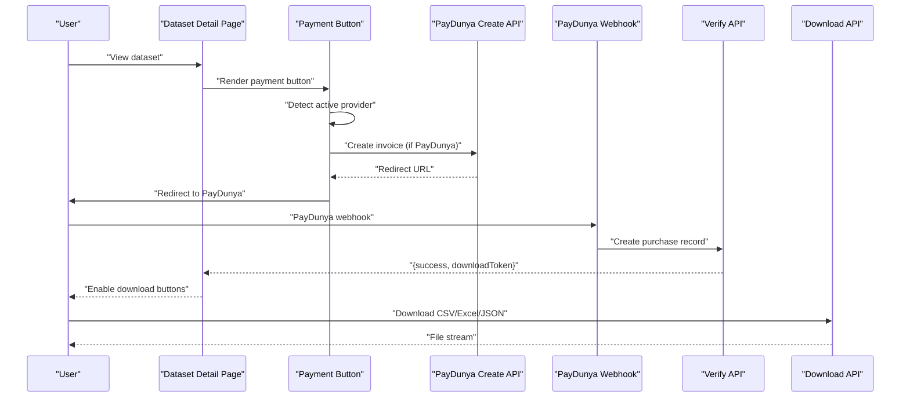

**Diagram sources**
- [page.tsx:84-120](file://src/app/datasets/[id]/page.tsx#L84-L120)
- [payment-button.tsx:99-131](file://src/components/payment/payment-button.tsx#L99-L131)
- [route.ts:122-126](file://src/app/api/payments/verify/route.ts#L122-L126)
- [route.ts:108-139](file://src/app/api/datasets/[id]/download/route.ts#L108-L139)
- [route.ts:1-129](file://src/app/api/payments/paydunya/create/route.ts#L1-L129)
- [route.ts:1-96](file://src/app/api/payments/paydunya/webhook/route.ts#L1-L96)

**Section sources**
- [page.tsx:1-382](file://src/app/datasets/[id]/page.tsx#L1-L382)
- [page.tsx:1-275](file://src/app/dashboard/page.tsx#L1-L275)
- [page.tsx:1-228](file://src/app/admin/analytics/page.tsx#L1-L228)
- [page.tsx:1-442](file://src/app/admin/payments/page.tsx#L1-L442)
- [payment-button.tsx:1-171](file://src/components/payment/payment-button.tsx#L1-L171)
- [kkiapay-button.tsx:1-110](file://src/components/payment/kkiapay-button.tsx#L1-L110)

### Enhanced Administrative Features
- Sales Analytics:
  - Computes total revenue, total sales, total users, total datasets.
  - Provides recent sales and top datasets by revenue.
- Payment Settings Management:
  - Configures active payment provider (PayDunya or KKiaPay).
  - Manages PayDunya API credentials (masterKey, privateKey, publicKey, token, mode).
  - Manages KKiaPay API credentials (publicKey, privateKey, secret, sandbox).
  - Masks sensitive API keys for security.
- User Management:
  - Lists users and updates roles (user/admin).

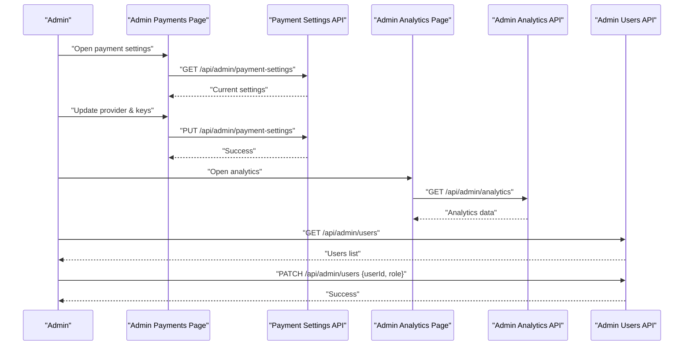

**Diagram sources**
- [page.tsx:38-72](file://src/app/admin/analytics/page.tsx#L38-L72)
- [page.tsx:1-442](file://src/app/admin/payments/page.tsx#L1-L442)
- [route.ts:5-120](file://src/app/api/admin/payment-settings/route.ts#L5-L120)
- [route.ts:5-78](file://src/app/api/admin/analytics/route.ts#L5-L78)
- [route.ts:5-54](file://src/app/api/admin/users/route.ts#L5-L54)

**Section sources**
- [page.tsx:1-228](file://src/app/admin/analytics/page.tsx#L1-L228)
- [page.tsx:1-442](file://src/app/admin/payments/page.tsx#L1-L442)
- [route.ts:1-120](file://src/app/api/admin/payment-settings/route.ts#L1-L120)
- [route.ts:1-78](file://src/app/api/admin/analytics/route.ts#L1-L78)
- [route.ts:1-54](file://src/app/api/admin/users/route.ts#L1-L54)

## Dependency Analysis
- Runtime dependencies include Next.js, Firebase Admin, UUID, XLSX, Papa Parse, and Sonner for notifications.
- Authentication and authorization depend on Firebase Admin SDK and custom auth middleware.
- Data access uses Firestore collections with explicit queries and writes.
- Enhanced payment provider support adds PayDunya API integration and webhook handling.
- Dynamic provider selection requires settings collection for configuration management.

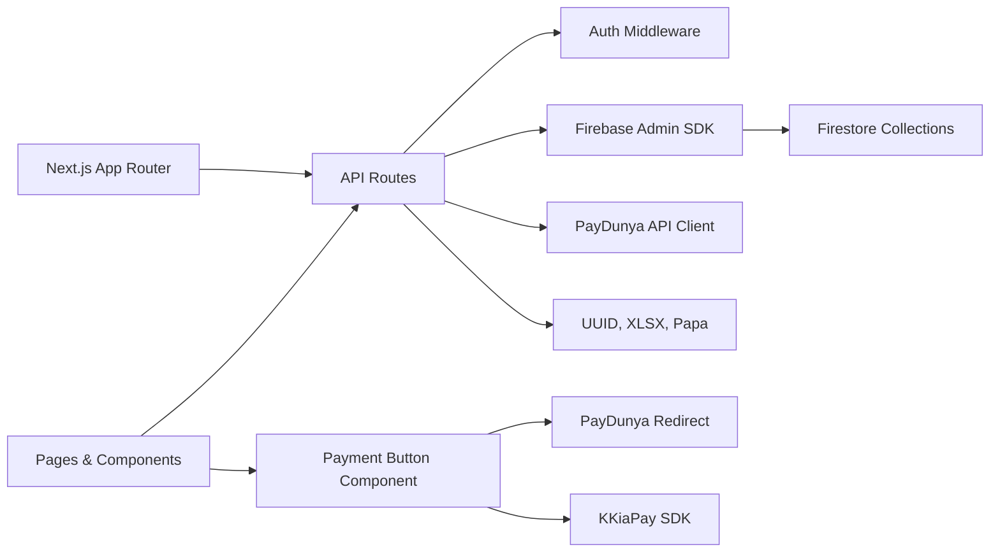

**Diagram sources**
- [package.json:11-37](file://package.json#L11-L37)
- [auth-middleware.ts:1-48](file://src/lib/auth-middleware.ts#L1-L48)
- [firebase-admin.ts:1-50](file://src/lib/firebase-admin.ts#L1-L50)
- [payment-button.tsx:1-171](file://src/components/payment/payment-button.tsx#L1-L171)

**Section sources**
- [package.json:1-51](file://package.json#L1-L51)
- [auth-middleware.ts:1-48](file://src/lib/auth-middleware.ts#L1-L48)
- [firebase-admin.ts:1-50](file://src/lib/firebase-admin.ts#L1-L50)
- [payment-button.tsx:1-171](file://src/components/payment/payment-button.tsx#L1-L171)

## Performance Considerations
- Query optimization:
  - Use indexed fields for purchases: userId, datasetId, status, createdAt.
  - Limit token queries to single matching document.
  - Cache active provider settings to reduce Firestore reads.
- Caching:
  - Consider caching dataset metadata for repeated views.
  - Cache active provider configuration for payment button rendering.
- Streaming:
  - File streaming avoids loading entire datasets into memory.
- Concurrency:
  - Ensure idempotent purchase creation and token generation to avoid duplicates.
  - Handle PayDunya webhook deduplication with existing purchase checks.
- Provider switching:
  - Minimize API calls when switching between payment providers.
  - Cache provider-specific SDKs and configurations.

## Troubleshooting Guide
- Authentication failures:
  - Ensure Bearer token is present and valid; verify with auth middleware.
- Payment verification errors:
  - Confirm required fields are provided.
  - Check provider credentials and network connectivity.
  - Verify PayDunya API keys are configured correctly.
  - Check KKiaPay API keys and sandbox settings.
  - In development, auto-verification may be enabled.
- Duplicate purchase attempts:
  - System prevents multiple completed purchases for the same user and dataset.
- Download access denied:
  - Verify purchase exists with status "completed".
  - If using a token, ensure it is valid, not used, and not expired.
- Provider configuration issues:
  - Verify active provider is set in payment settings.
  - Check that PayDunya masterKey, privateKey, and token are configured.
  - Ensure KKiaPay publicKey is properly set for widget loading.
- PayDunya webhook failures:
  - Verify webhook URL is configured in PayDunya dashboard.
  - Check master key hash verification in webhook handler.
  - Ensure Firestore settings are accessible during webhook processing.
- Analytics and admin endpoints:
  - Require admin role; verify user role in Firestore.

**Section sources**
- [auth-middleware.ts:19-47](file://src/lib/auth-middleware.ts#L19-L47)
- [route.ts:15-96](file://src/app/api/payments/verify/route.ts#L15-L96)
- [route.ts:31-68](file://src/app/api/datasets/[id]/download/route.ts#L31-L68)
- [route.ts:8-9](file://src/app/api/admin/analytics/route.ts#L8-L9)
- [route.ts:32-45](file://src/app/api/admin/users/route.ts#L32-L45)
- [route.ts:48-53](file://src/app/api/payments/paydunya/create/route.ts#L48-L53)
- [route.ts:23-29](file://src/app/api/payments/paydunya/webhook/route.ts#L23-L29)

## Conclusion
The enhanced purchase management system integrates secure payment processing through multiple providers, robust access control, and comprehensive audit trails. It now supports both PayDunya (mobile money and cards for West Africa) and KKiaPay (mobile money and cards across Africa) with dynamic provider selection and configuration management. The system provides user-facing purchase history and download workflows while enabling administrators to monitor sales, manage payment providers, and configure API credentials securely. The modular design leverages Firebase for identity and data, ensuring scalability and maintainability across multiple payment methods.

## Appendices

### API Definitions

- GET /api/user/purchases
  - Description: Retrieve current user's purchase history.
  - Authentication: Bearer token required.
  - Response: { purchases: Purchase[] }

- POST /api/payments/verify
  - Description: Verify payment and create purchase + download token.
  - Request body: { transactionId: string, datasetId: string, paymentMethod: "kkiapay" | "paydunya" | "stripe" }
  - Authentication: Bearer token required.
  - Response: { success: boolean, purchaseId: string, downloadToken: string }

- GET /api/datasets/[id]/download
  - Description: Stream dataset export; requires purchase and optional token.
  - Query params: format (csv|excel|json), token (optional)
  - Authentication: Bearer token required.
  - Response: File attachment (CSV/Excel/JSON)

- POST /api/payments/paydunya/create
  - Description: Create PayDunya checkout invoice for mobile money payments.
  - Request body: { datasetId: string }
  - Authentication: Bearer token required.
  - Response: { success: boolean, url: string, token: string }

- POST /api/payments/paydunya/webhook
  - Description: Handle PayDunya payment completion notifications.
  - Request body: Webhook payload from PayDunya
  - Authentication: None (IPN callback)
  - Response: { received: boolean }

- GET /api/payments/provider
  - Description: Get active payment provider configuration.
  - Authentication: Public endpoint
  - Response: { activeProvider: "paydunya" | "kkiapay", kkiapayPublicKey: string, kkiapaySandbox: boolean }

- GET /api/admin/analytics
  - Description: Sales analytics for admins.
  - Authentication: Admin required.
  - Response: { totalRevenue, totalSales, totalUsers, totalDatasets, recentSales[], topDatasets[] }

- GET /api/admin/users
  - Description: List all users.
  - Authentication: Admin required.
  - Response: { users: User[] }

- PATCH /api/admin/users
  - Description: Update user role.
  - Authentication: Admin required.
  - Request body: { userId: string, role: "user" | "admin" }
  - Response: { success: boolean }

- GET /api/admin/payment-settings
  - Description: Get current payment provider settings.
  - Authentication: Admin required.
  - Response: { activeProvider: "paydunya" | "kkiapay", paydunya: object, kkiapay: object }

- PUT /api/admin/payment-settings
  - Description: Update payment provider settings.
  - Authentication: Admin required.
  - Request body: { activeProvider: "paydunya" | "kkiapay", paydunya: object, kkiapay: object }
  - Response: { success: boolean }

**Section sources**
- [route.ts:5-22](file://src/app/api/user/purchases/route.ts#L5-L22)
- [route.ts:6-171](file://src/app/api/payments/verify/route.ts#L6-L171)
- [route.ts:7-148](file://src/app/api/datasets/[id]/download/route.ts#L7-L148)
- [route.ts:5-129](file://src/app/api/payments/paydunya/create/route.ts#L5-L129)
- [route.ts:6-96](file://src/app/api/payments/paydunya/webhook/route.ts#L6-L96)
- [route.ts:4-26](file://src/app/api/payments/provider/route.ts#L4-L26)
- [route.ts:5-78](file://src/app/api/admin/analytics/route.ts#L5-L78)
- [route.ts:5-54](file://src/app/api/admin/users/route.ts#L5-L54)
- [route.ts:5-120](file://src/app/api/admin/payment-settings/route.ts#L5-L120)

### Enhanced Data Privacy and Audit Trail
- Audit events:
  - purchases: capture transactionId, amount, currency, paymentMethod, status, createdAt.
  - downloads: capture userId, datasetId, format, createdAt.
  - payment settings: masked API keys for security.
- Token lifecycle:
  - Single-use, 24-hour expiry, marked used after first download.
- Provider considerations:
  - External payment verification logs should be retained per policy.
  - PayDunya webhook hash verification ensures authenticity.
  - Sensitive API keys are masked in admin interface.
- Compliance:
  - Ensure data retention aligns with financial and privacy regulations.
  - Implement deletion policies for tokens and logs as appropriate.
  - Maintain audit trail of provider switching and configuration changes.

**Section sources**
- [route.ts:98-120](file://src/app/api/payments/verify/route.ts#L98-L120)
- [route.ts:99-105](file://src/app/api/datasets/[id]/download/route.ts#L99-L105)
- [route.ts:38-87](file://src/app/api/payments/paydunya/webhook/route.ts#L38-L87)
- [route.ts:35-54](file://src/app/api/admin/payment-settings/route.ts#L35-L54)