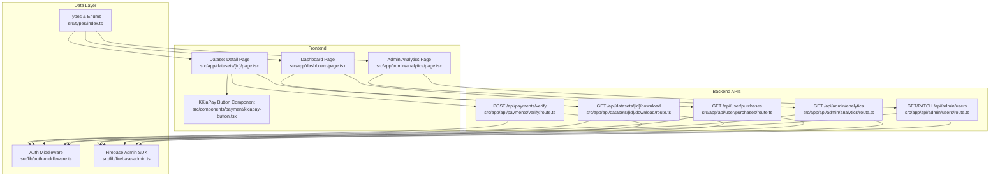
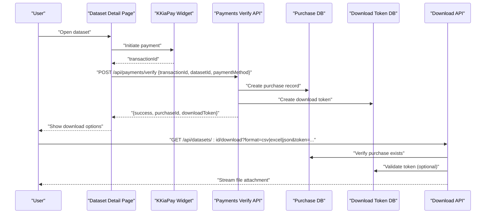
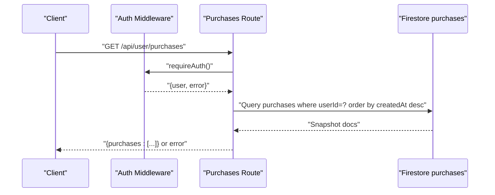
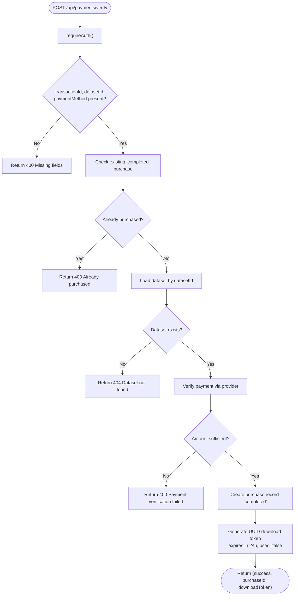
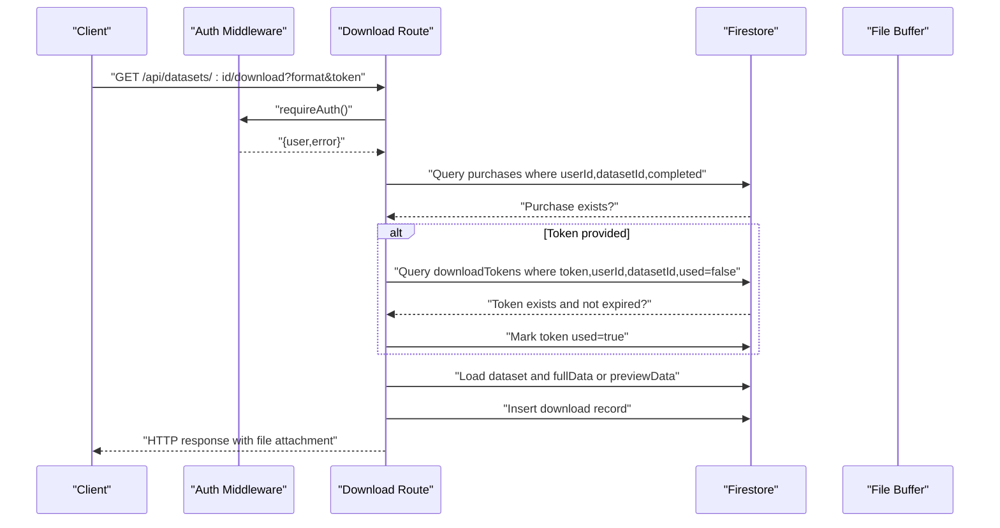
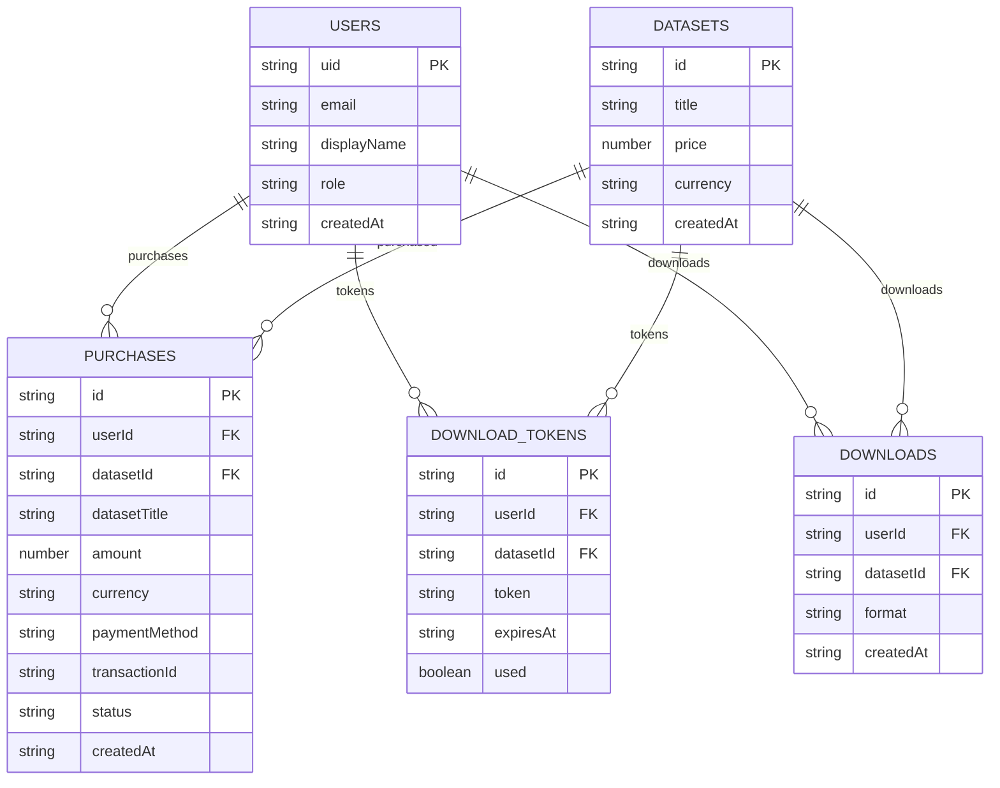
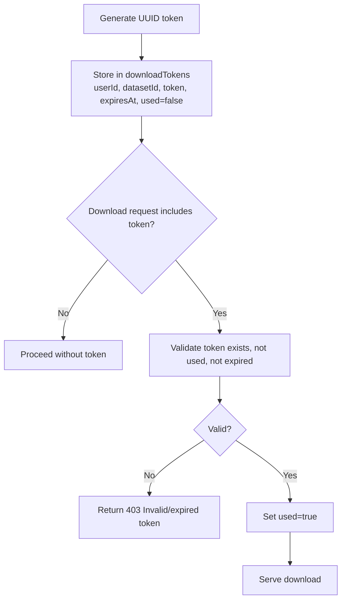
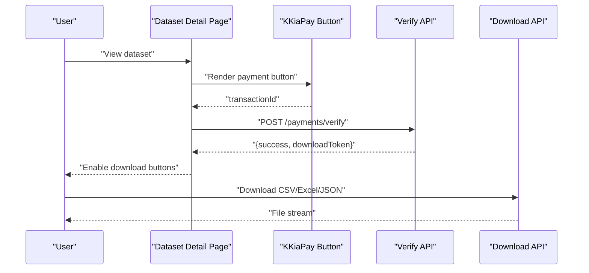
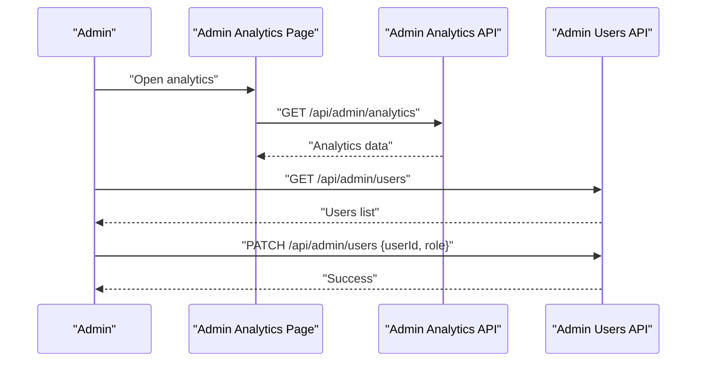
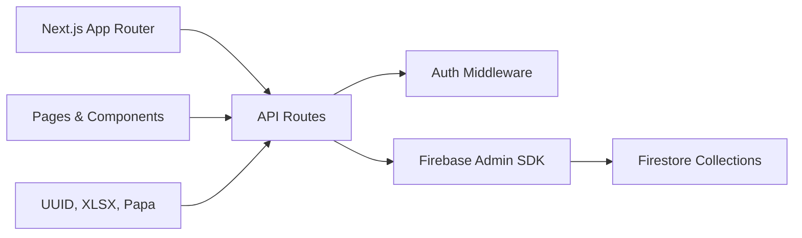

# Purchase Management

<cite>
**Referenced Files in This Document**
- [route.ts](file://src/app/api/user/purchases/route.ts)
- [route.ts](file://src/app/api/payments/verify/route.ts)
- [route.ts](file://src/app/api/datasets/[id]/download/route.ts)
- [index.ts](file://src/types/index.ts)
- [auth-middleware.ts](file://src/lib/auth-middleware.ts)
- [firebase-admin.ts](file://src/lib/firebase-admin.ts)
- [page.tsx](file://src/app/datasets/[id]/page.tsx)
- [page.tsx](file://src/app/dashboard/page.tsx)
- [page.tsx](file://src/app/admin/analytics/page.tsx)
- [route.ts](file://src/app/api/admin/analytics/route.ts)
- [route.ts](file://src/app/api/admin/users/route.ts)
- [kkiapay-button.tsx](file://src/components/payment/kkiapay-button.tsx)
- [package.json](file://package.json)
</cite>

## Table of Contents
1. [Introduction](#introduction)
2. [Project Structure](#project-structure)
3. [Core Components](#core-components)
4. [Architecture Overview](#architecture-overview)
5. [Detailed Component Analysis](#detailed-component-analysis)
6. [Dependency Analysis](#dependency-analysis)
7. [Performance Considerations](#performance-considerations)
8. [Troubleshooting Guide](#troubleshooting-guide)
9. [Conclusion](#conclusion)
10. [Appendices](#appendices)

## Introduction
This document describes the purchase management system that enables users to browse datasets, complete secure payments, track purchase history, and download datasets. It covers the API endpoints for verifying transactions, generating download tokens, retrieving purchase records, and the data models used. Administrative capabilities for analytics and user management are documented alongside privacy and audit considerations.

## Project Structure
The purchase management system spans frontend pages, UI components, and backend API routes. Authentication is enforced via Firebase Admin, and Firestore stores purchases, datasets, download tokens, and downloads.

**Diagram sources**
- [route.ts:1-31](file://src/app/api/user/purchases/route.ts#L1-L31)
- [route.ts:1-135](file://src/app/api/payments/verify/route.ts#L1-L135)
- [route.ts:1-148](file://src/app/api/datasets/[id]/download/route.ts#L1-L148)
- [page.tsx:1-382](file://src/app/datasets/[id]/page.tsx#L1-L382)
- [page.tsx:1-275](file://src/app/dashboard/page.tsx#L1-L275)
- [page.tsx:1-228](file://src/app/admin/analytics/page.tsx#L1-L228)
- [route.ts:1-78](file://src/app/api/admin/analytics/route.ts#L1-L78)
- [route.ts:1-54](file://src/app/api/admin/users/route.ts#L1-L54)
- [auth-middleware.ts:1-48](file://src/lib/auth-middleware.ts#L1-L48)
- [firebase-admin.ts:1-50](file://src/lib/firebase-admin.ts#L1-L50)
- [index.ts:1-90](file://src/types/index.ts#L1-L90)

**Section sources**
- [route.ts:1-31](file://src/app/api/user/purchases/route.ts#L1-L31)
- [route.ts:1-135](file://src/app/api/payments/verify/route.ts#L1-L135)
- [route.ts:1-148](file://src/app/api/datasets/[id]/download/route.ts#L1-L148)
- [page.tsx:1-382](file://src/app/datasets/[id]/page.tsx#L1-L382)
- [page.tsx:1-275](file://src/app/dashboard/page.tsx#L1-L275)
- [page.tsx:1-228](file://src/app/admin/analytics/page.tsx#L1-L228)
- [route.ts:1-78](file://src/app/api/admin/analytics/route.ts#L1-L78)
- [route.ts:1-54](file://src/app/api/admin/users/route.ts#L1-L54)
- [auth-middleware.ts:1-48](file://src/lib/auth-middleware.ts#L1-L48)
- [firebase-admin.ts:1-50](file://src/lib/firebase-admin.ts#L1-L50)
- [index.ts:1-90](file://src/types/index.ts#L1-L90)

## Core Components
- Authentication middleware enforces Bearer token authentication and admin checks.
- Purchase retrieval API returns a user’s purchase history ordered by creation date.
- Payment verification API validates transactions against external providers and creates purchase records and download tokens.
- Download API verifies purchase eligibility, optional token usage, and streams dataset exports.
- Frontend pages integrate purchase history, payment initiation, and download actions.
- Admin analytics and user management APIs support reporting and role administration.

**Section sources**
- [auth-middleware.ts:1-48](file://src/lib/auth-middleware.ts#L1-L48)
- [route.ts:1-31](file://src/app/api/user/purchases/route.ts#L1-L31)
- [route.ts:1-135](file://src/app/api/payments/verify/route.ts#L1-L135)
- [route.ts:1-148](file://src/app/api/datasets/[id]/download/route.ts#L1-L148)
- [page.tsx:1-382](file://src/app/datasets/[id]/page.tsx#L1-L382)
- [page.tsx:1-275](file://src/app/dashboard/page.tsx#L1-L275)
- [page.tsx:1-228](file://src/app/admin/analytics/page.tsx#L1-L228)
- [route.ts:1-78](file://src/app/api/admin/analytics/route.ts#L1-L78)
- [route.ts:1-54](file://src/app/api/admin/users/route.ts#L1-L54)

## Architecture Overview
The system uses Next.js App Router with server-side API routes. Authentication relies on Firebase ID tokens verified by the auth middleware. Data persistence uses Firestore collections for purchases, datasets, download tokens, and downloads. The frontend communicates with APIs using Bearer tokens obtained via Firebase Auth.

**Diagram sources**
- [page.tsx:84-120](file://src/app/datasets/[id]/page.tsx#L84-L120)
- [kkiapay-button.tsx:1-110](file://src/components/payment/kkiapay-button.tsx#L1-L110)
- [route.ts:6-135](file://src/app/api/payments/verify/route.ts#L6-L135)
- [route.ts:7-148](file://src/app/api/datasets/[id]/download/route.ts#L7-L148)

## Detailed Component Analysis

### Purchase History Retrieval API
- Endpoint: GET /api/user/purchases
- Purpose: Return the authenticated user’s purchase history ordered by creation time.
- Authentication: Requires Bearer token via Firebase ID token.
- Data source: Firestore collection "purchases" filtered by userId.
- Response: JSON object containing an array of purchase records.

**Diagram sources**
- [route.ts:5-31](file://src/app/api/user/purchases/route.ts#L5-L31)
- [auth-middleware.ts:19-28](file://src/lib/auth-middleware.ts#L19-L28)

**Section sources**
- [route.ts:1-31](file://src/app/api/user/purchases/route.ts#L1-L31)
- [auth-middleware.ts:1-48](file://src/lib/auth-middleware.ts#L1-L48)

### Payment Verification and Purchase Creation
- Endpoint: POST /api/payments/verify
- Purpose: Verify payment via external provider, prevent duplicate purchases, create purchase record, and issue a download token.
- Supported payment methods: kkiapay (external API), stripe (placeholder).
- Validation steps:
  - Check for missing fields.
  - Prevent duplicate completed purchases for the same user and dataset.
  - Fetch dataset to confirm price and metadata.
  - Verify transaction status and amount (provider-specific).
  - In development mode, auto-verification is enabled.
- Persistence:
  - Insert purchase record with status "completed".
  - Insert a download token with expiration and non-used flag.

**Diagram sources**
- [route.ts:6-135](file://src/app/api/payments/verify/route.ts#L6-L135)

**Section sources**
- [route.ts:1-135](file://src/app/api/payments/verify/route.ts#L1-L135)

### Download Access Management
- Endpoint: GET /api/datasets/[id]/download
- Purpose: Stream dataset export (CSV, Excel, JSON) to authenticated users who have purchased the dataset.
- Access control:
  - Authentication required.
  - Must have a completed purchase for the dataset.
  - Optional token validation: token must match user, dataset, not used, and not expired.
- Data sourcing:
  - Prefer dataset's "fullData" subcollection if present; otherwise fallback to preview data.
- Persistence:
  - Record a download event with user, dataset, and format.

**Diagram sources**
- [route.ts:7-148](file://src/app/api/datasets/[id]/download/route.ts#L7-L148)

**Section sources**
- [route.ts:1-148](file://src/app/api/datasets/[id]/download/route.ts#L1-L148)

### Data Model and Relationships
- Purchase record fields include identifiers, pricing, payment metadata, and timestamps.
- Foreign keys:
  - userId references the user who made the purchase.
  - datasetId references the purchased dataset.
- Additional related collections:
  - datasets: dataset metadata and preview data.
  - downloadTokens: per-user, per-dataset tokens with expiry and usage flag.
  - downloads: audit trail of user downloads with format and timestamp.

**Diagram sources**
- [index.ts:30-50](file://src/types/index.ts#L30-L50)
- [route.ts:98-120](file://src/app/api/payments/verify/route.ts#L98-L120)
- [route.ts:99-105](file://src/app/api/datasets/[id]/download/route.ts#L99-L105)

**Section sources**
- [index.ts:1-90](file://src/types/index.ts#L1-L90)
- [route.ts:98-120](file://src/app/api/payments/verify/route.ts#L98-L120)
- [route.ts:99-105](file://src/app/api/datasets/[id]/download/route.ts#L99-L105)

### Download Token System
- Generation: UUID-based token created upon successful payment verification.
- Expiration: 24 hours from creation.
- Usage: Optional query parameter token validated against user, dataset, and state.
- Security: Tokens are single-use and marked used after successful download.

**Diagram sources**
- [route.ts:112-120](file://src/app/api/payments/verify/route.ts#L112-L120)
- [route.ts:38-68](file://src/app/api/datasets/[id]/download/route.ts#L38-L68)

**Section sources**
- [route.ts:112-120](file://src/app/api/payments/verify/route.ts#L112-L120)
- [route.ts:38-68](file://src/app/api/datasets/[id]/download/route.ts#L38-L68)

### User Interface Integration
- Dataset Detail Page:
  - Shows purchase status and enables download buttons after purchase.
  - Initiates payment via KKiaPay widget and triggers verification.
  - Receives a download token on successful verification.
- Dashboard:
  - Lists purchase history and allows re-downloading in multiple formats.
- Admin Analytics:
  - Displays sales metrics, top-selling datasets, and recent sales for administrators.

**Diagram sources**
- [page.tsx:84-120](file://src/app/datasets/[id]/page.tsx#L84-L120)
- [kkiapay-button.tsx:1-110](file://src/components/payment/kkiapay-button.tsx#L1-L110)
- [route.ts:122-126](file://src/app/api/payments/verify/route.ts#L122-L126)
- [route.ts:108-139](file://src/app/api/datasets/[id]/download/route.ts#L108-L139)

**Section sources**
- [page.tsx:1-382](file://src/app/datasets/[id]/page.tsx#L1-L382)
- [page.tsx:1-275](file://src/app/dashboard/page.tsx#L1-L275)
- [page.tsx:1-228](file://src/app/admin/analytics/page.tsx#L1-L228)
- [kkiapay-button.tsx:1-110](file://src/components/payment/kkiapay-button.tsx#L1-L110)

### Administrative Features
- Sales Analytics:
  - Computes total revenue, total sales, total users, total datasets.
  - Provides recent sales and top datasets by revenue.
- User Management:
  - Lists users and updates roles (user/admin).

**Diagram sources**
- [page.tsx:38-72](file://src/app/admin/analytics/page.tsx#L38-L72)
- [route.ts:5-78](file://src/app/api/admin/analytics/route.ts#L5-L78)
- [route.ts:5-54](file://src/app/api/admin/users/route.ts#L5-L54)

**Section sources**
- [page.tsx:1-228](file://src/app/admin/analytics/page.tsx#L1-L228)
- [route.ts:1-78](file://src/app/api/admin/analytics/route.ts#L1-L78)
- [route.ts:1-54](file://src/app/api/admin/users/route.ts#L1-L54)

## Dependency Analysis
- Runtime dependencies include Next.js, Firebase Admin, UUID, XLSX, Papa Parse, and Sonner for notifications.
- Authentication and authorization depend on Firebase Admin SDK and custom auth middleware.
- Data access uses Firestore collections with explicit queries and writes.

**Diagram sources**
- [package.json:11-37](file://package.json#L11-L37)
- [auth-middleware.ts:1-48](file://src/lib/auth-middleware.ts#L1-L48)
- [firebase-admin.ts:1-50](file://src/lib/firebase-admin.ts#L1-L50)

**Section sources**
- [package.json:1-51](file://package.json#L1-L51)
- [auth-middleware.ts:1-48](file://src/lib/auth-middleware.ts#L1-L48)
- [firebase-admin.ts:1-50](file://src/lib/firebase-admin.ts#L1-L50)

## Performance Considerations
- Query optimization:
  - Use indexed fields for purchases: userId, datasetId, status, createdAt.
  - Limit token queries to single matching document.
- Caching:
  - Consider caching dataset metadata for repeated views.
- Streaming:
  - File streaming avoids loading entire datasets into memory.
- Concurrency:
  - Ensure idempotent purchase creation and token generation to avoid duplicates.

## Troubleshooting Guide
- Authentication failures:
  - Ensure Bearer token is present and valid; verify with auth middleware.
- Payment verification errors:
  - Confirm required fields are provided.
  - Check provider credentials and network connectivity.
  - In development, auto-verification may be enabled.
- Duplicate purchase attempts:
  - System prevents multiple completed purchases for the same user and dataset.
- Download access denied:
  - Verify purchase exists with status "completed".
  - If using a token, ensure it is valid, not used, and not expired.
- Analytics and admin endpoints:
  - Require admin role; verify user role in Firestore.

**Section sources**
- [auth-middleware.ts:19-47](file://src/lib/auth-middleware.ts#L19-L47)
- [route.ts:15-96](file://src/app/api/payments/verify/route.ts#L15-L96)
- [route.ts:31-68](file://src/app/api/datasets/[id]/download/route.ts#L31-L68)
- [route.ts:8-9](file://src/app/api/admin/analytics/route.ts#L8-L9)
- [route.ts:32-45](file://src/app/api/admin/users/route.ts#L32-L45)

## Conclusion
The purchase management system integrates secure payment processing, robust access control, and comprehensive audit trails. It supports user-facing purchase history and download workflows while enabling administrators to monitor sales and manage users. The modular design leverages Firebase for identity and data, ensuring scalability and maintainability.

## Appendices

### API Definitions

- GET /api/user/purchases
  - Description: Retrieve current user's purchase history.
  - Authentication: Bearer token required.
  - Response: { purchases: Purchase[] }

- POST /api/payments/verify
  - Description: Verify payment and create purchase + download token.
  - Request body: { transactionId: string, datasetId: string, paymentMethod: "kkiapay" | "stripe" }
  - Authentication: Bearer token required.
  - Response: { success: boolean, purchaseId: string, downloadToken: string }

- GET /api/datasets/[id]/download
  - Description: Stream dataset export; requires purchase and optional token.
  - Query params: format (csv|excel|json), token (optional)
  - Authentication: Bearer token required.
  - Response: File attachment (CSV/Excel/JSON)

- GET /api/admin/analytics
  - Description: Sales analytics for admins.
  - Authentication: Admin required.
  - Response: { totalRevenue, totalSales, totalUsers, totalDatasets, recentSales[], topDatasets[] }

- GET /api/admin/users
  - Description: List all users.
  - Authentication: Admin required.
  - Response: { users: User[] }

- PATCH /api/admin/users
  - Description: Update user role.
  - Authentication: Admin required.
  - Request body: { userId: string, role: "user" | "admin" }
  - Response: { success: boolean }

**Section sources**
- [route.ts:5-22](file://src/app/api/user/purchases/route.ts#L5-L22)
- [route.ts:6-126](file://src/app/api/payments/verify/route.ts#L6-L126)
- [route.ts:7-148](file://src/app/api/datasets/[id]/download/route.ts#L7-L148)
- [route.ts:5-78](file://src/app/api/admin/analytics/route.ts#L5-L78)
- [route.ts:5-54](file://src/app/api/admin/users/route.ts#L5-L54)

### Data Privacy and Audit Trail
- Audit events:
  - purchases: capture transactionId, amount, currency, paymentMethod, status, createdAt.
  - downloads: capture userId, datasetId, format, createdAt.
- Token lifecycle:
  - Single-use, 24-hour expiry, marked used after first download.
- Provider considerations:
  - External payment verification logs should be retained per policy.
- Compliance:
  - Ensure data retention aligns with financial and privacy regulations; implement deletion policies for tokens and logs as appropriate.

**Section sources**
- [route.ts:98-120](file://src/app/api/payments/verify/route.ts#L98-L120)
- [route.ts:99-105](file://src/app/api/datasets/[id]/download/route.ts#L99-L105)