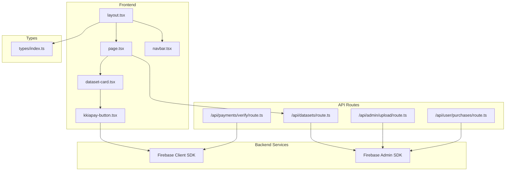
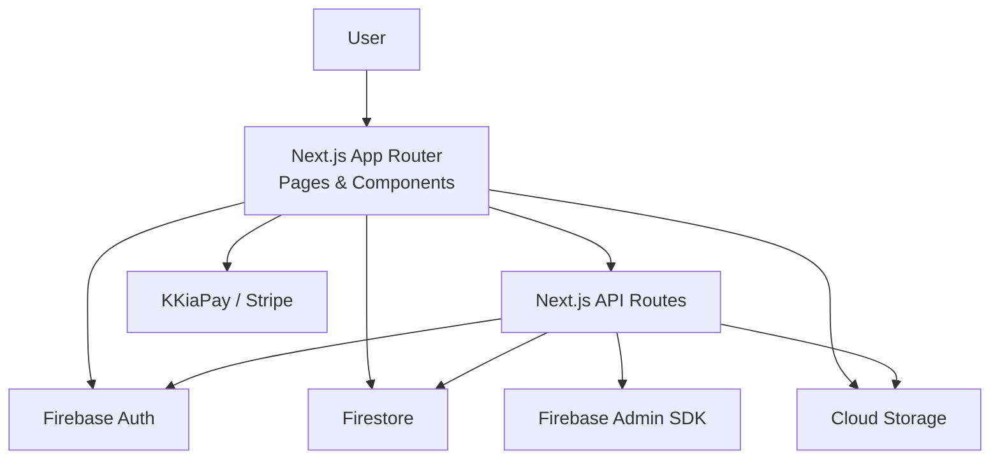
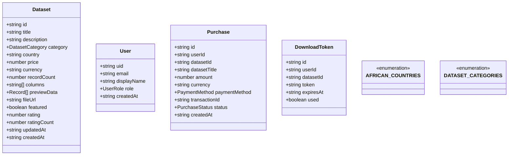
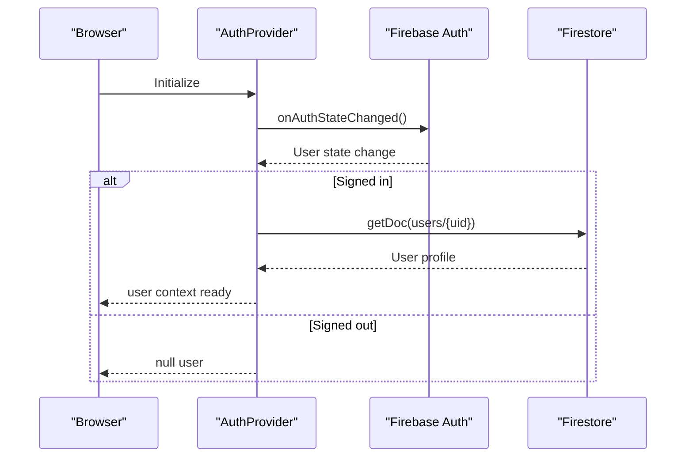
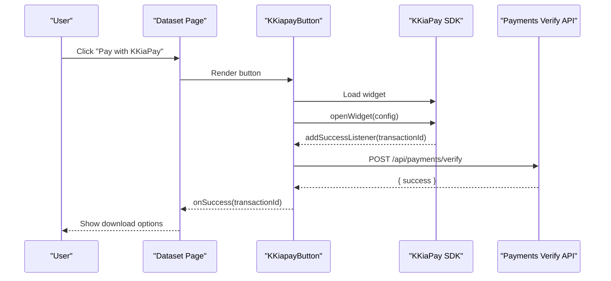
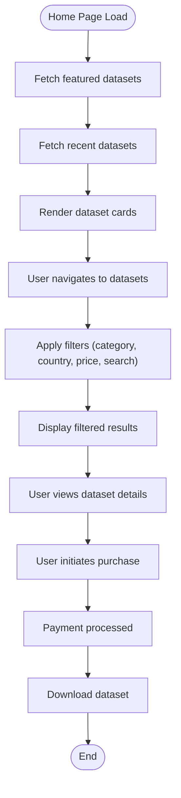
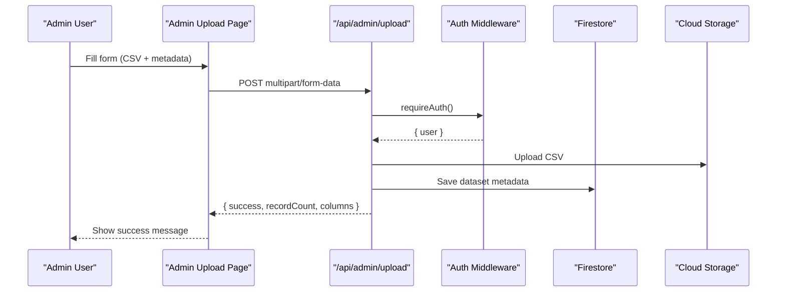
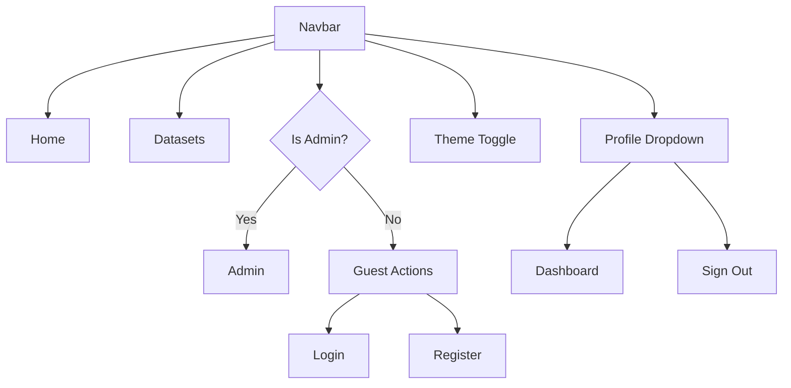

# Project Overview

<cite>
**Referenced Files in This Document**
- [README.md](file://README.md)
- [package.json](file://package.json)
- [next.config.ts](file://next.config.ts)
- [src/app/layout.tsx](file://src/app/layout.tsx)
- [src/app/page.tsx](file://src/app/page.tsx)
- [src/types/index.ts](file://src/types/index.ts)
- [src/lib/firebase.ts](file://src/lib/firebase.ts)
- [src/lib/auth-middleware.ts](file://src/lib/auth-middleware.ts)
- [src/hooks/use-auth.tsx](file://src/hooks/use-auth.tsx)
- [src/components/dataset/dataset-card.tsx](file://src/components/dataset/dataset-card.tsx)
- [src/components/payment/kkiapay-button.tsx](file://src/components/payment/kkiapay-button.tsx)
- [src/components/layout/navbar.tsx](file://src/components/layout/navbar.tsx)
- [src/app/api/datasets/route.ts](file://src/app/api/datasets/route.ts)
- [src/app/admin/upload/page.tsx](file://src/app/admin/upload/page.tsx)
- [src/app/dashboard/page.tsx](file://src/app/dashboard/page.tsx)
</cite>

## Table of Contents
1. [Introduction](#introduction)
2. [Project Structure](#project-structure)
3. [Core Components](#core-components)
4. [Architecture Overview](#architecture-overview)
5. [Detailed Component Analysis](#detailed-component-analysis)
6. [Dependency Analysis](#dependency-analysis)
7. [Performance Considerations](#performance-considerations)
8. [Troubleshooting Guide](#troubleshooting-guide)
9. [Conclusion](#conclusion)

## Introduction
Datafrica is an African dataset marketplace platform designed to enable users to browse, preview, and purchase high-quality business data, leads, and other curated datasets across the African continent. The platform focuses on delivering local data availability and relevance to support informed decision-making for businesses, researchers, and data analysts operating across Africa.

Key value propositions:
- Localized datasets tailored to African markets
- Secure and convenient payment options via mobile money and cards
- Instant access to datasets in multiple formats (CSV, Excel, JSON)
- Curated categories spanning business directories, leads, real estate, jobs, e-commerce, finance, health, and education
- Transparent pricing with clear previews and ratings

Target audience:
- Businesses seeking market insights, customer lists, and operational intelligence
- Researchers focusing on African economies, demographics, and trends
- Data analysts building dashboards, reports, and machine learning models using verified, structured datasets

Core benefits:
- Reduce friction in discovering and acquiring reliable African data
- Empower data-driven strategies with trusted, up-to-date datasets
- Simplified purchasing and immediate downloads streamline workflows

## Project Structure
The project follows a modern Next.js 13+ App Router architecture with a clear separation of concerns:
- Frontend: Next.js App Router pages, client components, and shared UI primitives
- Authentication: Firebase Authentication integrated with Firestore user profiles
- Backend APIs: Next.js API routes under src/app/api handling dataset listings, purchases, and admin operations
- Admin panel: Dedicated pages for dataset uploads and administrative analytics
- Shared types: Strongly typed models for users, datasets, purchases, and constants



**Diagram sources**
- [src/app/layout.tsx:1-50](file://src/app/layout.tsx#L1-L50)
- [src/app/page.tsx:1-199](file://src/app/page.tsx#L1-L199)
- [src/components/layout/navbar.tsx:1-167](file://src/components/layout/navbar.tsx#L1-L167)
- [src/components/dataset/dataset-card.tsx:1-81](file://src/components/dataset/dataset-card.tsx#L1-L81)
- [src/components/payment/kkiapay-button.tsx:1-110](file://src/components/payment/kkiapay-button.tsx#L1-L110)
- [src/app/api/datasets/route.ts:1-62](file://src/app/api/datasets/route.ts#L1-L62)
- [src/lib/firebase.ts:1-22](file://src/lib/firebase.ts#L1-L22)
- [src/lib/auth-middleware.ts:1-48](file://src/lib/auth-middleware.ts#L1-L48)
- [src/types/index.ts:1-90](file://src/types/index.ts#L1-L90)

**Section sources**
- [src/app/layout.tsx:1-50](file://src/app/layout.tsx#L1-L50)
- [src/app/page.tsx:1-199](file://src/app/page.tsx#L1-L199)
- [src/components/layout/navbar.tsx:1-167](file://src/components/layout/navbar.tsx#L1-L167)
- [src/app/api/datasets/route.ts:1-62](file://src/app/api/datasets/route.ts#L1-L62)
- [src/lib/firebase.ts:1-22](file://src/lib/firebase.ts#L1-L22)
- [src/types/index.ts:1-90](file://src/types/index.ts#L1-L90)

## Core Components
- Dataset model and categories define the core product offering with fields for title, description, category, country, pricing, preview data, and metadata.
- Authentication integrates Firebase Authentication with Firestore user profiles, exposing a context provider for global access.
- Payment integration supports mobile money and card payments via KKiaPay SDK with secure callbacks and transaction verification.
- API routes provide dataset listing with filtering, admin upload pipeline, purchase history retrieval, and payment verification.
- UI components encapsulate reusable elements like dataset cards, navigation, and themed payment buttons.

Practical examples:
- Buyers: A marketing analyst in Ghana purchases a business directory dataset to identify potential clients, then downloads the CSV for CRM import.
- Sellers/Admins: An admin uploads a newly compiled Nigerian job postings dataset, sets category and country, and marks it as featured to increase visibility.

**Section sources**
- [src/types/index.ts:11-28](file://src/types/index.ts#L11-L28)
- [src/hooks/use-auth.tsx:1-117](file://src/hooks/use-auth.tsx#L1-L117)
- [src/components/payment/kkiapay-button.tsx:1-110](file://src/components/payment/kkiapay-button.tsx#L1-L110)
- [src/app/api/datasets/route.ts:1-62](file://src/app/api/datasets/route.ts#L1-L62)
- [src/app/admin/upload/page.tsx:1-295](file://src/app/admin/upload/page.tsx#L1-L295)
- [src/app/dashboard/page.tsx:1-313](file://src/app/dashboard/page.tsx#L1-L313)

## Architecture Overview
The system combines a modern frontend built with Next.js App Router and TypeScript, backed by Firebase for authentication, database, and storage, and secured with Firebase Admin for server-side operations. The architecture emphasizes:
- Client-side routing and rendering with server-rendered metadata and hydration
- Centralized authentication state and user profile management
- API routes for dataset discovery, purchases, and administrative tasks
- Secure payment processing with external payment providers and token verification



**Diagram sources**
- [src/app/layout.tsx:1-50](file://src/app/layout.tsx#L1-L50)
- [src/lib/firebase.ts:1-22](file://src/lib/firebase.ts#L1-L22)
- [src/lib/auth-middleware.ts:1-48](file://src/lib/auth-middleware.ts#L1-L48)
- [src/app/api/datasets/route.ts:1-62](file://src/app/api/datasets/route.ts#L1-L62)

## Detailed Component Analysis

### Technology Stack Overview
- Next.js 13+: App Router-based pages, metadata, and client/server boundaries
- TypeScript: Strict typing for models, API handlers, and components
- Firebase: Client SDK for auth, Firestore, and Cloud Storage; Admin SDK for secure server operations
- UI primitives: Radix UI-based components with Tailwind styling
- Payment: KKiaPay SDK integration for mobile money and card payments

**Section sources**
- [package.json:11-38](file://package.json#L11-L38)
- [src/lib/firebase.ts:1-22](file://src/lib/firebase.ts#L1-L22)
- [src/lib/auth-middleware.ts:1-48](file://src/lib/auth-middleware.ts#L1-L48)
- [src/components/payment/kkiapay-button.tsx:1-110](file://src/components/payment/kkiapay-button.tsx#L1-L110)

### Dataset Model and Categories
The dataset model defines the core attributes for marketplace listings, including category taxonomy and supported African countries. Categories include Business, Leads, Real Estate, Jobs, E-commerce, Finance, Health, and Education.



**Diagram sources**
- [src/types/index.ts:11-28](file://src/types/index.ts#L11-L28)
- [src/types/index.ts:30-41](file://src/types/index.ts#L30-L41)
- [src/types/index.ts:43-50](file://src/types/index.ts#L43-L50)
- [src/types/index.ts:62-78](file://src/types/index.ts#L62-L78)
- [src/types/index.ts:80-89](file://src/types/index.ts#L80-L89)

**Section sources**
- [src/types/index.ts:11-28](file://src/types/index.ts#L11-L28)
- [src/types/index.ts:62-78](file://src/types/index.ts#L62-L78)
- [src/types/index.ts:80-89](file://src/types/index.ts#L80-L89)

### Authentication and User Management
Authentication is handled via Firebase Authentication with user profiles stored in Firestore. The AuthProvider subscribes to auth state changes, hydrates user data, and exposes sign-in, sign-up, and sign-out functions.



**Diagram sources**
- [src/hooks/use-auth.tsx:34-108](file://src/hooks/use-auth.tsx#L34-L108)
- [src/lib/firebase.ts:1-22](file://src/lib/firebase.ts#L1-L22)

**Section sources**
- [src/hooks/use-auth.tsx:1-117](file://src/hooks/use-auth.tsx#L1-L117)
- [src/lib/firebase.ts:1-22](file://src/lib/firebase.ts#L1-L22)

### Payment Flow with KKiaPay
The payment flow integrates the KKiaPay SDK for mobile money and card payments. The component loads the SDK dynamically, opens the widget with dataset and user context, listens for successful transactions, and invokes a callback upon completion.



**Diagram sources**
- [src/components/payment/kkiapay-button.tsx:15-80](file://src/components/payment/kkiapay-button.tsx#L15-L80)
- [src/app/dashboard/page.tsx:68-103](file://src/app/dashboard/page.tsx#L68-L103)

**Section sources**
- [src/components/payment/kkiapay-button.tsx:1-110](file://src/components/payment/kkiapay-button.tsx#L1-L110)
- [src/app/dashboard/page.tsx:68-103](file://src/app/dashboard/page.tsx#L68-L103)

### Dataset Browsing and Discovery
The homepage aggregates featured and recent datasets, renders them using dataset cards, and provides navigation to browse all datasets. Dataset cards display category badges, country, record count, ratings, and pricing.



**Diagram sources**
- [src/app/page.tsx:18-47](file://src/app/page.tsx#L18-L47)
- [src/components/dataset/dataset-card.tsx:14-79](file://src/components/dataset/dataset-card.tsx#L14-L79)
- [src/app/api/datasets/route.ts:5-61](file://src/app/api/datasets/route.ts#L5-L61)

**Section sources**
- [src/app/page.tsx:1-199](file://src/app/page.tsx#L1-L199)
- [src/components/dataset/dataset-card.tsx:1-81](file://src/components/dataset/dataset-card.tsx#L1-L81)
- [src/app/api/datasets/route.ts:1-62](file://src/app/api/datasets/route.ts#L1-L62)

### Admin Upload Pipeline
Administrators can upload datasets via a form that captures metadata, selects category and country, and posts a multipart form to the admin upload endpoint. The endpoint validates authentication, parses CSV, and persists dataset metadata and storage references.



**Diagram sources**
- [src/app/admin/upload/page.tsx:44-98](file://src/app/admin/upload/page.tsx#L44-L98)
- [src/lib/auth-middleware.ts:19-47](file://src/lib/auth-middleware.ts#L19-L47)

**Section sources**
- [src/app/admin/upload/page.tsx:1-295](file://src/app/admin/upload/page.tsx#L1-L295)
- [src/lib/auth-middleware.ts:1-48](file://src/lib/auth-middleware.ts#L1-L48)

### Navigation and User Experience
The navigation bar adapts to user roles and device sizes, providing quick access to datasets, admin panel (for admins), dashboard, and authentication actions. It also includes theme switching and responsive mobile menus.



**Diagram sources**
- [src/components/layout/navbar.tsx:18-166](file://src/components/layout/navbar.tsx#L18-L166)

**Section sources**
- [src/components/layout/navbar.tsx:1-167](file://src/components/layout/navbar.tsx#L1-L167)

## Dependency Analysis
The project relies on a cohesive set of dependencies:
- Next.js 16.x for the web framework and App Router
- Firebase client and admin SDKs for identity, database, and storage
- Radix UI components for accessible UI primitives
- Tailwind CSS for styling and responsive design
- Payment SDKs for mobile money and card payments

```mermaid
graph LR
Pkg["package.json"]
Next["next"]
Firebase["firebase"]
FirebaseAdmin["firebase-admin"]
Radix["@radix-ui/*"]
Tailwind["tailwindcss"]
Types["typescript"]
UI["lucide-react"]
Utils["papaparse", "xlsx"]
Pkg --> Next
Pkg --> Firebase
Pkg --> FirebaseAdmin
Pkg --> Radix
Pkg --> Tailwind
Pkg --> Types
Pkg --> UI
Pkg --> Utils
```

**Diagram sources**
- [package.json:11-38](file://package.json#L11-L38)

**Section sources**
- [package.json:1-51](file://package.json#L1-L51)

## Performance Considerations
- Client-side caching and skeleton loaders improve perceived performance during initial dataset fetches
- Lazy loading of the payment SDK reduces initial bundle size
- Efficient Firestore queries with server-side ordering and limits minimize payload sizes
- Responsive design ensures optimal performance across devices

## Troubleshooting Guide
Common issues and resolutions:
- Authentication errors: Ensure Firebase credentials are configured and the AuthProvider is mounted in the root layout
- Payment failures: Verify KKiaPay public key configuration and network connectivity for the SDK
- Upload errors: Confirm multipart form submission includes required fields and the user has admin role
- Download failures: Check purchase verification and token validity before initiating downloads

**Section sources**
- [src/hooks/use-auth.tsx:34-108](file://src/hooks/use-auth.tsx#L34-L108)
- [src/components/payment/kkiapay-button.tsx:15-80](file://src/components/payment/kkiapay-button.tsx#L15-L80)
- [src/app/admin/upload/page.tsx:44-98](file://src/app/admin/upload/page.tsx#L44-L98)
- [src/app/dashboard/page.tsx:68-103](file://src/app/dashboard/page.tsx#L68-L103)

## Conclusion
Datafrica delivers a focused, scalable marketplace for African datasets with a modern tech stack, robust authentication, and seamless payment processing. Its emphasis on local data availability and diverse categories makes it a valuable resource for businesses, researchers, and analysts across the continent.