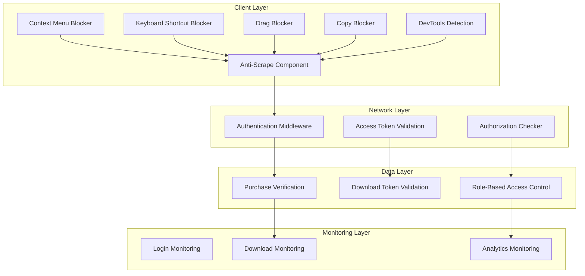
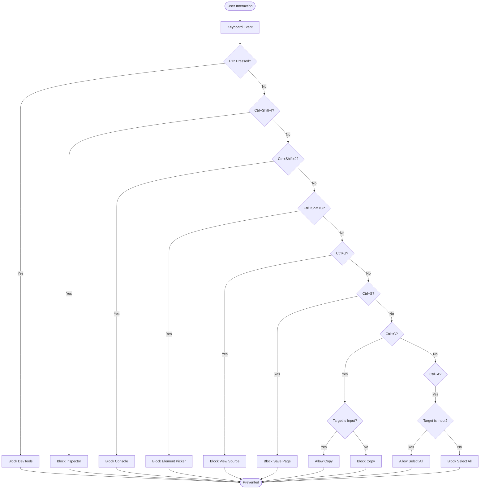
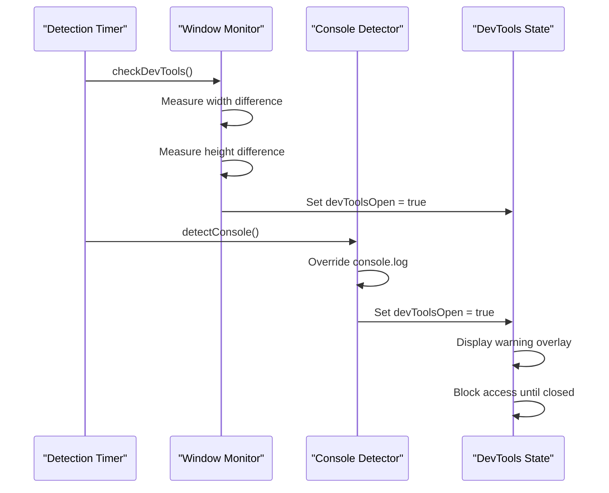
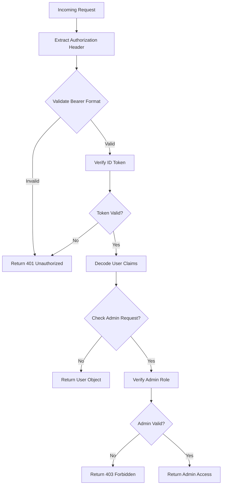
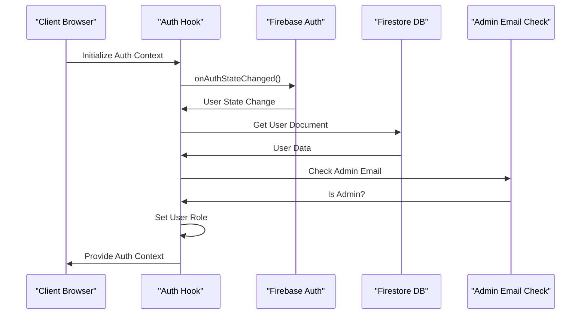
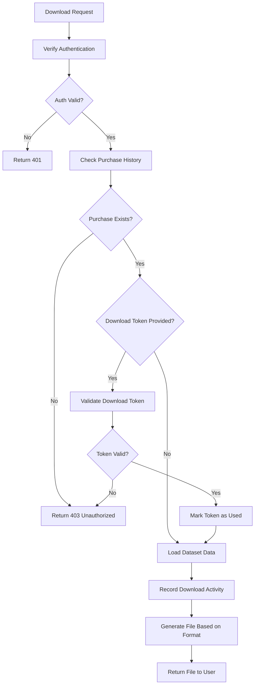
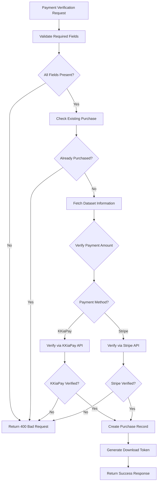
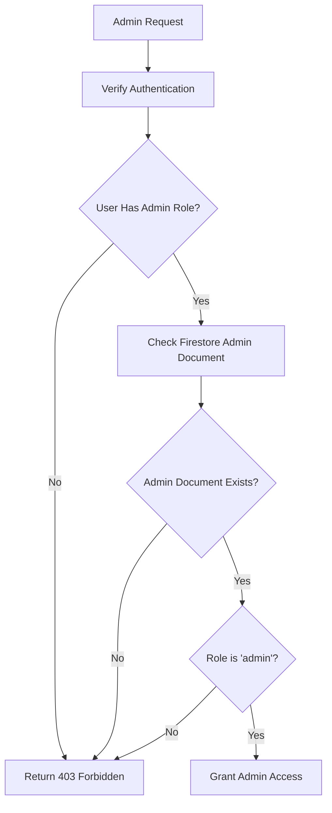

# Anti-Scraping Security Protection

<cite>
**Referenced Files in This Document**
- [anti-scrape.tsx](file://src/components/anti-scrape.tsx)
- [auth-middleware.ts](file://src/lib/auth-middleware.ts)
- [firebase-admin.ts](file://src/lib/firebase-admin.ts)
- [firebase.ts](file://src/lib/firebase.ts)
- [use-auth.tsx](file://src/hooks/use-auth.tsx)
- [route.ts](file://src/app/api/datasets/[id]/download/route.ts)
- [route.ts](file://src/app/api/admin/analytics/route.ts)
- [route.ts](file://src/app/api/admin/upload/route.ts)
- [route.ts](file://src/app/api/admin/users/route.ts)
- [route.ts](file://src/app/api/payments/verify/route.ts)
- [route.ts](file://src/app/api/user/purchases/route.ts)
- [index.ts](file://src/types/index.ts)
</cite>

## Table of Contents
1. [Introduction](#introduction)
2. [Security Architecture Overview](#security-architecture-overview)
3. [Client-Side Anti-Scraping Mechanisms](#client-side-anti-scraping-mechanisms)
4. [Server-Side Authentication and Authorization](#server-side-authentication-and-authorization)
5. [Data Access Control](#data-access-control)
6. [Payment Verification Security](#payment-verification-security)
7. [Administrative Access Control](#administrative-access-control)
8. [Security Implementation Details](#security-implementation-details)
9. [Performance Considerations](#performance-considerations)
10. [Troubleshooting Guide](#troubleshooting-guide)
11. [Conclusion](#conclusion)

## Introduction

The Datafrica platform implements a comprehensive anti-scraping security protection system designed to prevent unauthorized access to premium datasets while maintaining legitimate user experience. This security framework combines client-side detection mechanisms with robust server-side authentication and authorization controls to create multiple layers of protection against automated scraping and data theft.

The security system protects sensitive datasets by implementing strict access controls, real-time monitoring, and intelligent detection of suspicious activities. The platform ensures that only authorized users with valid purchases can access premium datasets, while simultaneously detecting and blocking attempts to scrape content through developer tools or automated scripts.

## Security Architecture Overview

The anti-scraping security system follows a multi-layered approach combining client-side detection with server-side enforcement:

**Diagram sources**
- [anti-scrape.tsx:1-169](file://src/components/anti-scrape.tsx#L1-L169)
- [auth-middleware.ts:1-48](file://src/lib/auth-middleware.ts#L1-L48)
- [route.ts:1-148](file://src/app/api/datasets/[id]/download/route.ts#L1-L148)

## Client-Side Anti-Scraping Mechanisms

The client-side anti-scraping component provides comprehensive protection against common scraping techniques through multiple detection and prevention mechanisms.

### Keyboard Shortcut Blocking

The system blocks critical keyboard shortcuts that are commonly used for scraping:

**Diagram sources**
- [anti-scrape.tsx:15-65](file://src/components/anti-scrape.tsx#L15-L65)

### Context Menu and Drag Prevention

The system prevents right-click context menus and drag operations that could facilitate data extraction:

- **Right-click blocking**: Prevents access to context menu options for inspection and copying
- **Drag prevention**: Blocks drag-and-drop operations that might be used to capture data
- **Copy event interception**: Monitors clipboard events to detect unauthorized copying attempts

### Developer Tools Detection

The platform implements sophisticated detection mechanisms to identify when developer tools are opened:

**Diagram sources**
- [anti-scrape.tsx:83-118](file://src/components/anti-scrape.tsx#L83-L118)

**Section sources**
- [anti-scrape.tsx:1-169](file://src/components/anti-scrape.tsx#L1-L169)

## Server-Side Authentication and Authorization

The server-side authentication system provides robust user verification and authorization controls using Firebase Authentication and custom middleware.

### Authentication Middleware

The authentication middleware implements a three-tier security system:

**Diagram sources**
- [auth-middleware.ts:4-28](file://src/lib/auth-middleware.ts#L4-L28)

### User Authentication Flow

The authentication system integrates with Firebase Authentication and maintains user state across sessions:

**Diagram sources**
- [use-auth.tsx:50-86](file://src/hooks/use-auth.tsx#L50-L86)

**Section sources**
- [auth-middleware.ts:1-48](file://src/lib/auth-middleware.ts#L1-L48)
- [use-auth.tsx:1-137](file://src/hooks/use-auth.tsx#L1-L137)

## Data Access Control

The data access control system ensures that users can only access datasets they have legitimately purchased, implementing multiple verification layers.

### Purchase Verification System

Each dataset download request undergoes rigorous verification:

**Diagram sources**
- [route.ts:8-68](file://src/app/api/datasets/[id]/download/route.ts#L8-L68)

### Download Token Management

The system implements time-limited download tokens for secure file distribution:

| Token Property | Description | Security Impact |
|---------------|-------------|-----------------|
| UUID Generation | Cryptographically secure random token | Prevents prediction attacks |
| 24-Hour Expiration | Automatic token expiration | Limits access window |
| Single-Use Policy | Tokens marked as used after first access | Prevents reuse |
| User-Specific Binding | Tokens linked to specific user and dataset | Prevents token sharing |

**Section sources**
- [route.ts:1-148](file://src/app/api/datasets/[id]/download/route.ts#L1-L148)

## Payment Verification Security

The payment verification system ensures that only legitimate payments grant access to premium datasets, implementing multiple verification layers for different payment methods.

### Multi-Payment Method Support

The system supports both KKiaPay and Stripe payment processors with different verification approaches:

**Diagram sources**
- [route.ts:6-96](file://src/app/api/payments/verify/route.ts#L6-L96)

### Development Environment Handling

The system includes special handling for development environments to facilitate testing:

- **Auto-verification in development**: Payments automatically verified for testing purposes
- **Environment-specific behavior**: Different validation logic based on NODE_ENV
- **Sandbox compatibility**: Allows testing without actual payment processing

**Section sources**
- [route.ts:1-135](file://src/app/api/payments/verify/route.ts#L1-L135)

## Administrative Access Control

The administrative access control system provides role-based permissions for platform administrators, ensuring that only authorized personnel can access sensitive administrative functions.

### Admin Role Verification

Administrative functions require explicit admin role verification:

**Diagram sources**
- [auth-middleware.ts:30-47](file://src/lib/auth-middleware.ts#L30-L47)

### Administrative Functions

The system provides several administrative capabilities:

| Function | Endpoint | Purpose | Security Level |
|----------|----------|---------|----------------|
| Analytics | `/api/admin/analytics` | View platform statistics | Admin Only |
| Dataset Upload | `/api/admin/upload` | Add new datasets | Admin Only |
| User Management | `/api/admin/users` | Manage user roles | Admin Only |
| Purchase Verification | `/api/admin/purchases` | Verify purchases | Admin Only |

**Section sources**
- [auth-middleware.ts:1-48](file://src/lib/auth-middleware.ts#L1-L48)
- [route.ts:1-78](file://src/app/api/admin/analytics/route.ts#L1-L78)
- [route.ts:1-96](file://src/app/api/admin/upload/route.ts#L1-L96)
- [route.ts:1-54](file://src/app/api/admin/users/route.ts#L1-L54)

## Security Implementation Details

The security implementation combines multiple techniques to create a robust protection system against various scraping and unauthorized access attempts.

### Real-Time Monitoring

The system implements continuous monitoring of user activities:

- **Download tracking**: Logs all dataset downloads with timestamps and user information
- **Access pattern analysis**: Monitors unusual access patterns that may indicate scraping
- **Rate limiting**: Prevents excessive requests that could indicate automated access

### Data Protection Measures

Several measures protect sensitive data from unauthorized access:

- **Column-based filtering**: Removes sensitive metadata during data export
- **Preview limitations**: Limits initial data exposure to preview rows only
- **Batch processing**: Handles large datasets efficiently without exposing raw data unnecessarily

### Error Handling and Logging

Comprehensive error handling ensures security events are properly logged:

- **Detailed error responses**: Provides meaningful error messages without exposing system internals
- **Security event logging**: Records all security-relevant events for audit purposes
- **Graceful degradation**: Maintains system stability even under attack conditions

**Section sources**
- [route.ts:99-105](file://src/app/api/datasets/[id]/download/route.ts#L99-L105)
- [route.ts:78-97](file://src/app/api/datasets/[id]/download/route.ts#L78-L97)

## Performance Considerations

The security system is designed to minimize performance impact while maintaining robust protection:

### Client-Side Performance

- **Efficient detection**: Uses lightweight interval-based checking for dev tools detection
- **Selective blocking**: Only blocks specific actions rather than entire browser functionality
- **Memory management**: Proper cleanup of event listeners and intervals

### Server-Side Performance

- **Lazy initialization**: Firebase services initialized only when needed
- **Connection pooling**: Efficient database connection management
- **Batch operations**: Optimized bulk data operations for large datasets

### Scalability Features

- **Horizontal scaling**: Stateless authentication allows easy horizontal scaling
- **Database indexing**: Strategic indexing for fast query performance
- **Caching strategies**: Appropriate caching for frequently accessed data

## Troubleshooting Guide

Common security-related issues and their solutions:

### Anti-Scraping Component Issues

**Problem**: Anti-scraping overlay appears unexpectedly
- **Solution**: Close developer tools and refresh the page
- **Cause**: Dev tools detection triggered by console manipulation

**Problem**: Keyboard shortcuts blocked unexpectedly  
- **Solution**: Check if target is an input field (copy/select allowed in inputs)
- **Cause**: Intended behavior to allow normal text editing

### Authentication Issues

**Problem**: Users unable to access purchased datasets
- **Solution**: Verify purchase completion in user profile
- **Cause**: Purchase not fully processed or token expired

**Problem**: Admin access denied
- **Solution**: Verify admin email in adminEmails collection
- **Cause**: Missing admin privileges assignment

### Download Issues

**Problem**: Download fails with token error
- **Solution**: Generate new download token from purchase verification
- **Cause**: Expired or already used download token

**Section sources**
- [anti-scrape.tsx:136-140](file://src/components/anti-scrape.tsx#L136-L140)
- [route.ts:49-68](file://src/app/api/datasets/[id]/download/route.ts#L49-L68)

## Conclusion

The Datafrica anti-scraping security protection system provides comprehensive defense against unauthorized data access through a multi-layered approach combining client-side detection, server-side authentication, and intelligent access control. The system successfully balances security with usability, preventing automated scraping while maintaining a smooth experience for legitimate users.

Key security achievements include:

- **Multi-modal detection**: Combines developer tools detection with behavioral analysis
- **Robust authentication**: Implements comprehensive user verification and authorization
- **Secure data handling**: Protects sensitive datasets through multiple verification layers
- **Administrative oversight**: Provides granular control for platform administrators
- **Performance optimization**: Minimizes security overhead on system performance

The implementation demonstrates best practices in modern web security, providing a solid foundation for protecting premium content while supporting legitimate business operations.