# Base Components

<cite>
**Referenced Files in This Document**
- [button.tsx](file://src/components/ui/button.tsx)
- [input.tsx](file://src/components/ui/input.tsx)
- [select.tsx](file://src/components/ui/select.tsx)
- [card.tsx](file://src/components/ui/card.tsx)
- [table.tsx](file://src/components/ui/table.tsx)
- [dialog.tsx](file://src/components/ui/dialog.tsx)
- [badge.tsx](file://src/components/ui/badge.tsx)
- [avatar.tsx](file://src/components/ui/avatar.tsx)
- [dropdown-menu.tsx](file://src/components/ui/dropdown-menu.tsx)
- [tabs.tsx](file://src/components/ui/tabs.tsx)
- [skeleton.tsx](file://src/components/ui/skeleton.tsx)
- [label.tsx](file://src/components/ui/label.tsx)
- [separator.tsx](file://src/components/ui/separator.tsx)
- [sonner.tsx](file://src/components/ui/sonner.tsx)
- [utils.ts](file://src/lib/utils.ts)
- [package.json](file://package.json)
- [components.json](file://components.json)
</cite>

## Table of Contents
1. [Introduction](#introduction)
2. [Project Structure](#project-structure)
3. [Core Components](#core-components)
4. [Architecture Overview](#architecture-overview)
5. [Detailed Component Analysis](#detailed-component-analysis)
6. [Dependency Analysis](#dependency-analysis)
7. [Performance Considerations](#performance-considerations)
8. [Troubleshooting Guide](#troubleshooting-guide)
9. [Conclusion](#conclusion)
10. [Appendices](#appendices)

## Introduction
This document describes Datafrica’s base UI components built with shadcn/ui and Radix UI primitives. It explains each component’s props, variants, styling options, and usage patterns. Special emphasis is placed on the button component’s variant and size system, form components’ validation and accessibility affordances, layout components’ responsive behaviors, and integration patterns with Radix UI and class-variance-authority. Practical examples illustrate composition, state management, and integration with themes and notifications.

## Project Structure
The UI components live under src/components/ui and are composed with:
- Radix UI primitives for accessible, unstyled foundations
- class-variance-authority for variant-driven styling
- Tailwind CSS via tw-merge and clsx for atomic class composition
- Lucide icons for visual indicators

```mermaid
graph TB
subgraph "UI Layer"
BTN["Button<br/>variants + sizes"]
INPUT["Input<br/>validation + focus"]
SELECT["Select<br/>trigger + content + items"]
CARD["Card<br/>header/content/footer"]
TABLE["Table<br/>container + rows + cells"]
DIALOG["Dialog<br/>overlay + content"]
BADGE["Badge<br/>variants"]
AVA["Avatar<br/>root + image + fallback"]
DROP["Dropdown Menu<br/>items + submenus"]
TABS["Tabs<br/>list + triggers + content"]
SKELETON["Skeleton<br/>pulse animation"]
LABEL["Label<br/>accessibility + disabled"]
SEP["Separator<br/>orientation"]
SONNER["Toaster<br/>notifications"]
end
UTILS["Utils<br/>cn()"]
RADIX["@radix-ui/*"]
CVA["class-variance-authority"]
BTN --> CVA
INPUT --> UTILS
SELECT --> RADIX
CARD --> UTILS
TABLE --> UTILS
DIALOG --> RADIX
BADGE --> CVA
AVA --> RADIX
DROP --> RADIX
TABS --> RADIX
SKELETON --> UTILS
LABEL --> UTILS
SEP --> RADIX
SONNER --> UTILS
```

**Diagram sources**
- [button.tsx:1-58](file://src/components/ui/button.tsx#L1-L58)
- [input.tsx:1-20](file://src/components/ui/input.tsx#L1-L20)
- [select.tsx:1-158](file://src/components/ui/select.tsx#L1-L158)
- [card.tsx:1-104](file://src/components/ui/card.tsx#L1-L104)
- [table.tsx:1-117](file://src/components/ui/table.tsx#L1-L117)
- [dialog.tsx:1-120](file://src/components/ui/dialog.tsx#L1-L120)
- [badge.tsx:1-37](file://src/components/ui/badge.tsx#L1-L37)
- [avatar.tsx:1-51](file://src/components/ui/avatar.tsx#L1-L51)
- [dropdown-menu.tsx:1-196](file://src/components/ui/dropdown-menu.tsx#L1-L196)
- [tabs.tsx:1-56](file://src/components/ui/tabs.tsx#L1-L56)
- [skeleton.tsx:1-14](file://src/components/ui/skeleton.tsx#L1-L14)
- [label.tsx:1-21](file://src/components/ui/label.tsx#L1-L21)
- [separator.tsx:1-32](file://src/components/ui/separator.tsx#L1-L32)
- [sonner.tsx:1-50](file://src/components/ui/sonner.tsx#L1-L50)
- [utils.ts:1-7](file://src/lib/utils.ts#L1-L7)

**Section sources**
- [components.json:1-26](file://components.json#L1-L26)
- [package.json:11-38](file://package.json#L11-L38)

## Core Components
This section summarizes each component’s primary purpose, props, and styling approach.

- Button
  - Purpose: Action surface with variant and size variants.
  - Props: variant (default, destructive, outline, secondary, ghost, link), size (default, sm, lg, icon), asChild (render as child element), plus native button attributes.
  - Styling: Uses class-variance-authority to compute base + variant + size classes; supports SVG sizing inside.
  - Accessibility: Inherits focus-visible ring and disabled states.

- Input
  - Purpose: Text field with consistent focus states and placeholder styling.
  - Props: type, plus native input attributes.
  - Styling: Focus ring, disabled states, and responsive text sizing; data-slot for styling hooks.

- Select
  - Purpose: Accessible single/multi selection with scrollable viewport and indicator.
  - Props: Trigger, Content, Item, Label, Separator; forwards Radix Select props.
  - Styling: Popper positioning, animations, and item selection indicators.

- Card
  - Purpose: Container with header, title, description, action, content, and footer slots.
  - Props: size (default, sm); all components accept className and spread props.
  - Styling: Data attributes and container queries for responsive spacing and borders.

- Table
  - Purpose: Scrollable, accessible table with container wrapper and semantic parts.
  - Props: Table, TableHeader, TableBody, TableFooter, TableRow, TableHead, TableCell, TableCaption.
  - Styling: Responsive horizontal scrolling and hover/selected states.

- Dialog
  - Purpose: Overlay modal with close controls and accessible focus trapping.
  - Props: Root, Portal, Overlay, Content, Header/Footer, Title, Description; forwards Radix props.
  - Styling: Centered content with animations and overlay backdrop.

- Badge
  - Purpose: Label with color variants.
  - Props: variant (default, secondary, destructive, outline).
  - Styling: Uses class-variance-authority.

- Avatar
  - Purpose: User identity with fallback visuals.
  - Props: Root, Image, Fallback; forwards Radix props.
  - Styling: Circular container with fallback background.

- Dropdown Menu
  - Purpose: Nested menus, checkboxes, radios, and shortcuts.
  - Props: Root, Trigger, Content, Item, CheckboxItem, RadioItem, Label, Separator, Sub components; forwards Radix props.
  - Styling: Animated popups and item states.

- Tabs
  - Purpose: Tabbed content navigation.
  - Props: Root, List, Trigger, Content; forwards Radix props.
  - Styling: Active state styling and focus rings.

- Skeleton
  - Purpose: Loading placeholders with pulse animation.
  - Props: className and spread div attributes.

- Label
  - Purpose: Associated label for form controls with disabled states.
  - Props: className and spread label attributes.

- Separator
  - Purpose: Decorative or structural divider.
  - Props: orientation (horizontal/vertical), decorative flag; forwards Radix props.

- Sonner Toaster
  - Purpose: Theme-aware toast notifications with icons and styles.
  - Props: ToasterProps; integrates with next-themes.

**Section sources**
- [button.tsx:37-58](file://src/components/ui/button.tsx#L37-L58)
- [input.tsx:5-19](file://src/components/ui/input.tsx#L5-L19)
- [select.tsx:9-157](file://src/components/ui/select.tsx#L9-L157)
- [card.tsx:5-103](file://src/components/ui/card.tsx#L5-L103)
- [table.tsx:7-116](file://src/components/ui/table.tsx#L7-L116)
- [dialog.tsx:9-119](file://src/components/ui/dialog.tsx#L9-L119)
- [badge.tsx:26-36](file://src/components/ui/badge.tsx#L26-L36)
- [avatar.tsx:8-50](file://src/components/ui/avatar.tsx#L8-L50)
- [dropdown-menu.tsx:9-195](file://src/components/ui/dropdown-menu.tsx#L9-L195)
- [tabs.tsx:8-55](file://src/components/ui/tabs.tsx#L8-L55)
- [skeleton.tsx:3-13](file://src/components/ui/skeleton.tsx#L3-L13)
- [label.tsx:7-20](file://src/components/ui/label.tsx#L7-L20)
- [separator.tsx:8-28](file://src/components/ui/separator.tsx#L8-L28)
- [sonner.tsx:7-47](file://src/components/ui/sonner.tsx#L7-L47)

## Architecture Overview
The UI stack combines:
- Radix UI primitives for semantics and accessibility
- class-variance-authority for variant composition
- Tailwind utilities via a centralized cn() helper
- Lucide icons for visual indicators
- next-themes and Sonner for theme-aware notifications

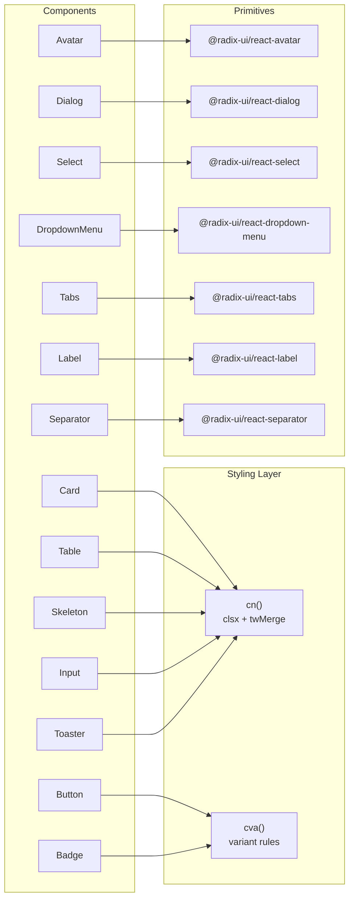

**Diagram sources**
- [button.tsx:7-35](file://src/components/ui/button.tsx#L7-L35)
- [badge.tsx:6-24](file://src/components/ui/badge.tsx#L6-L24)
- [select.tsx:1-158](file://src/components/ui/select.tsx#L1-L158)
- [dialog.tsx:1-120](file://src/components/ui/dialog.tsx#L1-L120)
- [dropdown-menu.tsx:1-196](file://src/components/ui/dropdown-menu.tsx#L1-L196)
- [tabs.tsx:1-56](file://src/components/ui/tabs.tsx#L1-L56)
- [avatar.tsx:1-51](file://src/components/ui/avatar.tsx#L1-L51)
- [label.tsx:1-21](file://src/components/ui/label.tsx#L1-L21)
- [separator.tsx:1-32](file://src/components/ui/separator.tsx#L1-L32)
- [card.tsx:1-104](file://src/components/ui/card.tsx#L1-L104)
- [table.tsx:1-117](file://src/components/ui/table.tsx#L1-L117)
- [skeleton.tsx:1-14](file://src/components/ui/skeleton.tsx#L1-L14)
- [input.tsx:1-20](file://src/components/ui/input.tsx#L1-L20)
- [sonner.tsx:1-50](file://src/components/ui/sonner.tsx#L1-L50)
- [utils.ts:4-6](file://src/lib/utils.ts#L4-L6)

## Detailed Component Analysis

### Button
- Variants: default, destructive, outline, secondary, ghost, link
- Sizes: default, sm, lg, icon
- Composition: Uses cva for variant rules; asChild renders a Slot to wrap other components; forwards ref and props
- Accessibility: Focus-visible ring, disabled pointer-events and opacity
- Usage patterns:
  - Render as a link-like button with variant="link"
  - Icon-only buttons with size="icon"
  - Danger actions with variant="destructive"

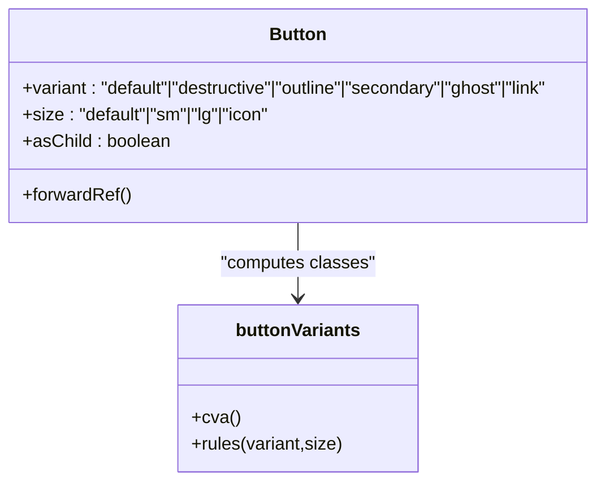

**Diagram sources**
- [button.tsx:7-58](file://src/components/ui/button.tsx#L7-L58)

**Section sources**
- [button.tsx:37-58](file://src/components/ui/button.tsx#L37-L58)

### Input
- Validation states: focus-visible ring, disabled cursor and opacity
- Accessibility: data-slot for styling hooks; consistent placeholder and text sizing
- Usage patterns:
  - Combine with Label for accessible forms
  - Use md:text-sm for larger screens

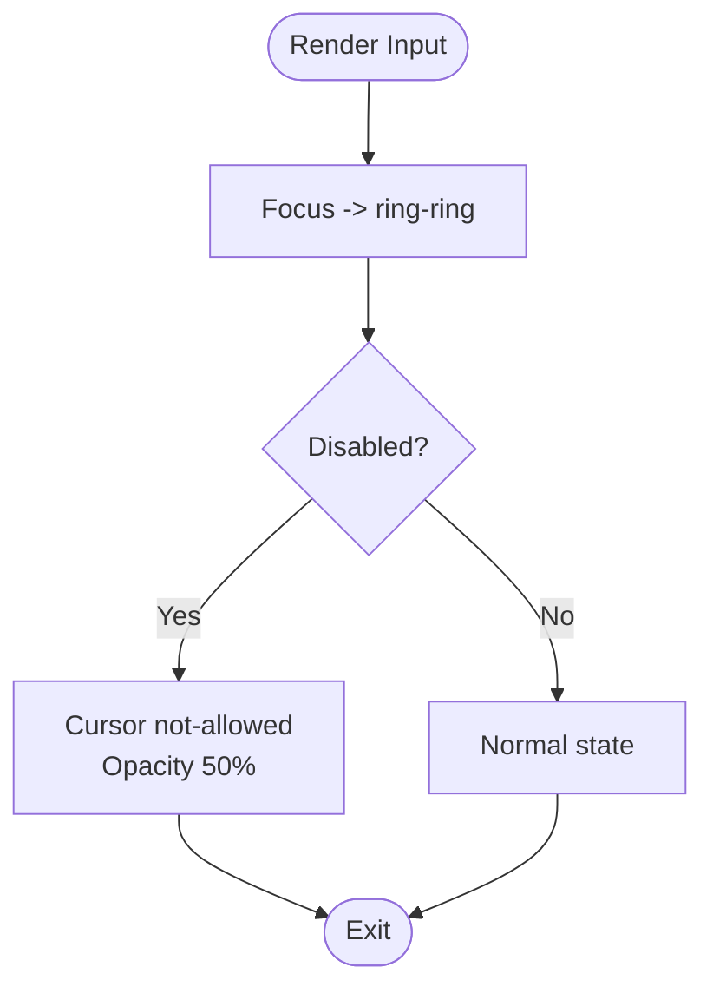

**Diagram sources**
- [input.tsx:5-19](file://src/components/ui/input.tsx#L5-L19)

**Section sources**
- [input.tsx:5-19](file://src/components/ui/input.tsx#L5-L19)

### Select
- Parts: Root, Group, Value, Trigger, Content, Label, Item, Separator, ScrollUp/Down buttons
- Behavior: Portal-based overlay, popper positioning, scrollable viewport, selection indicators
- Accessibility: Keyboard navigation, focus management, open/close states
- Usage patterns:
  - Use SelectTrigger to render current value
  - Populate SelectContent with SelectItem entries
  - Add SelectLabel for grouping

```mermaid
sequenceDiagram
participant U as "User"
participant T as "SelectTrigger"
participant P as "Portal"
participant C as "SelectContent"
participant V as "Viewport"
participant I as "SelectItem"
U->>T : Click
T->>P : Open portal
P->>C : Render content
C->>V : Render items
U->>I : Select item
I-->>T : Update value
T-->>U : Close menu
```

**Diagram sources**
- [select.tsx:9-157](file://src/components/ui/select.tsx#L9-L157)

**Section sources**
- [select.tsx:13-157](file://src/components/ui/select.tsx#L13-L157)

### Card
- Slots: header, title, description, action, content, footer
- Size variants: default, sm
- Behavior: Data attributes and container queries adjust padding and spacing; footer presence removes bottom padding
- Usage patterns:
  - Place an action in CardAction for alignment
  - Use size="sm" for compact cards

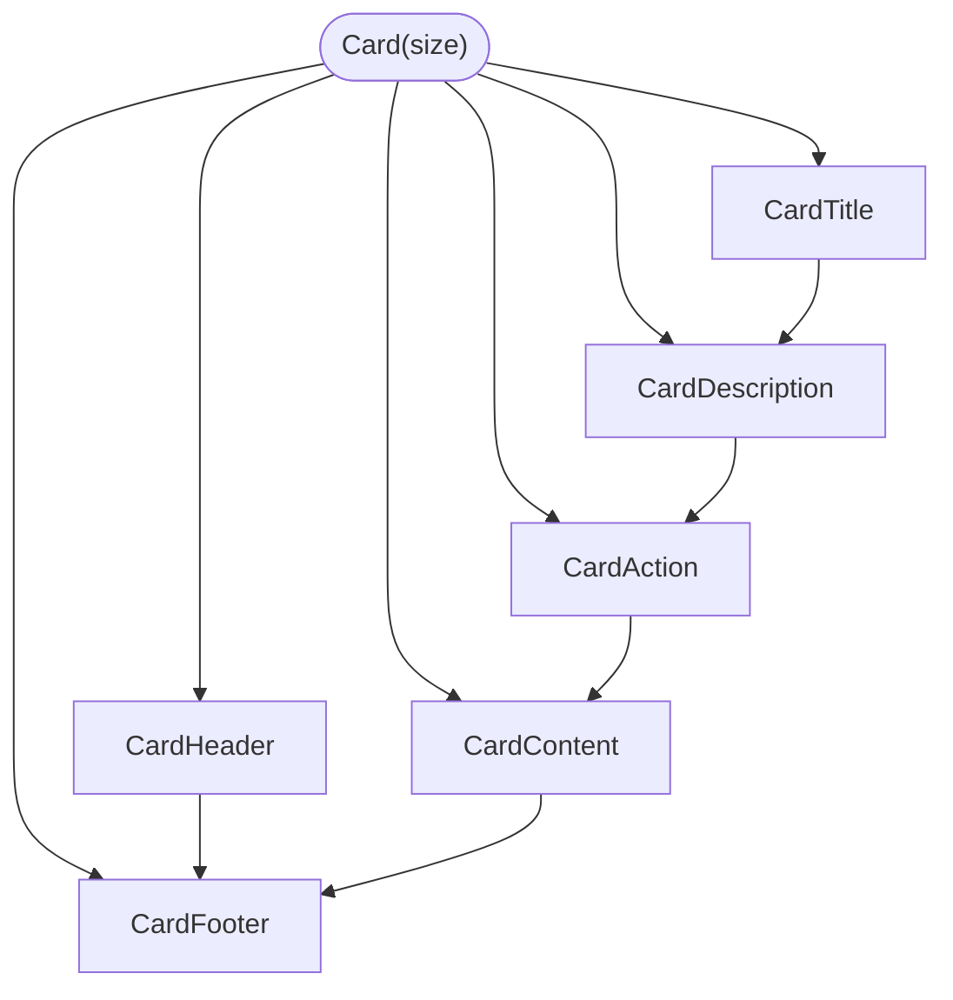

**Diagram sources**
- [card.tsx:5-103](file://src/components/ui/card.tsx#L5-L103)

**Section sources**
- [card.tsx:5-103](file://src/components/ui/card.tsx#L5-L103)

### Table
- Wrapper: Table container ensures horizontal scrolling
- Parts: Table, TableHeader, TableBody, TableFooter, TableRow, TableHead, TableCell, TableCaption
- Behavior: Hover and selected states; checkbox-friendly spacing
- Usage patterns:
  - Wrap long tables in Table for responsiveness
  - Use TableCaption for summaries

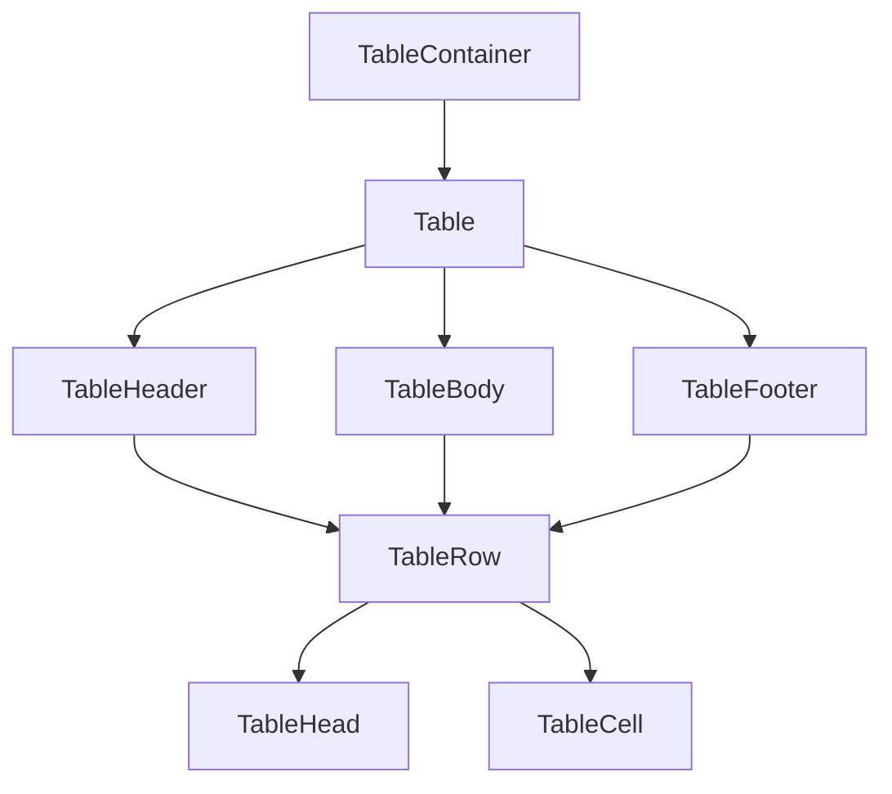

**Diagram sources**
- [table.tsx:7-116](file://src/components/ui/table.tsx#L7-L116)

**Section sources**
- [table.tsx:7-116](file://src/components/ui/table.tsx#L7-L116)

### Dialog
- Parts: Root, Portal, Overlay, Content, Header/Footer, Title, Description, Close
- Behavior: Centered content with animations; overlay backdrop; focus trapping
- Accessibility: Close button with screen-reader text; open/close transitions
- Usage patterns:
  - Use DialogTrigger to open
  - Put actions in DialogFooter

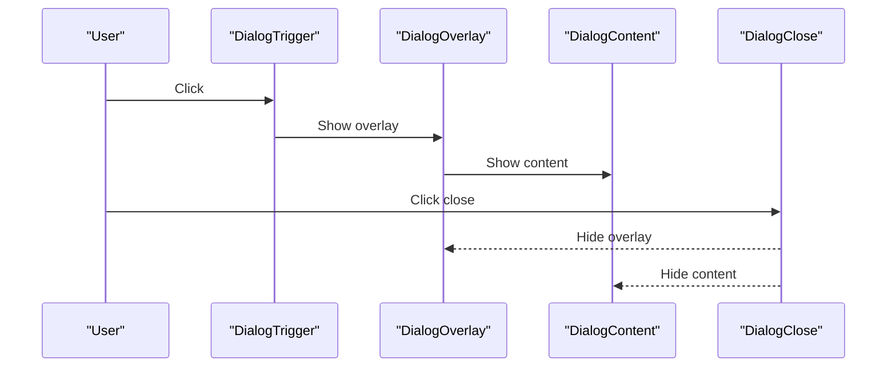

**Diagram sources**
- [dialog.tsx:9-119](file://src/components/ui/dialog.tsx#L9-L119)

**Section sources**
- [dialog.tsx:14-119](file://src/components/ui/dialog.tsx#L14-L119)

### Badge
- Variants: default, secondary, destructive, outline
- Usage patterns:
  - Status badges with default
  - Secondary for less prominent tags
  - Destructive for errors

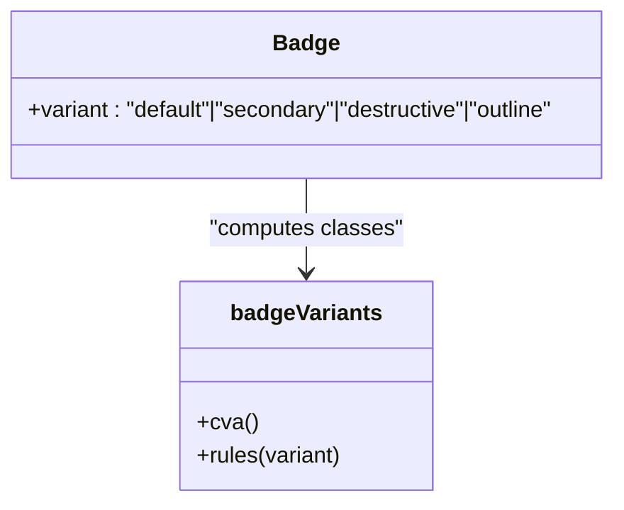

**Diagram sources**
- [badge.tsx:6-36](file://src/components/ui/badge.tsx#L6-L36)

**Section sources**
- [badge.tsx:26-36](file://src/components/ui/badge.tsx#L26-L36)

### Avatar
- Parts: Root, Image, Fallback
- Behavior: Circular container; fallback shown while image loads or fails
- Usage patterns:
  - Pair Avatar with AvatarImage and AvatarFallback
  - Use for user profiles and comments

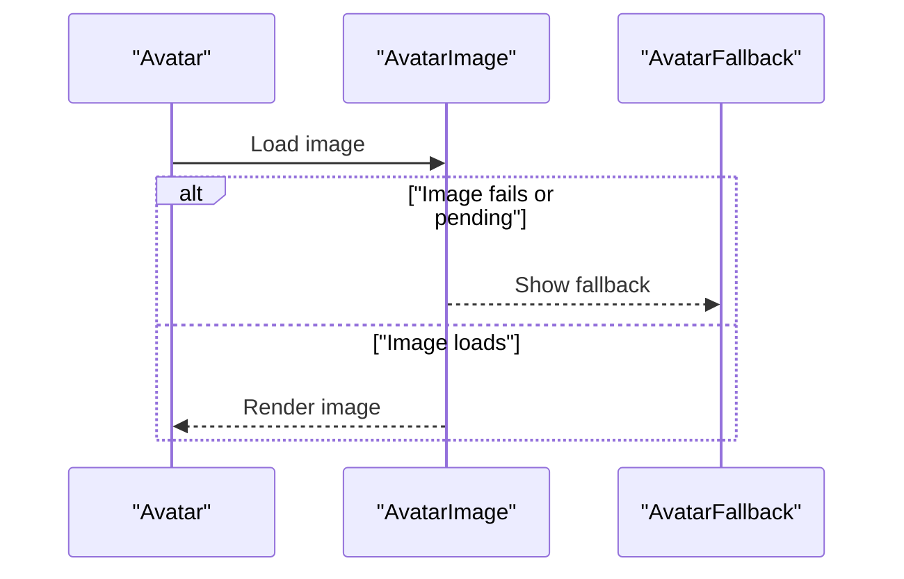

**Diagram sources**
- [avatar.tsx:8-50](file://src/components/ui/avatar.tsx#L8-L50)

**Section sources**
- [avatar.tsx:8-50](file://src/components/ui/avatar.tsx#L8-L50)

### Dropdown Menu
- Parts: Root, Trigger, Content, Item, CheckboxItem, RadioItem, Label, Separator, Sub components, RadioGroup
- Behavior: Animated popups, keyboard navigation, nested submenus
- Usage patterns:
  - Use SubTrigger/SubContent for nested groups
  - Use CheckboxItem/RadioItem for selections

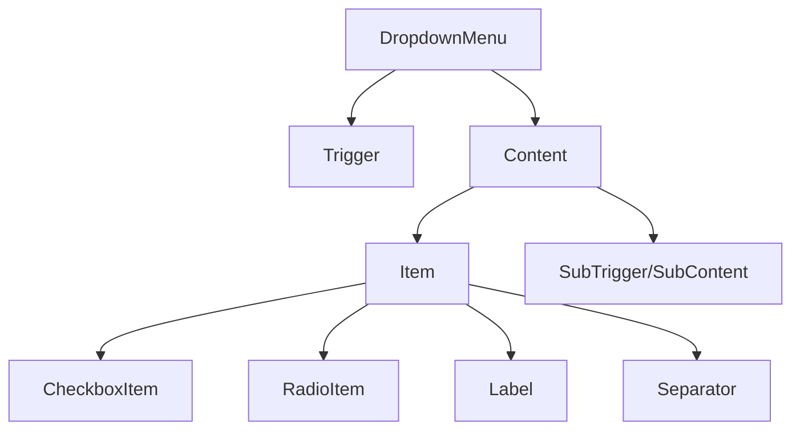

**Diagram sources**
- [dropdown-menu.tsx:9-195](file://src/components/ui/dropdown-menu.tsx#L9-L195)

**Section sources**
- [dropdown-menu.tsx:16-195](file://src/components/ui/dropdown-menu.tsx#L16-L195)

### Tabs
- Parts: Root, List, Trigger, Content
- Behavior: Active state styling and focus rings
- Usage patterns:
  - Use TabsTrigger values to control TabsContent visibility

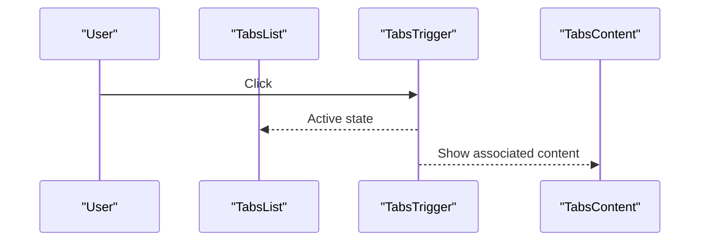

**Diagram sources**
- [tabs.tsx:8-55](file://src/components/ui/tabs.tsx#L8-L55)

**Section sources**
- [tabs.tsx:10-55](file://src/components/ui/tabs.tsx#L10-L55)

### Skeleton
- Purpose: Lightweight loading placeholders with pulse animation
- Usage patterns:
  - Wrap content areas during async fetch
  - Use TableSkeleton for table placeholders

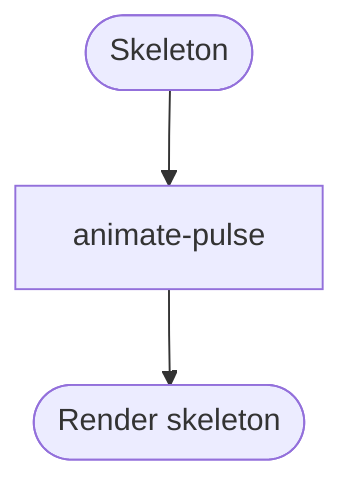

**Diagram sources**
- [skeleton.tsx:3-13](file://src/components/ui/skeleton.tsx#L3-L13)

**Section sources**
- [skeleton.tsx:3-13](file://src/components/ui/skeleton.tsx#L3-L13)

### Label
- Purpose: Associates text with form controls; respects disabled states
- Usage patterns:
  - Wrap inputs or toggles with Label for click-to-focus

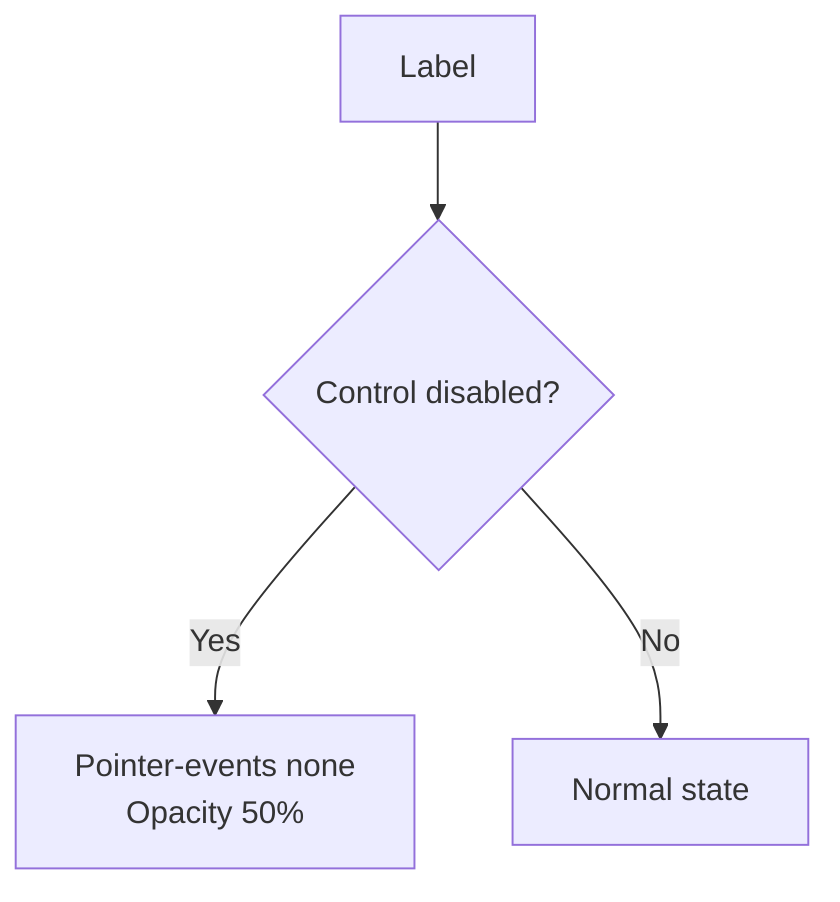

**Diagram sources**
- [label.tsx:7-20](file://src/components/ui/label.tsx#L7-L20)

**Section sources**
- [label.tsx:7-20](file://src/components/ui/label.tsx#L7-L20)

### Separator
- Purpose: Horizontal or vertical divider
- Props: orientation, decorative
- Usage patterns:
  - Use horizontal separators in lists
  - Use vertical for sidebars

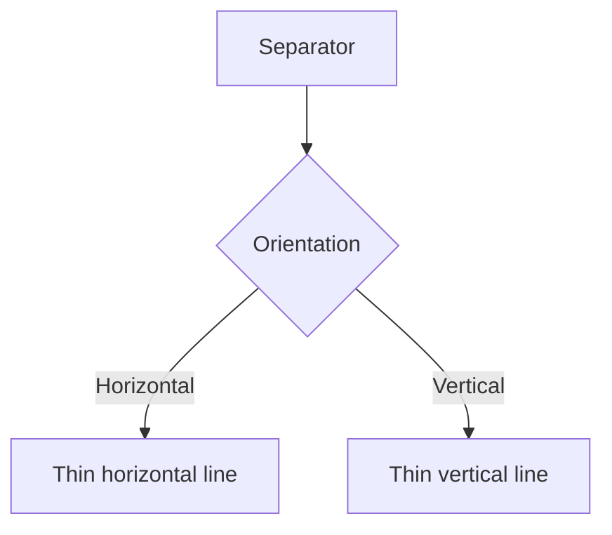

**Diagram sources**
- [separator.tsx:8-28](file://src/components/ui/separator.tsx#L8-L28)

**Section sources**
- [separator.tsx:8-28](file://src/components/ui/separator.tsx#L8-L28)

### Sonner Toaster
- Purpose: Theme-aware notifications with icons and styles
- Integration: Reads theme from next-themes; maps toast types to icons
- Usage patterns:
  - Trigger toasts from actions or API responses
  - Customize appearance via CSS variables

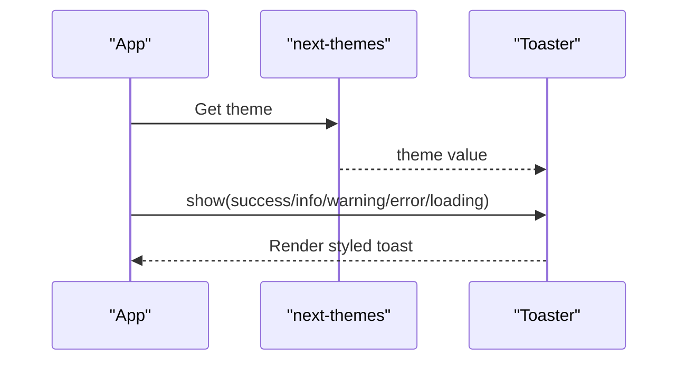

**Diagram sources**
- [sonner.tsx:7-47](file://src/components/ui/sonner.tsx#L7-L47)

**Section sources**
- [sonner.tsx:7-47](file://src/components/ui/sonner.tsx#L7-L47)

## Dependency Analysis
- Internal dependencies:
  - All components depend on cn() for class merging
  - Button and Badge use class-variance-authority
  - Form-related components integrate with Radix UI primitives
- External dependencies (selected):
  - @radix-ui/* for accessible primitives
  - class-variance-authority for variants
  - lucide-react for icons
  - next-themes and sonner for theme and notifications

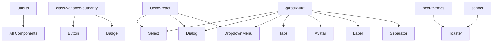

**Diagram sources**
- [utils.ts:4-6](file://src/lib/utils.ts#L4-L6)
- [button.tsx:7-35](file://src/components/ui/button.tsx#L7-L35)
- [badge.tsx:6-24](file://src/components/ui/badge.tsx#L6-L24)
- [select.tsx:1-158](file://src/components/ui/select.tsx#L1-L158)
- [dialog.tsx:1-120](file://src/components/ui/dialog.tsx#L1-L120)
- [dropdown-menu.tsx:1-196](file://src/components/ui/dropdown-menu.tsx#L1-L196)
- [tabs.tsx:1-56](file://src/components/ui/tabs.tsx#L1-L56)
- [avatar.tsx:1-51](file://src/components/ui/avatar.tsx#L1-L51)
- [label.tsx:1-21](file://src/components/ui/label.tsx#L1-L21)
- [separator.tsx:1-32](file://src/components/ui/separator.tsx#L1-L32)
- [sonner.tsx:1-50](file://src/components/ui/sonner.tsx#L1-L50)
- [package.json:11-38](file://package.json#L11-L38)

**Section sources**
- [package.json:11-38](file://package.json#L11-L38)
- [utils.ts:4-6](file://src/lib/utils.ts#L4-L6)

## Performance Considerations
- Prefer variant composition over inline conditionals to reduce re-renders.
- Use Skeleton sparingly; batch placeholder updates to avoid layout thrashing.
- For large tables, virtualize rows if needed; keep Select items grouped to improve UX.
- Avoid heavy animations in fast-paced flows; leverage CSS transitions minimally.
- Keep icon imports scoped to components to reduce bundle size.

## Troubleshooting Guide
- Button not responding to clicks:
  - Verify asChild is not wrapping interactive children unintentionally.
  - Ensure disabled prop is not set.
- Select not opening:
  - Confirm Select is wrapped in SelectProvider and Trigger is used.
  - Check Portal rendering and z-index stacking.
- Dialog not closing:
  - Ensure DialogClose is present and reachable via keyboard.
  - Verify focus trapping is not conflicting with custom focus management.
- Input focus ring not visible:
  - Confirm focus-visible styles and ring classes are applied.
  - Check for global overrides disabling outlines.
- Badge or Button variant not applying:
  - Verify variant name matches defined options.
  - Ensure cn() merges classes correctly with existing className.
- Notification icons missing:
  - Confirm Toaster is rendered and theme is resolved by next-themes.

**Section sources**
- [button.tsx:43-55](file://src/components/ui/button.tsx#L43-L55)
- [select.tsx:9-157](file://src/components/ui/select.tsx#L9-L157)
- [dialog.tsx:29-51](file://src/components/ui/dialog.tsx#L29-L51)
- [input.tsx:5-19](file://src/components/ui/input.tsx#L5-L19)
- [badge.tsx:30-33](file://src/components/ui/badge.tsx#L30-L33)
- [sonner.tsx:7-47](file://src/components/ui/sonner.tsx#L7-L47)

## Conclusion
Datafrica’s base UI components combine Radix UI primitives with shadcn/ui-inspired styling and class-variance-authority for robust, accessible, and maintainable interfaces. Buttons, forms, layouts, and feedback systems are designed for composability, responsive behavior, and consistent theming. Following the documented patterns ensures predictable behavior across contexts and easy extension.

## Appendices
- Shadcn configuration highlights:
  - Style: base-nova
  - RSC enabled
  - TSX enabled
  - Tailwind CSS in src/app/globals.css
  - Base color: neutral
  - CSS variables enabled
  - Icon library: lucide

**Section sources**
- [components.json:3-13](file://components.json#L3-L13)