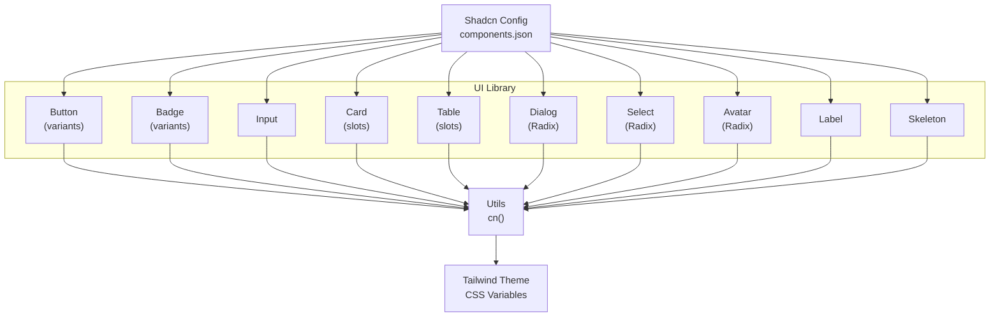
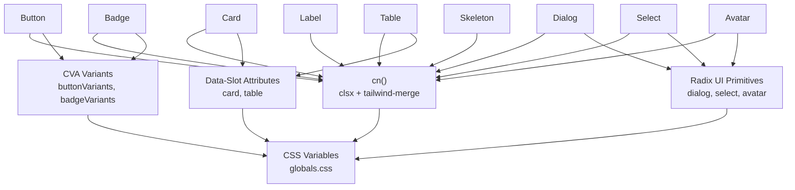
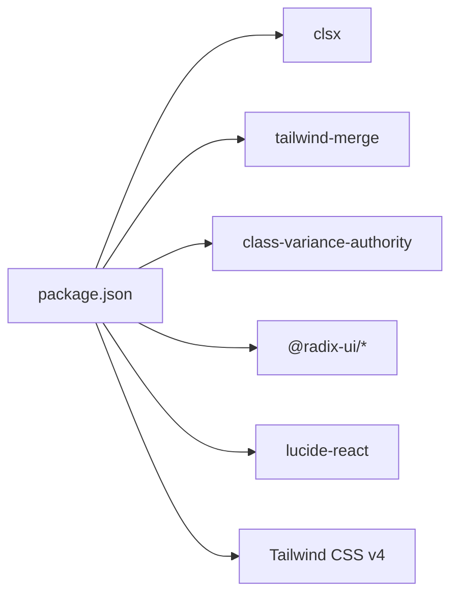

# Component Customization

<cite>
**Referenced Files in This Document**
- [components.json](file://components.json)
- [package.json](file://package.json)
- [src/lib/utils.ts](file://src/lib/utils.ts)
- [src/components/ui/button.tsx](file://src/components/ui/button.tsx)
- [src/components/ui/badge.tsx](file://src/components/ui/badge.tsx)
- [src/components/ui/input.tsx](file://src/components/ui/input.tsx)
- [src/components/ui/card.tsx](file://src/components/ui/card.tsx)
- [src/components/ui/dialog.tsx](file://src/components/ui/dialog.tsx)
- [src/components/ui/select.tsx](file://src/components/ui/select.tsx)
- [src/components/ui/table.tsx](file://src/components/ui/table.tsx)
- [src/components/ui/skeleton.tsx](file://src/components/ui/skeleton.tsx)
- [src/components/ui/avatar.tsx](file://src/components/ui/avatar.tsx)
- [src/components/ui/label.tsx](file://src/components/ui/label.tsx)
- [src/app/globals.css](file://src/app/globals.css)
</cite>

## Table of Contents
1. [Introduction](#introduction)
2. [Project Structure](#project-structure)
3. [Core Components](#core-components)
4. [Architecture Overview](#architecture-overview)
5. [Detailed Component Analysis](#detailed-component-analysis)
6. [Dependency Analysis](#dependency-analysis)
7. [Performance Considerations](#performance-considerations)
8. [Troubleshooting Guide](#troubleshooting-guide)
9. [Conclusion](#conclusion)
10. [Appendices](#appendices)

## Introduction
This document explains how to customize and extend Datafrica’s component library. It focuses on:
- The cn utility for safe, conditional class merging
- The component variant system powered by class-variance-authority (CVA)
- How to create custom variants, add new component styles, and maintain design consistency
- The shadcn/ui configuration in components.json and recommended customization patterns
- Guidelines for extending existing components, creating new shared components, and following the established design system
- Composition patterns, prop forwarding, and accessibility best practices

## Project Structure
The component library is organized under src/components/ui with individual components grouped by function. Shared utilities live under src/lib, and global Tailwind CSS variables and themes are defined in src/app/globals.css. The project integrates shadcn/ui via components.json and uses Radix UI primitives for accessible base components.

**Diagram sources**
- [src/components/ui/button.tsx:1-58](file://src/components/ui/button.tsx#L1-L58)
- [src/components/ui/badge.tsx:1-37](file://src/components/ui/badge.tsx#L1-L37)
- [src/components/ui/input.tsx:1-20](file://src/components/ui/input.tsx#L1-L20)
- [src/components/ui/card.tsx:1-104](file://src/components/ui/card.tsx#L1-L104)
- [src/components/ui/table.tsx:1-117](file://src/components/ui/table.tsx#L1-L117)
- [src/components/ui/dialog.tsx:1-120](file://src/components/ui/dialog.tsx#L1-L120)
- [src/components/ui/select.tsx:1-158](file://src/components/ui/select.tsx#L1-L158)
- [src/components/ui/avatar.tsx:1-51](file://src/components/ui/avatar.tsx#L1-L51)
- [src/components/ui/label.tsx:1-20](file://src/components/ui/label.tsx#L1-L20)
- [src/components/ui/skeleton.tsx:1-14](file://src/components/ui/skeleton.tsx#L1-L14)
- [src/lib/utils.ts:1-7](file://src/lib/utils.ts#L1-L7)
- [src/app/globals.css:1-120](file://src/app/globals.css#L1-L120)
- [components.json:1-26](file://components.json#L1-L26)

**Section sources**
- [components.json:1-26](file://components.json#L1-L26)
- [src/lib/utils.ts:1-7](file://src/lib/utils.ts#L1-L7)
- [src/app/globals.css:1-120](file://src/app/globals.css#L1-L120)

## Core Components
This section highlights the building blocks used across the UI library and how they are composed.

- cn utility: Provides robust class merging with Tailwind CSS conflict resolution.
- Variants with CVA: Buttons and badges define variant sets and defaults for consistent styling.
- Slots and data attributes: Cards and tables use data-slot attributes to enable theme-driven styling and composition.
- Radix UI primitives: Dialog, Select, Avatar, and others wrap accessible primitives with consistent styling.

Key patterns:
- Prop forwarding: Components forward props to underlying DOM or primitive elements.
- Conditional rendering: asChild pattern allows rendering alternate host elements via Radix Slot.
- Design tokens: Global CSS variables define semantic colors and radii, enabling consistent theming.

**Section sources**
- [src/lib/utils.ts:1-7](file://src/lib/utils.ts#L1-L7)
- [src/components/ui/button.tsx:1-58](file://src/components/ui/button.tsx#L1-L58)
- [src/components/ui/badge.tsx:1-37](file://src/components/ui/badge.tsx#L1-L37)
- [src/components/ui/card.tsx:1-104](file://src/components/ui/card.tsx#L1-L104)
- [src/components/ui/table.tsx:1-117](file://src/components/ui/table.tsx#L1-L117)
- [src/components/ui/dialog.tsx:1-120](file://src/components/ui/dialog.tsx#L1-L120)
- [src/components/ui/select.tsx:1-158](file://src/components/ui/select.tsx#L1-L158)
- [src/components/ui/avatar.tsx:1-51](file://src/components/ui/avatar.tsx#L1-L51)
- [src/components/ui/label.tsx:1-20](file://src/components/ui/label.tsx#L1-L20)
- [src/components/ui/skeleton.tsx:1-14](file://src/components/ui/skeleton.tsx#L1-L14)
- [src/app/globals.css:1-120](file://src/app/globals.css#L1-L120)

## Architecture Overview
The component architecture centers on:
- A single cn function to merge classes safely
- CVA-based variants for buttons and badges
- Data-slot attributes for slot-aware styling
- Radix UI for accessible base behavior
- Tailwind CSS variables for themeable design tokens

**Diagram sources**
- [src/lib/utils.ts:1-7](file://src/lib/utils.ts#L1-L7)
- [src/components/ui/button.tsx:1-58](file://src/components/ui/button.tsx#L1-L58)
- [src/components/ui/badge.tsx:1-37](file://src/components/ui/badge.tsx#L1-L37)
- [src/components/ui/card.tsx:1-104](file://src/components/ui/card.tsx#L1-L104)
- [src/components/ui/table.tsx:1-117](file://src/components/ui/table.tsx#L1-L117)
- [src/components/ui/dialog.tsx:1-120](file://src/components/ui/dialog.tsx#L1-L120)
- [src/components/ui/select.tsx:1-158](file://src/components/ui/select.tsx#L1-L158)
- [src/components/ui/avatar.tsx:1-51](file://src/components/ui/avatar.tsx#L1-L51)
- [src/components/ui/label.tsx:1-20](file://src/components/ui/label.tsx#L1-L20)
- [src/components/ui/skeleton.tsx:1-14](file://src/components/ui/skeleton.tsx#L1-L14)
- [src/app/globals.css:1-120](file://src/app/globals.css#L1-L120)

## Detailed Component Analysis

### cn Utility Function
Purpose:
- Merge class names while resolving Tailwind CSS conflicts using tailwind-merge after clsx normalization.

Usage pattern:
- Accepts any number of inputs and returns a single, deduplicated, conflict-free class string.
- Used pervasively across components to combine static base classes with dynamic variants and user-provided className.

Guidelines:
- Always pass user-provided className last to allow overrides.
- Prefer combining base classes with variant classes rather than raw Tailwind utilities inside components.

**Section sources**
- [src/lib/utils.ts:1-7](file://src/lib/utils.ts#L1-L7)

### Button Component (CVA Variants)
Pattern:
- Defines buttonVariants with variant and size axes.
- Exposes variant and size props with defaults.
- Uses cn to merge variant classes with user className.
- Supports asChild forwarding via Radix Slot for semantic composition.

Customization steps:
- Add a new variant axis (e.g., tone) by extending the variants object in buttonVariants.
- Define defaultVariants to set sensible defaults.
- Keep variant classes scoped to semantic roles to preserve consistency.

Accessibility:
- Inherits focus-visible outlines and ring styles from base classes.
- Disabled state handled via standard disabled attribute.

**Section sources**
- [src/components/ui/button.tsx:1-58](file://src/components/ui/button.tsx#L1-L58)

### Badge Component (CVA Variants)
Pattern:
- Similar to Button but simpler, with a single variant axis.
- Demonstrates minimal variant surface area for focused semantics.

Customization steps:
- Add new variants for distinct semantic states (e.g., muted).
- Keep variant classes aligned with global CSS variables.

**Section sources**
- [src/components/ui/badge.tsx:1-37](file://src/components/ui/badge.tsx#L1-L37)

### Input Component (Base Field)
Pattern:
- Wraps an HTML input with data-slot for theme-aware targeting.
- Applies base field styling consistently with form controls.

Customization steps:
- Extend base classes to support sizes or states (e.g., error).
- Introduce data-slot-aware variants in globals.css for theme-driven updates.

**Section sources**
- [src/components/ui/input.tsx:1-20](file://src/components/ui/input.tsx#L1-L20)

### Card Component (Slots and Composition)
Pattern:
- Uses data-slot attributes to mark structural parts (header, title, content, footer, action).
- Leverages group/* selectors and data-* attributes to adjust spacing and borders based on slot presence and size.

Customization steps:
- Add new data-slot markers for specialized regions.
- Define CSS rules in globals.css that target these slots and sizes.

Accessibility:
- No explicit ARIA roles here; ensure semantic HTML is used by consumers.

**Section sources**
- [src/components/ui/card.tsx:1-104](file://src/components/ui/card.tsx#L1-L104)
- [src/app/globals.css:1-120](file://src/app/globals.css#L1-L120)

### Table Component (Slots and States)
Pattern:
- Wraps a native table in a scrollable container and annotates child elements with data-slot.
- Uses data-slot and aria-expanded for hover, selection, and expansion states.

Customization steps:
- Add new data-slot targets for specialized cells or rows.
- Extend CSS rules to handle new states (e.g., striped).

Accessibility:
- Consumers should manage ARIA attributes (e.g., role=table, aria-describedby) as needed.

**Section sources**
- [src/components/ui/table.tsx:1-117](file://src/components/ui/table.tsx#L1-L117)

### Dialog Component (Radix UI)
Pattern:
- Composes Radix Dialog primitives with consistent overlay/content styling.
- Uses cn for overlay and content classes; includes close button with sr-only text.

Customization steps:
- Adjust animation classes or dimensions; keep portal usage to avoid layout shifts.
- Extend header/footer layouts via composition with Card or Table where appropriate.

Accessibility:
- Radix Dialog manages focus trapping and ARIA attributes automatically.

**Section sources**
- [src/components/ui/dialog.tsx:1-120](file://src/components/ui/dialog.tsx#L1-L120)

### Select Component (Radix UI)
Pattern:
- Wraps Trigger, Content, Item, Label, and Scroll buttons with consistent styling.
- Uses portals and position logic to render content near the trigger.

Customization steps:
- Add new item variants or separators.
- Keep popper positioning consistent with existing patterns.

Accessibility:
- Radix Select ensures keyboard navigation and ARIA roles.

**Section sources**
- [src/components/ui/select.tsx:1-158](file://src/components/ui/select.tsx#L1-L158)

### Avatar Component (Radix UI)
Pattern:
- Wraps Avatar primitives with consistent sizing and fallback visuals.

Customization steps:
- Add size variants via data-size or additional data-slot attributes.
- Align with global CSS variables for background and foreground.

**Section sources**
- [src/components/ui/avatar.tsx:1-51](file://src/components/ui/avatar.tsx#L1-L51)

### Label Component
Pattern:
- Adds data-slot and disabled state handling for form labels.

Customization steps:
- Extend with variant classes for emphasis or states.
- Keep alignment with form control components.

**Section sources**
- [src/components/ui/label.tsx:1-20](file://src/components/ui/label.tsx#L1-L20)

### Skeleton Component
Pattern:
- Provides a simple animated placeholder with data-slot for theme targeting.

Customization steps:
- Add variants for shapes or animation intensity.
- Use data-slot to integrate with Card, Table, and other components.

**Section sources**
- [src/components/ui/skeleton.tsx:1-14](file://src/components/ui/skeleton.tsx#L1-L14)

### Shadcn/ui Configuration (components.json)
Highlights:
- Style: base-nova
- RSC and TSX enabled
- Tailwind config path empty (defaults), CSS file set, baseColor neutral, cssVariables enabled
- Aliases for components, utils, ui, lib, hooks
- Icon library: lucide
- RTL disabled
- Menu colors and registries empty

Customization patterns:
- Use aliases to keep imports consistent across the app.
- Keep cssVariables enabled to leverage CSS variables for theming.
- Use iconLibrary to standardize icons across components.

**Section sources**
- [components.json:1-26](file://components.json#L1-L26)

## Dependency Analysis
The UI library depends on:
- clsx and tailwind-merge for class merging
- class-variance-authority for variant systems
- Radix UI for accessible primitives
- lucide-react for icons
- Tailwind CSS v4 for utilities and CSS variables

**Diagram sources**
- [package.json:1-51](file://package.json#L1-L51)

**Section sources**
- [package.json:1-51](file://package.json#L1-L51)

## Performance Considerations
- Prefer CVA variants over ad hoc conditionals to reduce runtime branching.
- Use cn sparingly and pass user className last to minimize re-renders.
- Keep variant surfaces small to limit CSS bloat.
- Use data-slot attributes to enable efficient CSS targeting without JavaScript.
- Avoid heavy animations in Skeleton and other loading states.

## Troubleshooting Guide
Common issues and resolutions:
- Conflicting Tailwind classes: Ensure cn is used to merge classes; pass user className last.
- Missing variant classes: Verify variant keys match those defined in CVA; check defaultVariants.
- Accessibility regressions: Confirm Radix primitives are used; ensure focus management and ARIA attributes remain intact.
- Theming inconsistencies: Check CSS variable definitions and ensure cssVariables are enabled in components.json.

**Section sources**
- [src/lib/utils.ts:1-7](file://src/lib/utils.ts#L1-L7)
- [src/components/ui/button.tsx:1-58](file://src/components/ui/button.tsx#L1-L58)
- [src/components/ui/dialog.tsx:1-120](file://src/components/ui/dialog.tsx#L1-L120)
- [components.json:1-26](file://components.json#L1-L26)

## Conclusion
Datafrica’s component library leverages a consistent set of patterns:
- A single cn utility for safe class merging
- CVA-based variants for scalable, maintainable styling
- Data-slot attributes for theme-aware composition
- Radix UI primitives for accessible behavior
- Tailwind CSS variables for cohesive theming

By following these patterns, you can extend existing components, introduce new shared components, and maintain design consistency across the application.

## Appendices

### Creating Custom Component Variants
Steps:
- Define a new variant schema using cva with clear axes (e.g., variant, size).
- Set defaultVariants to sensible values.
- Export VariantProps and merge variants with cn in the component.
- Keep variant classes scoped to semantic roles.

Example reference:
- Button variants definition and usage
- Badge variants definition and usage

**Section sources**
- [src/components/ui/button.tsx:1-58](file://src/components/ui/button.tsx#L1-L58)
- [src/components/ui/badge.tsx:1-37](file://src/components/ui/badge.tsx#L1-L37)

### Adding New Component Styles
Steps:
- Choose a base component or primitive to mirror.
- Wrap with cn and apply base styles.
- Introduce data-slot attributes for theme targeting.
- Update globals.css with rules that respond to data-slot and data-size.

Example reference:
- Input base styling and data-slot
- Card and Table slot-based styling

**Section sources**
- [src/components/ui/input.tsx:1-20](file://src/components/ui/input.tsx#L1-L20)
- [src/components/ui/card.tsx:1-104](file://src/components/ui/card.tsx#L1-L104)
- [src/components/ui/table.tsx:1-117](file://src/components/ui/table.tsx#L1-L117)
- [src/app/globals.css:1-120](file://src/app/globals.css#L1-L120)

### Extending Existing Components
Patterns:
- Forward props to underlying elements or primitives.
- Support asChild for semantic composition.
- Respect defaultVariants and variant axes.
- Maintain accessibility via Radix primitives.

Example reference:
- Button asChild forwarding
- Dialog, Select, Avatar wrapping Radix primitives

**Section sources**
- [src/components/ui/button.tsx:1-58](file://src/components/ui/button.tsx#L1-L58)
- [src/components/ui/dialog.tsx:1-120](file://src/components/ui/dialog.tsx#L1-L120)
- [src/components/ui/select.tsx:1-158](file://src/components/ui/select.tsx#L1-L158)
- [src/components/ui/avatar.tsx:1-51](file://src/components/ui/avatar.tsx#L1-L51)

### Creating New Shared Components
Guidelines:
- Use data-slot attributes for theme targeting.
- Keep variant surfaces minimal and semantic.
- Reuse cn and CVA patterns.
- Align with Tailwind CSS variables and components.json aliases.

Example reference:
- Label and Skeleton as minimal shared components
- Card and Table as composite components

**Section sources**
- [src/components/ui/label.tsx:1-20](file://src/components/ui/label.tsx#L1-L20)
- [src/components/ui/skeleton.tsx:1-14](file://src/components/ui/skeleton.tsx#L1-L14)
- [src/components/ui/card.tsx:1-104](file://src/components/ui/card.tsx#L1-L104)
- [src/components/ui/table.tsx:1-117](file://src/components/ui/table.tsx#L1-L117)

### Maintaining Design Consistency
Practices:
- Use CSS variables for colors and radii.
- Keep variants aligned with the design system.
- Prefer data-slot selectors over inline styles.
- Enable cssVariables in components.json to leverage theme tokens.

**Section sources**
- [src/app/globals.css:1-120](file://src/app/globals.css#L1-L120)
- [components.json:1-26](file://components.json#L1-L26)

### Component Composition Patterns
Patterns:
- Slot-based composition via data-slot attributes
- Prop forwarding to underlying DOM or Radix primitives
- asChild pattern for semantic wrappers

Example reference:
- Card and Table slot usage
- Button asChild forwarding

**Section sources**
- [src/components/ui/card.tsx:1-104](file://src/components/ui/card.tsx#L1-L104)
- [src/components/ui/table.tsx:1-117](file://src/components/ui/table.tsx#L1-L117)
- [src/components/ui/button.tsx:1-58](file://src/components/ui/button.tsx#L1-L58)

### Accessibility Standards
Guidelines:
- Use Radix UI primitives to inherit built-in accessibility features.
- Preserve focus management and keyboard navigation.
- Ensure sufficient color contrast using CSS variables.
- Provide visible focus indicators and ARIA attributes where needed.

**Section sources**
- [src/components/ui/dialog.tsx:1-120](file://src/components/ui/dialog.tsx#L1-L120)
- [src/components/ui/select.tsx:1-158](file://src/components/ui/select.tsx#L1-L158)
- [src/components/ui/avatar.tsx:1-51](file://src/components/ui/avatar.tsx#L1-L51)
- [src/app/globals.css:1-120](file://src/app/globals.css#L1-L120)