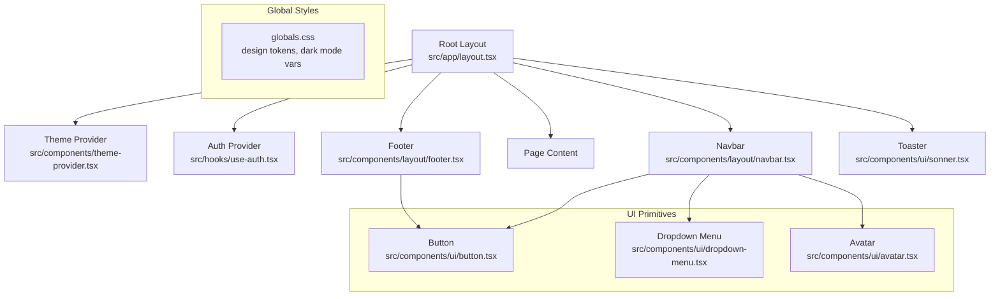
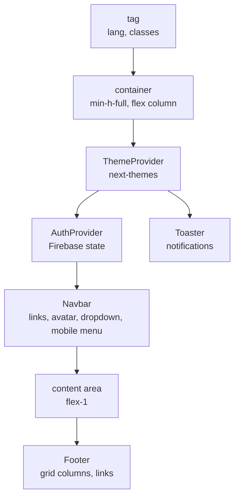
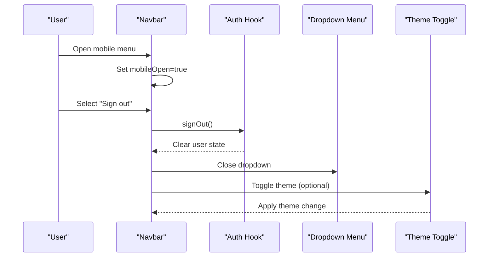
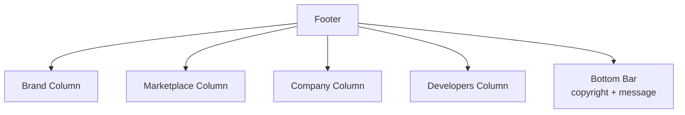
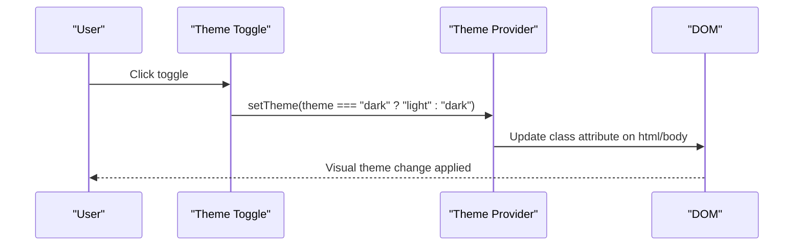
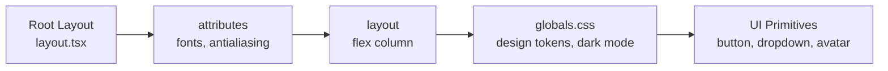
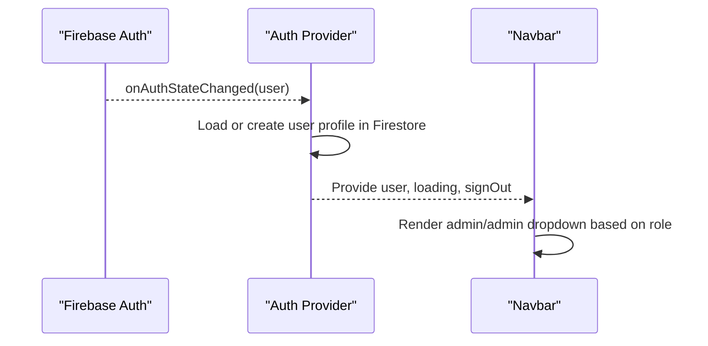
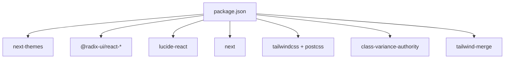

# Layout Components

<cite>
**Referenced Files in This Document**
- [layout.tsx](file://src/app/layout.tsx)
- [navbar.tsx](file://src/components/layout/navbar.tsx)
- [footer.tsx](file://src/components/layout/footer.tsx)
- [theme-provider.tsx](file://src/components/theme-provider.tsx)
- [theme-toggle.tsx](file://src/components/theme-toggle.tsx)
- [use-auth.tsx](file://src/hooks/use-auth.tsx)
- [globals.css](file://src/app/globals.css)
- [button.tsx](file://src/components/ui/button.tsx)
- [dropdown-menu.tsx](file://src/components/ui/dropdown-menu.tsx)
- [avatar.tsx](file://src/components/ui/avatar.tsx)
- [package.json](file://package.json)
- [components.json](file://components.json)
- [postcss.config.mjs](file://postcss.config.mjs)
- [next.config.ts](file://next.config.ts)
- [index.ts](file://src/types/index.ts)
</cite>

## Table of Contents
1. [Introduction](#introduction)
2. [Project Structure](#project-structure)
3. [Core Components](#core-components)
4. [Architecture Overview](#architecture-overview)
5. [Detailed Component Analysis](#detailed-component-analysis)
6. [Dependency Analysis](#dependency-analysis)
7. [Performance Considerations](#performance-considerations)
8. [Troubleshooting Guide](#troubleshooting-guide)
9. [Conclusion](#conclusion)
10. [Appendices](#appendices)

## Introduction
This document explains Datafrica’s layout and navigation components with a focus on:
- Navbar: authentication-aware navigation, responsive behavior, and menu interactions
- Footer: content organization and grid layout
- Theme provider and theme toggle: context-based theme management and user preference switching
- Root layout and global styling: Next.js app router integration, Tailwind CSS architecture, and design tokens
It also covers responsive breakpoints, mobile navigation patterns, and accessibility considerations, with practical examples of layout composition and theme integration.

## Project Structure
The layout system centers around the root layout that composes the theme provider, authentication provider, navbar, page content, footer, and toast notifications. Global styles define design tokens and theme-aware variables. UI primitives (button, dropdown-menu, avatar) are used consistently across layout components.

**Diagram sources**
- [layout.tsx:26-49](file://src/app/layout.tsx#L26-L49)
- [theme-provider.tsx:6-12](file://src/components/theme-provider.tsx#L6-L12)
- [use-auth.tsx:34-108](file://src/hooks/use-auth.tsx#L34-L108)
- [navbar.tsx:18-167](file://src/components/layout/navbar.tsx#L18-L167)
- [footer.tsx:4-74](file://src/components/layout/footer.tsx#L4-L74)
- [globals.css:1-120](file://src/app/globals.css#L1-L120)
- [button.tsx:7-35](file://src/components/ui/button.tsx#L7-L35)
- [dropdown-menu.tsx:54-70](file://src/components/ui/dropdown-menu.tsx#L54-L70)
- [avatar.tsx:8-21](file://src/components/ui/avatar.tsx#L8-L21)

**Section sources**
- [layout.tsx:1-50](file://src/app/layout.tsx#L1-L50)
- [globals.css:1-120](file://src/app/globals.css#L1-L120)

## Core Components
- Root layout orchestrates providers and renders the page shell with sticky navbar, scrollable main content, and footer.
- Navbar integrates authentication state, role-based visibility, responsive mobile menu, and theme toggle.
- Footer organizes links into columns and includes copyright and branding.
- Theme provider and toggle manage theme preferences via next-themes with hydration-safe mounting.
- Authentication provider manages Firebase state, user profile sync, and sign-out.

**Section sources**
- [layout.tsx:26-49](file://src/app/layout.tsx#L26-L49)
- [navbar.tsx:18-167](file://src/components/layout/navbar.tsx#L18-L167)
- [footer.tsx:4-74](file://src/components/layout/footer.tsx#L4-L74)
- [theme-provider.tsx:6-12](file://src/components/theme-provider.tsx#L6-L12)
- [theme-toggle.tsx:8-26](file://src/components/theme-toggle.tsx#L8-L26)
- [use-auth.tsx:34-108](file://src/hooks/use-auth.tsx#L34-L108)

## Architecture Overview
The layout architecture follows a layered pattern:
- Providers at the root configure theme and authentication contexts
- Navbar depends on authentication to show user menus and admin links
- Footer uses consistent typography and spacing from global styles
- UI primitives encapsulate styling and behavior for buttons, dropdowns, and avatars

**Diagram sources**
- [layout.tsx:32-47](file://src/app/layout.tsx#L32-L47)
- [theme-provider.tsx:8-10](file://src/components/theme-provider.tsx#L8-L10)
- [use-auth.tsx:34-108](file://src/hooks/use-auth.tsx#L34-L108)
- [navbar.tsx:22-164](file://src/components/layout/navbar.tsx#L22-L164)
- [footer.tsx:5-72](file://src/components/layout/footer.tsx#L5-L72)

## Detailed Component Analysis

### Navbar Component
Responsibilities:
- Brand identity and navigation links
- Authentication-aware rendering (signed-in vs anonymous)
- Role-based visibility (admin panel)
- Responsive behavior: desktop nav + mobile hamburger menu
- Theme toggle placement for quick theme switching
- User dropdown with profile info, navigation, and sign-out

Responsive design patterns:
- Desktop: hidden on small screens; uses flex layout with spacing and hover states
- Mobile: hamburger menu toggles a slide-down overlay with stacked links and actions
- Breakpoint: md (768px) separates desktop and mobile views

Accessibility considerations:
- Semantic markup with header, nav, and button elements
- Keyboard navigable dropdown menu
- Focus-visible ring utilities from button primitive
- Icons with appropriate sizing and contrast

Navigation state management:
- Uses authentication hook to derive user state and role
- Handles sign-out and redirects via dropdown menu
- Mobile menu closes after selection to improve UX

**Diagram sources**
- [navbar.tsx:18-167](file://src/components/layout/navbar.tsx#L18-L167)
- [use-auth.tsx:88-92](file://src/hooks/use-auth.tsx#L88-L92)
- [dropdown-menu.tsx:54-70](file://src/components/ui/dropdown-menu.tsx#L54-L70)
- [theme-toggle.tsx:8-26](file://src/components/theme-toggle.tsx#L8-L26)

**Section sources**
- [navbar.tsx:18-167](file://src/components/layout/navbar.tsx#L18-L167)
- [use-auth.tsx:22-108](file://src/hooks/use-auth.tsx#L22-L108)
- [dropdown-menu.tsx:54-70](file://src/components/ui/dropdown-menu.tsx#L54-L70)
- [avatar.tsx:8-21](file://src/components/ui/avatar.tsx#L8-L21)
- [button.tsx:7-35](file://src/components/ui/button.tsx#L7-L35)

### Footer Component
Structure and content organization:
- Grid layout with four columns: brand, marketplace, company, developers
- Each column groups related links with consistent typography
- Bottom bar includes copyright and brand message

Responsive behavior:
- Single column on small screens
- Four-column grid on medium screens and above

Accessibility considerations:
- Semantic headings and links
- Consistent text sizes and spacing from global styles

**Diagram sources**
- [footer.tsx:4-74](file://src/components/layout/footer.tsx#L4-L74)

**Section sources**
- [footer.tsx:4-74](file://src/components/layout/footer.tsx#L4-L74)

### Theme Provider and Theme Toggle
Theme provider:
- Wraps the app with next-themes provider
- Sets attribute to class, default theme to system, and enables OS preference detection

Theme toggle:
- Uses next-themes to switch between light and dark modes
- Hydration guard prevents mismatched SSR/CSS during initial render
- Renders icon button with accessible sizing and click handler

Integration:
- Navbar includes theme toggle in both desktop and mobile layouts
- Global CSS variables react to theme changes via .dark selector

**Diagram sources**
- [theme-provider.tsx:6-12](file://src/components/theme-provider.tsx#L6-L12)
- [theme-toggle.tsx:8-26](file://src/components/theme-toggle.tsx#L8-L26)
- [globals.css:81-113](file://src/app/globals.css#L81-L113)

**Section sources**
- [theme-provider.tsx:6-12](file://src/components/theme-provider.tsx#L6-L12)
- [theme-toggle.tsx:8-26](file://src/components/theme-toggle.tsx#L8-L26)
- [globals.css:1-120](file://src/app/globals.css#L1-L120)

### Root Layout and Global Styling
Root layout:
- Defines metadata and font variables
- Applies body layout with min-height and flex column
- Composes providers and page content

Global styling:
- Tailwind v4 configured via PostCSS plugin
- Design tokens mapped to CSS variables for theme-aware components
- Dark mode variables override light mode values under .dark class
- Fonts injected via Next Font with CSS variables for typography

**Diagram sources**
- [layout.tsx:10-37](file://src/app/layout.tsx#L10-L37)
- [globals.css:1-120](file://src/app/globals.css#L1-L120)
- [postcss.config.mjs:1-8](file://postcss.config.mjs#L1-L8)

**Section sources**
- [layout.tsx:1-50](file://src/app/layout.tsx#L1-L50)
- [globals.css:1-120](file://src/app/globals.css#L1-L120)
- [postcss.config.mjs:1-8](file://postcss.config.mjs#L1-L8)
- [components.json:6-12](file://components.json#L6-L12)

### Authentication State Integration
The navbar consumes authentication state to conditionally render:
- Admin-only links when user role equals admin
- User avatar dropdown with profile and sign-out
- Anonymous login/register buttons

The auth provider:
- Subscribes to Firebase auth state changes
- Synchronizes user profile in Firestore
- Provides sign-out and ID token retrieval

**Diagram sources**
- [use-auth.tsx:39-67](file://src/hooks/use-auth.tsx#L39-L67)
- [navbar.tsx:18-93](file://src/components/layout/navbar.tsx#L18-L93)
- [index.ts:3-9](file://src/types/index.ts#L3-L9)

**Section sources**
- [use-auth.tsx:22-108](file://src/hooks/use-auth.tsx#L22-L108)
- [navbar.tsx:18-93](file://src/components/layout/navbar.tsx#L18-L93)
- [index.ts:3-9](file://src/types/index.ts#L3-L9)

## Dependency Analysis
External dependencies relevant to layout and navigation:
- next-themes: theme management and persistence
- @radix-ui/react-dropdown-menu: accessible dropdown primitives
- lucide-react: icons for menu, close, sun, moon
- next: app router and font loading
- tailwind-merge, class-variance-authority: utility-first styling and variants

**Diagram sources**
- [package.json:11-37](file://package.json#L11-L37)
- [postcss.config.mjs:1-8](file://postcss.config.mjs#L1-L8)

**Section sources**
- [package.json:11-37](file://package.json#L11-L37)
- [postcss.config.mjs:1-8](file://postcss.config.mjs#L1-L8)

## Performance Considerations
- Hydration safety: theme toggle guards against SSR/CSS mismatches
- Minimal re-renders: navbar state isolated to mobileOpen and auth context
- Font optimization: Next Font with CSS variables reduces layout shifts
- Tailwind v4: efficient CSS generation via PostCSS pipeline

## Troubleshooting Guide
Common issues and resolutions:
- Theme toggle not switching: verify next-themes provider wraps the app and mounted guard is active
- Navbar shows loading state indefinitely: check auth subscription cleanup and ensure onAuthStateChanged is firing
- Mobile menu does not close: confirm click handlers reset mobileOpen and preventDefault is not interfering
- Footer layout breaks on small screens: ensure grid classes and responsive variants are present

**Section sources**
- [theme-toggle.tsx:12-14](file://src/components/theme-toggle.tsx#L12-L14)
- [use-auth.tsx:66-67](file://src/hooks/use-auth.tsx#L66-L67)
- [navbar.tsx:109-163](file://src/components/layout/navbar.tsx#L109-L163)
- [footer.tsx:8-71](file://src/components/layout/footer.tsx#L8-L71)

## Conclusion
Datafrica’s layout system combines a clean root layout with robust providers, an authentication-aware navbar, a responsive footer, and a theme system built on next-themes. The UI primitives ensure consistent styling and accessibility. Together, these components deliver a cohesive, responsive, and user-friendly experience across devices and themes.

## Appendices
- Responsive breakpoints: md (768px) separates desktop and mobile layouts
- Accessibility: semantic elements, keyboard navigation, focus-visible rings, and proper contrast via design tokens
- Example composition: place the navbar inside the root layout, wrap providers around it, and render page content in main