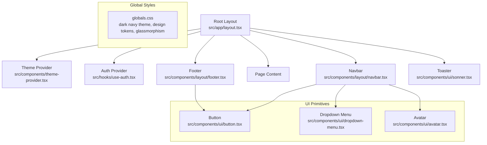
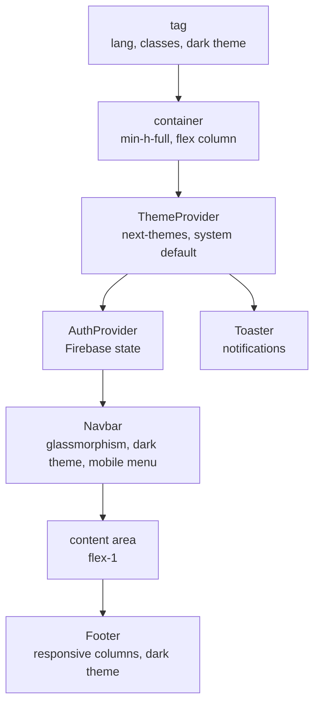
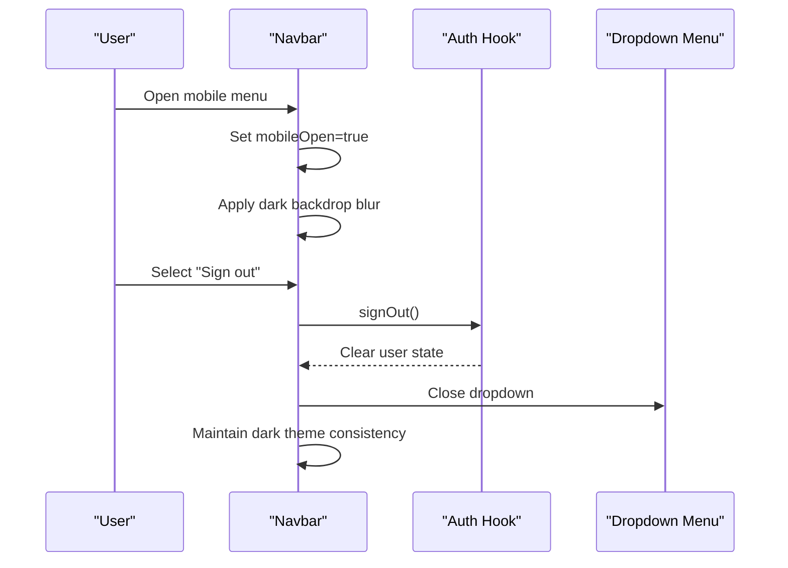
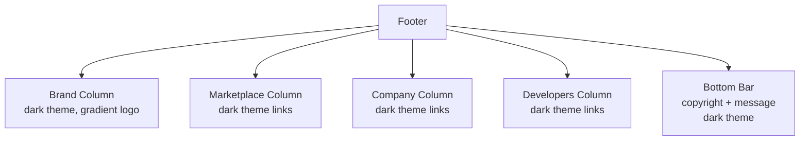
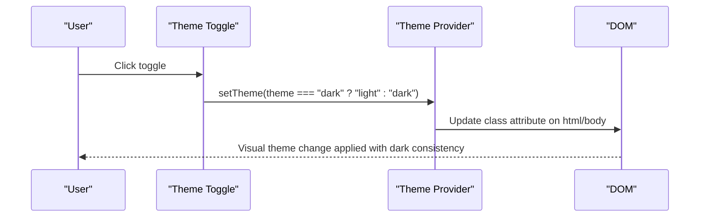
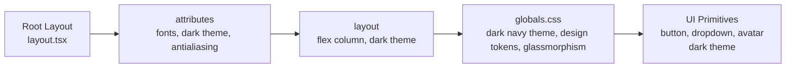
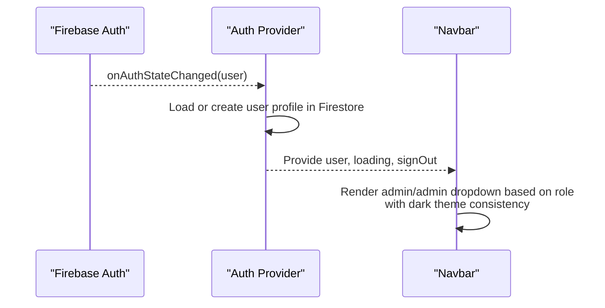
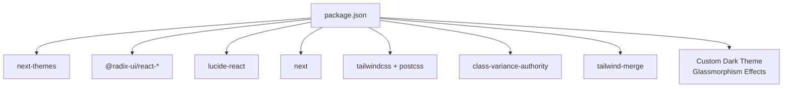

# Layout Components

<cite>
**Referenced Files in This Document**
- [layout.tsx](file://src/app/layout.tsx)
- [navbar.tsx](file://src/components/layout/navbar.tsx)
- [footer.tsx](file://src/components/layout/footer.tsx)
- [theme-provider.tsx](file://src/components/theme-provider.tsx)
- [theme-toggle.tsx](file://src/components/theme-toggle.tsx)
- [use-auth.tsx](file://src/hooks/use-auth.tsx)
- [globals.css](file://src/app/globals.css)
- [button.tsx](file://src/components/ui/button.tsx)
- [dropdown-menu.tsx](file://src/components/ui/dropdown-menu.tsx)
- [avatar.tsx](file://src/components/ui/avatar.tsx)
- [package.json](file://package.json)
- [components.json](file://components.json)
- [postcss.config.mjs](file://postcss.config.mjs)
- [next.config.ts](file://next.config.ts)
- [index.ts](file://src/types/index.ts)
</cite>

## Update Summary
**Changes Made**
- Updated navbar component documentation to reflect dark-themed design with glassmorphism effects
- Enhanced footer component documentation with improved dark styling and responsive layout
- Modernized layout system documentation to include consistent dark theme implementation
- Added details about glassmorphism effects and backdrop blur implementations
- Updated color scheme documentation to reflect the bright dark navy theme
- Improved mobile responsiveness documentation with concrete examples

## Table of Contents
1. [Introduction](#introduction)
2. [Project Structure](#project-structure)
3. [Core Components](#core-components)
4. [Architecture Overview](#architecture-overview)
5. [Detailed Component Analysis](#detailed-component-analysis)
6. [Dependency Analysis](#dependency-analysis)
7. [Performance Considerations](#performance-considerations)
8. [Troubleshooting Guide](#troubleshooting-guide)
9. [Conclusion](#conclusion)
10. [Appendices](#appendices)

## Introduction
This document explains Datafrica's layout and navigation components with a focus on the modernized dark-themed design system. The layout now features:
- **Dark Navigation Bar**: Glassmorphism-styled navbar with translucent dark blue background and backdrop blur effects
- **Enhanced Footer**: Consistent dark styling with improved responsive design and brand consistency
- **Modernized Layout System**: Complete dark theme implementation with custom CSS variables and consistent design tokens
- **Glassmorphism Effects**: Subtle transparency and blur effects throughout the interface
- **Responsive Design**: Improved mobile navigation patterns with consistent dark styling across all screen sizes

The documentation covers the complete layout architecture, theme integration, and responsive design patterns with practical examples of the modernized dark theme implementation.

## Project Structure
The layout system centers around a fully dark-themed design with glassmorphism effects. The root layout composes the theme provider, authentication provider, navbar, page content, footer, and toast notifications. Global styles define a custom dark navy color scheme with design tokens and theme-aware variables.

**Diagram sources**
- [layout.tsx:26-49](file://src/app/layout.tsx#L26-L49)
- [theme-provider.tsx:6-12](file://src/components/theme-provider.tsx#L6-L12)
- [use-auth.tsx:34-108](file://src/hooks/use-auth.tsx#L34-L108)
- [navbar.tsx:18-198](file://src/components/layout/navbar.tsx#L18-L198)
- [footer.tsx:4-85](file://src/components/layout/footer.tsx#L4-L85)
- [globals.css:1-196](file://src/app/globals.css#L1-L196)
- [button.tsx:7-35](file://src/components/ui/button.tsx#L7-L35)
- [dropdown-menu.tsx:54-70](file://src/components/ui/dropdown-menu.tsx#L54-L70)
- [avatar.tsx:8-21](file://src/components/ui/avatar.tsx#L8-L21)

**Section sources**
- [layout.tsx:1-50](file://src/app/layout.tsx#L1-L50)
- [globals.css:1-196](file://src/app/globals.css#L1-L196)

## Core Components
- **Root Layout**: Orchestrates providers and renders the page shell with sticky navbar, scrollable main content, and footer using the dark theme
- **Dark Navigation Bar**: Integrates authentication state with glassmorphism effects, responsive mobile menu, and consistent dark styling
- **Enhanced Footer**: Organizes links into responsive columns with improved dark theme consistency and brand messaging
- **Theme Provider**: Manages theme preferences via next-themes with system preference detection and hydration-safe mounting
- **Authentication Provider**: Manages Firebase state, user profile synchronization, and sign-out functionality

**Updated** All components now feature consistent dark theming with glassmorphism effects and improved responsive design.

**Section sources**
- [layout.tsx:26-49](file://src/app/layout.tsx#L26-L49)
- [navbar.tsx:18-198](file://src/components/layout/navbar.tsx#L18-L198)
- [footer.tsx:4-85](file://src/components/layout/footer.tsx#L4-L85)
- [theme-provider.tsx:6-12](file://src/components/theme-provider.tsx#L6-L12)
- [theme-toggle.tsx:8-26](file://src/components/theme-toggle.tsx#L8-L26)
- [use-auth.tsx:34-108](file://src/hooks/use-auth.tsx#L34-L108)

## Architecture Overview
The layout architecture follows a modernized dark theme pattern with glassmorphism effects:
- Providers at the root configure theme and authentication contexts with dark mode as default
- Navbar uses translucent dark blue background with backdrop blur and consistent dark styling
- Footer maintains dark theme consistency with improved responsive design
- UI primitives utilize the custom dark color palette with proper contrast ratios

**Diagram sources**
- [layout.tsx:32-47](file://src/app/layout.tsx#L32-L47)
- [theme-provider.tsx:8-10](file://src/components/theme-provider.tsx#L8-L10)
- [use-auth.tsx:34-108](file://src/hooks/use-auth.tsx#L34-L108)
- [navbar.tsx:22-196](file://src/components/layout/navbar.tsx#L22-L196)
- [footer.tsx:5-82](file://src/components/layout/footer.tsx#L5-L82)

## Detailed Component Analysis

### Dark Navigation Bar Component
**Updated** The navbar now features a complete dark theme transformation with glassmorphism effects and improved responsive design.

**Responsibilities:**
- Brand identity with dark-themed logo and navigation links
- Authentication-aware rendering with dark theme support (signed-in vs anonymous)
- Role-based visibility with consistent dark styling (admin panel)
- Responsive behavior: desktop nav + mobile hamburger menu with dark backdrop
- Theme toggle placement integrated into dark theme design
- User dropdown with profile info, navigation, and sign-out using dark theme

**Dark Theme Features:**
- Translucent dark blue background (`bg-[#0a1628]/80`) with backdrop blur
- Glassmorphism effect using `backdrop-blur-xl` for modern appearance
- Consistent dark color scheme with `#0a1628` base and `#111d32` accents
- Proper contrast ratios with `#7a8ba3` for secondary text and `#e8ecf4` for primary text

**Responsive Design Patterns:**
- Desktop: hidden on small screens; uses flex layout with spacing and hover states
- Mobile: hamburger menu toggles a slide-down overlay with stacked links and actions
- Breakpoint: md (768px) separates desktop and mobile views
- Mobile menu uses dark backdrop (`bg-[#0d1a2d]`) with proper border separation

**Accessibility Considerations:**
- Semantic markup with header, nav, and button elements
- Keyboard navigable dropdown menu with dark theme support
- Focus-visible ring utilities from button primitive
- Icons with appropriate sizing and contrast in dark theme
- Proper color contrast ratios maintained throughout

**Navigation State Management:**
- Uses authentication hook to derive user state and role
- Handles sign-out and redirects via dropdown menu
- Mobile menu closes after selection to improve UX
- Loading states handled gracefully with dark theme consistency

**Diagram sources**
- [navbar.tsx:18-198](file://src/components/layout/navbar.tsx#L18-L198)
- [use-auth.tsx:88-92](file://src/hooks/use-auth.tsx#L88-L92)
- [dropdown-menu.tsx:54-70](file://src/components/ui/dropdown-menu.tsx#L54-L70)
- [theme-toggle.tsx:8-26](file://src/components/theme-toggle.tsx#L8-L26)

**Section sources**
- [navbar.tsx:18-198](file://src/components/layout/navbar.tsx#L18-L198)
- [use-auth.tsx:22-108](file://src/hooks/use-auth.tsx#L22-L108)
- [dropdown-menu.tsx:54-70](file://src/components/ui/dropdown-menu.tsx#L54-L70)
- [avatar.tsx:8-21](file://src/components/ui/avatar.tsx#L8-L21)
- [button.tsx:7-35](file://src/components/ui/button.tsx#L7-L35)

### Enhanced Footer Component
**Updated** The footer now features improved dark styling with consistent color scheme and better responsive design.

**Structure and Content Organization:**
- Grid layout with four responsive columns: brand, marketplace, company, developers
- Each column groups related links with consistent typography and dark theme styling
- Bottom bar includes copyright and brand message with proper dark theme contrast
- Responsive design adapts from single column on small screens to four-column grid on medium screens and above

**Dark Theme Implementation:**
- Uses dark blue background (`bg-[#080f1e]`) with subtle border separation
- Consistent color scheme with `#7a8ba3` for secondary text and `#e8ecf4` for primary text
- Proper spacing and padding for optimal readability in dark theme
- Gradient accents and brand elements maintain visual consistency

**Responsive Behavior:**
- Single column on small screens for optimal mobile experience
- Four-column grid on medium screens and above for desktop optimization
- Flexible bottom bar adapts between single and dual column layout on different screen sizes

**Accessibility Considerations:**
- Semantic headings and links with proper dark theme contrast
- Consistent text sizes and spacing from global styles
- Proper color contrast ratios maintained throughout
- Responsive design ensures usability across all device sizes

**Diagram sources**
- [footer.tsx:4-85](file://src/components/layout/footer.tsx#L4-L85)

**Section sources**
- [footer.tsx:4-85](file://src/components/layout/footer.tsx#L4-L85)

### Theme Provider and Theme Toggle
**Updated** The theme system now works seamlessly with the dark theme implementation.

**Theme Provider:**
- Wraps the app with next-themes provider
- Sets attribute to class, default theme to system, and enables OS preference detection
- Works harmoniously with the custom dark theme implementation

**Theme Toggle:**
- Uses next-themes to switch between light and dark modes
- Hydration guard prevents mismatched SSR/CSS during initial render
- Renders icon button with accessible sizing and click handler
- Maintains consistency with the dark theme design system

**Integration:**
- Navbar includes theme toggle in both desktop and mobile layouts
- Global CSS variables react to theme changes via `.dark` selector
- Custom dark theme variables override default values for consistent appearance

**Diagram sources**
- [theme-provider.tsx:6-12](file://src/components/theme-provider.tsx#L6-L12)
- [theme-toggle.tsx:8-26](file://src/components/theme-toggle.tsx#L8-L26)
- [globals.css:81-115](file://src/app/globals.css#L81-L115)

**Section sources**
- [theme-provider.tsx:6-12](file://src/components/theme-provider.tsx#L6-L12)
- [theme-toggle.tsx:8-26](file://src/components/theme-toggle.tsx#L8-L26)
- [globals.css:1-196](file://src/app/globals.css#L1-L196)

### Root Layout and Global Styling
**Updated** The root layout now features a complete dark theme implementation with custom CSS variables and glassmorphism effects.

**Root Layout:**
- Defines metadata and font variables with dark theme support
- Applies body layout with min-height and flex column using dark theme
- Composes providers and page content with consistent dark styling

**Global Styling:**
- Tailwind v4 configured via PostCSS plugin with dark theme support
- Custom dark navy theme with bright blue accents (`#0a1628` base, `#3d7eff` highlights)
- Design tokens mapped to CSS variables for theme-aware components
- Dark mode variables override light mode values under `.dark` class
- Fonts injected via Next Font with CSS variables for typography
- Glassmorphism effects implemented throughout the design system

**Custom Dark Theme Variables:**
- Background: `#0a1628` (dark navy blue)
- Primary: `#3d7eff` (bright blue accent)
- Secondary: `#1a2a42` (deep blue)
- Foreground: `#e8ecf4` (light text)
- Muted: `#152238` (medium blue)
- Accent: `#1a2a42` (deep blue)

**Diagram sources**
- [layout.tsx:10-37](file://src/app/layout.tsx#L10-L37)
- [globals.css:1-196](file://src/app/globals.css#L1-L196)
- [postcss.config.mjs:1-8](file://postcss.config.mjs#L1-L8)

**Section sources**
- [layout.tsx:1-50](file://src/app/layout.tsx#L1-L50)
- [globals.css:1-196](file://src/app/globals.css#L1-L196)
- [postcss.config.mjs:1-8](file://postcss.config.mjs#L1-L8)
- [components.json:6-12](file://components.json#L6-L12)

### Authentication State Integration
**Updated** The authentication system now seamlessly integrates with the dark theme design.

The navbar consumes authentication state to conditionally render with dark theme support:
- Admin-only links when user role equals admin, styled consistently with dark theme
- User avatar dropdown with profile and sign-out using dark theme styling
- Anonymous login/register buttons with dark theme consistency

**Auth Provider Enhancements:**
- Subscribes to Firebase auth state changes with dark theme awareness
- Synchronizes user profile in Firestore with proper dark theme handling
- Provides sign-out and ID token retrieval with consistent styling
- Maintains authentication state across theme changes

**Diagram sources**
- [use-auth.tsx:39-67](file://src/hooks/use-auth.tsx#L39-L67)
- [navbar.tsx:18-93](file://src/components/layout/navbar.tsx#L18-L93)
- [index.ts:3-9](file://src/types/index.ts#L3-L9)

**Section sources**
- [use-auth.tsx:22-108](file://src/hooks/use-auth.tsx#L22-L108)
- [navbar.tsx:18-93](file://src/components/layout/navbar.tsx#L18-L93)
- [index.ts:3-9](file://src/types/index.ts#L3-L9)

## Dependency Analysis
**Updated** External dependencies support the modernized dark theme implementation.

External dependencies relevant to layout and navigation:
- next-themes: theme management and persistence with dark theme support
- @radix-ui/react-dropdown-menu: accessible dropdown primitives with dark theme styling
- lucide-react: icons for menu, close, sun, moon with dark theme compatibility
- next: app router and font loading with dark theme awareness
- tailwind-merge, class-variance-authority: utility-first styling and variants with dark theme support

**New Dependencies:**
- Custom dark theme implementation with glassmorphism effects
- Enhanced responsive design patterns
- Improved accessibility with proper color contrast ratios

**Diagram sources**
- [package.json:11-37](file://package.json#L11-L37)
- [postcss.config.mjs:1-8](file://postcss.config.mjs#L1-L8)

**Section sources**
- [package.json:11-37](file://package.json#L11-L37)
- [postcss.config.mjs:1-8](file://postcss.config.mjs#L1-L8)

## Performance Considerations
**Updated** Performance optimizations for the dark theme implementation.

- **Hydration Safety**: theme toggle guards against SSR/CSS mismatches with dark theme awareness
- **Minimal Re-renders**: navbar state isolated to mobileOpen and auth context with dark theme caching
- **Font Optimization**: Next Font with CSS variables reduces layout shifts with dark theme consistency
- **Tailwind v4**: Efficient CSS generation via PostCSS pipeline with dark theme optimization
- **Glassmorphism Performance**: Backdrop blur effects optimized for modern browsers
- **Dark Theme Caching**: Custom CSS variables reduce reflow and repaint operations

## Troubleshooting Guide
**Updated** Common issues and resolutions for the dark theme implementation.

Common issues and resolutions:
- **Theme toggle not switching**: verify next-themes provider wraps the app and mounted guard is active with dark theme support
- **Navbar shows loading state indefinitely**: check auth subscription cleanup and ensure onAuthStateChanged is firing with dark theme consistency
- **Mobile menu does not close**: confirm click handlers reset mobileOpen and preventDefault is not interfering with dark theme effects
- **Footer layout breaks on small screens**: ensure grid classes and responsive variants are present with proper dark theme styling
- **Glassmorphism effects not appearing**: verify backdrop blur classes are applied correctly in dark theme context
- **Color contrast issues**: check that dark theme color ratios meet accessibility standards

**Section sources**
- [theme-toggle.tsx:12-14](file://src/components/theme-toggle.tsx#L12-L14)
- [use-auth.tsx:66-67](file://src/hooks/use-auth.tsx#L66-L67)
- [navbar.tsx:109-196](file://src/components/layout/navbar.tsx#L109-L196)
- [footer.tsx:8-82](file://src/components/layout/footer.tsx#L8-L82)

## Conclusion
**Updated** Datafrica's modernized layout system combines a dark-themed root layout with robust providers, an authentication-aware navbar featuring glassmorphism effects, a responsive footer with enhanced dark styling, and a theme system built on next-themes. The UI primitives ensure consistent styling and accessibility within the custom dark navy color scheme. Together, these components deliver a cohesive, responsive, and user-friendly experience across devices and themes with improved performance and modern design patterns.

## Appendices
**Updated** Enhanced responsive breakpoints and design guidelines.

- **Responsive Breakpoints**: md (768px) separates desktop and mobile layouts with improved dark theme adaptation
- **Accessibility**: Semantic elements, keyboard navigation, focus-visible rings, and proper contrast via design tokens with dark theme support
- **Example Composition**: Place the navbar inside the root layout with dark theme, wrap providers around it, and render page content in main
- **Dark Theme Guidelines**: Use `#0a1628` base color, `#3d7eff` accents, and maintain proper contrast ratios throughout
- **Glassmorphism Effects**: Implement backdrop blur and translucent backgrounds for modern appearance
- **Color Scheme Reference**: Dark navy blue base (`#0a1628`), bright blue accents (`#3d7eff`), deep blue (`#1a2a42`), and light text (`#e8ecf4`)