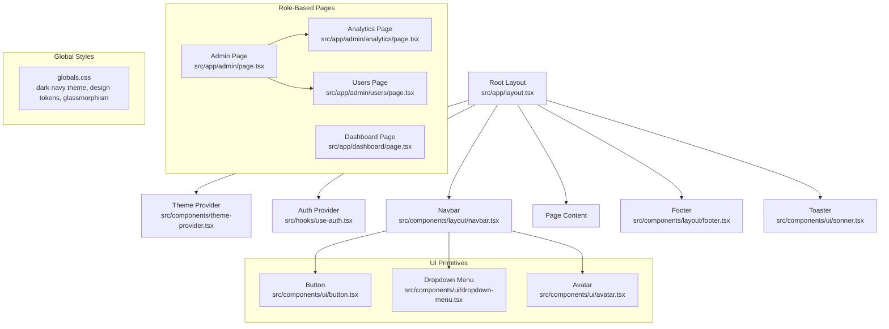
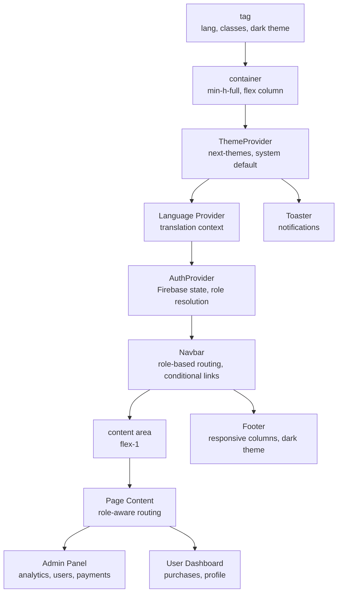
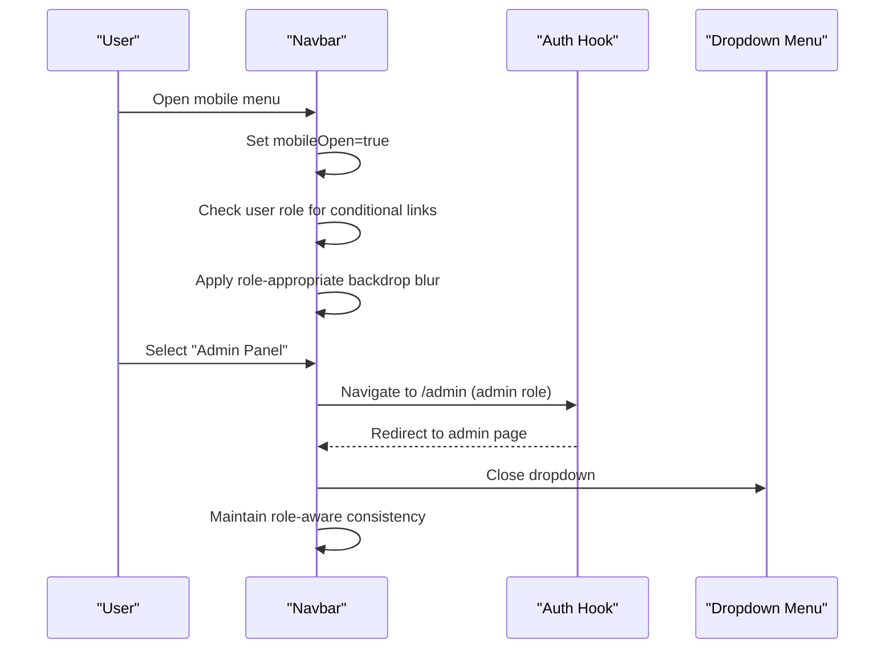
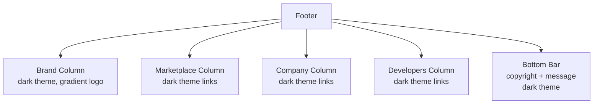
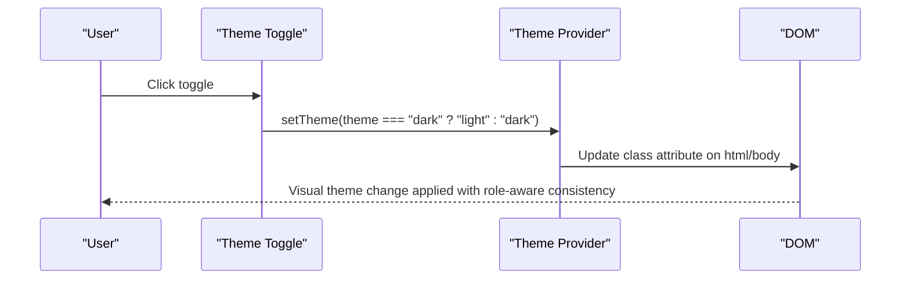
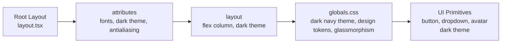
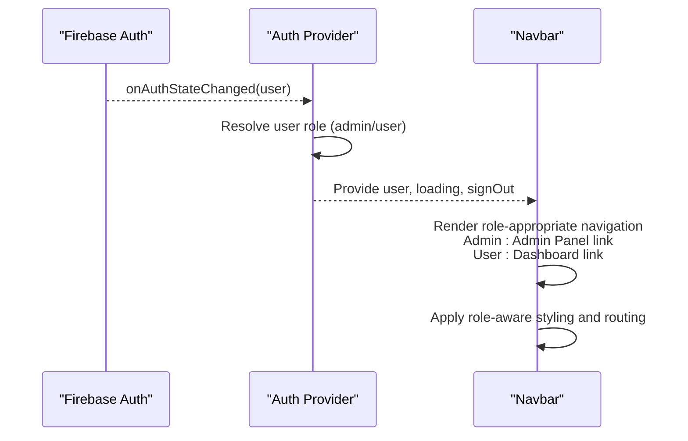
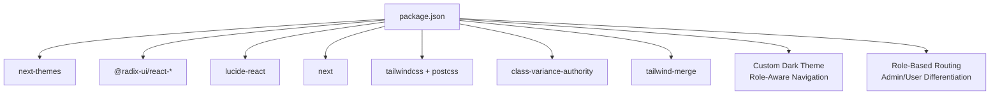

# Layout Components

<cite>
**Referenced Files in This Document**
- [layout.tsx](file://src/app/layout.tsx)
- [navbar.tsx](file://src/components/layout/navbar.tsx)
- [footer.tsx](file://src/components/layout/footer.tsx)
- [theme-provider.tsx](file://src/components/theme-provider.tsx)
- [theme-toggle.tsx](file://src/components/theme-toggle.tsx)
- [use-auth.tsx](file://src/hooks/use-auth.tsx)
- [globals.css](file://src/app/globals.css)
- [button.tsx](file://src/components/ui/button.tsx)
- [dropdown-menu.tsx](file://src/components/ui/dropdown-menu.tsx)
- [avatar.tsx](file://src/components/ui/avatar.tsx)
- [package.json](file://package.json)
- [components.json](file://components.json)
- [postcss.config.mjs](file://postcss.config.mjs)
- [next.config.ts](file://next.config.ts)
- [index.ts](file://src/types/index.ts)
- [admin/page.tsx](file://src/app/admin/page.tsx)
- [dashboard/page.tsx](file://src/app/dashboard/page.tsx)
- [admin/analytics/page.tsx](file://src/app/admin/analytics/page.tsx)
- [admin/users/page.tsx](file://src/app/admin/users/page.tsx)
- [en.json](file://src/locales/en.json)
</cite>

## Update Summary
**Changes Made**
- Enhanced navbar component documentation to reflect role-based routing implementation with Admin Panel vs Dashboard differentiation
- Updated authentication state integration documentation to show conditional navigation links based on user permissions
- Added comprehensive coverage of mobile navigation menu implementation with consistent role-based routing
- Expanded role-based access control documentation with admin-only features and user-specific dashboards
- Updated navigation state management documentation to include role-based link generation and conditional rendering

## Table of Contents
1. [Introduction](#introduction)
2. [Project Structure](#project-structure)
3. [Core Components](#core-components)
4. [Architecture Overview](#architecture-overview)
5. [Detailed Component Analysis](#detailed-component-analysis)
6. [Dependency Analysis](#dependency-analysis)
7. [Performance Considerations](#performance-considerations)
8. [Troubleshooting Guide](#troubleshooting-guide)
9. [Conclusion](#conclusion)
10. [Appendices](#appendices)

## Introduction
This document explains Datafrica's layout and navigation components with a focus on the enhanced role-based routing system. The layout now features:
- **Role-Based Navigation**: Conditional navigation links based on user permissions (admin vs user roles)
- **Admin Panel Integration**: Dedicated admin routes with comprehensive management capabilities
- **Dashboard Differentiation**: Separate user dashboard for non-admin users
- **Enhanced Mobile Navigation**: Consistent role-based routing across mobile and desktop interfaces
- **Conditional Feature Access**: Admin-only features like analytics, user management, and dataset uploads
- **Streamlined User Experience**: Automatic redirection based on user role and authentication state

The documentation covers the complete layout architecture, role-based access control, and responsive design patterns with practical examples of the enhanced navigation system.

## Project Structure
The layout system centers around a role-aware navigation architecture with conditional routing. The root layout composes the theme provider, authentication provider, navbar with role-based routing, page content, footer, and toast notifications. Global styles define a custom dark navy color scheme with design tokens and theme-aware variables.

**Diagram sources**
- [layout.tsx:28-54](file://src/app/layout.tsx#L28-L54)
- [theme-provider.tsx:6-12](file://src/components/theme-provider.tsx#L6-L12)
- [use-auth.tsx:44-181](file://src/hooks/use-auth.tsx#L44-L181)
- [navbar.tsx:19-218](file://src/components/layout/navbar.tsx#L19-L218)
- [footer.tsx:6-56](file://src/components/layout/footer.tsx#L6-L56)
- [admin/page.tsx:39-204](file://src/app/admin/page.tsx#L39-L204)
- [dashboard/page.tsx:24-236](file://src/app/dashboard/page.tsx#L24-L236)
- [admin/analytics/page.tsx:39-232](file://src/app/admin/analytics/page.tsx#L39-L232)
- [admin/users/page.tsx:30-193](file://src/app/admin/users/page.tsx#L30-L193)
- [globals.css:1-196](file://src/app/globals.css#L1-L196)

**Section sources**
- [layout.tsx:1-55](file://src/app/layout.tsx#L1-L55)
- [globals.css:1-196](file://src/app/globals.css#L1-L196)

## Core Components
- **Root Layout**: Orchestrates providers and renders the page shell with sticky navbar, scrollable main content, and footer using the dark theme
- **Enhanced Navigation Bar**: Integrates role-based routing with conditional navigation links, admin panel access, and user dashboard differentiation
- **Admin Panel System**: Comprehensive administrative interface with analytics, user management, and dataset upload capabilities
- **User Dashboard**: Personalized dashboard for non-admin users with purchase history and profile management
- **Theme Provider**: Manages theme preferences via next-themes with system preference detection and hydration-safe mounting
- **Authentication Provider**: Manages Firebase state, user role resolution, and sign-out functionality with role-based access control

**Updated** All components now feature role-aware navigation with conditional rendering based on user permissions and automatic redirection based on role hierarchy.

**Section sources**
- [layout.tsx:28-54](file://src/app/layout.tsx#L28-L54)
- [navbar.tsx:19-218](file://src/components/layout/navbar.tsx#L19-L218)
- [footer.tsx:6-56](file://src/components/layout/footer.tsx#L6-L56)
- [theme-provider.tsx:6-12](file://src/components/theme-provider.tsx#L6-L12)
- [theme-toggle.tsx:8-26](file://src/components/theme-toggle.tsx#L8-L26)
- [use-auth.tsx:44-181](file://src/hooks/use-auth.tsx#L44-L181)
- [admin/page.tsx:39-204](file://src/app/admin/page.tsx#L39-L204)
- [dashboard/page.tsx:24-236](file://src/app/dashboard/page.tsx#L24-L236)

## Architecture Overview
The layout architecture follows a role-aware navigation pattern with conditional routing:
- Providers at the root configure theme and authentication contexts with role resolution
- Navbar uses conditional rendering based on user role with admin panel and dashboard differentiation
- Admin pages provide comprehensive management capabilities with role-based access control
- User dashboard offers personalized experience with purchase history and profile management
- Mobile navigation maintains consistent role-based routing across all screen sizes

**Diagram sources**
- [layout.tsx:33-53](file://src/app/layout.tsx#L33-L53)
- [theme-provider.tsx:8-10](file://src/components/theme-provider.tsx#L8-L10)
- [use-auth.tsx:44-181](file://src/hooks/use-auth.tsx#L44-L181)
- [navbar.tsx:29-218](file://src/components/layout/navbar.tsx#L29-L218)
- [footer.tsx:9-56](file://src/components/layout/footer.tsx#L9-L56)

## Detailed Component Analysis

### Enhanced Navigation Bar Component
**Updated** The navbar now features comprehensive role-based routing with conditional navigation links and consistent mobile implementation.

**Responsibilities:**
- Role-aware brand identity with conditional navigation links based on user permissions
- Authentication-aware rendering with role-based visibility (admin panel vs dashboard)
- Conditional admin-only links when user role equals admin
- Responsive behavior: desktop nav + mobile hamburger menu with role-based routing
- Theme toggle placement integrated into role-aware design
- User dropdown with role-specific navigation and sign-out using conditional routing

**Role-Based Navigation Features:**
- Admin users see "Admin Panel" link in desktop navigation and dropdown menu
- Non-admin users see "Dashboard" link in both desktop and mobile interfaces
- Mobile menu automatically adapts to user role with appropriate navigation options
- Sign-out functionality available to all authenticated users regardless of role

**Responsive Design Patterns:**
- Desktop: hidden on small screens; uses flex layout with conditional admin links
- Mobile: hamburger menu toggles a slide-down overlay with role-appropriate links
- Breakpoint: md (768px) separates desktop and mobile views with consistent role routing
- Mobile menu uses backdrop blur with proper border separation and role-aware links

**Accessibility Considerations:**
- Semantic markup with header, nav, and button elements
- Keyboard navigable dropdown menu with role-aware routing
- Focus-visible ring utilities from button primitive
- Icons with appropriate sizing and contrast in role-aware theme
- Proper color contrast ratios maintained throughout role-based navigation

**Navigation State Management:**
- Uses authentication hook to derive user state, role, and loading status
- Handles sign-out and redirects via dropdown menu with role-aware routing
- Mobile menu closes after selection to improve UX with role-based navigation
- Loading states handled gracefully with role-consistent styling

**Diagram sources**
- [navbar.tsx:19-218](file://src/components/layout/navbar.tsx#L19-L218)
- [use-auth.tsx:161-165](file://src/hooks/use-auth.tsx#L161-L165)
- [dropdown-menu.tsx:102-127](file://src/components/ui/dropdown-menu.tsx#L102-L127)
- [theme-toggle.tsx:8-26](file://src/components/theme-toggle.tsx#L8-L26)

**Section sources**
- [navbar.tsx:19-218](file://src/components/layout/navbar.tsx#L19-L218)
- [use-auth.tsx:44-181](file://src/hooks/use-auth.tsx#L44-L181)
- [dropdown-menu.tsx:102-127](file://src/components/ui/dropdown-menu.tsx#L102-L127)
- [avatar.tsx:8-21](file://src/components/ui/avatar.tsx#L8-L21)
- [button.tsx:7-35](file://src/components/ui/button.tsx#L7-L35)

### Admin Panel System
**Updated** The admin panel provides comprehensive management capabilities with role-based access control and conditional navigation.

**Admin Features:**
- Analytics dashboard with revenue, sales, user, and dataset statistics
- User management with role assignment and permission control
- Dataset upload and management interface
- Payment settings and provider configuration
- Real-time sales monitoring and reporting

**Role-Based Access Control:**
- Admin-only pages with automatic redirection for non-admin users
- Secure API endpoints requiring admin authentication tokens
- Role-specific navigation links in admin panel interface
- User management capabilities with admin privilege controls

**Navigation Integration:**
- Admin panel accessible via dedicated "Admin Panel" link in navbar
- Contextual navigation within admin pages for analytics, users, payments
- Consistent role-based routing across all admin interface components

**Section sources**
- [admin/page.tsx:39-204](file://src/app/admin/page.tsx#L39-L204)
- [admin/analytics/page.tsx:39-232](file://src/app/admin/analytics/page.tsx#L39-L232)
- [admin/users/page.tsx:30-193](file://src/app/admin/users/page.tsx#L30-L193)
- [use-auth.tsx:44-181](file://src/hooks/use-auth.tsx#L44-L181)

### User Dashboard
**Updated** The user dashboard provides personalized experience with role-based access control and conditional content.

**User Features:**
- Purchase history with dataset previews and download options
- Profile management with personal information and account details
- Account statistics including total purchases and available datasets
- Role display with user permissions and membership information

**Role-Based Access Control:**
- Automatic redirection from dashboard to admin panel for admin users
- Conditional content based on user role and authentication state
- Purchase history integration with authenticated user sessions
- Profile information management for authenticated users

**Navigation Integration:**
- Dashboard accessible via "Dashboard" link in navbar for non-admin users
- Contextual navigation within dashboard for purchases and profile management
- Consistent role-based routing preventing unauthorized access

**Section sources**
- [dashboard/page.tsx:24-236](file://src/app/dashboard/page.tsx#L24-L236)
- [use-auth.tsx:44-181](file://src/hooks/use-auth.tsx#L44-L181)

### Enhanced Footer Component
**Updated** The footer maintains consistent dark styling with improved responsive design and role-aware navigation.

**Structure and Content Organization:**
- Grid layout with four responsive columns: brand, marketplace, company, developers
- Each column groups related links with consistent typography and dark theme styling
- Bottom bar includes copyright and brand message with proper dark theme contrast
- Responsive design adapts from single column on small screens to four-column grid on medium screens and above

**Dark Theme Implementation:**
- Uses dark blue background (`bg-card`) with subtle border separation
- Consistent color scheme with `text-muted-foreground` for secondary text and `text-foreground` for primary text
- Proper spacing and padding for optimal readability in dark theme
- Gradient accents and brand elements maintain visual consistency

**Responsive Behavior:**
- Single column on small screens for optimal mobile experience
- Four-column grid on medium screens and above for desktop optimization
- Flexible bottom bar adapts between single and dual column layout on different screen sizes

**Accessibility Considerations:**
- Semantic headings and links with proper dark theme contrast
- Consistent text sizes and spacing from global styles
- Proper color contrast ratios maintained throughout
- Responsive design ensures usability across all device sizes

**Diagram sources**
- [footer.tsx:6-56](file://src/components/layout/footer.tsx#L6-L56)

**Section sources**
- [footer.tsx:6-56](file://src/components/layout/footer.tsx#L6-L56)

### Theme Provider and Theme Toggle
**Updated** The theme system now works seamlessly with the role-aware navigation design.

**Theme Provider:**
- Wraps the app with next-themes provider
- Sets attribute to class, default theme to system, and enables OS preference detection
- Works harmoniously with the custom dark theme implementation

**Theme Toggle:**
- Uses next-themes to switch between light and dark modes
- Hydration guard prevents mismatched SSR/CSS during initial render
- Renders icon button with accessible sizing and click handler
- Maintains consistency with the role-aware design system

**Integration:**
- Navbar includes theme toggle in both desktop and mobile layouts with role-aware positioning
- Global CSS variables react to theme changes via `.dark` selector
- Custom dark theme variables override default values for consistent appearance across role-based interfaces

**Diagram sources**
- [theme-provider.tsx:6-12](file://src/components/theme-provider.tsx#L6-L12)
- [theme-toggle.tsx:8-26](file://src/components/theme-toggle.tsx#L8-L26)
- [globals.css:81-115](file://src/app/globals.css#L81-L115)

**Section sources**
- [theme-provider.tsx:6-12](file://src/components/theme-provider.tsx#L6-L12)
- [theme-toggle.tsx:8-26](file://src/components/theme-toggle.tsx#L8-L26)
- [globals.css:1-196](file://src/app/globals.css#L1-L196)

### Root Layout and Global Styling
**Updated** The root layout now features a complete role-aware dark theme implementation with custom CSS variables and glassmorphism effects.

**Root Layout:**
- Defines metadata and font variables with dark theme support
- Applies body layout with min-height and flex column using dark theme
- Composes providers and page content with consistent role-aware styling

**Global Styling:**
- Tailwind v4 configured via PostCSS plugin with dark theme support
- Custom dark navy theme with bright blue accents (`#0a1628` base, `#3d7eff` highlights)
- Design tokens mapped to CSS variables for theme-aware components
- Dark mode variables override light mode values under `.dark` class
- Fonts injected via Next Font with CSS variables for typography
- Glassmorphism effects implemented throughout the role-aware design system

**Custom Dark Theme Variables:**
- Background: `#0a1628` (dark navy blue)
- Primary: `#3d7eff` (bright blue accent)
- Secondary: `#1a2a42` (deep blue)
- Foreground: `#e8ecf4` (light text)
- Muted: `#152238` (medium blue)
- Accent: `#1a2a42` (deep blue)

**Diagram sources**
- [layout.tsx:28-54](file://src/app/layout.tsx#L28-L54)
- [globals.css:1-196](file://src/app/globals.css#L1-L196)
- [postcss.config.mjs:1-8](file://postcss.config.mjs#L1-L8)

**Section sources**
- [layout.tsx:1-55](file://src/app/layout.tsx#L1-L55)
- [globals.css:1-196](file://src/app/globals.css#L1-L196)
- [postcss.config.mjs:1-8](file://postcss.config.mjs#L1-L8)
- [components.json:6-12](file://components.json#L6-L12)

### Role-Based Authentication State Integration
**Updated** The authentication system now seamlessly integrates with role-aware navigation and conditional routing.

The navbar consumes authentication state to conditionally render role-appropriate navigation with dark theme support:
- Admin-only links when user role equals admin, styled consistently with dark theme
- User dashboard vs admin panel routing based on role hierarchy
- Role-aware user avatar dropdown with profile and sign-out using dark theme styling
- Anonymous login/register buttons with dark theme consistency

**Auth Provider Enhancements:**
- Subscribes to Firebase auth state changes with role resolution
- Synchronizes user profile in Firestore with proper role assignment
- Provides sign-out and ID token retrieval with role-aware routing
- Maintains authentication state across theme and role changes

**Role-Based Routing Logic:**
- Admin users automatically redirected to admin panel from dashboard
- Non-admin users redirected to dashboard from admin panel
- Conditional navigation links based on user role in navbar
- Role-aware mobile navigation with appropriate routing options

**Diagram sources**
- [use-auth.tsx:109-128](file://src/hooks/use-auth.tsx#L109-L128)
- [navbar.tsx:49-53](file://src/components/layout/navbar.tsx#L49-L53)
- [index.ts:3-9](file://src/types/index.ts#L3-L9)

**Section sources**
- [use-auth.tsx:44-181](file://src/hooks/use-auth.tsx#L44-L181)
- [navbar.tsx:19-218](file://src/components/layout/navbar.tsx#L19-L218)
- [index.ts:3-9](file://src/types/index.ts#L3-L9)

## Dependency Analysis
**Updated** External dependencies support the role-aware navigation implementation.

External dependencies relevant to layout and navigation:
- next-themes: theme management and persistence with dark theme support
- @radix-ui/react-dropdown-menu: accessible dropdown primitives with dark theme styling
- lucide-react: icons for menu, close, sun, moon with dark theme compatibility
- next: app router and font loading with dark theme awareness
- tailwind-merge, class-variance-authority: utility-first styling and variants with dark theme support

**New Dependencies:**
- Role-based routing system with conditional navigation
- Enhanced responsive design patterns with role-aware mobile navigation
- Improved accessibility with proper color contrast ratios in role-based contexts
- Admin panel integration with comprehensive management capabilities

**Diagram sources**
- [package.json:11-37](file://package.json#L11-L37)
- [postcss.config.mjs:1-8](file://postcss.config.mjs#L1-L8)

**Section sources**
- [package.json:11-37](file://package.json#L11-L37)
- [postcss.config.mjs:1-8](file://postcss.config.mjs#L1-L8)

## Performance Considerations
**Updated** Performance optimizations for the role-aware navigation implementation.

- **Hydration Safety**: theme toggle guards against SSR/CSS mismatches with dark theme awareness
- **Minimal Re-renders**: navbar state isolated to mobileOpen and auth context with role-aware caching
- **Role-Based Memoization**: Conditional rendering optimized for role changes and navigation updates
- **Font Optimization**: Next Font with CSS variables reduces layout shifts with dark theme consistency
- **Tailwind v4**: Efficient CSS generation via PostCSS pipeline with dark theme optimization
- **Glassmorphism Performance**: Backdrop blur effects optimized for modern browsers
- **Dark Theme Caching**: Custom CSS variables reduce reflow and repaint operations
- **Conditional Rendering**: Role-based navigation links minimize unnecessary component rendering

## Troubleshooting Guide
**Updated** Common issues and resolutions for the role-aware navigation implementation.

Common issues and resolutions:
- **Theme toggle not switching**: verify next-themes provider wraps the app and mounted guard is active with dark theme support
- **Navbar shows loading state indefinitely**: check auth subscription cleanup and ensure onAuthStateChanged is firing with role-aware consistency
- **Mobile menu does not close**: confirm click handlers reset mobileOpen and preventDefault is not interfering with role-based navigation effects
- **Admin panel accessible to non-admins**: verify role-based access control in admin pages and proper redirection logic
- **Dashboard shows admin content**: check role-based routing logic and ensure proper redirection for admin users
- **Role-based links not appearing**: confirm user role is properly resolved and stored in Firestore with role-aware navigation
- **Footer layout breaks on small screens**: ensure grid classes and responsive variants are present with proper dark theme styling
- **Glassmorphism effects not appearing**: verify backdrop blur classes are applied correctly in role-aware dark theme context
- **Color contrast issues**: check that role-aware dark theme color ratios meet accessibility standards

**Section sources**
- [theme-toggle.tsx:12-14](file://src/components/theme-toggle.tsx#L12-L14)
- [use-auth.tsx:109-128](file://src/hooks/use-auth.tsx#L109-L128)
- [navbar.tsx:160-218](file://src/components/layout/navbar.tsx#L160-L218)
- [footer.tsx:10-56](file://src/components/layout/footer.tsx#L10-L56)

## Conclusion
**Updated** Datafrica's enhanced layout system combines a role-aware root layout with robust providers, an authentication-aware navbar featuring conditional navigation links, comprehensive admin panel with role-based access control, personalized user dashboard, and a theme system built on next-themes. The UI primitives ensure consistent styling and accessibility within the custom dark navy color scheme. Together, these components deliver a cohesive, responsive, and user-friendly experience across devices and themes with improved role-based navigation, conditional routing, and modern design patterns.

## Appendices
**Updated** Enhanced responsive breakpoints and design guidelines with role-based navigation.

- **Responsive Breakpoints**: md (768px) separates desktop and mobile layouts with improved role-aware adaptation
- **Accessibility**: Semantic elements, keyboard navigation, focus-visible rings, and proper contrast via design tokens with role-aware support
- **Example Composition**: Place the role-aware navbar inside the root layout with dark theme, wrap providers around it, and render role-appropriate page content in main
- **Dark Theme Guidelines**: Use `#0a1628` base color, `#3d7eff` accents, and maintain proper contrast ratios throughout role-based interfaces
- **Glassmorphism Effects**: Implement backdrop blur and translucent backgrounds for modern appearance in role-aware contexts
- **Role-Based Navigation Guidelines**: Use conditional rendering for admin-only features, implement proper redirection logic, and maintain consistent role-aware styling
- **Color Scheme Reference**: Dark navy blue base (`#0a1628`), bright blue accents (`#3d7eff`), deep blue (`#1a2a42`), and light text (`#e8ecf4`)
- **Role-Based Access Control**: Implement proper role validation, secure API endpoints, and automatic redirection based on user permissions