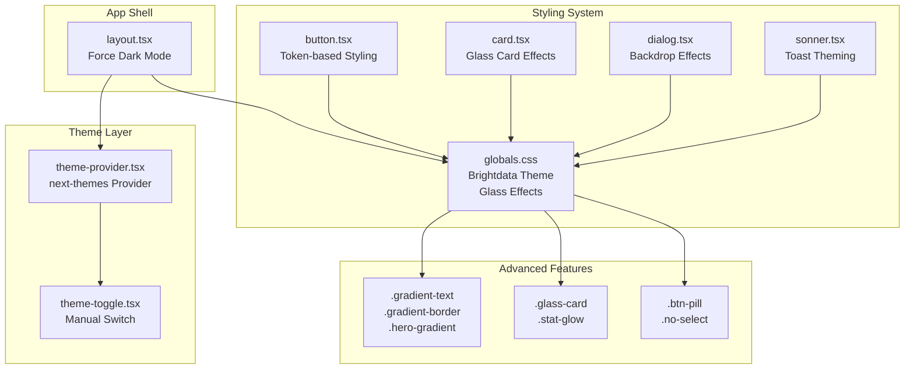
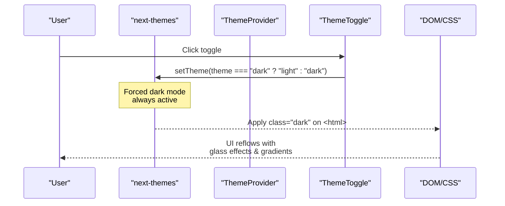
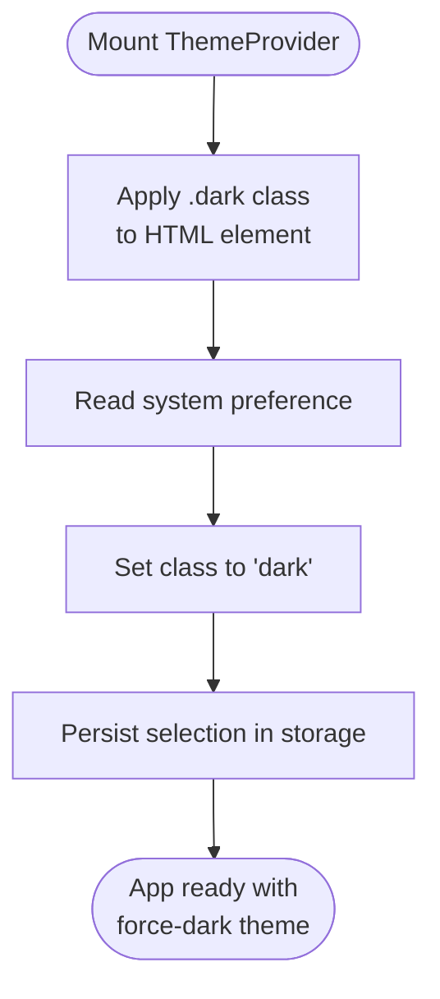
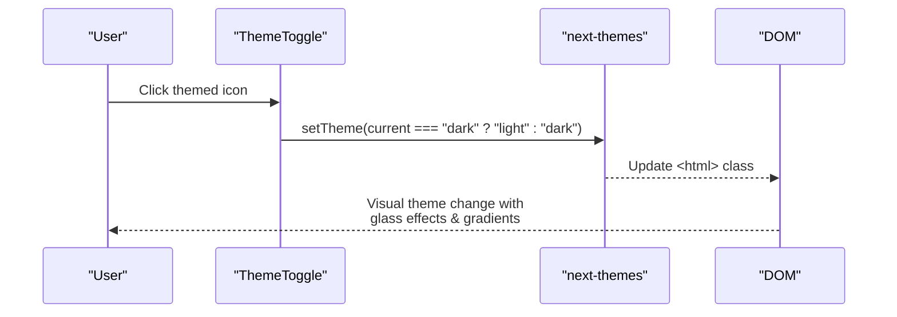
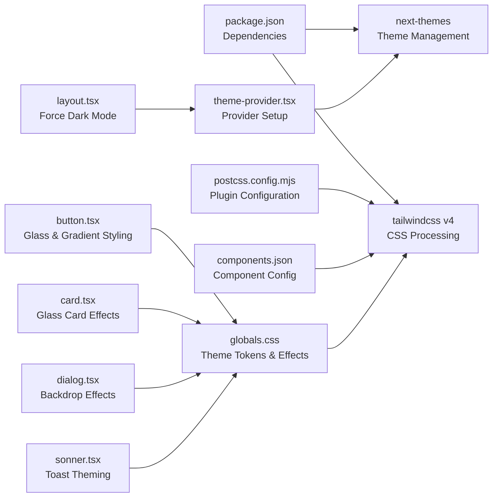

# Theme System

<cite>
**Referenced Files in This Document**
- [theme-provider.tsx](file://src/components/theme-provider.tsx)
- [theme-toggle.tsx](file://src/components/theme-toggle.tsx)
- [layout.tsx](file://src/app/layout.tsx)
- [globals.css](file://src/app/globals.css)
- [components.json](file://components.json)
- [postcss.config.mjs](file://postcss.config.mjs)
- [package.json](file://package.json)
- [navbar.tsx](file://src/components/layout/navbar.tsx)
- [button.tsx](file://src/components/ui/button.tsx)
- [sonner.tsx](file://src/components/ui/sonner.tsx)
- [card.tsx](file://src/components/ui/card.tsx)
- [dialog.tsx](file://src/components/ui/dialog.tsx)
</cite>

## Update Summary
**Changes Made**
- Updated design token system to reflect Brightdata-style dark theme implementation
- Added comprehensive glass-morphism effects and blue/purple accent color scheme
- Enhanced global styling system with advanced visual effects and gradients
- Updated theme provider integration and dark mode enforcement
- Expanded component styling patterns with new visual effects

## Table of Contents
1. [Introduction](#introduction)
2. [Project Structure](#project-structure)
3. [Core Components](#core-components)
4. [Architecture Overview](#architecture-overview)
5. [Detailed Component Analysis](#detailed-component-analysis)
6. [Design Token System](#design-token-system)
7. [Visual Effects and Styling](#visual-effects-and-styling)
8. [Component Styling Patterns](#component-styling-patterns)
9. [Dependency Analysis](#dependency-analysis)
10. [Performance Considerations](#performance-considerations)
11. [Troubleshooting Guide](#troubleshooting-guide)
12. [Conclusion](#conclusion)

## Introduction
This document explains Datafrica's comprehensive theme system and design token management, featuring a Brightdata-inspired dark theme implementation with glass-morphism effects, blue and purple accent colors, and a complete overhaul of the global styling system. The system provides automatic system preference detection via next-themes with manual theme switching capabilities, CSS custom properties for consistent design tokens across light and dark modes, and theme-aware component styling patterns.

## Project Structure
The theme system encompasses a sophisticated set of components and styling configurations:
- Theme provider and toggle components with enhanced dark mode enforcement
- Comprehensive global CSS with Brightdata-style design tokens and visual effects
- Application layout with forced dark mode implementation
- Advanced Tailwind CSS configuration with custom variants and utilities
- UI components with glass-morphism and gradient styling



**Diagram sources**
- [layout.tsx:32-36](file://src/app/layout.tsx#L32-L36)
- [theme-provider.tsx:6-11](file://src/components/theme-provider.tsx#L6-L11)
- [theme-toggle.tsx:8-26](file://src/components/theme-toggle.tsx#L8-L26)
- [globals.css:46-196](file://src/app/globals.css#L46-L196)
- [button.tsx:10-35](file://src/components/ui/button.tsx#L10-L35)
- [card.tsx:10-21](file://src/components/ui/card.tsx#L10-L21)
- [dialog.tsx:14-27](file://src/components/ui/dialog.tsx#L14-L27)
- [sonner.tsx:7-47](file://src/components/ui/sonner.tsx#L7-L47)

**Section sources**
- [layout.tsx:1-49](file://src/app/layout.tsx#L1-L49)
- [theme-provider.tsx:1-13](file://src/components/theme-provider.tsx#L1-L13)
- [theme-toggle.tsx:1-27](file://src/components/theme-toggle.tsx#L1-L27)
- [globals.css:1-196](file://src/app/globals.css#L1-L196)

## Core Components
The theme system consists of several key components working together to deliver a cohesive dark theme experience:

- **ThemeProvider**: Wraps the application with next-themes to manage theme state and persistence, enforcing dark mode as the primary theme
- **ThemeToggle**: Provides user-controlled theme switching with hydration safety and proper SSR handling
- **Design Tokens**: Comprehensive CSS custom properties system with Brightdata-inspired color scheme and visual effects
- **Visual Effects**: Advanced styling including glass-morphism, gradients, and blur effects
- **UI Components**: Buttons, cards, dialogs, and toasts that consume design tokens and visual effects

Key behaviors:
- **Dark Mode Enforcement**: The layout forces dark mode with `.dark` class on HTML element
- **Automatic Detection**: next-themes with `defaultTheme="system"` and `enableSystem` for OS preference
- **Manual Override**: ThemeToggle toggles between themes with hydration guard
- **Persistence**: next-themes persists selections in localStorage
- **Visual Consistency**: All components use CSS variables and Tailwind utilities for automatic adaptation

**Section sources**
- [theme-provider.tsx:1-13](file://src/components/theme-provider.tsx#L1-L13)
- [theme-toggle.tsx:1-27](file://src/components/theme-toggle.tsx#L1-L27)
- [layout.tsx:32-36](file://src/app/layout.tsx#L32-L36)
- [globals.css:46-196](file://src/app/globals.css#L46-L196)

## Architecture Overview
The theme system architecture implements a force-dark approach with Brightdata-inspired styling, centered on a provider that injects theme state, a toggle component for manual control, and a comprehensive global stylesheet with advanced visual effects.



**Diagram sources**
- [theme-provider.tsx:6-11](file://src/components/theme-provider.tsx#L6-L11)
- [theme-toggle.tsx:8-26](file://src/components/theme-toggle.tsx#L8-L26)
- [layout.tsx:32-36](file://src/app/layout.tsx#L32-L36)
- [globals.css:46-115](file://src/app/globals.css#L46-L115)

## Detailed Component Analysis

### ThemeProvider
The ThemeProvider component serves as the foundation for the theme system, wrapping the entire application with next-themes context.

- **Purpose**: Provide theme context to the entire app with forced dark mode enforcement
- **Behavior**: Uses next-themes with `attribute="class"`, `defaultTheme="system"`, and `enableSystem` for OS preference detection
- **Integration**: Wrapped around the app shell in layout.tsx with forced dark class
- **Enhanced**: Works seamlessly with the Brightdata-style dark theme implementation



**Diagram sources**
- [theme-provider.tsx:6-11](file://src/components/theme-provider.tsx#L6-L11)
- [layout.tsx:32-36](file://src/app/layout.tsx#L32-L36)

**Section sources**
- [theme-provider.tsx:1-13](file://src/components/theme-provider.tsx#L1-L13)
- [layout.tsx:1-49](file://src/app/layout.tsx#L1-L49)

### ThemeToggle
The ThemeToggle component provides user-controlled theme switching with proper hydration safety and Brightdata-style styling.

- **Purpose**: Allow user to switch themes manually with visual feedback
- **Behavior**: Uses next-themes hook to read current theme and toggle between "light" and "dark" with hydration guard
- **Placement**: Integrated into the navbar for both desktop and mobile views
- **Styling**: Uses gradient accents and maintains visual consistency with the dark theme



**Diagram sources**
- [theme-toggle.tsx:8-26](file://src/components/theme-toggle.tsx#L8-L26)
- [navbar.tsx:21-22](file://src/components/layout/navbar.tsx#L21-L22)

**Section sources**
- [theme-toggle.tsx:1-27](file://src/components/theme-toggle.tsx#L1-L27)
- [navbar.tsx:1-198](file://src/components/layout/navbar.tsx#L1-L198)

## Design Token System
The design token system implements a comprehensive Brightdata-inspired dark theme with advanced visual effects and color schemes.

### Color Palette and Scheme
The system defines a complete color palette optimized for dark mode interfaces:

- **Primary Colors**: Deep navy blue (#0a1628) background with bright blue (#3d7eff) accents
- **Secondary Colors**: Rich indigo (#1a2a42) and purple (#6c5ce7) accents
- **Text Colors**: Light gray (#e8ecf4) for primary text with muted blues (#7a8ba3) for secondary
- **Card Colors**: Slightly lighter navy (#111d32) for elevated surfaces
- **Border Effects**: Subtle white overlays (rgba 255,255,255,0.08) for depth perception

### Advanced Visual Effects
The system incorporates several advanced visual effects for enhanced user experience:

- **Glass Morphism**: Semi-transparent backgrounds with backdrop blur effects
- **Gradient Accents**: Multi-color gradients for buttons, borders, and decorative elements
- **Statistical Effects**: Glowing effects for important metrics and statistics
- **Hero Backgrounds**: Radial gradients for hero sections and promotional areas

**Section sources**
- [globals.css:46-115](file://src/app/globals.css#L46-L115)
- [globals.css:128-182](file://src/app/globals.css#L128-L182)

## Visual Effects and Styling
The global styling system implements advanced visual effects that create a premium dark theme experience.

### Glass-Morphism Implementation
The glass effect creates semi-transparent UI elements with backdrop blur:

```css
.glass-card {
  background: rgba(17, 29, 50, 0.6);
  border: 1px solid rgba(255, 255, 255, 0.06);
  backdrop-filter: blur(12px);
}

.glass-card:hover {
  border-color: rgba(255, 255, 255, 0.12);
}
```

### Gradient Effects
Multiple gradient implementations enhance visual appeal:

- **Gradient Borders**: Animated gradient borders on hover for interactive elements
- **Gradient Text**: Text with gradient coloring for headings and emphasis
- **Hero Gradients**: Radial gradients for hero sections and promotional areas
- **Accent Gradients**: Blue-to-purple gradients for primary actions and highlights

### Advanced Styling Classes
The system provides utility classes for common visual patterns:

- **Pill Buttons**: Rounded button styling for primary actions
- **Blur Effects**: Text blur for protected content sections
- **Stat Glow**: Subtle glow effects for important statistics
- **Anti-Scrape Protection**: Text selection prevention for sensitive content

**Section sources**
- [globals.css:128-196](file://src/app/globals.css#L128-L196)
- [navbar.tsx:21-22](file://src/components/layout/navbar.tsx#L21-L22)

## Component Styling Patterns
Components throughout the application follow consistent styling patterns that leverage the theme system and visual effects.

### Button Styling
Buttons utilize the design token system with gradient accents and proper contrast:

- **Primary Buttons**: Blue gradient background (#3d7eff) with white text
- **Ghost Buttons**: Transparent styling with hover effects using accent colors
- **Pill Shape**: Rounded button styling for modern appearance
- **Consistent Spacing**: Proper padding and sizing based on theme tokens

### Card Components
Cards implement glass-morphism effects with proper elevation and transparency:

- **Glass Cards**: Semi-transparent backgrounds with backdrop blur
- **Border Effects**: Subtle borders with gradient accents on hover
- **Content Organization**: Proper spacing and typography hierarchy
- **Responsive Design**: Adaptive sizing and layout for different screen sizes

### Dialog Components
Dialogs incorporate backdrop effects and proper modal styling:

- **Backdrop Effects**: Semi-transparent dark overlays with blur
- **Glass Content**: Modal content with glass-morphism styling
- **Border Details**: Subtle borders and proper elevation
- **Animation Effects**: Smooth open/close animations

**Section sources**
- [button.tsx:10-35](file://src/components/ui/button.tsx#L10-L35)
- [card.tsx:10-21](file://src/components/ui/card.tsx#L10-L21)
- [dialog.tsx:14-27](file://src/components/ui/dialog.tsx#L14-L27)
- [sonner.tsx:31-43](file://src/components/ui/sonner.tsx#L31-L43)

## Dependency Analysis
The theme system relies on a carefully orchestrated set of dependencies that work together to deliver the dark theme experience.

### Core Dependencies
- **next-themes**: Provides theme state management, persistence, and class application
- **Tailwind CSS v4**: Consumes CSS variables via @theme and generates utilities
- **PostCSS**: Processes CSS with Tailwind plugin for advanced styling
- **shadcn/ui Components**: Consume design tokens with enhanced visual effects

### Enhanced Component Integration
- **Layout Components**: Navbar and footer use glass effects and gradient accents
- **UI Components**: Buttons, cards, and dialogs leverage theme tokens
- **Toast System**: Sonner integrates with theme tokens for consistent notifications
- **Custom Effects**: Utility classes extend beyond standard component styling



**Diagram sources**
- [package.json:11-38](file://package.json#L11-L38)
- [postcss.config.mjs:1-8](file://postcss.config.mjs#L1-L8)
- [components.json:6-12](file://components.json#L6-L12)
- [theme-provider.tsx:6-11](file://src/components/theme-provider.tsx#L6-L11)
- [layout.tsx:32-36](file://src/app/layout.tsx#L32-L36)
- [globals.css:46-196](file://src/app/globals.css#L46-L196)

**Section sources**
- [package.json:1-51](file://package.json#L1-L51)
- [postcss.config.mjs:1-8](file://postcss.config.mjs#L1-L8)
- [components.json:1-26](file://components.json#L1-L26)
- [theme-provider.tsx:1-13](file://src/components/theme-provider.tsx#L1-L13)
- [layout.tsx:1-49](file://src/app/layout.tsx#L1-L49)
- [globals.css:1-196](file://src/app/globals.css#L1-L196)

## Performance Considerations
The theme system is optimized for performance while delivering advanced visual effects.

### Hydration Safety
- **ThemeToggle**: Uses mounted state to prevent SSR mismatches and unnecessary re-renders
- **Layout Integration**: Forces dark mode at the HTML level to avoid hydration conflicts
- **Component Optimization**: All components use CSS variables for efficient updates

### Visual Effect Performance
- **CSS Variables**: Using --color-* and --radius-* avoids costly recalculations
- **GPU Acceleration**: Backdrop filters and transforms leverage hardware acceleration
- **Efficient Transitions**: Smooth animations use transform properties for optimal performance
- **Minimal Reflow**: Theme switching updates only CSS variables and class attributes

### Memory and Rendering Optimization
- **Scoped Effects**: Visual effects are applied selectively to relevant components
- **Cache-Friendly**: Design tokens are processed at build time by Tailwind
- **Reduced Complexity**: Glass effects use simple CSS properties rather than complex JavaScript
- **Browser Compatibility**: Effects degrade gracefully on older browsers

**Section sources**
- [theme-toggle.tsx:8-26](file://src/components/theme-toggle.tsx#L8-L26)
- [layout.tsx:32-36](file://src/app/layout.tsx#L32-L36)
- [globals.css:128-196](file://src/app/globals.css#L128-L196)

## Troubleshooting Guide
Common issues and resolutions for the enhanced theme system:

### Theme and Visual Effects Issues
- **Force Dark Mode Conflicts**: Verify layout applies `.dark` class to HTML element
- **Glass Effects Not Working**: Check browser support for backdrop-filter and ensure proper CSS syntax
- **Gradient Borders Missing**: Ensure gradient definitions are properly formatted and accessible
- **Visual Effects Flicker**: Confirm CSS variables are defined before component rendering

### Component Styling Problems
- **Buttons Not Using Theme Colors**: Check that components reference CSS variables instead of hardcoded values
- **Cards Missing Glass Effect**: Verify `.glass-card` class is applied and CSS variables are accessible
- **Dialog Backdrops Incorrect**: Ensure backdrop effects use proper z-index and opacity values
- **Toasts Not Theming Correctly**: Confirm Sonner integrates with theme tokens via CSS variables

### Performance and Compatibility
- **Slow Theme Switching**: Verify CSS variables are used instead of JavaScript manipulation
- **Poor Mobile Performance**: Check that visual effects don't exceed device capabilities
- **Legacy Browser Support**: Confirm graceful degradation for unsupported CSS features
- **Build Errors**: Ensure Tailwind CSS v4 and PostCSS configuration are properly set up

**Section sources**
- [theme-provider.tsx:6-11](file://src/components/theme-provider.tsx#L6-L11)
- [theme-toggle.tsx:8-26](file://src/components/theme-toggle.tsx#L8-L26)
- [layout.tsx:32-36](file://src/app/layout.tsx#L32-L36)
- [globals.css:46-196](file://src/app/globals.css#L46-L196)

## Conclusion
Datafrica's theme system represents a comprehensive implementation of a Brightdata-inspired dark theme with advanced visual effects and glass-morphism styling. The system combines automatic system preference detection with manual user control, backed by a robust design token system that defines a complete color palette and visual effects library. The integration of CSS custom properties, Tailwind CSS v4, and advanced visual effects creates a cohesive and performant dark theme experience that enhances user engagement while maintaining excellent performance characteristics.

The system's strength lies in its comprehensive approach to theme management, from the foundational provider setup to the detailed visual effects implementation. The force-dark approach ensures consistent branding and user experience, while the extensive use of CSS variables and Tailwind utilities provides flexibility for future enhancements and customization.