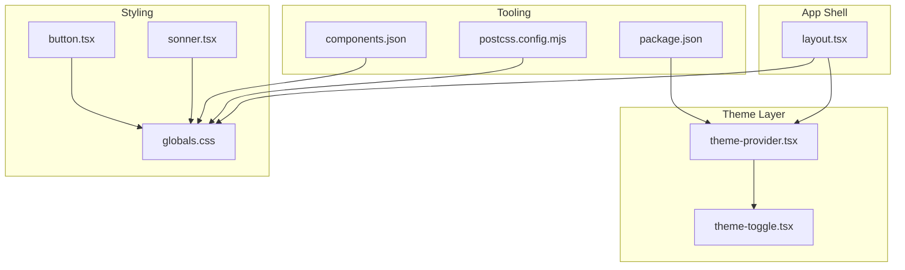
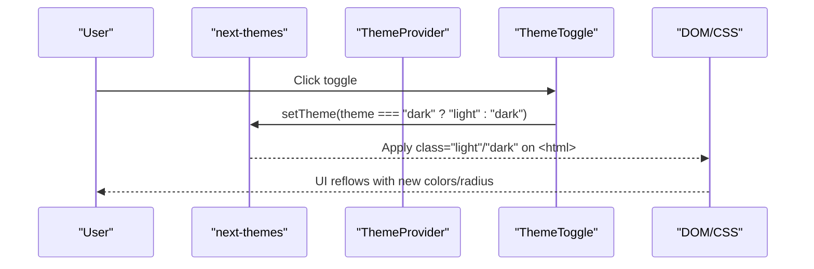
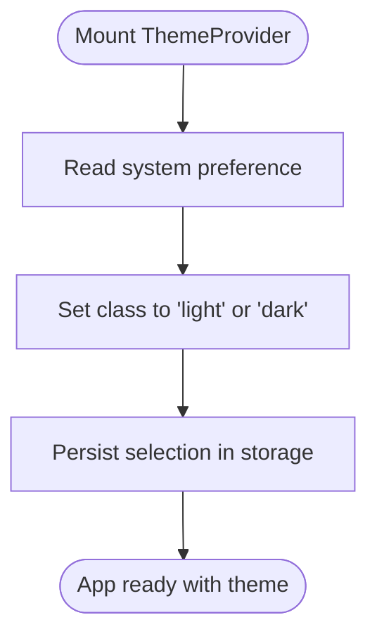
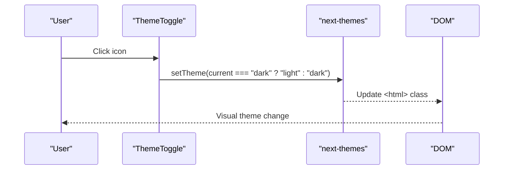
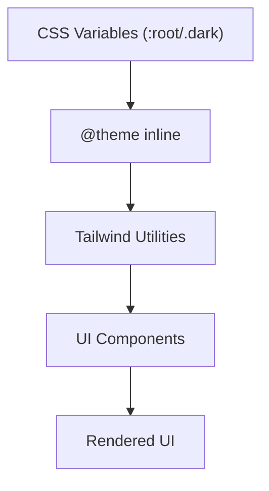
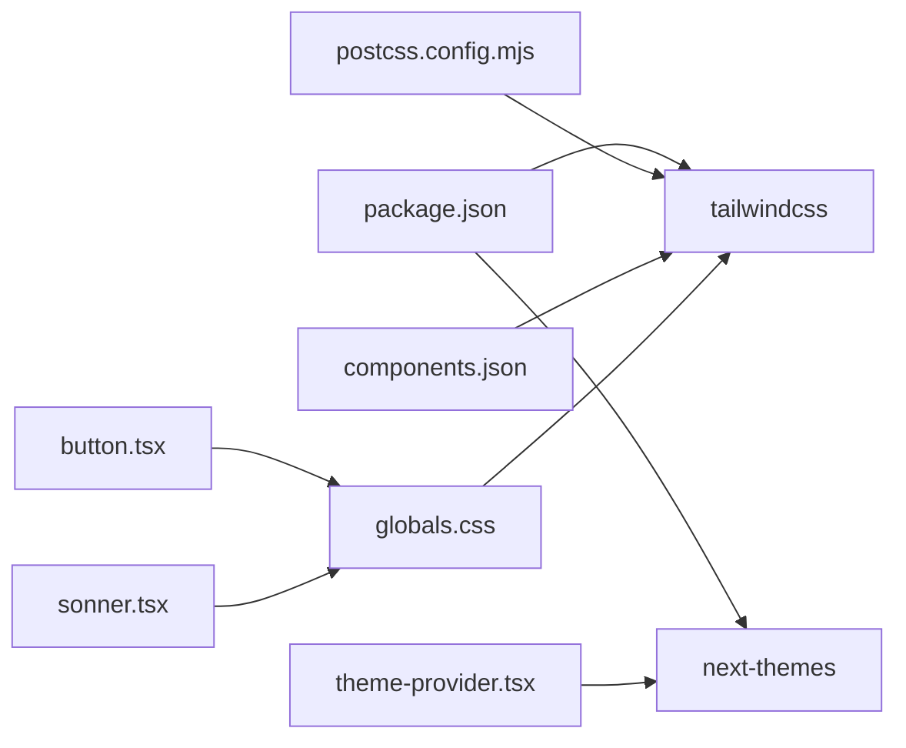

# Theme System

<cite>
**Referenced Files in This Document**
- [theme-provider.tsx](file://src/components/theme-provider.tsx)
- [theme-toggle.tsx](file://src/components/theme-toggle.tsx)
- [layout.tsx](file://src/app/layout.tsx)
- [globals.css](file://src/app/globals.css)
- [components.json](file://components.json)
- [postcss.config.mjs](file://postcss.config.mjs)
- [package.json](file://package.json)
- [navbar.tsx](file://src/components/layout/navbar.tsx)
- [button.tsx](file://src/components/ui/button.tsx)
- [sonner.tsx](file://src/components/ui/sonner.tsx)
</cite>

## Table of Contents
1. [Introduction](#introduction)
2. [Project Structure](#project-structure)
3. [Core Components](#core-components)
4. [Architecture Overview](#architecture-overview)
5. [Detailed Component Analysis](#detailed-component-analysis)
6. [Dependency Analysis](#dependency-analysis)
7. [Performance Considerations](#performance-considerations)
8. [Troubleshooting Guide](#troubleshooting-guide)
9. [Conclusion](#conclusion)

## Introduction
This document explains Datafrica’s theme system and design token management. It covers how themes are provided and switched automatically via system preferences and manually by the user, how CSS custom properties and Tailwind CSS are configured to maintain consistent design tokens across light and dark modes, and how theme-aware components are styled. It also provides practical guidance for extending the system with new themes, customizing design tokens, ensuring cross-browser compatibility, and optimizing performance during theme switching.

## Project Structure
The theme system spans a small set of focused files:
- Theme provider and toggle components
- Global CSS with design tokens and mode-specific overrides
- Application layout wiring the provider
- Tailwind and PostCSS configuration
- UI components consuming design tokens



**Diagram sources**
- [layout.tsx:1-50](file://src/app/layout.tsx#L1-L50)
- [theme-provider.tsx:1-13](file://src/components/theme-provider.tsx#L1-L13)
- [theme-toggle.tsx:1-27](file://src/components/theme-toggle.tsx#L1-L27)
- [globals.css:1-120](file://src/app/globals.css#L1-L120)
- [button.tsx:1-58](file://src/components/ui/button.tsx#L1-L58)
- [sonner.tsx:1-50](file://src/components/ui/sonner.tsx#L1-L50)
- [components.json:1-26](file://components.json#L1-L26)
- [postcss.config.mjs:1-8](file://postcss.config.mjs#L1-L8)
- [package.json:1-51](file://package.json#L1-L51)

**Section sources**
- [layout.tsx:1-50](file://src/app/layout.tsx#L1-L50)
- [theme-provider.tsx:1-13](file://src/components/theme-provider.tsx#L1-L13)
- [theme-toggle.tsx:1-27](file://src/components/theme-toggle.tsx#L1-L27)
- [globals.css:1-120](file://src/app/globals.css#L1-L120)
- [components.json:1-26](file://components.json#L1-L26)
- [postcss.config.mjs:1-8](file://postcss.config.mjs#L1-L8)
- [package.json:1-51](file://package.json#L1-L51)

## Core Components
- ThemeProvider: Wraps the app with next-themes to manage theme state and persistence. It sets the default theme to system and enables system preference detection.
- ThemeToggle: Provides a user-controlled switch between light and dark modes, rendering an appropriate icon based on the current theme.
- Design Tokens: Defined as CSS custom properties in :root and .dark, then exposed to Tailwind via @theme and consumed by components.
- UI Components: Buttons and toasts consume design tokens directly via CSS variables and Tailwind utilities.

Key behaviors:
- Automatic detection: defaultTheme="system" with enableSystem allows the provider to follow OS-level theme preference.
- Manual override: ThemeToggle toggles between "light" and "dark".
- Persistence: next-themes persists the selected theme in localStorage by default.
- Consistency: Tailwind utilities and component styles rely on CSS variables so they adapt automatically to theme changes.

**Section sources**
- [theme-provider.tsx:1-13](file://src/components/theme-provider.tsx#L1-L13)
- [theme-toggle.tsx:1-27](file://src/components/theme-toggle.tsx#L1-L27)
- [globals.css:1-120](file://src/app/globals.css#L1-L120)
- [button.tsx:1-58](file://src/components/ui/button.tsx#L1-L58)
- [sonner.tsx:1-50](file://src/components/ui/sonner.tsx#L1-L50)

## Architecture Overview
The theme system architecture centers on a provider that injects theme state into the React tree, a toggle component that updates that state, and a global stylesheet that defines design tokens and Tailwind configuration.



**Diagram sources**
- [theme-provider.tsx:1-13](file://src/components/theme-provider.tsx#L1-L13)
- [theme-toggle.tsx:1-27](file://src/components/theme-toggle.tsx#L1-L27)
- [layout.tsx:1-50](file://src/app/layout.tsx#L1-L50)
- [globals.css:1-120](file://src/app/globals.css#L1-L120)

## Detailed Component Analysis

### ThemeProvider
- Purpose: Provide theme context to the entire app.
- Behavior: Uses next-themes with attribute="class", defaultTheme="system", and enableSystem to detect OS preference.
- Integration: Wrapped around the app shell in layout.tsx.



**Diagram sources**
- [theme-provider.tsx:1-13](file://src/components/theme-provider.tsx#L1-L13)
- [layout.tsx:1-50](file://src/app/layout.tsx#L1-L50)

**Section sources**
- [theme-provider.tsx:1-13](file://src/components/theme-provider.tsx#L1-L13)
- [layout.tsx:1-50](file://src/app/layout.tsx#L1-L50)

### ThemeToggle
- Purpose: Allow user to switch themes manually.
- Behavior: Uses next-themes hook to read current theme and toggle between "light" and "dark". Includes hydration guard to avoid SSR mismatches.
- Placement: Integrated into the navbar for desktop and mobile views.



**Diagram sources**
- [theme-toggle.tsx:1-27](file://src/components/theme-toggle.tsx#L1-L27)
- [navbar.tsx:1-167](file://src/components/layout/navbar.tsx#L1-L167)

**Section sources**
- [theme-toggle.tsx:1-27](file://src/components/theme-toggle.tsx#L1-L27)
- [navbar.tsx:1-167](file://src/components/layout/navbar.tsx#L1-L167)

### Design Tokens and Tailwind Configuration
- CSS Variables: :root defines base tokens; .dark overrides them for dark mode. Tokens include colors, radii, fonts, and chart colors.
- Tailwind @theme: Exposes CSS variables as Tailwind tokens for utilities like bg-*, text-*, border-*, ring-*, and spacing/radius.
- CSS Custom Properties: Components and utilities read from --color-* and --radius-* variables.
- Tooling: components.json configures Tailwind CSS variables and CSS file location; postcss.config.mjs registers Tailwind plugin.



**Diagram sources**
- [globals.css:1-120](file://src/app/globals.css#L1-L120)
- [components.json:1-26](file://components.json#L1-L26)
- [postcss.config.mjs:1-8](file://postcss.config.mjs#L1-L8)

**Section sources**
- [globals.css:1-120](file://src/app/globals.css#L1-L120)
- [components.json:1-26](file://components.json#L1-L26)
- [postcss.config.mjs:1-8](file://postcss.config.mjs#L1-L8)

### Theme-Aware Component Styling Patterns
- Buttons: Use variants that reference primary, secondary, muted, foreground, and ring tokens. These resolve to CSS variables and adapt to theme.
- Toasts: Sonner reads the current theme and applies CSS variables for background, text, border, and radius to match the active palette.

```mermaid
classDiagram
class Button {
+variant : "default|outline|secondary|ghost|link"
+size : "default|sm|lg|icon"
+styles derive from CSS variables
}
class SonnerToast {
+reads theme from next-themes
+applies CSS variables for colors/radius
}
Button --> "uses" CSSVars["CSS Variables"]
SonnerToast --> "uses" CSSVars
```

**Diagram sources**
- [button.tsx:1-58](file://src/components/ui/button.tsx#L1-L58)
- [sonner.tsx:1-50](file://src/components/ui/sonner.tsx#L1-L50)
- [globals.css:1-120](file://src/app/globals.css#L1-L120)

**Section sources**
- [button.tsx:1-58](file://src/components/ui/button.tsx#L1-L58)
- [sonner.tsx:1-50](file://src/components/ui/sonner.tsx#L1-L50)
- [globals.css:1-120](file://src/app/globals.css#L1-L120)

### Adding New Themes and Customizing Tokens
- Add a new theme variant:
  - Extend the ThemeProvider defaultTheme and enableSystem behavior to include the new variant if desired.
  - Optionally introduce additional CSS custom properties in :root and .dark for the new scheme.
- Customize design tokens:
  - Modify values in :root and .dark within the global stylesheet to adjust colors, radii, and fonts.
  - Re-run Tailwind to regenerate utilities if you introduce new tokens.
- Maintain consistency:
  - Keep all color tokens aligned to the same semantic roles (background, foreground, primary, secondary, muted, destructive, etc.).
  - Prefer CSS variables for all component colors to ensure automatic adaptation.

Practical steps:
- Define new tokens in :root and .dark.
- Reference them in @theme and Tailwind utilities.
- Update components to use the new tokens or variants.

**Section sources**
- [globals.css:1-120](file://src/app/globals.css#L1-L120)
- [components.json:1-26](file://components.json#L1-L26)

## Dependency Analysis
- next-themes: Provides theme state, persistence, and class application on <html>.
- Tailwind CSS v4: Consumes CSS variables via @theme and generates utilities.
- PostCSS: Registers Tailwind plugin for CSS processing.
- shadcn/ui components: Consume design tokens via CSS variables and Tailwind utilities.



**Diagram sources**
- [package.json:1-51](file://package.json#L1-L51)
- [postcss.config.mjs:1-8](file://postcss.config.mjs#L1-L8)
- [components.json:1-26](file://components.json#L1-L26)
- [theme-provider.tsx:1-13](file://src/components/theme-provider.tsx#L1-L13)
- [globals.css:1-120](file://src/app/globals.css#L1-L120)
- [button.tsx:1-58](file://src/components/ui/button.tsx#L1-L58)
- [sonner.tsx:1-50](file://src/components/ui/sonner.tsx#L1-L50)

**Section sources**
- [package.json:1-51](file://package.json#L1-L51)
- [postcss.config.mjs:1-8](file://postcss.config.mjs#L1-L8)
- [components.json:1-26](file://components.json#L1-L26)
- [theme-provider.tsx:1-13](file://src/components/theme-provider.tsx#L1-L13)
- [globals.css:1-120](file://src/app/globals.css#L1-L120)
- [button.tsx:1-58](file://src/components/ui/button.tsx#L1-L58)
- [sonner.tsx:1-50](file://src/components/ui/sonner.tsx#L1-L50)

## Performance Considerations
- Hydration safety: ThemeToggle uses a mounted flag to prevent SSR mismatches, avoiding unnecessary client-side re-renders.
- Minimal reflow: Theme switching updates only the <html> class and CSS variables, resulting in efficient DOM updates.
- CSS variables: Using --color-* and --radius-* avoids costly recalculations and leverages GPU-friendly property changes.
- Tailwind utilities: Utilities derived from CSS variables are generated at build time, minimizing runtime overhead.

Recommendations:
- Keep design token changes scoped to CSS variables to minimize cascade impact.
- Avoid frequent theme switches in tight loops or animations.
- Test on lower-powered devices to confirm smoothness.

**Section sources**
- [theme-toggle.tsx:1-27](file://src/components/theme-toggle.tsx#L1-L27)
- [globals.css:1-120](file://src/app/globals.css#L1-L120)

## Troubleshooting Guide
Common issues and resolutions:
- Theme does not switch on initial load:
  - Verify ThemeProvider wraps the app and that defaultTheme="system" is set.
  - Confirm the <html> element receives the "light" or "dark" class.
- Icons or layout flicker during hydration:
  - Ensure ThemeToggle uses a hydration guard (mounted flag) before rendering interactive elements.
- Tokens not applied in components:
  - Check that components reference CSS variables and Tailwind utilities built from @theme.
  - Verify components.json points to the correct CSS file and that Tailwind is processing it.
- Browser compatibility:
  - CSS custom properties are broadly supported; ensure legacy browsers fall back gracefully.
  - Tailwind v4 requires modern PostCSS; confirm postcss.config.mjs is present and correct.

**Section sources**
- [theme-provider.tsx:1-13](file://src/components/theme-provider.tsx#L1-L13)
- [theme-toggle.tsx:1-27](file://src/components/theme-toggle.tsx#L1-L27)
- [globals.css:1-120](file://src/app/globals.css#L1-L120)
- [components.json:1-26](file://components.json#L1-L26)
- [postcss.config.mjs:1-8](file://postcss.config.mjs#L1-L8)

## Conclusion
Datafrica’s theme system combines automatic system preference detection with manual user control, backed by a robust set of design tokens defined as CSS custom properties and exposed to Tailwind via @theme. Components consistently consume these tokens, ensuring a cohesive look and feel across light and dark modes. The system is designed for performance, maintainability, and extensibility, enabling straightforward additions of new themes and refinements to the design language.