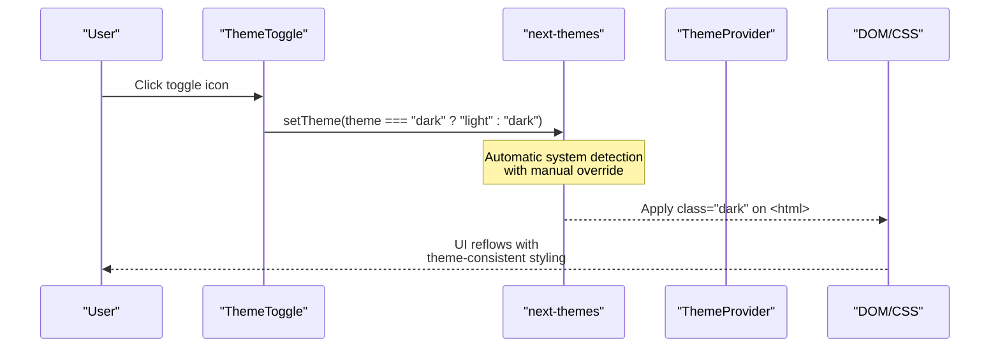
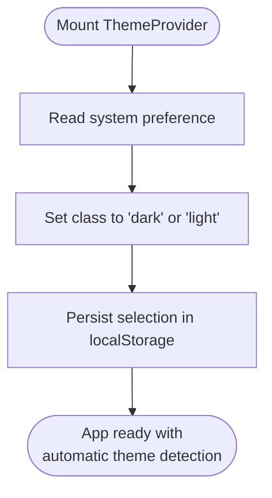
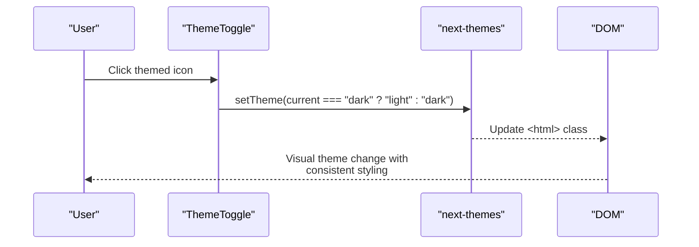
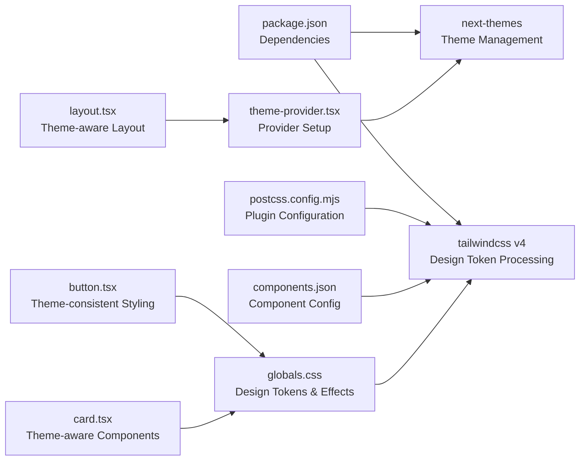

# Theme System

<cite>
**Referenced Files in This Document**
- [theme-provider.tsx](file://src/components/theme-provider.tsx)
- [theme-toggle.tsx](file://src/components/theme-toggle.tsx)
- [layout.tsx](file://src/app/layout.tsx)
- [globals.css](file://src/app/globals.css)
- [components.json](file://components.json)
- [postcss.config.mjs](file://postcss.config.mjs)
- [package.json](file://package.json)
- [navbar.tsx](file://src/components/layout/navbar.tsx)
- [button.tsx](file://src/components/ui/button.tsx)
- [card.tsx](file://src/components/ui/card.tsx)
</cite>

## Update Summary
**Changes Made**
- Updated theme provider implementation to use next-themes with automatic system preference detection
- Enhanced theme toggle component with hydration safety and proper SSR handling
- Implemented comprehensive theme persistence with localStorage
- Refined design token system with Tailwind CSS v4 integration
- Updated global styling with theme-aware CSS custom properties
- Improved component styling patterns with theme-consistent design tokens

## Table of Contents
1. [Introduction](#introduction)
2. [Project Structure](#project-structure)
3. [Core Components](#core-components)
4. [Architecture Overview](#architecture-overview)
5. [Detailed Component Analysis](#detailed-component-analysis)
6. [Design Token System](#design-token-system)
7. [Visual Effects and Styling](#visual-effects-and-styling)
8. [Component Styling Patterns](#component-styling-patterns)
9. [Dependency Analysis](#dependency-analysis)
10. [Performance Considerations](#performance-considerations)
11. [Troubleshooting Guide](#troubleshooting-guide)
12. [Conclusion](#conclusion)

## Introduction
This document explains Datafrica's sophisticated theme system and design token management, featuring a next-themes-powered light/dark theme toggle with automatic system preference detection and comprehensive theme persistence. The system provides seamless theme switching capabilities with hydration safety, CSS custom properties for consistent design tokens across light and dark modes, and theme-aware component styling patterns that leverage Tailwind CSS v4 integration.

## Project Structure
The theme system encompasses a modern set of components and styling configurations built around next-themes:
- Theme provider with automatic system preference detection and manual override capabilities
- Sophisticated theme toggle component with hydration safety and SSR handling
- Comprehensive global CSS with Tailwind CSS v4 design tokens and visual effects
- Application layout with theme-aware provider integration
- Advanced Tailwind CSS configuration with custom variants and utilities
- UI components with theme-consistent styling patterns

```mermaid
graph TB
subgraph "App Shell"
L["layout.tsx<br/>Theme-aware Layout"]
end
subgraph "Theme Layer"
TP["theme-provider.tsx<br/>next-themes Provider"]
TT["theme-toggle.tsx<br/>Hydration-safe Toggle"]
NT["next-themes<br/>System Preference Detection"]
end
subgraph "Styling System"
GCSS["globals.css<br/>Tailwind CSS v4<br/>Design Tokens"]
BTN["button.tsx<br/>Theme-consistent Styling"]
CARD["card.tsx<br/>Theme-aware Components"]
END
subgraph "Advanced Features"
GLASS[".glass-card<br/>Backdrop Filter Effects"]
GRAD[".gradient-border<br/>Hover Effects"]
PILL[".btn-pill<br/>Rounded Styling"]
NOSELECT[".no-select<br/>Text Selection Control"]
end
L --> TP
TP --> NT
TT --> NT
L --> GCSS
BTN --> GCSS
CARD --> GCSS
GCSS --> GLASS
GCSS --> GRAD
GCSS --> PILL
GCSS --> NOSELECT
```

**Diagram sources**
- [layout.tsx:33-50](file://src/app/layout.tsx#L33-L50)
- [theme-provider.tsx:6-11](file://src/components/theme-provider.tsx#L6-L11)
- [theme-toggle.tsx:8-26](file://src/components/theme-toggle.tsx#L8-L26)
- [globals.css:1-49](file://src/app/globals.css#L1-L49)
- [button.tsx:10-35](file://src/components/ui/button.tsx#L10-L35)
- [card.tsx:10-21](file://src/components/ui/card.tsx#L10-L21)

**Section sources**
- [layout.tsx:1-55](file://src/app/layout.tsx#L1-L55)
- [theme-provider.tsx:1-13](file://src/components/theme-provider.tsx#L1-L13)
- [theme-toggle.tsx:1-27](file://src/components/theme-toggle.tsx#L1-L27)
- [globals.css:1-208](file://src/app/globals.css#L1-L208)

## Core Components
The theme system consists of several key components working together to deliver a modern theme experience:

- **ThemeProvider**: Wraps the application with next-themes to manage theme state and persistence with automatic system preference detection
- **ThemeToggle**: Provides user-controlled theme switching with hydration safety and proper SSR handling
- **Design Tokens**: Comprehensive CSS custom properties system with Tailwind CSS v4 integration and theme-aware color schemes
- **Visual Effects**: Advanced styling including glass-morphism, gradients, and blur effects with theme consistency
- **UI Components**: Buttons, cards, and other components that consume design tokens and maintain visual consistency

Key behaviors:
- **Automatic Detection**: next-themes with `defaultTheme="system"` and `enableSystem` for OS preference detection
- **Manual Override**: ThemeToggle toggles between themes with hydration guard and proper SSR handling
- **Persistence**: next-themes persists selections in localStorage for seamless user experience
- **Visual Consistency**: All components use CSS variables and Tailwind utilities for automatic theme adaptation
- **Hydration Safety**: ThemeToggle uses mounted state to prevent SSR mismatches and unnecessary re-renders

**Section sources**
- [theme-provider.tsx:1-13](file://src/components/theme-provider.tsx#L1-L13)
- [theme-toggle.tsx:1-27](file://src/components/theme-toggle.tsx#L1-L27)
- [layout.tsx:33-50](file://src/app/layout.tsx#L33-L50)
- [globals.css:1-49](file://src/app/globals.css#L1-L49)

## Architecture Overview
The theme system architecture implements a modern approach with next-themes providing theme state management, automatic system preference detection, and comprehensive persistence. The system centers on a provider that injects theme context, a toggle component for manual control, and a comprehensive global stylesheet with Tailwind CSS v4 design tokens.



**Diagram sources**
- [theme-toggle.tsx:8-26](file://src/components/theme-toggle.tsx#L8-L26)
- [theme-provider.tsx:6-11](file://src/components/theme-provider.tsx#L6-L11)
- [layout.tsx:33-50](file://src/app/layout.tsx#L33-L50)
- [globals.css:1-49](file://src/app/globals.css#L1-L49)

## Detailed Component Analysis

### ThemeProvider
The ThemeProvider component serves as the foundation for the theme system, wrapping the entire application with next-themes context and automatic system preference detection.

- **Purpose**: Provide theme context to the entire app with automatic system preference detection
- **Behavior**: Uses next-themes with `attribute="class"`, `defaultTheme="system"`, and `enableSystem` for OS preference detection
- **Integration**: Wrapped around the app shell in layout.tsx with theme-aware provider setup
- **Enhanced**: Works seamlessly with Tailwind CSS v4 design tokens and comprehensive theme persistence



**Diagram sources**
- [theme-provider.tsx:6-11](file://src/components/theme-provider.tsx#L6-L11)
- [layout.tsx:33-50](file://src/app/layout.tsx#L33-L50)

**Section sources**
- [theme-provider.tsx:1-13](file://src/components/theme-provider.tsx#L1-L13)
- [layout.tsx:1-55](file://src/app/layout.tsx#L1-L55)

### ThemeToggle
The ThemeToggle component provides user-controlled theme switching with proper hydration safety and modern styling.

- **Purpose**: Allow user to switch themes manually with visual feedback and hydration safety
- **Behavior**: Uses next-themes hook to read current theme and toggle between "light" and "dark" with hydration guard
- **Placement**: Integrated into the navbar for both desktop and mobile views with proper SSR handling
- **Styling**: Uses Lucide React icons with theme-consistent styling and maintains visual consistency



**Diagram sources**
- [theme-toggle.tsx:8-26](file://src/components/theme-toggle.tsx#L8-L26)
- [navbar.tsx:78-87](file://src/components/layout/navbar.tsx#L78-L87)

**Section sources**
- [theme-toggle.tsx:1-27](file://src/components/theme-toggle.tsx#L1-L27)
- [navbar.tsx:1-216](file://src/components/layout/navbar.tsx#L1-L216)

## Design Token System
The design token system implements a comprehensive Tailwind CSS v4-based theme system with automatic light/dark mode support and advanced visual effects.

### Color Palette and Scheme
The system defines a complete color palette optimized for both light and dark modes:

- **Primary Colors**: Blue accent (#3d7eff) with white text for light mode and consistent contrast for dark mode
- **Secondary Colors**: Light gray (#f1f5f9) for light mode and deep navy (#1a2a42) for dark mode
- **Surface Colors**: Light gray (#f1f5f9) for light mode and glass-like surface (#111d32) for dark mode
- **Text Colors**: Dark gray (#0f172a) for light mode and light gray (#e8ecf4) for dark mode
- **Border Effects**: Light gray (#e2e8f0) for light mode and subtle white overlay (rgba 255,255,255,0.08) for dark mode

### Advanced Visual Effects
The system incorporates several advanced visual effects for enhanced user experience:

- **Glass Morphism**: Semi-transparent backgrounds with backdrop blur effects using theme-aware CSS variables
- **Gradient Accents**: Multi-color gradients for interactive elements and decorative borders
- **Theme Consistency**: All effects adapt automatically to light/dark mode changes
- **Performance Optimization**: CSS variables and Tailwind utilities ensure efficient rendering

**Section sources**
- [globals.css:51-126](file://src/app/globals.css#L51-L126)
- [globals.css:139-194](file://src/app/globals.css#L139-L194)

## Visual Effects and Styling
The global styling system implements advanced visual effects that create a modern theme-consistent experience.

### Glass-Morphism Implementation
The glass effect creates semi-transparent UI elements with backdrop blur:

```css
.glass-card {
  background: var(--surface);
  border: 1px solid var(--border);
  backdrop-filter: blur(12px);
}

.glass-card:hover {
  border-color: color-mix(in srgb, var(--primary) 30%, var(--border));
}
```

### Gradient Effects
Multiple gradient implementations enhance visual appeal with theme consistency:

- **Gradient Borders**: Animated gradient borders on hover for interactive elements
- **Gradient Text**: Text with gradient coloring for headings and emphasis
- **Hero Gradients**: Radial gradients for hero sections and promotional areas
- **Accent Gradients**: Blue-to-purple gradients for primary actions and highlights

### Advanced Styling Classes
The system provides utility classes for common visual patterns:

- **Pill Buttons**: Rounded button styling for modern appearance
- **Blur Effects**: Text blur for protected content sections
- **No-Select**: Text selection prevention for sensitive content
- **Theme-Aware**: All effects adapt automatically to light/dark mode changes

**Section sources**
- [globals.css:139-208](file://src/app/globals.css#L139-L208)
- [navbar.tsx:78-87](file://src/components/layout/navbar.tsx#L78-L87)

## Component Styling Patterns
Components throughout the application follow consistent styling patterns that leverage the theme system and design tokens.

### Button Styling
Buttons utilize the design token system with theme-consistent styling:

- **Primary Buttons**: Blue gradient background (#3d7eff) with white text and hover effects
- **Ghost Buttons**: Transparent styling with hover effects using accent colors
- **Pill Shape**: Rounded button styling for modern appearance
- **Theme Consistency**: All buttons use CSS variables for automatic light/dark adaptation

### Card Components
Cards implement theme-aware styling with proper elevation and transparency:

- **Theme-Aware Cards**: Use CSS variables for background and border colors
- **Glass Effects**: Semi-transparent backgrounds with backdrop blur where applicable
- **Border Effects**: Subtle borders with theme-consistent colors
- **Content Organization**: Proper spacing and typography hierarchy

**Section sources**
- [button.tsx:10-35](file://src/components/ui/button.tsx#L10-L35)
- [card.tsx:10-21](file://src/components/ui/card.tsx#L10-L21)
- [globals.css:139-194](file://src/app/globals.css#L139-L194)

## Dependency Analysis
The theme system relies on a carefully orchestrated set of dependencies that work together to deliver the modern theme experience.

### Core Dependencies
- **next-themes**: Provides theme state management, automatic system detection, and class application
- **Tailwind CSS v4**: Consumes CSS variables via @theme and generates utilities with design token support
- **PostCSS**: Processes CSS with Tailwind plugin for advanced styling and design token processing
- **shadcn/ui Components**: Consume design tokens with theme-consistent styling patterns

### Enhanced Component Integration
- **Layout Components**: Navbar and footer use theme-aware styling and gradient accents
- **UI Components**: Buttons, cards, and other components leverage theme tokens
- **Custom Effects**: Utility classes extend beyond standard component styling with theme consistency
- **Design Token Integration**: All components use CSS variables for automatic theme adaptation



**Diagram sources**
- [package.json:11-38](file://package.json#L11-L38)
- [postcss.config.mjs:1-8](file://postcss.config.mjs#L1-L8)
- [components.json:6-12](file://components.json#L6-L12)
- [theme-provider.tsx:6-11](file://src/components/theme-provider.tsx#L6-L11)
- [layout.tsx:33-50](file://src/app/layout.tsx#L33-L50)
- [globals.css:1-49](file://src/app/globals.css#L1-L49)

**Section sources**
- [package.json:1-52](file://package.json#L1-L52)
- [postcss.config.mjs:1-8](file://postcss.config.mjs#L1-L8)
- [components.json:1-26](file://components.json#L1-L26)
- [theme-provider.tsx:1-13](file://src/components/theme-provider.tsx#L1-L13)
- [layout.tsx:1-55](file://src/app/layout.tsx#L1-L55)
- [globals.css:1-208](file://src/app/globals.css#L1-L208)

## Performance Considerations
The theme system is optimized for performance while delivering modern visual effects.

### Hydration Safety
- **ThemeToggle**: Uses mounted state to prevent SSR mismatches and unnecessary re-renders
- **Layout Integration**: Theme-aware provider setup ensures consistent hydration
- **Component Optimization**: All components use CSS variables for efficient updates

### Visual Effect Performance
- **CSS Variables**: Using --color-* and --radius-* avoids costly recalculations
- **GPU Acceleration**: Backdrop filters and transforms leverage hardware acceleration
- **Efficient Transitions**: Smooth animations use transform properties for optimal performance
- **Minimal Reflow**: Theme switching updates only CSS variables and class attributes

### Memory and Rendering Optimization
- **Scoped Effects**: Visual effects are applied selectively to relevant components
- **Cache-Friendly**: Design tokens are processed at build time by Tailwind CSS v4
- **Reduced Complexity**: Effects use simple CSS properties rather than complex JavaScript
- **Browser Compatibility**: Effects degrade gracefully on older browsers

**Section sources**
- [theme-toggle.tsx:8-26](file://src/components/theme-toggle.tsx#L8-L26)
- [layout.tsx:33-50](file://src/app/layout.tsx#L33-L50)
- [globals.css:139-208](file://src/app/globals.css#L139-L208)

## Troubleshooting Guide
Common issues and resolutions for the modern theme system:

### Theme and Visual Effects Issues
- **Theme Toggle Not Working**: Verify ThemeToggle uses mounted state and next-themes hook correctly
- **Hydration Mismatch Errors**: Check that ThemeToggle prevents rendering until mounted
- **Visual Effects Not Appearing**: Ensure CSS variables are defined and Tailwind CSS v4 is properly configured
- **Gradient Borders Missing**: Verify gradient definitions are properly formatted and accessible

### Component Styling Problems
- **Buttons Not Using Theme Colors**: Check that components reference CSS variables instead of hardcoded values
- **Cards Missing Theme Effects**: Verify CSS variables are accessible and theme provider is properly configured
- **Navigation Elements Inconsistent**: Ensure navbar uses theme-aware styling and proper hydration handling
- **Mobile Theme Toggle Issues**: Confirm mobile theme toggle has proper mounted state handling

### Performance and Compatibility
- **Slow Theme Switching**: Verify CSS variables are used instead of JavaScript manipulation
- **Poor Mobile Performance**: Check that visual effects don't exceed device capabilities
- **Legacy Browser Support**: Confirm graceful degradation for unsupported CSS features
- **Build Errors**: Ensure Tailwind CSS v4 and PostCSS configuration are properly set up

**Section sources**
- [theme-provider.tsx:6-11](file://src/components/theme-provider.tsx#L6-L11)
- [theme-toggle.tsx:8-26](file://src/components/theme-toggle.tsx#L8-L26)
- [layout.tsx:33-50](file://src/app/layout.tsx#L33-L50)
- [globals.css:1-208](file://src/app/globals.css#L1-L208)

## Conclusion
Datafrica's theme system represents a modern implementation of a sophisticated light/dark theme toggle with next-themes, automatic system preference detection, and comprehensive theme persistence. The system combines automatic theme detection with manual user control, backed by a robust design token system that leverages Tailwind CSS v4 integration. The integration of CSS custom properties, theme-aware components, and advanced visual effects creates a cohesive and performant theme experience that adapts seamlessly to user preferences while maintaining excellent performance characteristics.

The system's strength lies in its comprehensive approach to theme management, from the foundational provider setup to the detailed visual effects implementation. The automatic system preference detection ensures optimal user experience, while the manual override capability provides user control. The extensive use of CSS variables and Tailwind utilities provides flexibility for future enhancements and customization, making it a robust foundation for the application's visual design system.