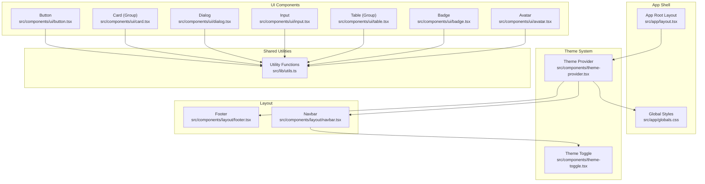
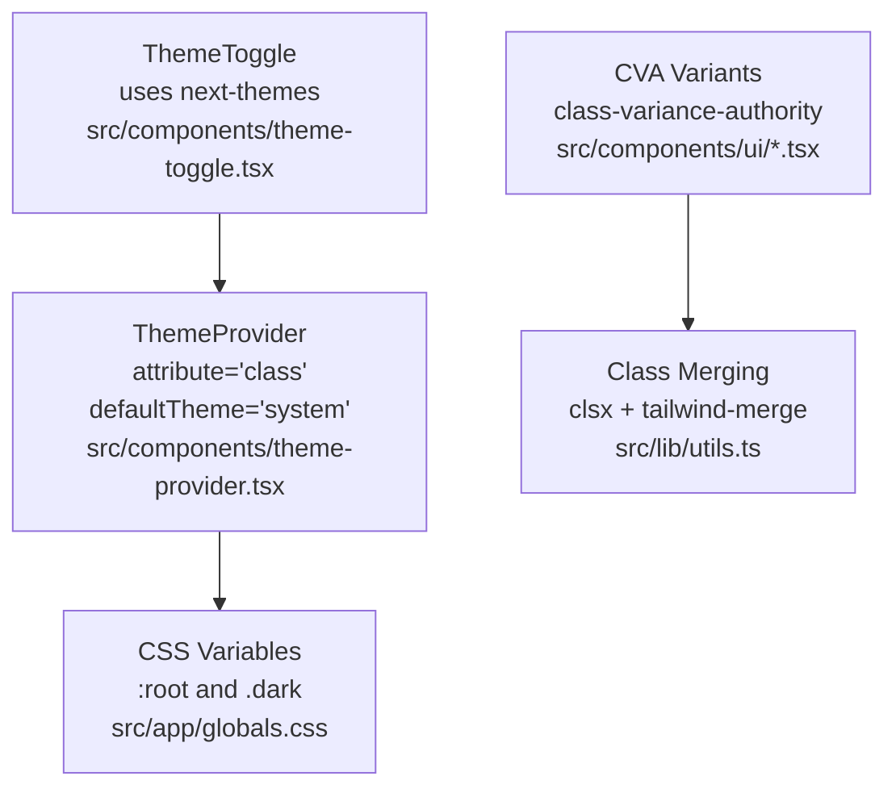
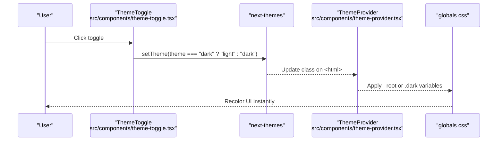
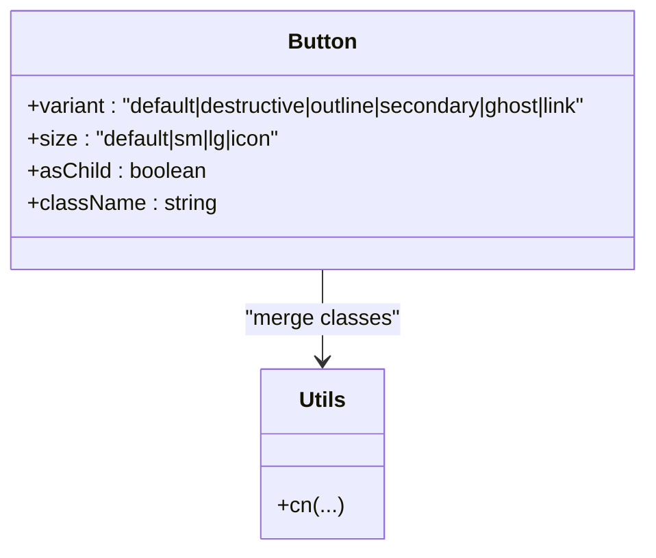
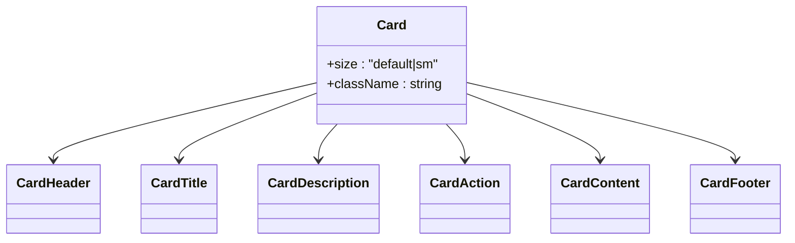
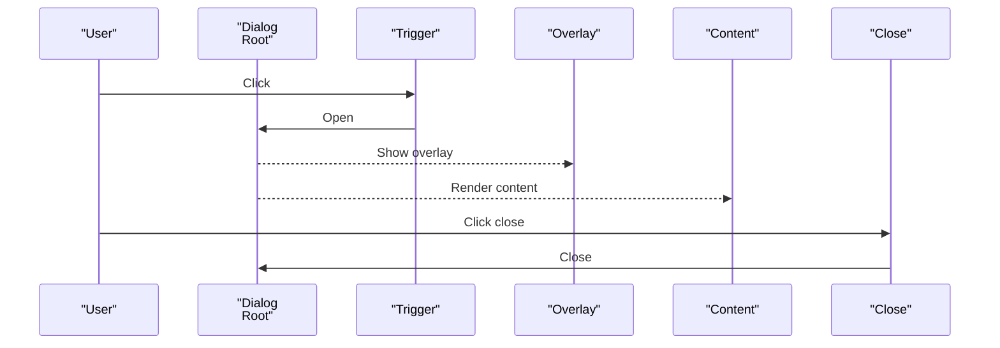
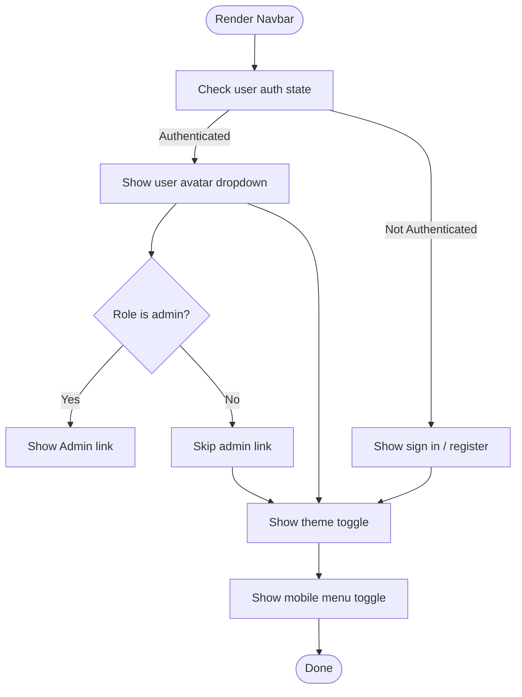
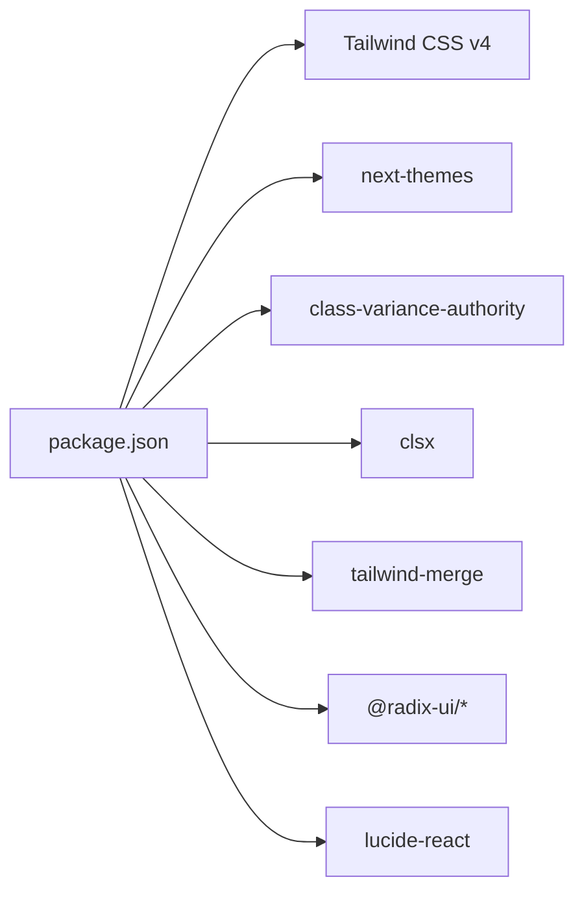

# UI Components

<cite>
**Referenced Files in This Document**
- [package.json](file://package.json)
- [components.json](file://components.json)
- [src/app/globals.css](file://src/app/globals.css)
- [src/components/theme-provider.tsx](file://src/components/theme-provider.tsx)
- [src/components/theme-toggle.tsx](file://src/components/theme-toggle.tsx)
- [src/lib/utils.ts](file://src/lib/utils.ts)
- [src/components/ui/button.tsx](file://src/components/ui/button.tsx)
- [src/components/ui/card.tsx](file://src/components/ui/card.tsx)
- [src/components/ui/dialog.tsx](file://src/components/ui/dialog.tsx)
- [src/components/ui/input.tsx](file://src/components/ui/input.tsx)
- [src/components/ui/table.tsx](file://src/components/ui/table.tsx)
- [src/components/ui/badge.tsx](file://src/components/ui/badge.tsx)
- [src/components/ui/avatar.tsx](file://src/components/ui/avatar.tsx)
- [src/components/layout/navbar.tsx](file://src/components/layout/navbar.tsx)
- [src/components/layout/footer.tsx](file://src/components/layout/footer.tsx)
</cite>

## Table of Contents
1. [Introduction](#introduction)
2. [Project Structure](#project-structure)
3. [Core Components](#core-components)
4. [Architecture Overview](#architecture-overview)
5. [Detailed Component Analysis](#detailed-component-analysis)
6. [Dependency Analysis](#dependency-analysis)
7. [Performance Considerations](#performance-considerations)
8. [Troubleshooting Guide](#troubleshooting-guide)
9. [Conclusion](#conclusion)
10. [Appendices](#appendices)

## Introduction
This document describes the UI components, design system, and styling architecture used in the Datafrica application. It focuses on the shadcn/ui-inspired component library, theme system (light/dark mode), and layout primitives. It also documents reusable components such as buttons, cards, inputs, dialogs, and tables, along with layout components like the navigation bar and footer. Guidance is included for extending the component library while maintaining design consistency, accessibility, responsive behavior, and cross-browser compatibility.

## Project Structure
The UI system is organized around:
- A shared design system built on Tailwind CSS v4 and CSS variables
- A theme provider enabling system-aware light/dark mode
- A small set of shadcn/ui-inspired components under src/components/ui
- Layout primitives under src/components/layout
- Utility helpers for class merging and component composition

**Diagram sources**
- [src/app/globals.css:1-120](file://src/app/globals.css#L1-L120)
- [src/components/theme-provider.tsx:1-13](file://src/components/theme-provider.tsx#L1-L13)
- [src/components/theme-toggle.tsx:1-27](file://src/components/theme-toggle.tsx#L1-L27)
- [src/lib/utils.ts:1-7](file://src/lib/utils.ts#L1-L7)
- [src/components/ui/button.tsx:1-58](file://src/components/ui/button.tsx#L1-L58)
- [src/components/ui/card.tsx:1-104](file://src/components/ui/card.tsx#L1-L104)
- [src/components/ui/dialog.tsx:1-120](file://src/components/ui/dialog.tsx#L1-L120)
- [src/components/ui/input.tsx:1-20](file://src/components/ui/input.tsx#L1-L20)
- [src/components/ui/table.tsx:1-117](file://src/components/ui/table.tsx#L1-L117)
- [src/components/ui/badge.tsx:1-37](file://src/components/ui/badge.tsx#L1-L37)
- [src/components/ui/avatar.tsx:1-51](file://src/components/ui/avatar.tsx#L1-L51)
- [src/components/layout/navbar.tsx:1-167](file://src/components/layout/navbar.tsx#L1-L167)
- [src/components/layout/footer.tsx:1-75](file://src/components/layout/footer.tsx#L1-L75)

**Section sources**
- [package.json:1-51](file://package.json#L1-L51)
- [components.json:1-26](file://components.json#L1-L26)
- [src/app/globals.css:1-120](file://src/app/globals.css#L1-L120)

## Core Components
This section documents the primary UI components and their props, variants, and usage patterns.

- Button
  - Variants: default, destructive, outline, secondary, ghost, link
  - Sizes: default, sm, lg, icon
  - Props: inherits HTML button attributes; supports asChild via Radix Slot; integrates with theme tokens
  - Usage: render as a native button or wrap other elements using asChild
  - Accessibility: supports focus-visible ring and keyboard interaction

- Card (composite)
  - Slots: card, header, title, description, action, content, footer
  - Sizes: default, sm
  - Props: CardHeader/CardTitle/CardDescription/CardAction/CardContent/CardFooter accept className
  - Usage: compose slots to build structured content areas with consistent spacing and borders

- Dialog (composite)
  - Parts: Root, Trigger, Portal, Overlay, Close, Content, Header, Footer, Title, Description
  - Props: Content, Title, Description accept className; overlay and content include animation classes
  - Accessibility: manages focus trapping and escape key handling via Radix Dialog

- Input
  - Props: standard input attributes; includes data-slot for styling hooks
  - Usage: form inputs with consistent sizing and focus styles

- Table (composite)
  - Parts: Table container, TableHeader, TableBody, TableFooter, TableRow, TableHead, TableCell, TableCaption
  - Props: each part accepts className; container handles horizontal scrolling
  - Usage: responsive tabular data with hover and selection states

- Badge
  - Variants: default, secondary, destructive, outline
  - Props: standard div attributes; integrates with theme tokens

- Avatar (composite)
  - Parts: Root, Image, Fallback
  - Props: forward refs to Radix primitives; includes fallback visuals

**Section sources**
- [src/components/ui/button.tsx:1-58](file://src/components/ui/button.tsx#L1-L58)
- [src/components/ui/card.tsx:1-104](file://src/components/ui/card.tsx#L1-L104)
- [src/components/ui/dialog.tsx:1-120](file://src/components/ui/dialog.tsx#L1-L120)
- [src/components/ui/input.tsx:1-20](file://src/components/ui/input.tsx#L1-L20)
- [src/components/ui/table.tsx:1-117](file://src/components/ui/table.tsx#L1-L117)
- [src/components/ui/badge.tsx:1-37](file://src/components/ui/badge.tsx#L1-L37)
- [src/components/ui/avatar.tsx:1-51](file://src/components/ui/avatar.tsx#L1-L51)

## Architecture Overview
The UI architecture centers on:
- Tailwind CSS v4 with CSS variables for theme tokens
- next-themes for theme orchestration and persistence
- class-variance-authority (CVA) and clsx/tailwind-merge for variant composition
- Radix UI primitives for accessible overlays and controls
- Lucide icons for consistent iconography

**Diagram sources**
- [src/app/globals.css:1-120](file://src/app/globals.css#L1-L120)
- [src/components/theme-provider.tsx:1-13](file://src/components/theme-provider.tsx#L1-L13)
- [src/components/theme-toggle.tsx:1-27](file://src/components/theme-toggle.tsx#L1-L27)
- [src/lib/utils.ts:1-7](file://src/lib/utils.ts#L1-L7)
- [src/components/ui/button.tsx:1-58](file://src/components/ui/button.tsx#L1-L58)

## Detailed Component Analysis

### Theme System
The theme system enables light/dark mode switching and integrates with Tailwind’s variant system.

- Implementation
  - ThemeProvider wraps the app and sets attribute="class" with defaultTheme="system"
  - ThemeToggle reads current theme and toggles between "dark" and "light"
  - CSS variables define color tokens for both modes; Tailwind v4 @theme maps these to utilities

- Behavior
  - On mount, ThemeToggle avoids hydration mismatches by rendering a minimal placeholder until mounted
  - The .dark selector overrides color variables for dark mode

**Diagram sources**
- [src/components/theme-toggle.tsx:1-27](file://src/components/theme-toggle.tsx#L1-L27)
- [src/components/theme-provider.tsx:1-13](file://src/components/theme-provider.tsx#L1-L13)
- [src/app/globals.css:1-120](file://src/app/globals.css#L1-L120)

**Section sources**
- [src/components/theme-provider.tsx:1-13](file://src/components/theme-provider.tsx#L1-L13)
- [src/components/theme-toggle.tsx:1-27](file://src/components/theme-toggle.tsx#L1-L27)
- [src/app/globals.css:1-120](file://src/app/globals.css#L1-L120)

### Button Component
- Composition
  - Uses CVA for variants and sizes
  - Supports asChild via Radix Slot to render links or other components as buttons
  - Integrates with theme tokens for colors and shadows

- Props
  - Inherits button HTML attributes
  - Variant and size selection via CVA
  - asChild to render alternate element types

- Accessibility
  - Focus-visible ring and keyboard operable
  - Disabled state handled with reduced opacity and pointer-events

**Diagram sources**
- [src/components/ui/button.tsx:1-58](file://src/components/ui/button.tsx#L1-L58)
- [src/lib/utils.ts:1-7](file://src/lib/utils.ts#L1-L7)

**Section sources**
- [src/components/ui/button.tsx:1-58](file://src/components/ui/button.tsx#L1-L58)
- [src/lib/utils.ts:1-7](file://src/lib/utils.ts#L1-L7)

### Card Component
- Composition
  - Composite component exposing multiple slots for semantic grouping
  - Supports size variants and responsive padding/margins

- Slots and Parts
  - Card, CardHeader, CardTitle, CardDescription, CardAction, CardContent, CardFooter

- Styling Hooks
  - data-slot attributes enable targeted styling and composition

**Diagram sources**
- [src/components/ui/card.tsx:1-104](file://src/components/ui/card.tsx#L1-L104)

**Section sources**
- [src/components/ui/card.tsx:1-104](file://src/components/ui/card.tsx#L1-L104)

### Dialog Component
- Composition
  - Exposes Root, Trigger, Portal, Overlay, Close, Content, Header, Footer, Title, Description
  - Overlay and Content include animation classes for transitions

- Accessibility
  - Focus management and Escape key handling via Radix Dialog
  - Close button includes screen-reader text

**Diagram sources**
- [src/components/ui/dialog.tsx:1-120](file://src/components/ui/dialog.tsx#L1-L120)

**Section sources**
- [src/components/ui/dialog.tsx:1-120](file://src/components/ui/dialog.tsx#L1-L120)

### Input Component
- Styling
  - Consistent height, border, focus ring, and responsive typography
  - data-slot attribute for styling hooks

- Usage
  - Standard text/password/email/etc. inputs with theme-aware colors

**Section sources**
- [src/components/ui/input.tsx:1-20](file://src/components/ui/input.tsx#L1-L20)

### Table Component
- Composition
  - Container with horizontal scroll for responsiveness
  - Semantic parts for header, body, footer, rows, cells, captions

- Interactions
  - Hover and selection states; supports aria-expanded and selected states

**Section sources**
- [src/components/ui/table.tsx:1-117](file://src/components/ui/table.tsx#L1-L117)

### Badge Component
- Variants
  - default, secondary, destructive, outline
- Theming
  - Integrates with primary/secondary/destructive tokens

**Section sources**
- [src/components/ui/badge.tsx:1-37](file://src/components/ui/badge.tsx#L1-L37)

### Avatar Component
- Composition
  - Root, Image, Fallback expose Radix primitives
- Styling
  - Circular container with fallback background

**Section sources**
- [src/components/ui/avatar.tsx:1-51](file://src/components/ui/avatar.tsx#L1-L51)

### Navigation Bar
- Features
  - Branding, desktop navigation, theme toggle, user menu, mobile menu
  - Conditional rendering based on authentication state and role
  - Responsive behavior using hidden/display utilities

- Accessibility
  - Dropdown menus use Radix primitives; focus management and keyboard navigation supported

**Diagram sources**
- [src/components/layout/navbar.tsx:1-167](file://src/components/layout/navbar.tsx#L1-L167)

**Section sources**
- [src/components/layout/navbar.tsx:1-167](file://src/components/layout/navbar.tsx#L1-L167)

### Footer
- Structure
  - Grid layout with four columns on medium screens and above
  - Copyright and branding info below the grid

- Responsiveness
  - Stacked layout on small screens; grouped links per column

**Section sources**
- [src/components/layout/footer.tsx:1-75](file://src/components/layout/footer.tsx#L1-L75)

## Dependency Analysis
The UI stack relies on:
- Tailwind CSS v4 for utility-first styling and CSS variables
- next-themes for theme orchestration
- class-variance-authority for variant composition
- clsx and tailwind-merge for robust class merging
- Radix UI for accessible primitives
- Lucide React for icons

**Diagram sources**
- [package.json:1-51](file://package.json#L1-L51)

**Section sources**
- [package.json:1-51](file://package.json#L1-L51)

## Performance Considerations
- Prefer variant composition via CVA to avoid runtime branching and reduce re-renders
- Use data-slot attributes on composite components to minimize CSS specificity conflicts
- Keep theme variables scoped to CSS custom properties to avoid cascade bloat
- Defer heavy computations in theme toggles; rely on class attribute changes
- Use responsive utilities judiciously to prevent excessive media queries

## Troubleshooting Guide
- Hydration mismatch on theme toggle
  - Cause: Client-side mount before server-rendered class
  - Fix: Render a minimal placeholder until mounted, as implemented in ThemeToggle

- Missing theme tokens after switching
  - Cause: CSS variable not defined for a given mode
  - Fix: Ensure both :root and .dark define all required variables

- Dialog focus issues
  - Cause: Focus not trapped or returned properly
  - Fix: Verify Radix Dialog primitives are used and Overlay/Content are rendered

- Button icon sizing
  - Cause: Icon size not matching button size
  - Fix: Use consistent icon sizing and leverage button size classes

- Table overflow on small screens
  - Cause: Horizontal scroll missing
  - Fix: Ensure table container applies overflow-x-auto

**Section sources**
- [src/components/theme-toggle.tsx:1-27](file://src/components/theme-toggle.tsx#L1-L27)
- [src/app/globals.css:1-120](file://src/app/globals.css#L1-L120)
- [src/components/ui/dialog.tsx:1-120](file://src/components/ui/dialog.tsx#L1-L120)
- [src/components/ui/button.tsx:1-58](file://src/components/ui/button.tsx#L1-L58)
- [src/components/ui/table.tsx:1-117](file://src/components/ui/table.tsx#L1-L117)

## Conclusion
The Datafrica UI system combines Tailwind CSS v4, CSS variables, and shadcn/ui-inspired components to deliver a consistent, accessible, and theme-aware design system. The theme provider and toggle enable seamless light/dark mode switching, while composite components like Card, Dialog, and Table offer flexible, accessible building blocks. By following the documented patterns and extending via CVA and data-slot hooks, teams can maintain design consistency and scalability.

## Appendices

### Styling Architecture and Tokens
- CSS variables define theme tokens for backgrounds, foregrounds, primary/secondary/accent palettes, borders, inputs, rings, and chart colors
- Tailwind v4 @theme maps these variables to utilities
- The dark variant selector ensures tokens switch automatically

**Section sources**
- [src/app/globals.css:1-120](file://src/app/globals.css#L1-L120)

### Shadcn/UI Integration and Customization
- Style and configuration are defined in components.json
- Aliases map internal paths for components, utils, UI, lib, and hooks
- Integration uses Radix UI primitives and Lucide icons

**Section sources**
- [components.json:1-26](file://components.json#L1-L26)

### Accessibility and Responsive Patterns
- Accessibility
  - Focus-visible rings, aria-expanded support, sr-only text on close buttons
  - Keyboard navigation via Radix primitives
- Responsive
  - Hidden/display utilities for mobile/desktop
  - Grid layouts adapt to column counts at medium breakpoint
  - Horizontal scrolling for tables on small screens

**Section sources**
- [src/components/ui/dialog.tsx:1-120](file://src/components/ui/dialog.tsx#L1-L120)
- [src/components/layout/navbar.tsx:1-167](file://src/components/layout/navbar.tsx#L1-L167)
- [src/components/ui/table.tsx:1-117](file://src/components/ui/table.tsx#L1-L117)

### Extending the Component Library
- Guidelines
  - Use class-variance-authority for variants and sizes
  - Merge classes with cn from src/lib/utils.ts
  - Wrap composite components with data-slot attributes for styling hooks
  - Reuse theme tokens via CSS variables and Tailwind utilities
  - Add new components under src/components/ui and export composites consistently
  - Maintain parity between light and dark tokens in globals.css

**Section sources**
- [src/lib/utils.ts:1-7](file://src/lib/utils.ts#L1-L7)
- [src/app/globals.css:1-120](file://src/app/globals.css#L1-L120)
- [src/components/ui/button.tsx:1-58](file://src/components/ui/button.tsx#L1-L58)
- [src/components/ui/card.tsx:1-104](file://src/components/ui/card.tsx#L1-L104)
- [src/components/ui/dialog.tsx:1-120](file://src/components/ui/dialog.tsx#L1-L120)
- [src/components/ui/input.tsx:1-20](file://src/components/ui/input.tsx#L1-L20)
- [src/components/ui/table.tsx:1-117](file://src/components/ui/table.tsx#L1-L117)
- [src/components/ui/badge.tsx:1-37](file://src/components/ui/badge.tsx#L1-L37)
- [src/components/ui/avatar.tsx:1-51](file://src/components/ui/avatar.tsx#L1-L51)