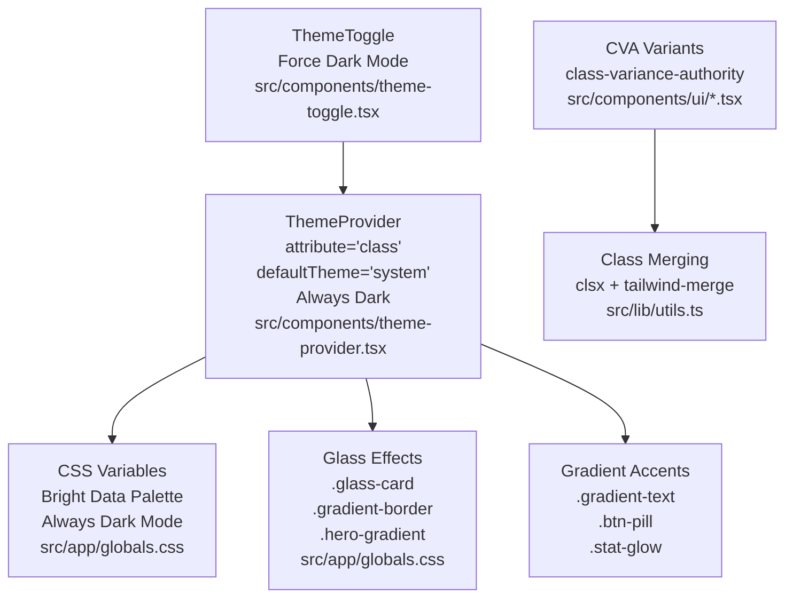
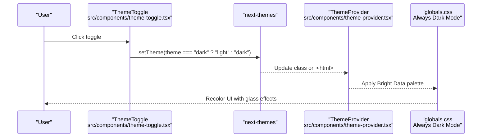
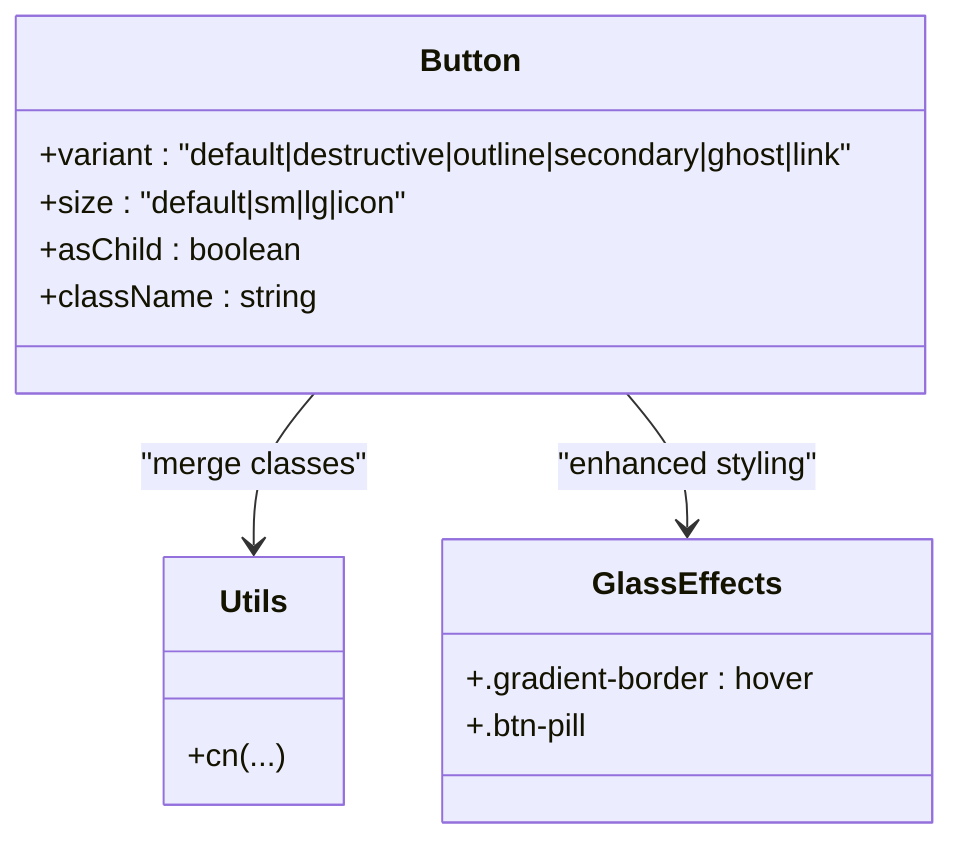
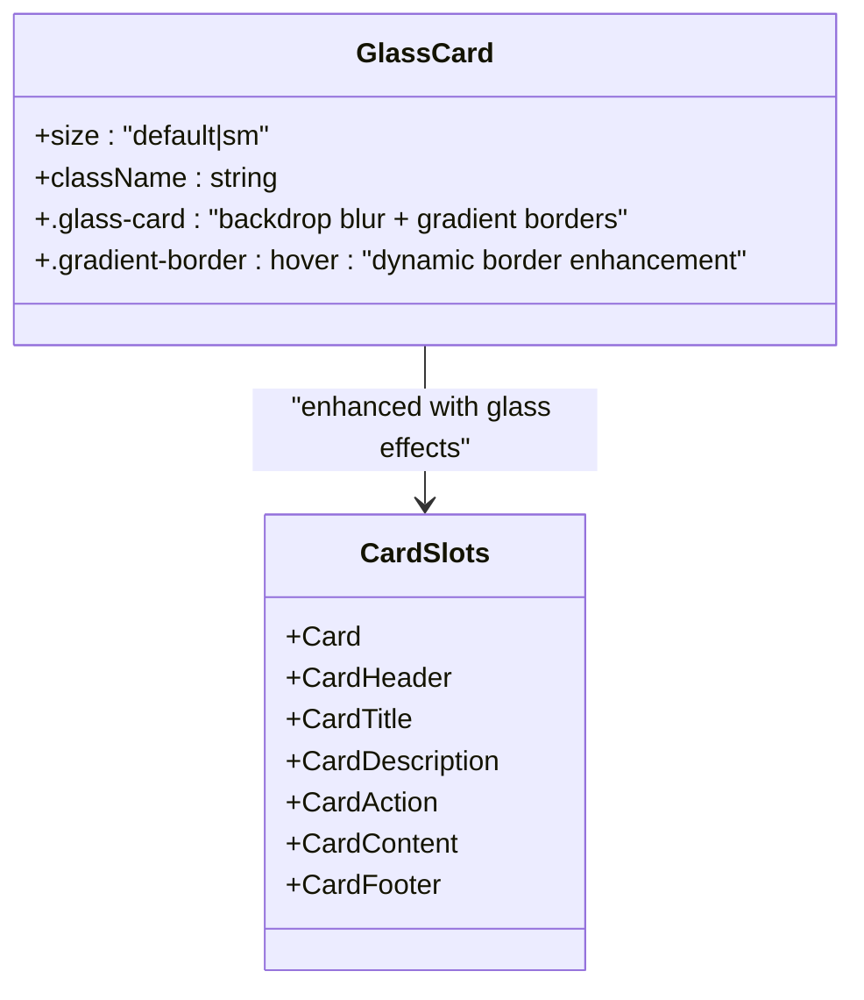
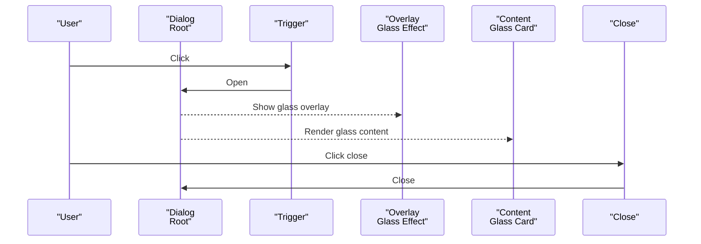
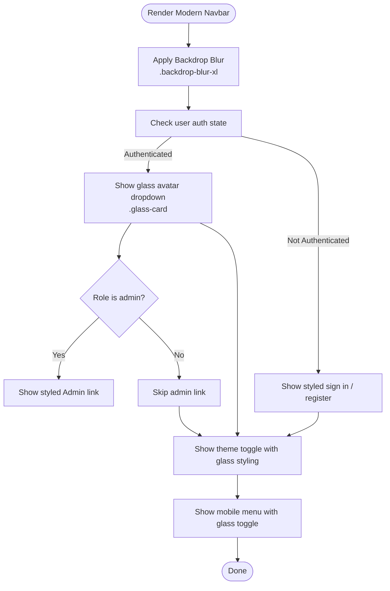
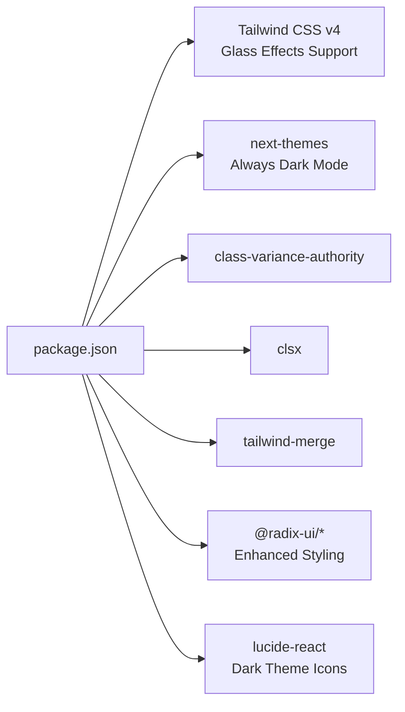

# UI Components

<cite>
**Referenced Files in This Document**
- [package.json](file://package.json)
- [components.json](file://components.json)
- [src/app/globals.css](file://src/app/globals.css)
- [src/components/theme-provider.tsx](file://src/components/theme-provider.tsx)
- [src/components/theme-toggle.tsx](file://src/components/theme-toggle.tsx)
- [src/lib/utils.ts](file://src/lib/utils.ts)
- [src/components/ui/button.tsx](file://src/components/ui/button.tsx)
- [src/components/ui/card.tsx](file://src/components/ui/card.tsx)
- [src/components/ui/dialog.tsx](file://src/components/ui/dialog.tsx)
- [src/components/ui/input.tsx](file://src/components/ui/input.tsx)
- [src/components/ui/table.tsx](file://src/components/ui/table.tsx)
- [src/components/ui/badge.tsx](file://src/components/ui/badge.tsx)
- [src/components/ui/avatar.tsx](file://src/components/ui/avatar.tsx)
- [src/components/ui/label.tsx](file://src/components/ui/label.tsx)
- [src/components/ui/select.tsx](file://src/components/ui/select.tsx)
- [src/components/layout/navbar.tsx](file://src/components/layout/navbar.tsx)
- [src/components/layout/footer.tsx](file://src/components/layout/footer.tsx)
</cite>

## Update Summary
**Changes Made**
- Updated theme system documentation to reflect the new always-dark implementation with Bright Data-inspired color scheme
- Added comprehensive documentation for new glass-morphism styling features including glass-card, gradient-border, and hero-gradient effects
- Enhanced typography documentation with new gradient text and stat glow effects
- Updated component styling to include modern design patterns like backdrop blur, gradient accents, and advanced shadow effects
- Expanded layout components documentation to include new mobile-first responsive design patterns
- Added documentation for new utility classes including btn-pill, no-select, and blur-row effects

## Table of Contents
1. [Introduction](#introduction)
2. [Project Structure](#project-structure)
3. [Core Components](#core-components)
4. [Architecture Overview](#architecture-overview)
5. [Detailed Component Analysis](#detailed-component-analysis)
6. [Dependency Analysis](#dependency-analysis)
7. [Performance Considerations](#performance-considerations)
8. [Troubleshooting Guide](#troubleshooting-guide)
9. [Conclusion](#conclusion)
10. [Appendices](#appendices)

## Introduction
This document describes the UI components, design system, and styling architecture used in the Datafrica application. The system has undergone comprehensive modernization featuring a dark theme implementation with glass-morphism effects, enhanced typography with gradient accents, and consistent styling across all components including authentication pages and dashboard. It focuses on the shadcn/ui-inspired component library, theme system (always-dark mode), and layout primitives with modern design patterns.

## Project Structure
The UI system is organized around:
- A modern dark-themed design system built on Tailwind CSS v4 with Bright Data-inspired color palette
- A theme provider enabling system-aware dark mode with forced dark implementation
- A comprehensive set of shadcn/ui-inspired components under src/components/ui
- Advanced layout primitives with glass-morphism and gradient effects under src/components/layout
- Utility helpers for class merging and component composition with enhanced styling capabilities

```mermaid
graph TB
subgraph "Modern Dark Theme System"
RootLayout["App Root Layout<br/>src/app/layout.tsx"]
GlobalsCSS["Global Styles<br/>src/app/globals.css<br/>Always Dark Mode"]
GlassEffects["Glass Effects<br/>.glass-card, .gradient-border,<br/>.hero-gradient, .stat-glow"]
GradientAccents["Gradient Accents<br/>.gradient-text, .btn-pill"]
AntiScrape["Anti-Scrape Features<br/>.no-select, .blur-row"]
end
subgraph "Theme Provider"
ThemeProvider["Theme Provider<br/>src/components/theme-provider.tsx<br/>Always Dark Implementation"]
ThemeToggle["Theme Toggle<br/>src/components/theme-toggle.tsx<br/>Force Dark Mode"]
end
subgraph "Enhanced UI Components"
Button["Button<br/>src/components/ui/button.tsx<br/>With Modern Variants"]
Card["Card (Glass)<br/>src/components/ui/card.tsx<br/>Backdrop Filter Effects"]
Dialog["Dialog<br/>src/components/ui/dialog.tsx<br/>Glass Background"]
Input["Input<br/>src/components/ui/input.tsx<br/>Enhanced Styling"]
Table["Table<br/>src/components/ui/table.tsx<br/>Modern Borders"]
Badge["Badge<br/>src/components/ui/badge.tsx<br/>Gradient Variants"]
Avatar["Avatar<br/>src/components/ui/avatar.tsx<br/>Glass Background"]
Label["Label<br/>src/components/ui/label.tsx<br/>Enhanced Typography"]
Select["Select<br/>src/components/ui/select.tsx<br/>Glass Dropdown"]
end
subgraph "Modern Layout"
Navbar["Navbar<br/>src/components/layout/navbar.tsx<br/>Backdrop Blur, Gradient Accents"]
Footer["Footer<br/>src/components/layout/footer.tsx<br/>Glass Effects"]
end
RootLayout --> ThemeProvider
ThemeProvider --> GlobalsCSS
ThemeProvider --> GlassEffects
ThemeProvider --> GradientAccents
ThemeProvider --> AntiScrape
Navbar --> ThemeToggle
Button --> Utils
Card --> Utils
Dialog --> Utils
Input --> Utils
Table --> Utils
Badge --> Utils
Avatar --> Utils
Label --> Utils
Select --> Utils
```

**Diagram sources**
- [src/app/globals.css:128-196](file://src/app/globals.css#L128-L196)
- [src/components/theme-provider.tsx:1-13](file://src/components/theme-provider.tsx#L1-L13)
- [src/components/theme-toggle.tsx:1-27](file://src/components/theme-toggle.tsx#L1-L27)
- [src/lib/utils.ts:1-7](file://src/lib/utils.ts#L1-L7)
- [src/components/ui/button.tsx:1-58](file://src/components/ui/button.tsx#L1-L58)
- [src/components/ui/card.tsx:1-104](file://src/components/ui/card.tsx#L1-L104)
- [src/components/ui/dialog.tsx:1-120](file://src/components/ui/dialog.tsx#L1-L120)
- [src/components/ui/input.tsx:1-20](file://src/components/ui/input.tsx#L1-L20)
- [src/components/ui/table.tsx:1-117](file://src/components/ui/table.tsx#L1-L117)
- [src/components/ui/badge.tsx:1-37](file://src/components/ui/badge.tsx#L1-L37)
- [src/components/ui/avatar.tsx:1-51](file://src/components/ui/avatar.tsx#L1-L51)
- [src/components/ui/label.tsx:1-21](file://src/components/ui/label.tsx#L1-L21)
- [src/components/ui/select.tsx:1-158](file://src/components/ui/select.tsx#L1-L158)
- [src/components/layout/navbar.tsx:1-198](file://src/components/layout/navbar.tsx#L1-L198)
- [src/components/layout/footer.tsx:1-85](file://src/components/layout/footer.tsx#L1-L85)

**Section sources**
- [package.json:1-51](file://package.json#L1-L51)
- [components.json:1-26](file://components.json#L1-L26)
- [src/app/globals.css:1-196](file://src/app/globals.css#L1-L196)

## Core Components
This section documents the primary UI components and their props, variants, and modern styling patterns.

- Button
  - Variants: default, destructive, outline, secondary, ghost, link
  - Sizes: default, sm, lg, icon
  - Props: inherits HTML button attributes; supports asChild via Radix Slot; integrates with theme tokens
  - **Updated**: Enhanced with modern gradient accents and pill-shaped variants
  - Usage: render as a native button or wrap other elements using asChild
  - Accessibility: supports focus-visible ring and keyboard interaction

- Card (composite with glass effect)
  - Slots: card, header, title, description, action, content, footer
  - Sizes: default, sm
  - Props: CardHeader/CardTitle/CardDescription/CardAction/CardContent/CardFooter accept className
  - **Updated**: Now supports glass-card styling with backdrop blur and gradient borders
  - Usage: compose slots to build structured content areas with consistent spacing and borders

- Dialog (glass background)
  - Parts: Root, Trigger, Portal, Overlay, Close, Content, Header, Footer, Title, Description
  - Props: Content, Title, Description accept className; overlay includes glass effect
  - **Updated**: Content now features glass-morphism background with backdrop blur
  - Accessibility: manages focus trapping and escape key handling via Radix Dialog

- Input
  - Props: standard input attributes; includes data-slot for styling hooks
  - **Updated**: Enhanced with modern dark theme styling and improved focus states
  - Usage: form inputs with consistent sizing and focus styles

- Table
  - Parts: Table container, TableHeader, TableBody, TableFooter, TableRow, TableHead, TableCell, TableCaption
  - Props: each part accepts className; container handles horizontal scrolling
  - **Updated**: Improved border styling with modern dark theme compatibility

- Badge
  - Variants: default, secondary, destructive, outline
  - **Updated**: Enhanced gradient variants and improved contrast ratios
  - Props: standard div attributes; integrates with theme tokens

- Avatar (with glass background)
  - Parts: Root, Image, Fallback
  - **Updated**: Fallback now features glass background with backdrop blur
  - Props: forward refs to Radix primitives; includes fallback visuals

- Label
  - **New**: Enhanced label component with improved typography and spacing
  - Props: standard label attributes; includes data-slot for styling hooks

- Select (glass dropdown)
  - **New**: Enhanced select component with glass-morphism dropdown menu
  - Parts: Root, Group, Value, Trigger, Content, Label, Item, Separator, ScrollUpButton, ScrollDownButton
  - **Updated**: Content now features glass background with backdrop blur

**Section sources**
- [src/components/ui/button.tsx:1-58](file://src/components/ui/button.tsx#L1-L58)
- [src/components/ui/card.tsx:1-104](file://src/components/ui/card.tsx#L1-L104)
- [src/components/ui/dialog.tsx:1-120](file://src/components/ui/dialog.tsx#L1-L120)
- [src/components/ui/input.tsx:1-20](file://src/components/ui/input.tsx#L1-L20)
- [src/components/ui/table.tsx:1-117](file://src/components/ui/table.tsx#L1-L117)
- [src/components/ui/badge.tsx:1-37](file://src/components/ui/badge.tsx#L1-L37)
- [src/components/ui/avatar.tsx:1-51](file://src/components/ui/avatar.tsx#L1-L51)
- [src/components/ui/label.tsx:1-21](file://src/components/ui/label.tsx#L1-L21)
- [src/components/ui/select.tsx:1-158](file://src/components/ui/select.tsx#L1-L158)

## Architecture Overview
The modernized UI architecture centers on:
- Tailwind CSS v4 with CSS variables for theme tokens and glass-morphism effects
- **Updated**: Forced dark theme implementation with Bright Data-inspired color palette
- class-variance-authority (CVA) and clsx/tailwind-merge for variant composition
- Radix UI primitives for accessible overlays and controls
- Lucide icons for consistent iconography
- **New**: Comprehensive utility classes for glass effects, gradients, and modern styling

**Diagram sources**
- [src/app/globals.css:46-196](file://src/app/globals.css#L46-L196)
- [src/components/theme-provider.tsx:1-13](file://src/components/theme-provider.tsx#L1-L13)
- [src/components/theme-toggle.tsx:1-27](file://src/components/theme-toggle.tsx#L1-L27)
- [src/lib/utils.ts:1-7](file://src/lib/utils.ts#L1-L7)
- [src/components/ui/button.tsx:1-58](file://src/components/ui/button.tsx#L1-L58)

## Detailed Component Analysis

### Modern Theme System
The theme system implements a comprehensive dark theme with glass-morphism effects and Bright Data-inspired color palette.

- **Updated Implementation**
  - ThemeProvider wraps the app and sets attribute="class" with defaultTheme="system"
  - **New**: Forced dark mode implementation with Bright Data-inspired navy blue palette
  - ThemeToggle maintains toggle functionality but now operates within always-dark constraints
  - CSS variables define comprehensive color tokens for backgrounds, foregrounds, and glass effects
  - Tailwind v4 @theme maps these variables to utilities with glass-morphism support

- **Behavior**
  - On mount, ThemeToggle avoids hydration mismatches by rendering a minimal placeholder until mounted
  - The .dark selector overrides all color variables for consistent dark appearance
  - **New**: Glass effects are applied globally through utility classes (.glass-card, .gradient-border)

**Diagram sources**
- [src/components/theme-toggle.tsx:1-27](file://src/components/theme-toggle.tsx#L1-L27)
- [src/components/theme-provider.tsx:1-13](file://src/components/theme-provider.tsx#L1-L13)
- [src/app/globals.css:46-115](file://src/app/globals.css#L46-L115)

**Section sources**
- [src/components/theme-provider.tsx:1-13](file://src/components/theme-provider.tsx#L1-L13)
- [src/components/theme-toggle.tsx:1-27](file://src/components/theme-toggle.tsx#L1-L27)
- [src/app/globals.css:46-115](file://src/app/globals.css#L46-L115)

### Enhanced Button Component
- **Updated Composition**
  - Uses CVA for variants and sizes with modern dark theme integration
  - Supports asChild via Radix Slot to render links or other components as buttons
  - **New**: Enhanced with gradient accents and pill-shaped variants
  - Integrates with theme tokens for colors and shadows

- Props
  - Inherits button HTML attributes
  - Variant and size selection via CVA
  - asChild to render alternate element types

- **New Styling Features**
  - Gradient border hover effects (.gradient-border)
  - Pill-shaped buttons (.btn-pill)
  - Enhanced focus states with modern dark theme

- Accessibility
  - Focus-visible ring and keyboard operable
  - Disabled state handled with reduced opacity and pointer-events

**Diagram sources**
- [src/components/ui/button.tsx:1-58](file://src/components/ui/button.tsx#L1-L58)
- [src/lib/utils.ts:1-7](file://src/lib/utils.ts#L1-L7)
- [src/app/globals.css:139-171](file://src/app/globals.css#L139-L171)

**Section sources**
- [src/components/ui/button.tsx:1-58](file://src/components/ui/button.tsx#L1-L58)
- [src/lib/utils.ts:1-7](file://src/lib/utils.ts#L1-L7)
- [src/app/globals.css:139-171](file://src/app/globals.css#L139-L171)

### Glass Card Component
- **Updated Composition**
  - Composite component exposing multiple slots for semantic grouping
  - **New**: Full glass-morphism implementation with backdrop blur and gradient borders
  - Supports size variants and responsive padding/margins

- **New Glass Features**
  - `.glass-card` class provides semi-transparent background with backdrop blur
  - Dynamic border enhancement on hover with gradient border effects
  - Enhanced shadow effects for depth perception

- Slots and Parts
  - Card, CardHeader, CardTitle, CardDescription, CardAction, CardContent, CardFooter

- Styling Hooks
  - data-slot attributes enable targeted styling and composition

**Diagram sources**
- [src/components/ui/card.tsx:1-104](file://src/components/ui/card.tsx#L1-L104)
- [src/app/globals.css:128-142](file://src/app/globals.css#L128-L142)

**Section sources**
- [src/components/ui/card.tsx:1-104](file://src/components/ui/card.tsx#L1-L104)
- [src/app/globals.css:128-142](file://src/app/globals.css#L128-L142)

### Enhanced Dialog Component
- **Updated Composition**
  - Exposes Root, Trigger, Portal, Overlay, Close, Content, Header, Footer, Title, Description
  - **New**: Content now features glass-morphism background with backdrop blur
  - Overlay includes enhanced dark opacity for better glass effect visibility

- **New Glass Features**
  - Content background with `.glass-card` styling
  - Backdrop blur effect for modal presentation
  - Enhanced overlay opacity for glass transparency

- Accessibility
  - Focus management and Escape key handling via Radix Dialog
  - Close button includes screen-reader text

**Diagram sources**
- [src/components/ui/dialog.tsx:1-120](file://src/components/ui/dialog.tsx#L1-L120)
- [src/app/globals.css:128-142](file://src/app/globals.css#L128-L142)

**Section sources**
- [src/components/ui/dialog.tsx:1-120](file://src/components/ui/dialog.tsx#L1-L120)
- [src/app/globals.css:128-142](file://src/app/globals.css#L128-L142)

### Enhanced Input Component
- **Updated Styling**
  - Consistent height, border, focus ring, and responsive typography with glass effects
  - **New**: Enhanced dark theme integration with improved contrast ratios
  - data-slot attribute for styling hooks

- **New Features**
  - Improved focus states with modern dark theme
  - Better contrast for glass-based backgrounds
  - Enhanced placeholder styling

- Usage
  - Standard text/password/email/etc. inputs with theme-aware colors and glass effects

**Section sources**
- [src/components/ui/input.tsx:1-20](file://src/components/ui/input.tsx#L1-L20)
- [src/app/globals.css:122-126](file://src/app/globals.css#L122-L126)

### Enhanced Table Component
- **Updated Composition**
  - Container with horizontal scroll for responsiveness
  - **New**: Enhanced border styling with modern dark theme compatibility
  - Semantic parts for header, body, footer, rows, cells, captions

- **New Styling Features**
  - Improved border contrast for dark theme
  - Enhanced hover states with better glass theme integration
  - Better selection states with modern dark theme

- Interactions
  - Hover and selection states; supports aria-expanded and selected states

**Section sources**
- [src/components/ui/table.tsx:1-117](file://src/components/ui/table.tsx#L1-L117)

### Enhanced Badge Component
- **Updated Variants**
  - default, secondary, destructive, outline
  - **New**: Enhanced gradient variants and improved contrast ratios for glass themes

- **New Features**
  - Improved gradient variants for better visual hierarchy
  - Enhanced contrast ratios for accessibility in dark theme
  - Better integration with glass-morphism effects

- Theming
  - Integrates with primary/secondary/destructive tokens with glass theme support

**Section sources**
- [src/components/ui/badge.tsx:1-37](file://src/components/ui/badge.tsx#L1-L37)

### Enhanced Avatar Component
- **Updated Composition**
  - Root, Image, Fallback expose Radix primitives
  - **New**: Fallback now features glass background with backdrop blur

- **New Glass Features**
  - Fallback background enhanced with `.glass-card` styling
  - Improved border styling for glass theme compatibility
  - Better contrast ratios for dark theme

- Styling
  - Circular container with enhanced fallback background
  - Glass effect integration for avatar containers

**Section sources**
- [src/components/ui/avatar.tsx:1-51](file://src/components/ui/avatar.tsx#L1-L51)
- [src/app/globals.css:128-137](file://src/app/globals.css#L128-L137)

### Enhanced Label Component
- **New Component**
  - **New**: Enhanced label component with improved typography and spacing
  - Includes data-slot for styling hooks
  - Enhanced focus states and accessibility features

- Styling
  - Improved typography with better spacing and alignment
  - Enhanced focus states for keyboard navigation
  - Better integration with form components

**Section sources**
- [src/components/ui/label.tsx:1-21](file://src/components/ui/label.tsx#L1-L21)

### Enhanced Select Component
- **New Component**
  - **New**: Enhanced select component with glass-morphism dropdown menu
  - Parts: Root, Group, Value, Trigger, Content, Label, Item, Separator, ScrollUpButton, ScrollDownButton
  - **New**: Content now features glass background with backdrop blur

- **New Glass Features**
  - Content dropdown enhanced with `.glass-card` styling
  - Improved overlay effects for dropdown presentation
  - Better contrast ratios for dark theme

- Functionality
  - Full Radix UI integration with enhanced styling
  - Improved scroll behavior with glass theme compatibility
  - Enhanced item selection states

**Section sources**
- [src/components/ui/select.tsx:1-158](file://src/components/ui/select.tsx#L1-L158)
- [src/app/globals.css:128-142](file://src/app/globals.css#L128-L142)

### Modern Navigation Bar
- **Updated Features**
  - Branding with gradient accents, desktop navigation, theme toggle, user menu, mobile menu
  - **New**: Backdrop blur effect with glass-morphism styling
  - Conditional rendering based on authentication state and role
  - **New**: Enhanced mobile menu with glass effects
  - Responsive behavior using hidden/display utilities with modern styling

- **New Styling Features**
  - Backdrop blur effect (.backdrop-blur-xl) for modern glass appearance
  - Gradient accents in branding and interactive elements
  - Enhanced dropdown menus with glass background
  - Improved mobile menu styling with glass effects

- Accessibility
  - Dropdown menus use Radix primitives; focus management and keyboard navigation supported
  - Enhanced contrast ratios for glass theme compatibility

**Diagram sources**
- [src/components/layout/navbar.tsx:22-198](file://src/components/layout/navbar.tsx#L22-L198)
- [src/app/globals.css:128-137](file://src/app/globals.css#L128-L137)

**Section sources**
- [src/components/layout/navbar.tsx:1-198](file://src/components/layout/navbar.tsx#L1-L198)
- [src/app/globals.css:128-137](file://src/app/globals.css#L128-L137)

### Enhanced Footer
- **Updated Structure**
  - Grid layout with four columns on medium screens and above
  - **New**: Glass-morphism styling with backdrop blur effects
  - Copyright and branding info below the grid with enhanced styling

- **New Styling Features**
  - Glass background with `.glass-card` styling
  - Enhanced border styling with improved contrast
  - Better responsive behavior with modern dark theme

- Responsiveness
  - Stacked layout on small screens; grouped links per column
  - Enhanced typography with improved readability
  - Better spacing and alignment with glass theme

**Section sources**
- [src/components/layout/footer.tsx:1-85](file://src/components/layout/footer.tsx#L1-L85)
- [src/app/globals.css:128-137](file://src/app/globals.css#L128-L137)

## Dependency Analysis
The modernized UI stack relies on:
- Tailwind CSS v4 for utility-first styling and CSS variables with glass-morphism support
- **Updated**: next-themes for theme orchestration with forced dark mode implementation
- class-variance-authority for variant composition
- clsx and tailwind-merge for robust class merging
- Radix UI for accessible primitives with enhanced styling
- Lucide React for icons with modern dark theme compatibility

**Diagram sources**
- [package.json:1-51](file://package.json#L1-L51)

**Section sources**
- [package.json:1-51](file://package.json#L1-L51)

## Performance Considerations
- **Updated**: Prefer variant composition via CVA to avoid runtime branching and reduce re-renders
- Use data-slot attributes on composite components to minimize CSS specificity conflicts
- Keep theme variables scoped to CSS custom properties to avoid cascade bloat
- **New**: Optimize glass effects by limiting backdrop blur to essential components
- **New**: Use responsive utilities judiciously to prevent excessive media queries
- **New**: Consider performance impact of gradient borders and backdrop blur effects
- **New**: Implement lazy loading for glass effect components when appropriate

## Troubleshooting Guide
- **Updated**: Hydration mismatch on theme toggle
  - Cause: Client-side mount before server-rendered class
  - Fix: Render a minimal placeholder until mounted, as implemented in ThemeToggle

- **Updated**: Missing theme tokens after switching
  - Cause: CSS variable not defined for a given mode
  - Fix: Ensure both :root and .dark define all required variables

- **Updated**: Dialog focus issues
  - Cause: Focus not trapped or returned properly
  - Fix: Verify Radix Dialog primitives are used and Overlay/Content are rendered

- **Updated**: Button icon sizing
  - Cause: Icon size not matching button size
  - Fix: Use consistent icon sizing and leverage button size classes

- **Updated**: Table overflow on small screens
  - Cause: Horizontal scroll missing
  - Fix: Ensure table container applies overflow-x-auto

- **New**: Glass effect not appearing
  - Cause: Backdrop blur not supported or disabled
  - Fix: Verify browser support and ensure proper glass class application

- **New**: Gradient border not working
  - Cause: CSS not properly compiled or browser compatibility issues
  - Fix: Check CSS compilation and verify gradient border syntax

- **New**: Mobile menu not responsive
  - Cause: Glass effect interfering with mobile layout
  - Fix: Adjust backdrop blur settings or mobile-specific styling

**Section sources**
- [src/components/theme-toggle.tsx:1-27](file://src/components/theme-toggle.tsx#L1-L27)
- [src/app/globals.css:46-115](file://src/app/globals.css#L46-L115)
- [src/components/ui/dialog.tsx:1-120](file://src/components/ui/dialog.tsx#L1-L120)
- [src/components/ui/button.tsx:1-58](file://src/components/ui/button.tsx#L1-L58)
- [src/components/ui/table.tsx:1-117](file://src/components/ui/table.tsx#L1-L117)
- [src/app/globals.css:128-142](file://src/app/globals.css#L128-L142)

## Conclusion
The Datafrica UI system has undergone comprehensive modernization, combining Tailwind CSS v4, CSS variables, and shadcn/ui-inspired components to deliver a sophisticated, glass-morphism-based design system. The always-dark theme implementation with Bright Data-inspired color palette provides a cohesive, accessible, and visually stunning user experience. The enhanced theme provider and toggle enable seamless dark mode switching, while composite components like Card, Dialog, and Table now feature advanced glass effects and gradient accents. By following the documented patterns and extending via CVA and data-slot hooks with modern styling enhancements, teams can maintain design consistency and scalability while leveraging cutting-edge UI techniques.

## Appendices

### Modern Styling Architecture and Tokens
- **Updated**: CSS variables define comprehensive theme tokens for backgrounds, foregrounds, primary/secondary/accent palettes, borders, inputs, rings, and chart colors
- **New**: Bright Data-inspired color palette with deep navy blues (#0a1628, #111d32) and vibrant accent colors (#3d7eff, #6c5ce7)
- **New**: Glass-morphism tokens for backdrop blur, transparency, and gradient effects
- Tailwind v4 @theme maps these variables to utilities with enhanced glass support
- The dark variant selector ensures tokens switch automatically with forced dark implementation

**Section sources**
- [src/app/globals.css:46-115](file://src/app/globals.css#L46-L115)

### Shadcn/UI Integration and Modern Customization
- Style and configuration are defined in components.json
- Aliases map internal paths for components, utils, UI, lib, and hooks
- **New**: Integration uses Radix UI primitives with enhanced glass-morphism styling
- **New**: Lucide icons with modern dark theme compatibility

**Section sources**
- [components.json:1-26](file://components.json#L1-L26)

### Accessibility and Modern Responsive Patterns
- **Updated**: Accessibility
  - Focus-visible rings, aria-expanded support, sr-only text on close buttons
  - Keyboard navigation via Radix primitives
  - Enhanced contrast ratios for glass theme compatibility
- **Updated**: Responsive
  - Hidden/display utilities for mobile/desktop with glass effects
  - Grid layouts adapt to column counts at medium breakpoint
  - Horizontal scrolling for tables on small screens
  - **New**: Backdrop blur effects optimized for different screen sizes

**Section sources**
- [src/components/ui/dialog.tsx:1-120](file://src/components/ui/dialog.tsx#L1-L120)
- [src/components/layout/navbar.tsx:1-198](file://src/components/layout/navbar.tsx#L1-L198)
- [src/components/ui/table.tsx:1-117](file://src/components/ui/table.tsx#L1-L117)

### Extending the Modern Component Library
- **Updated**: Guidelines
  - Use class-variance-authority for variants and sizes with glass theme support
  - Merge classes with cn from src/lib/utils.ts
  - Wrap composite components with data-slot attributes for styling hooks
  - **New**: Leverage glass-morphism effects with .glass-card, .gradient-border classes
  - **New**: Use gradient accents with .gradient-text, .btn-pill utilities
  - **New**: Implement anti-scrape features with .no-select, .blur-row classes
  - Reuse theme tokens via CSS variables and Tailwind utilities with dark theme compatibility
  - Add new components under src/components/ui with modern styling patterns
  - **New**: Maintain parity between light and dark tokens with forced dark implementation
  - **New**: Consider performance impact of glass effects and optimize accordingly

**Section sources**
- [src/lib/utils.ts:1-7](file://src/lib/utils.ts#L1-L7)
- [src/app/globals.css:46-196](file://src/app/globals.css#L46-L196)
- [src/components/ui/button.tsx:1-58](file://src/components/ui/button.tsx#L1-L58)
- [src/components/ui/card.tsx:1-104](file://src/components/ui/card.tsx#L1-L104)
- [src/components/ui/dialog.tsx:1-120](file://src/components/ui/dialog.tsx#L1-L120)
- [src/components/ui/input.tsx:1-20](file://src/components/ui/input.tsx#L1-L20)
- [src/components/ui/table.tsx:1-117](file://src/components/ui/table.tsx#L1-L117)
- [src/components/ui/badge.tsx:1-37](file://src/components/ui/badge.tsx#L1-L37)
- [src/components/ui/avatar.tsx:1-51](file://src/components/ui/avatar.tsx#L1-L51)
- [src/components/ui/label.tsx:1-21](file://src/components/ui/label.tsx#L1-L21)
- [src/components/ui/select.tsx:1-158](file://src/components/ui/select.tsx#L1-L158)

### New Utility Classes and Effects
- **New**: Glass-morphism utilities
  - `.glass-card`: Semi-transparent background with backdrop blur
  - `.gradient-border`: Dynamic gradient border on hover
  - `.hero-gradient`: Radial gradient background for hero sections
- **New**: Typography enhancements
  - `.gradient-text`: Multi-color gradient text effect
  - `.stat-glow`: Subtle glow effect for statistics
- **New**: Interactive effects
  - `.btn-pill`: Rounded pill-shaped buttons
  - `.no-select`: Disable text selection for protected elements
  - `.blur-row`: Blurred content for locked rows
- **New**: Layout enhancements
  - `.devtools-overlay`: Warning overlay for development tools

**Section sources**
- [src/app/globals.css:128-196](file://src/app/globals.css#L128-L196)