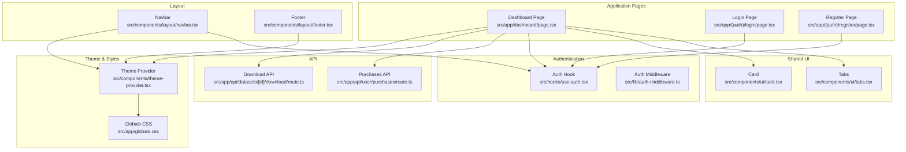
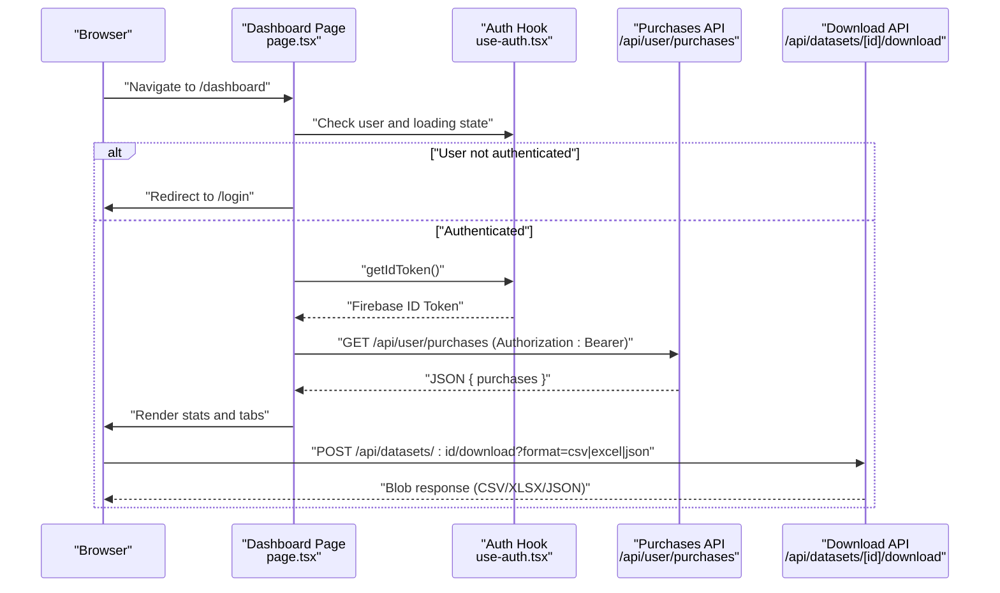
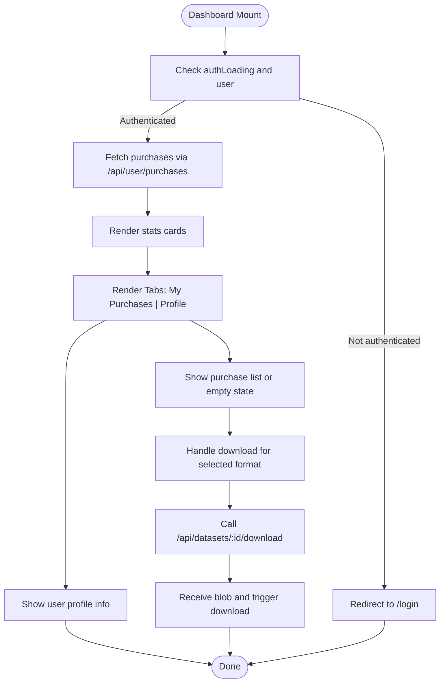
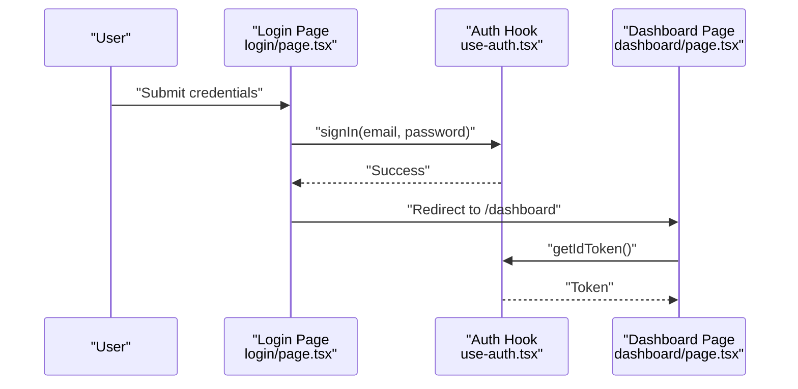
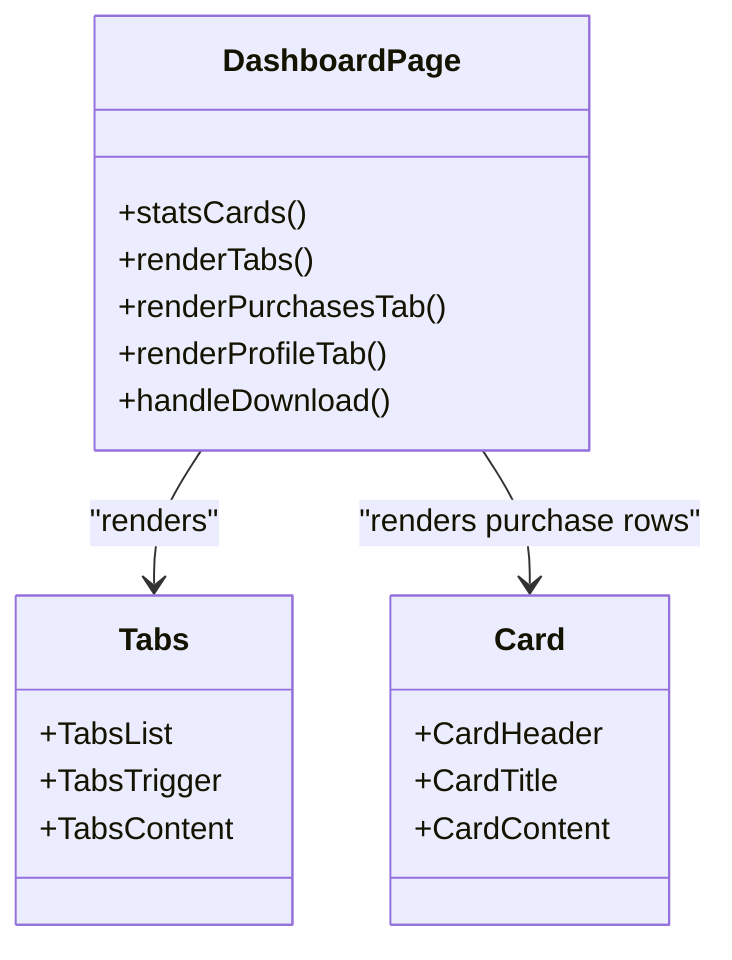
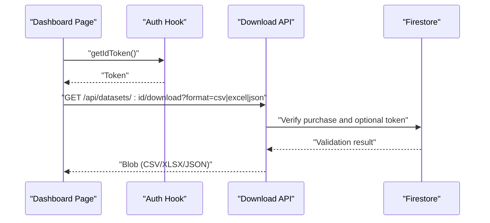
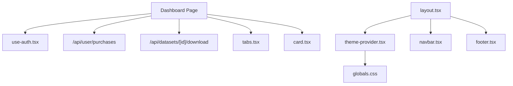

# Dashboard Overview

<cite>
**Referenced Files in This Document**
- [src/app/dashboard/page.tsx](file://src/app/dashboard/page.tsx)
- [src/components/layout/navbar.tsx](file://src/components/layout/navbar.tsx)
- [src/hooks/use-auth.tsx](file://src/hooks/use-auth.tsx)
- [src/lib/auth-middleware.ts](file://src/lib/auth-middleware.ts)
- [src/app/api/user/purchases/route.ts](file://src/app/api/user/purchases/route.ts)
- [src/app/api/datasets/[id]/download/route.ts](file://src/app/api/datasets/[id]/download/route.ts)
- [src/components/ui/tabs.tsx](file://src/components/ui/tabs.tsx)
- [src/components/ui/card.tsx](file://src/components/ui/card.tsx)
- [src/app/layout.tsx](file://src/app/layout.tsx)
- [src/types/index.ts](file://src/types/index.ts)
- [src/app/globals.css](file://src/app/globals.css)
- [src/components/theme-provider.tsx](file://src/components/theme-provider.tsx)
- [src/components/layout/footer.tsx](file://src/components/layout/footer.tsx)
- [src/app/(auth)/login/page.tsx](file://src/app/(auth)/login/page.tsx)
- [src/app/(auth)/register/page.tsx](file://src/app/(auth)/register/page.tsx)
</cite>

## Table of Contents
1. [Introduction](#introduction)
2. [Project Structure](#project-structure)
3. [Core Components](#core-components)
4. [Architecture Overview](#architecture-overview)
5. [Detailed Component Analysis](#detailed-component-analysis)
6. [Dependency Analysis](#dependency-analysis)
7. [Performance Considerations](#performance-considerations)
8. [Troubleshooting Guide](#troubleshooting-guide)
9. [Conclusion](#conclusion)

## Introduction
This document provides a comprehensive overview of Datafrica’s user dashboard, focusing on its architecture, layout, and main sections. It explains how the dashboard integrates with the authentication system, displays user engagement metrics and purchase history, and presents a responsive design with a tabbed interface for "My Purchases" and "Profile". The documentation is structured to be accessible to both technical and non-technical readers.

## Project Structure
The dashboard is part of a Next.js application with a clear separation of concerns:
- Application pages under src/app, including the dashboard page and authentication pages
- Shared UI components under src/components/ui
- Layout components (navbar, footer) under src/components/layout
- Authentication hooks and middleware under src/hooks and src/lib
- Global styles and theme provider under src/app and src/components/theme-provider.tsx
- Types under src/types

**Diagram sources**
- [src/app/dashboard/page.tsx:1-313](file://src/app/dashboard/page.tsx#L1-L313)
- [src/components/ui/tabs.tsx:1-56](file://src/components/ui/tabs.tsx#L1-L56)
- [src/components/ui/card.tsx:1-104](file://src/components/ui/card.tsx#L1-L104)
- [src/components/layout/navbar.tsx:1-167](file://src/components/layout/navbar.tsx#L1-L167)
- [src/components/layout/footer.tsx:1-75](file://src/components/layout/footer.tsx#L1-L75)
- [src/hooks/use-auth.tsx:1-117](file://src/hooks/use-auth.tsx#L1-L117)
- [src/lib/auth-middleware.ts:1-48](file://src/lib/auth-middleware.ts#L1-L48)
- [src/app/api/user/purchases/route.ts:1-31](file://src/app/api/user/purchases/route.ts#L1-L31)
- [src/app/api/datasets/[id]/download/route.ts](file://src/app/api/datasets/[id]/download/route.ts#L1-L148)
- [src/components/theme-provider.tsx:1-13](file://src/components/theme-provider.tsx#L1-L13)
- [src/app/globals.css:1-120](file://src/app/globals.css#L1-L120)
- [src/app/(auth)/login/page.tsx](file://src/app/(auth)/login/page.tsx#L1-L98)
- [src/app/(auth)/register/page.tsx](file://src/app/(auth)/register/page.tsx#L1-L117)

**Section sources**
- [src/app/dashboard/page.tsx:1-313](file://src/app/dashboard/page.tsx#L1-L313)
- [src/app/layout.tsx:1-50](file://src/app/layout.tsx#L1-L50)

## Core Components
- Dashboard page orchestrates user session checks, purchase retrieval, and rendering of statistics and tabs.
- Authentication hook manages Firebase authentication state, user profile synchronization, and ID token retrieval.
- Tabs component provides a clean, accessible tabbed interface for switching between "My Purchases" and "Profile".
- Card component renders purchase entries and profile information with consistent spacing and typography.
- Navbar integrates with authentication to show user menu, admin links, and logout.
- Global theme provider and CSS define responsive design and dark/light mode support.

Key responsibilities:
- Statistics cards: display total purchases, available datasets, and user role.
- Tabbed interface: "My Purchases" lists purchase history with download actions; "Profile" shows user details.
- Responsive behavior: mobile-friendly navbar and grid layouts adapt to screen sizes.
- Accessibility: semantic HTML, focus states, and keyboard navigation via Radix UI tabs.

**Section sources**
- [src/app/dashboard/page.tsx:32-312](file://src/app/dashboard/page.tsx#L32-L312)
- [src/hooks/use-auth.tsx:22-117](file://src/hooks/use-auth.tsx#L22-L117)
- [src/components/ui/tabs.tsx:8-56](file://src/components/ui/tabs.tsx#L8-L56)
- [src/components/ui/card.tsx:5-104](file://src/components/ui/card.tsx#L5-L104)
- [src/components/layout/navbar.tsx:18-167](file://src/components/layout/navbar.tsx#L18-L167)
- [src/app/globals.css:1-120](file://src/app/globals.css#L1-L120)

## Architecture Overview
The dashboard follows a client-side React pattern with serverless API routes:
- Client-side authentication state is managed by the AuthProvider and useAuth hook.
- The dashboard fetches purchase history via a protected API endpoint using Firebase ID tokens.
- Download actions are handled by another protected API route that validates purchases and generates downloadable files.
- The layout wraps the app with theme provider, navbar, and footer, ensuring consistent UX across pages.

**Diagram sources**
- [src/app/dashboard/page.tsx:32-103](file://src/app/dashboard/page.tsx#L32-L103)
- [src/hooks/use-auth.tsx:94-99](file://src/hooks/use-auth.tsx#L94-L99)
- [src/app/api/user/purchases/route.ts:5-30](file://src/app/api/user/purchases/route.ts#L5-L30)
- [src/app/api/datasets/[id]/download/route.ts](file://src/app/api/datasets/[id]/download/route.ts#L7-L148)

## Detailed Component Analysis

### Dashboard Page
Responsibilities:
- Redirect unauthenticated users to the login page.
- Fetch and display purchase statistics (total purchases, datasets available, user role).
- Render a tabbed interface with "My Purchases" and "Profile".
- Handle purchase download actions for CSV, Excel, and JSON formats.
- Provide fallbacks and loading states using skeletons and empty states.

Key behaviors:
- Uses useAuth for user state and getIdToken for secure API calls.
- Calls the purchases API with an Authorization header containing a Firebase ID token.
- Generates download URLs dynamically and triggers browser downloads.
- Displays purchase entries with status badges and metadata.

**Diagram sources**
- [src/app/dashboard/page.tsx:32-103](file://src/app/dashboard/page.tsx#L32-L103)
- [src/app/api/user/purchases/route.ts:5-30](file://src/app/api/user/purchases/route.ts#L5-L30)
- [src/app/api/datasets/[id]/download/route.ts](file://src/app/api/datasets/[id]/download/route.ts#L7-L148)

**Section sources**
- [src/app/dashboard/page.tsx:32-312](file://src/app/dashboard/page.tsx#L32-L312)

### Authentication Integration
- useAuth manages Firebase authentication state, synchronizes user profiles in Firestore, and exposes getIdToken for protected API calls.
- AuthProvider wraps the app in RootLayout, ensuring authentication context is available globally.
- Login and Register pages integrate with useAuth to sign in/sign up and redirect to the dashboard upon success.

**Diagram sources**
- [src/app/(auth)/login/page.tsx](file://src/app/(auth)/login/page.tsx#L14-L36)
- [src/hooks/use-auth.tsx:84-86](file://src/hooks/use-auth.tsx#L84-L86)
- [src/app/dashboard/page.tsx:34-42](file://src/app/dashboard/page.tsx#L34-L42)

**Section sources**
- [src/hooks/use-auth.tsx:22-117](file://src/hooks/use-auth.tsx#L22-L117)
- [src/app/(auth)/login/page.tsx](file://src/app/(auth)/login/page.tsx#L14-L36)
- [src/app/(auth)/register/page.tsx](file://src/app/(auth)/register/page.tsx#L22-L43)

### Tabbed Interface Design
- "My Purchases" tab lists purchase history with status badges, dates, amounts, and download buttons for CSV, Excel, and JSON.
- "Profile" tab shows user name, email, role, and membership date.
- The tabs component uses Radix UI primitives for accessibility and keyboard navigation.

**Diagram sources**
- [src/app/dashboard/page.tsx:169-309](file://src/app/dashboard/page.tsx#L169-L309)
- [src/components/ui/tabs.tsx:8-56](file://src/components/ui/tabs.tsx#L8-L56)
- [src/components/ui/card.tsx:5-104](file://src/components/ui/card.tsx#L5-L104)

**Section sources**
- [src/app/dashboard/page.tsx:169-309](file://src/app/dashboard/page.tsx#L169-L309)
- [src/components/ui/tabs.tsx:8-56](file://src/components/ui/tabs.tsx#L8-L56)
- [src/components/ui/card.tsx:5-104](file://src/components/ui/card.tsx#L5-L104)

### Purchase Statistics and Engagement Metrics
- Statistics cards present:
  - Total purchases count
  - Number of datasets available for download
  - User email and role
- These cards reflect user engagement and ownership, derived from the fetched purchase data.

**Section sources**
- [src/app/dashboard/page.tsx:127-167](file://src/app/dashboard/page.tsx#L127-L167)
- [src/app/api/user/purchases/route.ts:11-22](file://src/app/api/user/purchases/route.ts#L11-L22)

### Download Workflow and Security
- The dashboard triggers downloads by calling the download API with the dataset ID and desired format.
- The download API verifies the user's authentication, ensures the user purchased the dataset, and optionally validates a one-time download token.
- Supported formats: CSV, Excel (XLSX), JSON.

**Diagram sources**
- [src/app/dashboard/page.tsx:68-103](file://src/app/dashboard/page.tsx#L68-L103)
- [src/app/api/datasets/[id]/download/route.ts](file://src/app/api/datasets/[id]/download/route.ts#L18-L68)

**Section sources**
- [src/app/dashboard/page.tsx:68-103](file://src/app/dashboard/page.tsx#L68-L103)
- [src/app/api/datasets/[id]/download/route.ts](file://src/app/api/datasets/[id]/download/route.ts#L7-L148)

### Navigation Structure
- Navbar displays site branding, dataset browsing, and conditional admin links based on user role.
- Authenticated users see a dropdown with profile and logout; anonymous users see sign-in and register options.
- Mobile navigation toggles a compact menu with the same links and actions.

**Section sources**
- [src/components/layout/navbar.tsx:18-167](file://src/components/layout/navbar.tsx#L18-L167)

### Responsive Design and Accessibility
- Responsive grid layout for statistics cards adapts from single column on small screens to three columns on medium and larger screens.
- Mobile navbar collapses into a hamburger menu with a themed toggle and action buttons.
- Accessibility features include:
  - Semantic HTML and proper labeling
  - Focus management via Radix UI tabs
  - Keyboard navigation support
  - Screen reader-friendly labels and roles

**Section sources**
- [src/app/dashboard/page.tsx:127-167](file://src/app/dashboard/page.tsx#L127-L167)
- [src/components/layout/navbar.tsx:95-167](file://src/components/layout/navbar.tsx#L95-L167)
- [src/app/globals.css:1-120](file://src/app/globals.css#L1-L120)

## Dependency Analysis
The dashboard depends on:
- Authentication context for user state and ID tokens
- Protected APIs for purchases and downloads
- UI primitives for tabs and cards
- Theme provider for consistent styling

**Diagram sources**
- [src/app/dashboard/page.tsx:1-313](file://src/app/dashboard/page.tsx#L1-L313)
- [src/hooks/use-auth.tsx:1-117](file://src/hooks/use-auth.tsx#L1-L117)
- [src/app/api/user/purchases/route.ts:1-31](file://src/app/api/user/purchases/route.ts#L1-L31)
- [src/app/api/datasets/[id]/download/route.ts](file://src/app/api/datasets/[id]/download/route.ts#L1-L148)
- [src/components/ui/tabs.tsx:1-56](file://src/components/ui/tabs.tsx#L1-L56)
- [src/components/ui/card.tsx:1-104](file://src/components/ui/card.tsx#L1-L104)
- [src/app/layout.tsx:26-49](file://src/app/layout.tsx#L26-L49)
- [src/components/theme-provider.tsx:1-13](file://src/components/theme-provider.tsx#L1-L13)
- [src/app/globals.css:1-120](file://src/app/globals.css#L1-L120)
- [src/components/layout/navbar.tsx:1-167](file://src/components/layout/navbar.tsx#L1-L167)
- [src/components/layout/footer.tsx:1-75](file://src/components/layout/footer.tsx#L1-L75)

**Section sources**
- [src/app/dashboard/page.tsx:1-313](file://src/app/dashboard/page.tsx#L1-L313)
- [src/app/layout.tsx:26-49](file://src/app/layout.tsx#L26-L49)

## Performance Considerations
- Minimize re-renders by keeping dashboard state scoped to necessary variables (purchases, loading).
- Use skeletons during initial load to improve perceived performance.
- Debounce or batch API calls if additional real-time features are introduced.
- Lazy-load heavy components if needed, though current implementation is lightweight.

## Troubleshooting Guide
Common issues and resolutions:
- Unauthorized access to purchases or downloads:
  - Ensure the user is authenticated and has a valid Firebase ID token.
  - Verify the auth middleware decodes the token and grants access.
- Empty purchase list:
  - Confirm the user has completed purchases and the Firestore query returns results.
- Download failures:
  - Check that the user purchased the dataset and that the download token (if used) is valid and not expired.
  - Validate the requested format is supported (CSV, Excel, JSON).

**Section sources**
- [src/lib/auth-middleware.ts:4-28](file://src/lib/auth-middleware.ts#L4-L28)
- [src/app/api/user/purchases/route.ts:7-22](file://src/app/api/user/purchases/route.ts#L7-L22)
- [src/app/api/datasets/[id]/download/route.ts](file://src/app/api/datasets/[id]/download/route.ts#L18-L68)

## Conclusion
The Datafrica user dashboard provides a focused, authenticated experience centered on purchase history and user profile information. Its architecture leverages client-side authentication, protected serverless APIs, and accessible UI components to deliver a responsive and secure interface. The tabbed design cleanly separates user actions, while the statistics cards summarize engagement and ownership. Together, these elements form a cohesive foundation for user onboarding, data access, and ongoing engagement.