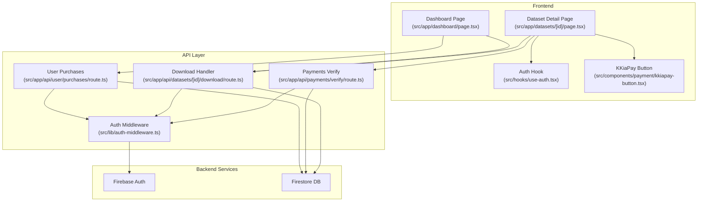
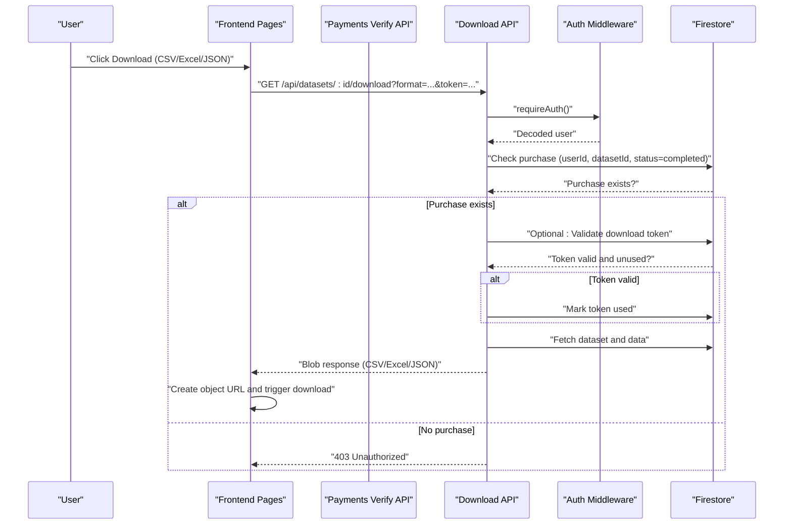
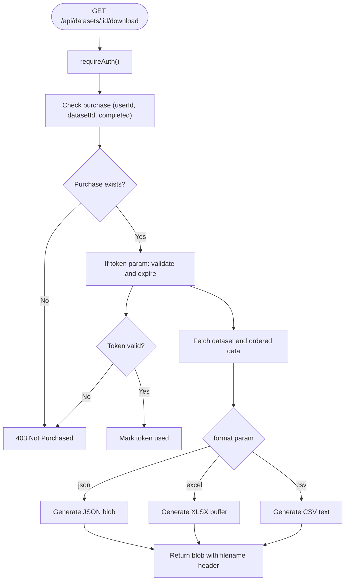
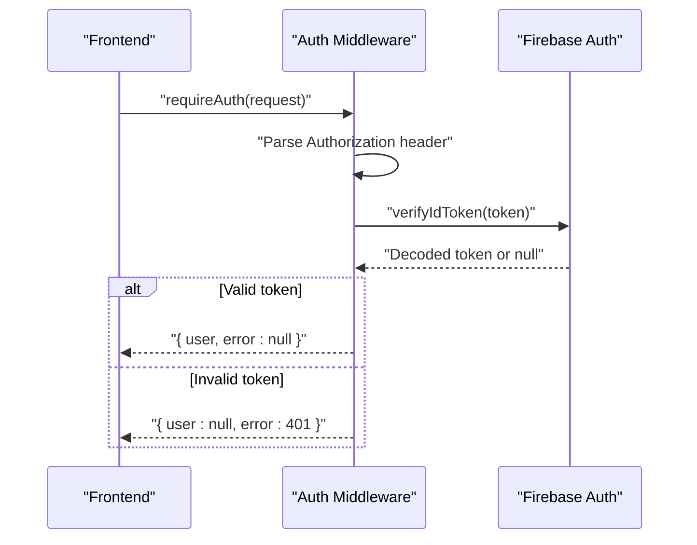
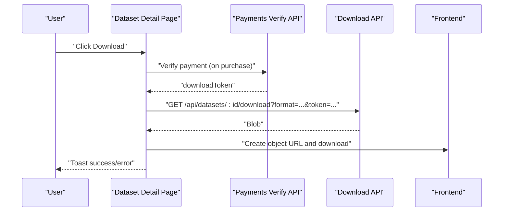
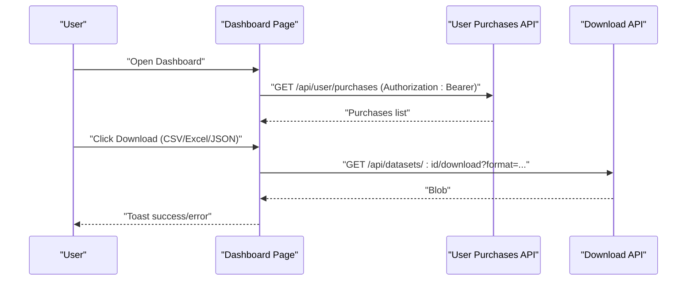
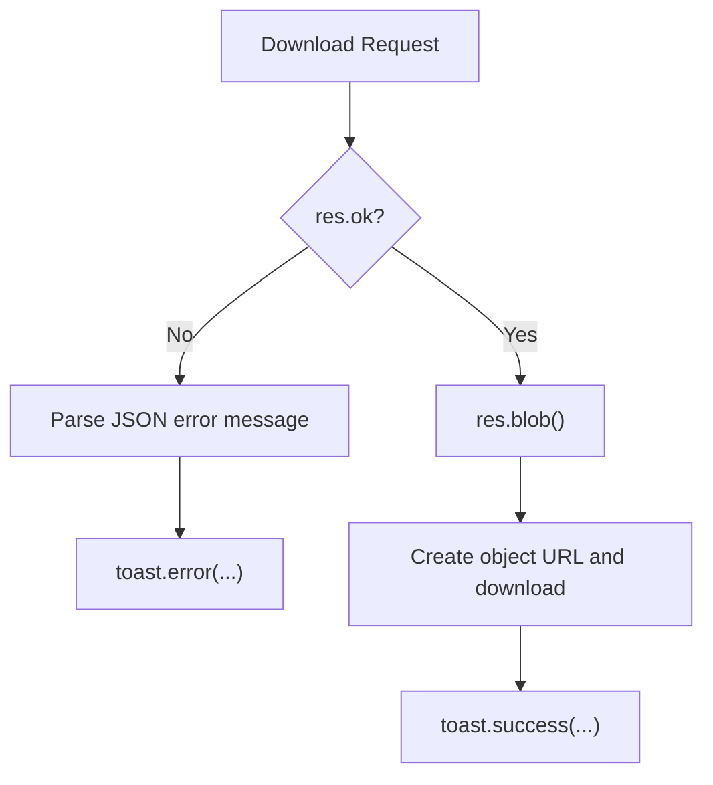
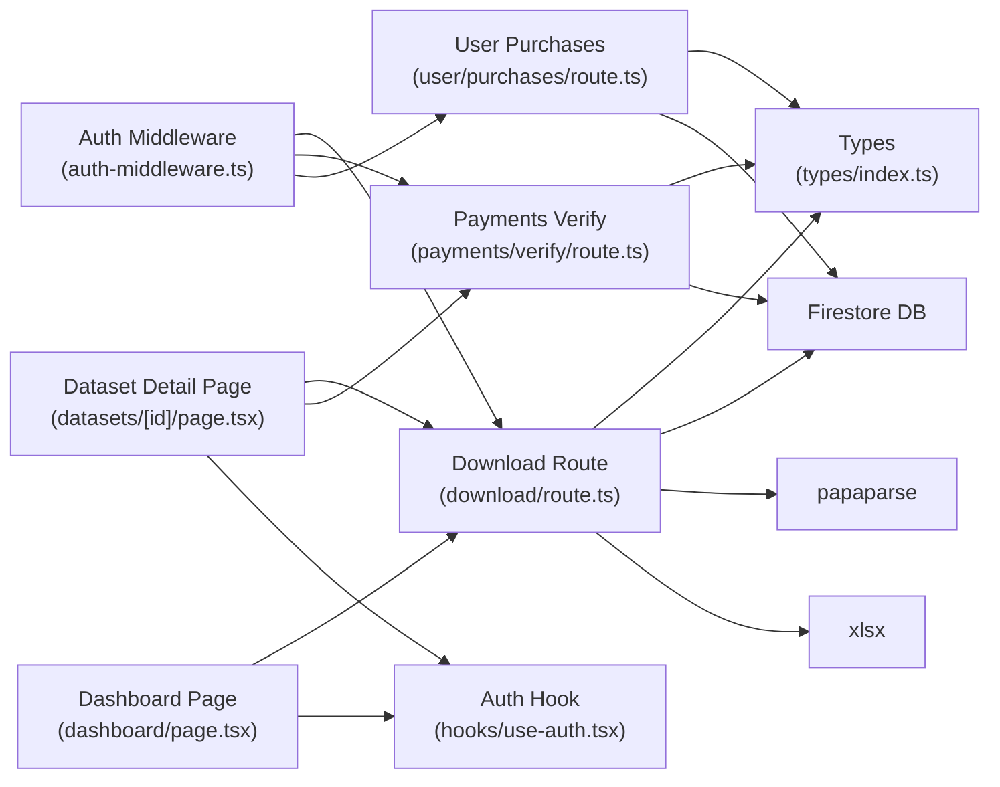

# Download System

<cite>
**Referenced Files in This Document**
- [src/app/api/datasets/[id]/download/route.ts](file://src/app/api/datasets/[id]/download/route.ts)
- [src/app/datasets/[id]/page.tsx](file://src/app/datasets/[id]/page.tsx)
- [src/app/dashboard/page.tsx](file://src/app/dashboard/page.tsx)
- [src/app/api/payments/verify/route.ts](file://src/app/api/payments/verify/route.ts)
- [src/app/api/user/purchases/route.ts](file://src/app/api/user/purchases/route.ts)
- [src/lib/auth-middleware.ts](file://src/lib/auth-middleware.ts)
- [src/hooks/use-auth.tsx](file://src/hooks/use-auth.tsx)
- [src/components/payment/kkiapay-button.tsx](file://src/components/payment/kkiapay-button.tsx)
- [src/types/index.ts](file://src/types/index.ts)
</cite>

## Table of Contents
1. [Introduction](#introduction)
2. [Project Structure](#project-structure)
3. [Core Components](#core-components)
4. [Architecture Overview](#architecture-overview)
5. [Detailed Component Analysis](#detailed-component-analysis)
6. [Dependency Analysis](#dependency-analysis)
7. [Performance Considerations](#performance-considerations)
8. [Troubleshooting Guide](#troubleshooting-guide)
9. [Conclusion](#conclusion)

## Introduction
This document explains the dataset download system within the user dashboard. It covers how users purchase datasets, how download access is granted, and how downloads are processed securely. The system supports multiple export formats (CSV, Excel, JSON), integrates with a token-based authorization mechanism, and ensures users can only download datasets they have purchased. It also documents the frontend download handlers, error handling with toast notifications, and security considerations for file delivery.

## Project Structure
The download system spans frontend pages, API routes, authentication middleware, and payment verification. Key areas:
- Frontend dataset detail page and dashboard for initiating downloads
- API endpoints for dataset metadata, purchases, payment verification, and downloads
- Authentication middleware for Bearer token verification
- Payment integration for purchase completion and token issuance

**Diagram sources**
- [src/app/datasets/[id]/page.tsx:1-382](file://src/app/datasets/[id]/page.tsx#L1-L382)
- [src/app/dashboard/page.tsx:1-313](file://src/app/dashboard/page.tsx#L1-L313)
- [src/app/api/payments/verify/route.ts:1-135](file://src/app/api/payments/verify/route.ts#L1-L135)
- [src/app/api/user/purchases/route.ts:1-31](file://src/app/api/user/purchases/route.ts#L1-L31)
- [src/app/api/datasets/[id]/download/route.ts:1-148](file://src/app/api/datasets/[id]/download/route.ts#L1-L148)
- [src/lib/auth-middleware.ts:1-48](file://src/lib/auth-middleware.ts#L1-L48)
- [src/hooks/use-auth.tsx:1-117](file://src/hooks/use-auth.tsx#L1-L117)
- [src/components/payment/kkiapay-button.tsx:1-110](file://src/components/payment/kkiapay-button.tsx#L1-L110)

**Section sources**
- [src/app/datasets/[id]/page.tsx:1-382](file://src/app/datasets/[id]/page.tsx#L1-L382)
- [src/app/dashboard/page.tsx:1-313](file://src/app/dashboard/page.tsx#L1-L313)
- [src/app/api/payments/verify/route.ts:1-135](file://src/app/api/payments/verify/route.ts#L1-L135)
- [src/app/api/user/purchases/route.ts:1-31](file://src/app/api/user/purchases/route.ts#L1-L31)
- [src/app/api/datasets/[id]/download/route.ts:1-148](file://src/app/api/datasets/[id]/download/route.ts#L1-L148)
- [src/lib/auth-middleware.ts:1-48](file://src/lib/auth-middleware.ts#L1-L48)
- [src/hooks/use-auth.tsx:1-117](file://src/hooks/use-auth.tsx#L1-L117)
- [src/components/payment/kkiapay-button.tsx:1-110](file://src/components/payment/kkiapay-button.tsx#L1-L110)

## Core Components
- Token-based authentication: Bearer tokens validated against Firebase Authentication via the auth middleware.
- Purchase verification: Payments are verified and a purchase record is created upon successful payment.
- Download token issuance: Upon successful purchase verification, a temporary download token is generated and stored for 24 hours.
- Download handler: Validates authentication and purchase, optionally validates a download token, builds requested format, and returns a downloadable file.
- Frontend download handlers: Initiate downloads with proper headers, construct URLs with format and optional token, and trigger browser downloads.
- Error handling: Centralized error responses and user feedback via toast notifications.

**Section sources**
- [src/lib/auth-middleware.ts:19-28](file://src/lib/auth-middleware.ts#L19-L28)
- [src/app/api/payments/verify/route.ts:112-126](file://src/app/api/payments/verify/route.ts#L112-L126)
- [src/app/api/datasets/[id]/download/route.ts:38-68](file://src/app/api/datasets/[id]/download/route.ts#L38-L68)
- [src/app/datasets/[id]/page.tsx:122-162](file://src/app/datasets/[id]/page.tsx#L122-L162)
- [src/app/dashboard/page.tsx:68-103](file://src/app/dashboard/page.tsx#L68-L103)

## Architecture Overview
The download pipeline integrates purchase completion, token issuance, and secure file delivery.

**Diagram sources**
- [src/app/api/datasets/[id]/download/route.ts:8-147](file://src/app/api/datasets/[id]/download/route.ts#L8-L147)
- [src/lib/auth-middleware.ts:19-28](file://src/lib/auth-middleware.ts#L19-L28)
- [src/app/datasets/[id]/page.tsx:122-162](file://src/app/datasets/[id]/page.tsx#L122-L162)

## Detailed Component Analysis

### Download Handler Implementation
The download endpoint enforces authentication, verifies purchase, optionally validates a download token, retrieves dataset data, and generates the requested file format.

Key behaviors:
- Authentication: Uses Bearer token verification via the auth middleware.
- Purchase validation: Confirms a completed purchase for the dataset by the current user.
- Optional token validation: If a download token is present, checks validity, expiration, and marks it used.
- Data retrieval: Reads ordered rows from the dataset’s data subcollection; falls back to preview data if needed.
- Format generation:
  - JSON: Returns a JSON string with appropriate headers.
  - Excel: Converts JSON to an XLSX workbook and returns a binary buffer.
  - CSV: Unparses JSON to CSV and returns text/plain.
- File naming: Uses the dataset title with appropriate extension.
- Automatic download: Triggered on the frontend after receiving the blob.

**Diagram sources**
- [src/app/api/datasets/[id]/download/route.ts:8-147](file://src/app/api/datasets/[id]/download/route.ts#L8-L147)

**Section sources**
- [src/app/api/datasets/[id]/download/route.ts:8-147](file://src/app/api/datasets/[id]/download/route.ts#L8-L147)

### Token-Based Authentication System
The system uses Firebase ID tokens passed as Bearer tokens. The auth middleware decodes and validates the token, returning an error for invalid or missing tokens.

- Header requirement: Authorization: Bearer <token>
- Validation: Decodes via Firebase Admin and returns user context or 401.

**Diagram sources**
- [src/lib/auth-middleware.ts:4-28](file://src/lib/auth-middleware.ts#L4-L28)

**Section sources**
- [src/lib/auth-middleware.ts:4-28](file://src/lib/auth-middleware.ts#L4-L28)

### Download Initiation and File Delivery
Two frontend pages initiate downloads:
- Dataset detail page: On successful payment verification, a download token is stored and used for subsequent downloads.
- Dashboard page: Users can download datasets they purchased directly from their purchase history.

Both use the same pattern:
- Acquire a Firebase ID token via the auth hook.
- Construct the download URL with format and optional token.
- Send a request with Authorization: Bearer <token>.
- On success, convert the response to a Blob, create an object URL, and trigger a download anchor click.
- Provide user feedback via toast notifications.

**Diagram sources**
- [src/app/datasets/[id]/page.tsx:122-162](file://src/app/datasets/[id]/page.tsx#L122-L162)
- [src/app/api/payments/verify/route.ts:112-126](file://src/app/api/payments/verify/route.ts#L112-L126)
- [src/app/api/datasets/[id]/download/route.ts:8-147](file://src/app/api/datasets/[id]/download/route.ts#L8-L147)

**Section sources**
- [src/app/datasets/[id]/page.tsx:122-162](file://src/app/datasets/[id]/page.tsx#L122-L162)
- [src/app/dashboard/page.tsx:68-103](file://src/app/dashboard/page.tsx#L68-L103)

### Purchase History and Download Access
The purchase history page lists completed purchases and enables direct downloads. It fetches purchases using the user’s ID token and triggers downloads with the selected format.

- Purchase listing: GET /api/user/purchases with Authorization header.
- Download from history: GET /api/datasets/:id/download?format=...

**Diagram sources**
- [src/app/dashboard/page.tsx:44-66](file://src/app/dashboard/page.tsx#L44-L66)
- [src/app/api/user/purchases/route.ts:6-30](file://src/app/api/user/purchases/route.ts#L6-L30)
- [src/app/dashboard/page.tsx:68-103](file://src/app/dashboard/page.tsx#L68-L103)

**Section sources**
- [src/app/dashboard/page.tsx:44-66](file://src/app/dashboard/page.tsx#L44-L66)
- [src/app/api/user/purchases/route.ts:6-30](file://src/app/api/user/purchases/route.ts#L6-L30)

### Error Handling and User Feedback
- Backend errors: Standardized JSON responses with appropriate HTTP status codes (401, 403, 404, 500).
- Frontend errors: Parse error messages from the server and display via toast notifications; provide user-friendly messages for network failures.

**Diagram sources**
- [src/app/datasets/[id]/page.tsx:138-142](file://src/app/datasets/[id]/page.tsx#L138-L142)
- [src/app/dashboard/page.tsx:82-85](file://src/app/dashboard/page.tsx#L82-L85)

**Section sources**
- [src/app/datasets/[id]/page.tsx:138-142](file://src/app/datasets/[id]/page.tsx#L138-L142)
- [src/app/dashboard/page.tsx:82-85](file://src/app/dashboard/page.tsx#L82-L85)

### Download URL Construction and Parameter Handling
- Required parameters:
  - format: "csv" | "excel" | "json" (defaults to "csv")
  - token: optional download token issued after payment verification
- Headers:
  - Authorization: Bearer <Firebase ID token>
- Response processing:
  - On success: Convert response to Blob, create object URL, set download filename, trigger anchor click, revoke object URL
  - On failure: Parse error and show toast

**Section sources**
- [src/app/api/datasets/[id]/download/route.ts:14-16](file://src/app/api/datasets/[id]/download/route.ts#L14-L16)
- [src/app/datasets/[id]/page.tsx:131-136](file://src/app/datasets/[id]/page.tsx#L131-L136)
- [src/app/dashboard/page.tsx:77-80](file://src/app/dashboard/page.tsx#L77-L80)

### Browser Compatibility and Security Considerations
- Browser compatibility:
  - Blob and URL.createObjectURL are widely supported in modern browsers.
  - Anchor element download attribute is broadly supported.
- Security measures:
  - Authentication via Bearer tokens prevents unauthorized access.
  - Purchase verification ensures only paid users can download.
  - Optional download tokens add an extra layer; they are single-use and expire after 24 hours.
  - Content-Disposition headers specify filenames to avoid unexpected browser behavior.

**Section sources**
- [src/app/api/datasets/[id]/download/route.ts:108-139](file://src/app/api/datasets/[id]/download/route.ts#L108-L139)
- [src/app/api/payments/verify/route.ts:112-120](file://src/app/api/payments/verify/route.ts#L112-L120)

## Dependency Analysis
The download system relies on several modules and APIs:

**Diagram sources**
- [src/lib/auth-middleware.ts:1-48](file://src/lib/auth-middleware.ts#L1-L48)
- [src/app/api/datasets/[id]/download/route.ts:1-148](file://src/app/api/datasets/[id]/download/route.ts#L1-L148)
- [src/app/api/payments/verify/route.ts:1-135](file://src/app/api/payments/verify/route.ts#L1-L135)
- [src/app/api/user/purchases/route.ts:1-31](file://src/app/api/user/purchases/route.ts#L1-L31)
- [src/types/index.ts:1-90](file://src/types/index.ts#L1-L90)
- [src/app/datasets/[id]/page.tsx:1-382](file://src/app/datasets/[id]/page.tsx#L1-L382)
- [src/app/dashboard/page.tsx:1-313](file://src/app/dashboard/page.tsx#L1-L313)
- [src/hooks/use-auth.tsx:1-117](file://src/hooks/use-auth.tsx#L1-L117)

**Section sources**
- [src/lib/auth-middleware.ts:1-48](file://src/lib/auth-middleware.ts#L1-L48)
- [src/app/api/datasets/[id]/download/route.ts:1-148](file://src/app/api/datasets/[id]/download/route.ts#L1-L148)
- [src/app/api/payments/verify/route.ts:1-135](file://src/app/api/payments/verify/route.ts#L1-L135)
- [src/app/api/user/purchases/route.ts:1-31](file://src/app/api/user/purchases/route.ts#L1-L31)
- [src/types/index.ts:1-90](file://src/types/index.ts#L1-L90)
- [src/app/datasets/[id]/page.tsx:1-382](file://src/app/datasets/[id]/page.tsx#L1-L382)
- [src/app/dashboard/page.tsx:1-313](file://src/app/dashboard/page.tsx#L1-L313)
- [src/hooks/use-auth.tsx:1-117](file://src/hooks/use-auth.tsx#L1-L117)

## Performance Considerations
- Data retrieval: The handler reads ordered rows from the dataset’s data subcollection. For very large datasets, consider pagination or streaming to reduce memory usage.
- Format generation: CSV and JSON generation are client-side; Excel generation uses xlsx. For extremely large datasets, Excel may be more efficient for downstream processing but increases client CPU usage.
- Token usage: Download tokens are single-use and expire after 24 hours, reducing repeated validation overhead.

## Troubleshooting Guide
Common issues and resolutions:
- 401 Unauthorized: Ensure the user is signed in and the Authorization header contains a valid Bearer token.
- 403 Not Purchased: The user must complete a purchase for the dataset; verify the purchase status is "completed".
- 403 Invalid or Expired Token: If using a download token, regenerate it by completing payment verification again.
- 404 Dataset Not Found: The dataset ID may be incorrect or the dataset may have been removed.
- 500 Generation Failure: Server-side error during file generation; retry or contact support.
- Frontend download fails silently: Confirm the response is a Blob and that object URL creation and anchor download are executed successfully.

**Section sources**
- [src/app/api/datasets/[id]/download/route.ts:31-64](file://src/app/api/datasets/[id]/download/route.ts#L31-L64)
- [src/app/datasets/[id]/page.tsx:138-142](file://src/app/datasets/[id]/page.tsx#L138-L142)
- [src/app/dashboard/page.tsx:82-85](file://src/app/dashboard/page.tsx#L82-L85)

## Conclusion
The dataset download system combines robust authentication, purchase verification, and optional token-based access to securely deliver datasets in multiple formats. The frontend provides seamless download experiences with clear user feedback, while the backend enforces access controls and delivers appropriately formatted files. Extending support for larger datasets and optimizing format generation can further improve performance.