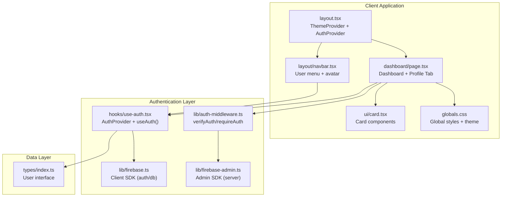
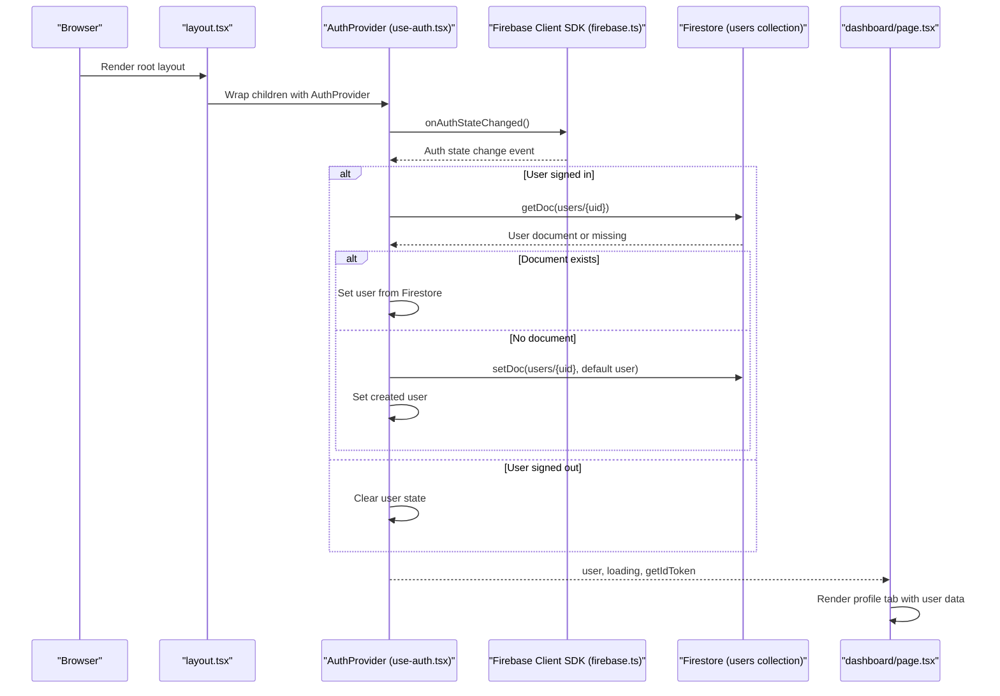
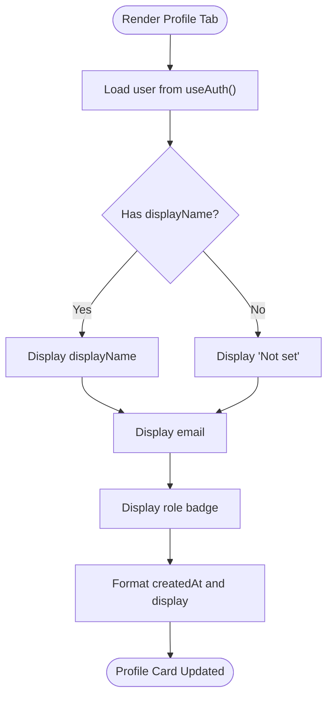
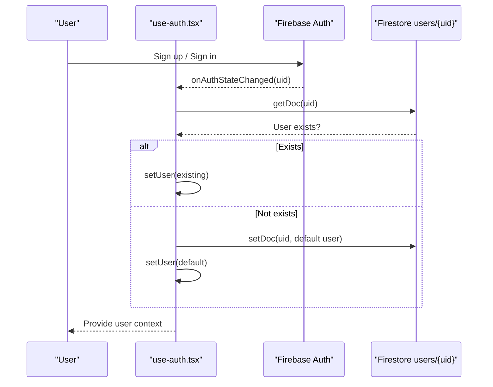
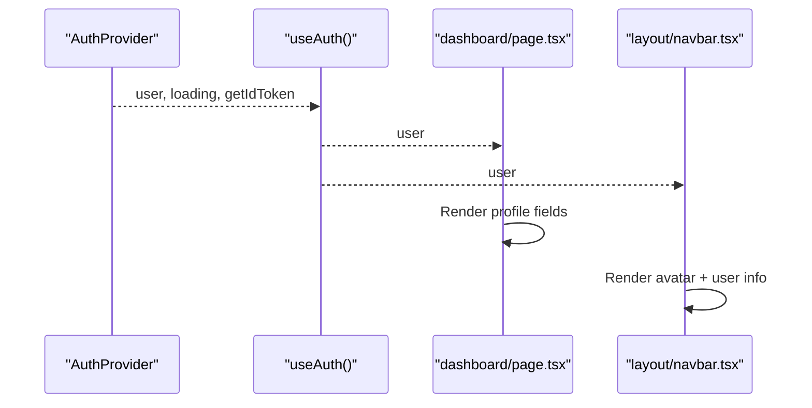
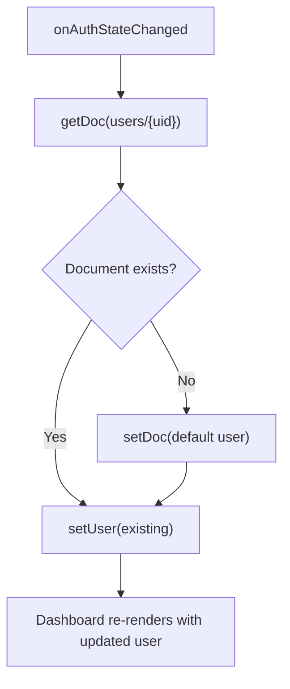
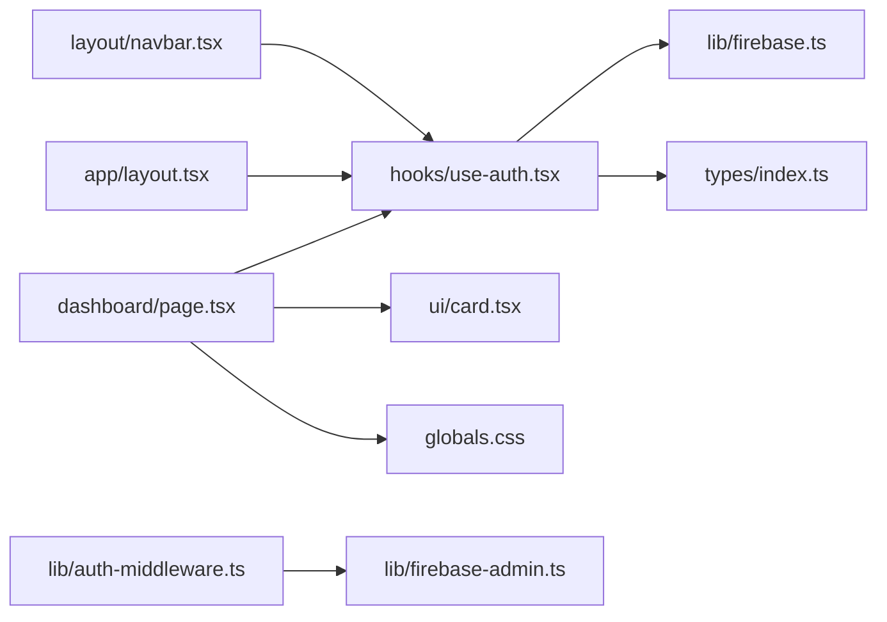

# Profile Management

<cite>
**Referenced Files in This Document**
- [src/app/dashboard/page.tsx](file://src/app/dashboard/page.tsx)
- [src/hooks/use-auth.tsx](file://src/hooks/use-auth.tsx)
- [src/lib/firebase.ts](file://src/lib/firebase.ts)
- [src/lib/firebase-admin.ts](file://src/lib/firebase-admin.ts)
- [src/lib/auth-middleware.ts](file://src/lib/auth-middleware.ts)
- [src/components/ui/card.tsx](file://src/components/ui/card.tsx)
- [src/components/layout/navbar.tsx](file://src/components/layout/navbar.tsx)
- [src/app/layout.tsx](file://src/app/layout.tsx)
- [src/types/index.ts](file://src/types/index.ts)
- [src/app/globals.css](file://src/app/globals.css)
</cite>

## Table of Contents
1. [Introduction](#introduction)
2. [Project Structure](#project-structure)
3. [Core Components](#core-components)
4. [Architecture Overview](#architecture-overview)
5. [Detailed Component Analysis](#detailed-component-analysis)
6. [Dependency Analysis](#dependency-analysis)
7. [Performance Considerations](#performance-considerations)
8. [Accessibility Considerations](#accessibility-considerations)
9. [Responsive Design](#responsive-design)
10. [Troubleshooting Guide](#troubleshooting-guide)
11. [Conclusion](#conclusion)

## Introduction
This document provides comprehensive documentation for the user profile management section in Datafrica's dashboard. It explains how profile information (name, email, role, and membership date) is retrieved from Firebase Authentication and Firestore, displayed in the dashboard, and refreshed when changes occur. It also covers the integration with Firebase authentication, the profile information cards and layout structure, the data flow from authentication to the dashboard, refresh mechanisms, accessibility considerations, and responsive design across screen sizes.

## Project Structure
The profile management functionality spans several key areas:
- Authentication provider and hooks that manage Firebase Authentication state and Firestore user profiles
- Dashboard page that renders profile information and integrates with the authentication context
- UI components for cards and layout
- Global styles and theme provider for responsive design
- Types that define the user model and other domain entities

**Diagram sources**
- [src/app/layout.tsx:31-46](file://src/app/layout.tsx#L31-L46)
- [src/app/dashboard/page.tsx:32-312](file://src/app/dashboard/page.tsx#L32-L312)
- [src/components/layout/navbar.tsx:18-166](file://src/components/layout/navbar.tsx#L18-L166)
- [src/hooks/use-auth.tsx:34-108](file://src/hooks/use-auth.tsx#L34-L108)
- [src/lib/firebase.ts:16-22](file://src/lib/firebase.ts#L16-L22)
- [src/lib/firebase-admin.ts:12-49](file://src/lib/firebase-admin.ts#L12-L49)
- [src/lib/auth-middleware.ts:4-28](file://src/lib/auth-middleware.ts#L4-L28)
- [src/types/index.ts:3-9](file://src/types/index.ts#L3-L9)

**Section sources**
- [src/app/layout.tsx:31-46](file://src/app/layout.tsx#L31-L46)
- [src/app/dashboard/page.tsx:32-312](file://src/app/dashboard/page.tsx#L32-L312)
- [src/components/layout/navbar.tsx:18-166](file://src/components/layout/navbar.tsx#L18-L166)
- [src/hooks/use-auth.tsx:34-108](file://src/hooks/use-auth.tsx#L34-L108)
- [src/lib/firebase.ts:16-22](file://src/lib/firebase.ts#L16-L22)
- [src/lib/firebase-admin.ts:12-49](file://src/lib/firebase-admin.ts#L12-L49)
- [src/lib/auth-middleware.ts:4-28](file://src/lib/auth-middleware.ts#L4-L28)
- [src/types/index.ts:3-9](file://src/types/index.ts#L3-L9)

## Core Components
- Authentication Provider and Hook
  - Provides user state, Firebase user, loading state, sign-in/sign-up/sign-out actions, and ID token retrieval
  - Integrates Firebase Authentication with Firestore to maintain a normalized user profile
- Dashboard Page
  - Renders profile information in a dedicated tab
  - Displays name, email, role, and membership date using the authenticated user context
  - Includes a stats bar with user email and role visible outside the profile tab
- UI Cards and Layout
  - Uses reusable Card components for structured profile information display
  - Applies global Tailwind-based theme and responsive utilities
- Navbar Integration
  - Shows user avatar and basic profile info in the navigation dropdown
- Types
  - Defines the User interface used across the application

Key implementation references:
- Authentication provider and user profile creation/retrieval: [src/hooks/use-auth.tsx:39-67](file://src/hooks/use-auth.tsx#L39-L67)
- Profile tab rendering in dashboard: [src/app/dashboard/page.tsx:277-308](file://src/app/dashboard/page.tsx#L277-L308)
- Stats bar with email and role: [src/app/dashboard/page.tsx:127-167](file://src/app/dashboard/page.tsx#L127-L167)
- Navbar avatar fallback and user info: [src/components/layout/navbar.tsx:50-67](file://src/components/layout/navbar.tsx#L50-L67)
- User type definition: [src/types/index.ts:3-9](file://src/types/index.ts#L3-L9)

**Section sources**
- [src/hooks/use-auth.tsx:39-67](file://src/hooks/use-auth.tsx#L39-L67)
- [src/app/dashboard/page.tsx:127-167](file://src/app/dashboard/page.tsx#L127-L167)
- [src/app/dashboard/page.tsx:277-308](file://src/app/dashboard/page.tsx#L277-L308)
- [src/components/layout/navbar.tsx:50-67](file://src/components/layout/navbar.tsx#L50-L67)
- [src/types/index.ts:3-9](file://src/types/index.ts#L3-L9)

## Architecture Overview
The profile management architecture follows a clear separation of concerns:
- Client SDK initializes Firebase Authentication and Firestore
- The AuthProvider listens to authentication state changes and synchronizes Firestore user documents
- The dashboard consumes the authenticated user context to render profile information
- The navbar displays user avatar and basic info using the same context
- Global theme and responsive styles ensure consistent presentation

**Diagram sources**
- [src/app/layout.tsx:38-45](file://src/app/layout.tsx#L38-L45)
- [src/hooks/use-auth.tsx:39-67](file://src/hooks/use-auth.tsx#L39-L67)
- [src/lib/firebase.ts:16-22](file://src/lib/firebase.ts#L16-L22)

**Section sources**
- [src/app/layout.tsx:38-45](file://src/app/layout.tsx#L38-L45)
- [src/hooks/use-auth.tsx:39-67](file://src/hooks/use-auth.tsx#L39-L67)
- [src/lib/firebase.ts:16-22](file://src/lib/firebase.ts#L16-L22)

## Detailed Component Analysis

### Profile Information Display in Dashboard
The dashboard presents profile information in a dedicated tab with a clean, structured layout:
- Name: Displays user display name or a placeholder if not set
- Email: Displays the authenticated user's email
- Role: Shows the user's role with a secondary badge
- Member since: Displays the account creation date formatted as a readable date

Rendering logic and structure:
- Profile tab container: [src/app/dashboard/page.tsx:277-308](file://src/app/dashboard/page.tsx#L277-L308)
- Name field: [src/app/dashboard/page.tsx:284-285](file://src/app/dashboard/page.tsx#L284-L285)
- Email field: [src/app/dashboard/page.tsx:289-290](file://src/app/dashboard/page.tsx#L289-L290)
- Role field: [src/app/dashboard/page.tsx:294-297](file://src/app/dashboard/page.tsx#L294-L297)
- Membership date: [src/app/dashboard/page.tsx:301-304](file://src/app/dashboard/page.tsx#L301-L304)
- Card components used: [src/components/ui/card.tsx:5-103](file://src/components/ui/card.tsx#L5-L103)

**Diagram sources**
- [src/app/dashboard/page.tsx:277-308](file://src/app/dashboard/page.tsx#L277-L308)

**Section sources**
- [src/app/dashboard/page.tsx:277-308](file://src/app/dashboard/page.tsx#L277-L308)
- [src/components/ui/card.tsx:5-103](file://src/components/ui/card.tsx#L5-L103)

### Authentication Integration with Firebase
The authentication system integrates Firebase Authentication with Firestore to maintain a normalized user profile:
- onAuthStateChanged listener updates local state and Firestore synchronization
- On sign-up, a Firestore document is created with default role and timestamps
- On subsequent visits, the Firestore document is retrieved and merged into the user context
- getIdToken is exposed for protected API calls

Key references:
- Auth state subscription and Firestore sync: [src/hooks/use-auth.tsx:39-67](file://src/hooks/use-auth.tsx#L39-L67)
- Sign-up flow and Firestore write: [src/hooks/use-auth.tsx:69-82](file://src/hooks/use-auth.tsx#L69-L82)
- User type fields (role, createdAt): [src/types/index.ts:3-9](file://src/types/index.ts#L3-L9)
- Client SDK initialization: [src/lib/firebase.ts:16-22](file://src/lib/firebase.ts#L16-L22)

**Diagram sources**
- [src/hooks/use-auth.tsx:39-67](file://src/hooks/use-auth.tsx#L39-L67)
- [src/lib/firebase.ts:16-22](file://src/lib/firebase.ts#L16-L22)
- [src/types/index.ts:3-9](file://src/types/index.ts#L3-L9)

**Section sources**
- [src/hooks/use-auth.tsx:39-67](file://src/hooks/use-auth.tsx#L39-L67)
- [src/hooks/use-auth.tsx:69-82](file://src/hooks/use-auth.tsx#L69-L82)
- [src/lib/firebase.ts:16-22](file://src/lib/firebase.ts#L16-L22)
- [src/types/index.ts:3-9](file://src/types/index.ts#L3-L9)

### Profile Data Flow: Authentication to Dashboard
The profile data flows from Firebase Authentication and Firestore to the dashboard UI:
- AuthProvider establishes the user context with Firestore-backed profile data
- Dashboard reads user from useAuth() and renders profile information
- Navbar also consumes the same context for avatar and user info

References:
- AuthProvider context export: [src/hooks/use-auth.tsx:101-107](file://src/hooks/use-auth.tsx#L101-L107)
- Dashboard consuming user context: [src/app/dashboard/page.tsx:34](file://src/app/dashboard/page.tsx#L34)
- Navbar consuming user context: [src/components/layout/navbar.tsx:19](file://src/components/layout/navbar.tsx#L19)

**Diagram sources**
- [src/hooks/use-auth.tsx:101-107](file://src/hooks/use-auth.tsx#L101-L107)
- [src/app/dashboard/page.tsx:34](file://src/app/dashboard/page.tsx#L34)
- [src/components/layout/navbar.tsx:19](file://src/components/layout/navbar.tsx#L19)

**Section sources**
- [src/hooks/use-auth.tsx:101-107](file://src/hooks/use-auth.tsx#L101-L107)
- [src/app/dashboard/page.tsx:34](file://src/app/dashboard/page.tsx#L34)
- [src/components/layout/navbar.tsx:19](file://src/components/layout/navbar.tsx#L19)

### Profile Information Refresh Mechanism
Profile data refresh occurs automatically via the AuthProvider:
- onAuthStateChanged triggers Firestore synchronization on every authentication state change
- If a user document does not exist, it is created with defaults during the first login
- Subsequent logins fetch the stored profile from Firestore
- The dashboard re-renders when the user context updates

References:
- Auth state subscription and Firestore sync: [src/hooks/use-auth.tsx:39-67](file://src/hooks/use-auth.tsx#L39-L67)
- Sign-up creates user document: [src/hooks/use-auth.tsx:69-82](file://src/hooks/use-auth.tsx#L69-L82)

**Diagram sources**
- [src/hooks/use-auth.tsx:39-67](file://src/hooks/use-auth.tsx#L39-L67)

**Section sources**
- [src/hooks/use-auth.tsx:39-67](file://src/hooks/use-auth.tsx#L39-L67)
- [src/hooks/use-auth.tsx:69-82](file://src/hooks/use-auth.tsx#L69-L82)

## Dependency Analysis
The profile management module depends on:
- Firebase Client SDK for authentication and Firestore
- Firebase Admin SDK for server-side verification in API routes
- UI primitives for cards and layout
- Global theme and responsive utilities

**Diagram sources**
- [src/app/dashboard/page.tsx:32-312](file://src/app/dashboard/page.tsx#L32-L312)
- [src/hooks/use-auth.tsx:34-108](file://src/hooks/use-auth.tsx#L34-L108)
- [src/components/ui/card.tsx:5-103](file://src/components/ui/card.tsx#L5-L103)
- [src/app/globals.css:1-120](file://src/app/globals.css#L1-L120)
- [src/lib/firebase.ts:16-22](file://src/lib/firebase.ts#L16-L22)
- [src/types/index.ts:3-9](file://src/types/index.ts#L3-L9)
- [src/lib/auth-middleware.ts:4-28](file://src/lib/auth-middleware.ts#L4-L28)
- [src/lib/firebase-admin.ts:12-49](file://src/lib/firebase-admin.ts#L12-L49)
- [src/components/layout/navbar.tsx:18-166](file://src/components/layout/navbar.tsx#L18-L166)
- [src/app/layout.tsx:38-45](file://src/app/layout.tsx#L38-L45)

**Section sources**
- [src/app/dashboard/page.tsx:32-312](file://src/app/dashboard/page.tsx#L32-L312)
- [src/hooks/use-auth.tsx:34-108](file://src/hooks/use-auth.tsx#L34-L108)
- [src/components/ui/card.tsx:5-103](file://src/components/ui/card.tsx#L5-L103)
- [src/app/globals.css:1-120](file://src/app/globals.css#L1-L120)
- [src/lib/firebase.ts:16-22](file://src/lib/firebase.ts#L16-L22)
- [src/types/index.ts:3-9](file://src/types/index.ts#L3-L9)
- [src/lib/auth-middleware.ts:4-28](file://src/lib/auth-middleware.ts#L4-L28)
- [src/lib/firebase-admin.ts:12-49](file://src/lib/firebase-admin.ts#L12-L49)
- [src/components/layout/navbar.tsx:18-166](file://src/components/layout/navbar.tsx#L18-L166)
- [src/app/layout.tsx:38-45](file://src/app/layout.tsx#L38-L45)

## Performance Considerations
- Authentication state changes trigger Firestore reads/writes; keep user documents minimal to reduce latency
- Use getIdToken judiciously; cache tokens per session to avoid frequent re-fetches
- Debounce or batch UI updates when multiple state changes occur rapidly
- Lazy load heavy assets; profile images should be optimized and cached

## Accessibility Considerations
- Profile labels use semantic headings and paragraphs for screen readers
- Color contrast is maintained via theme variables ensuring readability in light and dark modes
- Interactive elements (buttons, links) are keyboard focusable and have sufficient touch targets
- Role badges and separators improve visual scanning of information

Recommendations:
- Ensure all interactive elements in the profile tab (e.g., edit actions if added) support keyboard navigation
- Provide ARIA labels for icons and badges where context is not purely decorative
- Test with screen readers and keyboard-only navigation to confirm usability

## Responsive Design
The profile cards and dashboard layout adapt across screen sizes:
- Grid-based stats section uses responsive column counts (single column on small screens, three columns on medium and larger)
- Profile card content stacks vertically on smaller screens while maintaining spacing and alignment
- Navbar collapses into a mobile-friendly menu with appropriate spacing and touch targets

References:
- Responsive grid for stats: [src/app/dashboard/page.tsx:127](file://src/app/dashboard/page.tsx#L127)
- Profile card layout: [src/app/dashboard/page.tsx:277-308](file://src/app/dashboard/page.tsx#L277-L308)
- Mobile navbar toggle and layout: [src/components/layout/navbar.tsx:96-163](file://src/components/layout/navbar.tsx#L96-L163)
- Global theme and variables: [src/app/globals.css:46-113](file://src/app/globals.css#L46-L113)

**Section sources**
- [src/app/dashboard/page.tsx:127](file://src/app/dashboard/page.tsx#L127)
- [src/app/dashboard/page.tsx:277-308](file://src/app/dashboard/page.tsx#L277-L308)
- [src/components/layout/navbar.tsx:96-163](file://src/components/layout/navbar.tsx#L96-L163)
- [src/app/globals.css:46-113](file://src/app/globals.css#L46-L113)

## Troubleshooting Guide
Common issues and resolutions:
- User not authenticated
  - Cause: Auth state not established or expired session
  - Resolution: Redirect to login; ensure AuthProvider wraps the application
  - Reference: [src/app/layout.tsx:38-45](file://src/app/layout.tsx#L38-L45)
- Missing profile data
  - Cause: First-time sign-up without Firestore document
  - Resolution: AuthProvider creates default document on first login
  - Reference: [src/hooks/use-auth.tsx:48-58](file://src/hooks/use-auth.tsx#L48-L58)
- Unauthorized API calls
  - Cause: Missing or invalid ID token
  - Resolution: Use getIdToken from useAuth() before calling protected endpoints
  - Reference: [src/hooks/use-auth.tsx:94-99](file://src/hooks/use-auth.tsx#L94-L99)
- Role-based visibility
  - Cause: Admin-only routes not validated
  - Resolution: Use requireAdmin middleware in API routes
  - Reference: [src/lib/auth-middleware.ts:30-47](file://src/lib/auth-middleware.ts#L30-L47)

**Section sources**
- [src/app/layout.tsx:38-45](file://src/app/layout.tsx#L38-L45)
- [src/hooks/use-auth.tsx:48-58](file://src/hooks/use-auth.tsx#L48-L58)
- [src/hooks/use-auth.tsx:94-99](file://src/hooks/use-auth.tsx#L94-L99)
- [src/lib/auth-middleware.ts:30-47](file://src/lib/auth-middleware.ts#L30-L47)

## Conclusion
The profile management section in Datafrica’s dashboard leverages Firebase Authentication and Firestore to deliver a seamless user experience. The AuthProvider ensures consistent user state synchronization, while the dashboard and navbar present profile information in a responsive, accessible manner. The data flow from authentication to UI is straightforward, with automatic refresh on authentication state changes. Following the outlined best practices will help maintain reliability, performance, and inclusivity across devices and user needs.