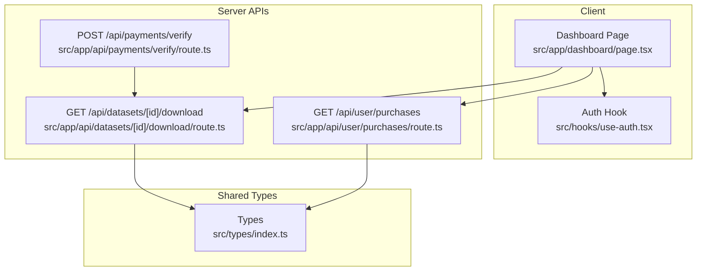
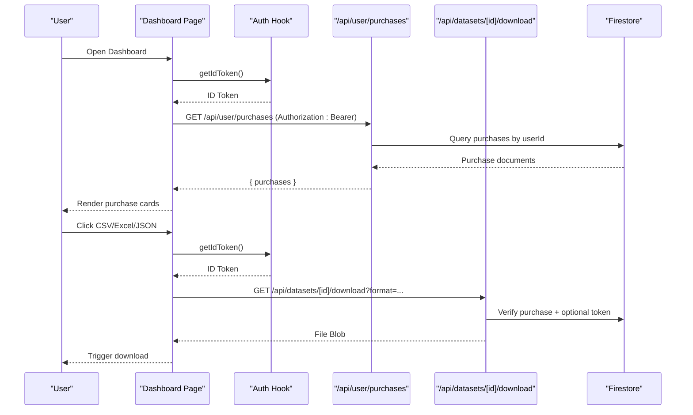
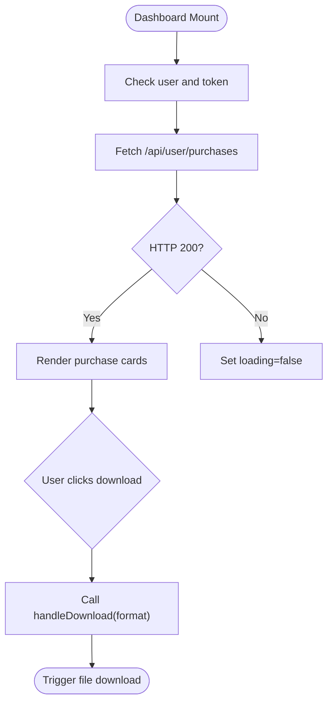
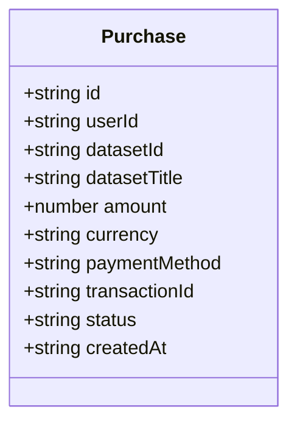
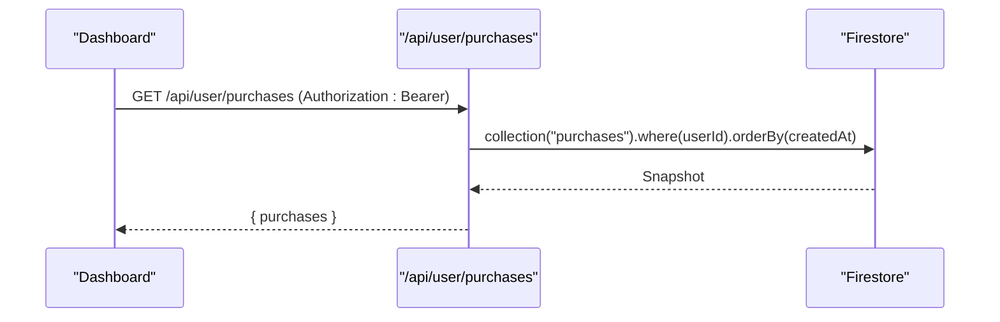
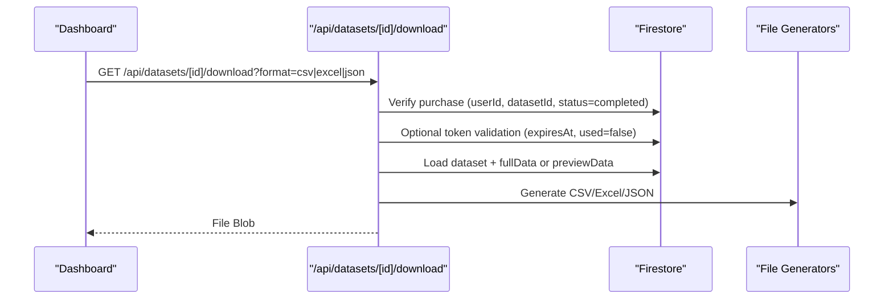
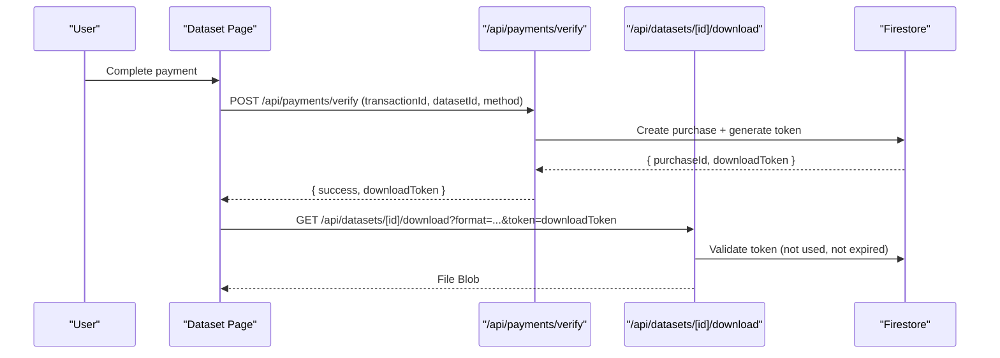
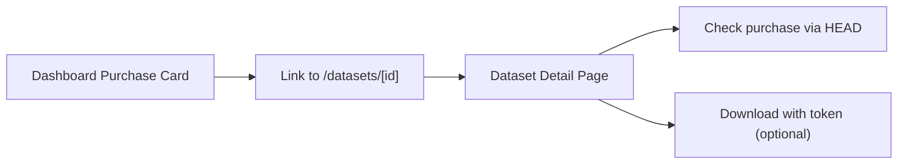
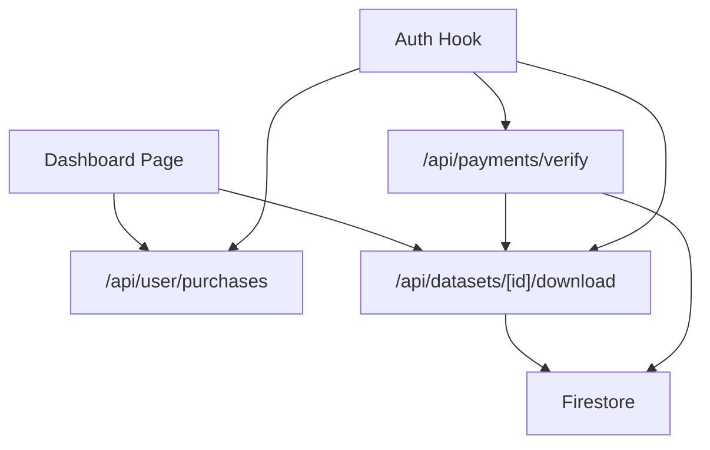

# Purchase History

<cite>
**Referenced Files in This Document**
- [dashboard/page.tsx](file://src/app/dashboard/page.tsx)
- [user/purchases/route.ts](file://src/app/api/user/purchases/route.ts)
- [datasets/[id]/download/route.ts](file://src/app/api/datasets/[id]/download/route.ts)
- [payments/verify/route.ts](file://src/app/api/payments/verify/route.ts)
- [types/index.ts](file://src/types/index.ts)
- [use-auth.tsx](file://src/hooks/use-auth.tsx)
- [datasets/[id]/page.tsx](file://src/app/datasets/[id]/page.tsx)
</cite>

## Table of Contents
1. [Introduction](#introduction)
2. [Project Structure](#project-structure)
3. [Core Components](#core-components)
4. [Architecture Overview](#architecture-overview)
5. [Detailed Component Analysis](#detailed-component-analysis)
6. [Dependency Analysis](#dependency-analysis)
7. [Performance Considerations](#performance-considerations)
8. [Troubleshooting Guide](#troubleshooting-guide)
9. [Conclusion](#conclusion)

## Introduction
This document explains the purchase history functionality in Datafrica's user dashboard. It covers how purchase records are fetched and displayed, the purchase card UI with status indicators and transaction details, the download system for CSV, Excel, and JSON formats, token-based authentication for downloads, and the navigation flow from purchases to dataset detail pages. It also documents empty state handling and error scenarios.

## Project Structure
The purchase history feature spans client-side UI, server-side APIs, and shared types:
- Client dashboard renders purchase cards and handles downloads
- Backend APIs fetch purchases, verify payments, and serve downloads
- Shared types define the purchase data model
- Authentication hook provides ID tokens for protected endpoints

**Diagram sources**
- [dashboard/page.tsx:1-313](file://src/app/dashboard/page.tsx#L1-L313)
- [user/purchases/route.ts:1-31](file://src/app/api/user/purchases/route.ts#L1-L31)
- [datasets/[id]/download/route.ts:1-148](file://src/app/api/datasets/[id]/download/route.ts#L1-L148)
- [payments/verify/route.ts:1-135](file://src/app/api/payments/verify/route.ts#L1-L135)
- [types/index.ts:30-41](file://src/types/index.ts#L30-L41)
- [use-auth.tsx:1-117](file://src/hooks/use-auth.tsx#L1-L117)

**Section sources**
- [dashboard/page.tsx:1-313](file://src/app/dashboard/page.tsx#L1-L313)
- [user/purchases/route.ts:1-31](file://src/app/api/user/purchases/route.ts#L1-L31)
- [datasets/[id]/download/route.ts:1-148](file://src/app/api/datasets/[id]/download/route.ts#L1-L148)
- [payments/verify/route.ts:1-135](file://src/app/api/payments/verify/route.ts#L1-L135)
- [types/index.ts:30-41](file://src/types/index.ts#L30-L41)
- [use-auth.tsx:1-117](file://src/hooks/use-auth.tsx#L1-L117)

## Core Components
- Purchase display and actions: The dashboard page renders purchase cards with dataset title, status badge, purchase date, amount, and action buttons for CSV, Excel, JSON, and navigation to dataset detail.
- Purchase history API: Fetches purchases for the authenticated user, ordered by creation date descending.
- Download API: Generates downloadable files (CSV, Excel, JSON) for purchased datasets, enforcing purchase verification and optional token-based access.
- Payment verification: Creates purchase records and generates a temporary download token upon successful payment verification.
- Authentication: Provides ID tokens for protected requests.

**Section sources**
- [dashboard/page.tsx:175-275](file://src/app/dashboard/page.tsx#L175-L275)
- [user/purchases/route.ts:5-30](file://src/app/api/user/purchases/route.ts#L5-L30)
- [datasets/[id]/download/route.ts:7-148](file://src/app/api/datasets/[id]/download/route.ts#L7-L148)
- [payments/verify/route.ts:6-135](file://src/app/api/payments/verify/route.ts#L6-L135)
- [types/index.ts:30-41](file://src/types/index.ts#L30-L41)
- [use-auth.tsx:94-99](file://src/hooks/use-auth.tsx#L94-L99)

## Architecture Overview
The purchase history system integrates the frontend dashboard with backend APIs and Firestore. The flow begins with the dashboard fetching purchases, then enabling downloads and navigation to dataset detail pages.

**Diagram sources**
- [dashboard/page.tsx:44-103](file://src/app/dashboard/page.tsx#L44-L103)
- [user/purchases/route.ts:6-22](file://src/app/api/user/purchases/route.ts#L6-L22)
- [datasets/[id]/download/route.ts:8-68](file://src/app/api/datasets/[id]/download/route.ts#L8-L68)
- [use-auth.tsx:94-99](file://src/hooks/use-auth.tsx#L94-L99)

## Detailed Component Analysis

### Purchase History Display (Dashboard)
The dashboard page displays a tabbed interface with a "My Purchases" tab. It:
- Fetches purchases using an authenticated request to the purchases API
- Renders each purchase as a card containing:
  - Dataset title
  - Status badge (completed/pending/failed)
  - Purchase date
  - Amount and currency
  - Action buttons for CSV, Excel, JSON downloads
  - Navigation to dataset detail page
- Handles loading states with skeletons and empty state with a prompt to browse datasets

**Diagram sources**
- [dashboard/page.tsx:32-103](file://src/app/dashboard/page.tsx#L32-L103)
- [dashboard/page.tsx:175-275](file://src/app/dashboard/page.tsx#L175-L275)

**Section sources**
- [dashboard/page.tsx:32-103](file://src/app/dashboard/page.tsx#L32-L103)
- [dashboard/page.tsx:175-275](file://src/app/dashboard/page.tsx#L175-L275)

### Purchase Data Model
The purchase entity includes:
- Identifier, user identifier, dataset identifier, and dataset title
- Amount, currency, payment method, and transaction identifier
- Status (pending, completed, failed)
- Creation timestamp

**Diagram sources**
- [types/index.ts:30-41](file://src/types/index.ts#L30-L41)

**Section sources**
- [types/index.ts:30-41](file://src/types/index.ts#L30-L41)

### API: Fetch User Purchases
The purchases endpoint:
- Requires authentication
- Queries purchases for the current user ordered by creation date descending
- Returns a JSON payload with a purchases array

**Diagram sources**
- [user/purchases/route.ts:6-22](file://src/app/api/user/purchases/route.ts#L6-L22)

**Section sources**
- [user/purchases/route.ts:6-22](file://src/app/api/user/purchases/route.ts#L6-L22)

### API: Download Dataset Files
The download endpoint supports CSV, Excel, and JSON formats:
- Requires authentication
- Verifies the user purchased the dataset with status "completed"
- Optionally validates a download token if provided
- Generates the file from dataset data (fullData or previewData fallback)
- Records the download event
- Returns the file as a downloadable response

**Diagram sources**
- [datasets/[id]/download/route.ts:8-148](file://src/app/api/datasets/[id]/download/route.ts#L8-L148)

**Section sources**
- [datasets/[id]/download/route.ts:8-148](file://src/app/api/datasets/[id]/download/route.ts#L8-L148)

### Payment Verification and Download Token
After a successful payment:
- The payment verification endpoint creates a purchase record
- A temporary download token is generated and stored with expiration and usage flags
- The client receives the token and can pass it to the download endpoint

**Diagram sources**
- [payments/verify/route.ts:6-135](file://src/app/api/payments/verify/route.ts#L6-L135)
- [datasets/[id]/download/route.ts:38-68](file://src/app/api/datasets/[id]/download/route.ts#L38-L68)
- [datasets/[id]/page.tsx:84-120](file://src/app/datasets/[id]/page.tsx#L84-L120)

**Section sources**
- [payments/verify/route.ts:6-135](file://src/app/api/payments/verify/route.ts#L6-L135)
- [datasets/[id]/download/route.ts:38-68](file://src/app/api/datasets/[id]/download/route.ts#L38-L68)
- [datasets/[id]/page.tsx:84-120](file://src/app/datasets/[id]/page.tsx#L84-L120)

### Navigation Flow: From Purchases to Dataset Details
The dashboard purchase cards include a link to the dataset detail page. The dataset page:
- Checks if the user has already purchased the dataset
- Displays purchase status and download controls
- Uses the download token when available

**Diagram sources**
- [dashboard/page.tsx:252-256](file://src/app/dashboard/page.tsx#L252-L256)
- [datasets/[id]/page.tsx:61-82](file://src/app/datasets/[id]/page.tsx#L61-L82)
- [datasets/[id]/page.tsx:122-162](file://src/app/datasets/[id]/page.tsx#L122-L162)

**Section sources**
- [dashboard/page.tsx:252-256](file://src/app/dashboard/page.tsx#L252-L256)
- [datasets/[id]/page.tsx:61-82](file://src/app/datasets/[id]/page.tsx#L61-L82)
- [datasets/[id]/page.tsx:122-162](file://src/app/datasets/[id]/page.tsx#L122-L162)

## Dependency Analysis
Key dependencies and relationships:
- Dashboard depends on the purchases API and the download API
- Download API depends on Firestore for purchase verification and dataset data
- Payment verification creates purchase records and tokens used by the download API
- Authentication hook supplies ID tokens for protected endpoints

**Diagram sources**
- [dashboard/page.tsx:44-103](file://src/app/dashboard/page.tsx#L44-L103)
- [user/purchases/route.ts:6-22](file://src/app/api/user/purchases/route.ts#L6-L22)
- [datasets/[id]/download/route.ts:8-68](file://src/app/api/datasets/[id]/download/route.ts#L8-L68)
- [payments/verify/route.ts:6-135](file://src/app/api/payments/verify/route.ts#L6-L135)
- [use-auth.tsx:94-99](file://src/hooks/use-auth.tsx#L94-L99)

**Section sources**
- [dashboard/page.tsx:44-103](file://src/app/dashboard/page.tsx#L44-L103)
- [user/purchases/route.ts:6-22](file://src/app/api/user/purchases/route.ts#L6-L22)
- [datasets/[id]/download/route.ts:8-68](file://src/app/api/datasets/[id]/download/route.ts#L8-L68)
- [payments/verify/route.ts:6-135](file://src/app/api/payments/verify/route.ts#L6-L135)
- [use-auth.tsx:94-99](file://src/hooks/use-auth.tsx#L94-L99)

## Performance Considerations
- Purchase list ordering: The purchases API orders by creation date descending, minimizing UI sorting overhead.
- Download generation: File generation occurs server-side using streaming-friendly libraries; consider pagination for very large datasets if needed.
- Token lifecycle: Download tokens expire after 24 hours, reducing long-term storage and security risk.
- Client-side caching: Consider caching purchase lists per session to reduce repeated network calls.

## Troubleshooting Guide
Common issues and resolutions:
- Authentication failures:
  - Symptom: Requests to purchases/download fail with unauthorized errors.
  - Cause: Missing or invalid ID token.
  - Resolution: Ensure the user is signed in and the auth hook provides a token.
- Purchase not found:
  - Symptom: Download endpoint returns forbidden when requesting a file.
  - Cause: No completed purchase record for the user and dataset.
  - Resolution: Complete a purchase and verify payment.
- Expired or invalid token:
  - Symptom: Download fails with token-related error.
  - Cause: Token expired or already used.
  - Resolution: Request a new download token after successful payment verification.
- Network errors:
  - Symptom: Purchase list does not load or download fails silently.
  - Cause: Network issues or server errors.
  - Resolution: Retry after verifying connectivity; check server logs for detailed errors.

**Section sources**
- [dashboard/page.tsx:82-86](file://src/app/dashboard/page.tsx#L82-L86)
- [datasets/[id]/download/route.ts:31-36](file://src/app/api/datasets/[id]/download/route.ts#L31-L36)
- [datasets/[id]/download/route.ts:49-64](file://src/app/api/datasets/[id]/download/route.ts#L49-L64)
- [payments/verify/route.ts:127-133](file://src/app/api/payments/verify/route.ts#L127-L133)

## Conclusion
The purchase history system provides a robust, user-friendly way to view past purchases, download datasets in multiple formats, and navigate seamlessly to dataset detail pages. It enforces purchase verification and optional token-based access for secure downloads, while offering clear empty states and error feedback.