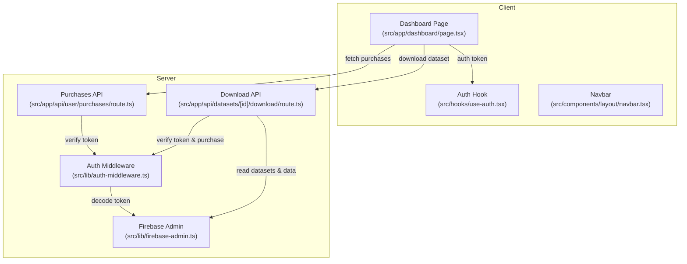
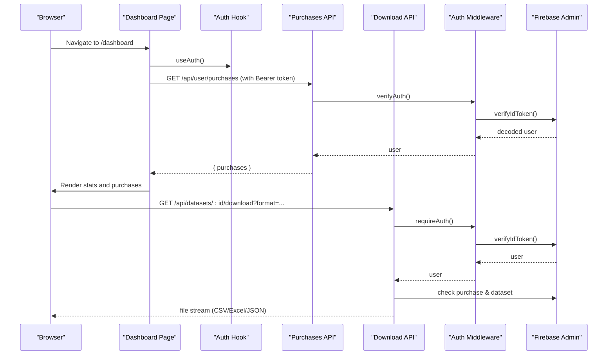
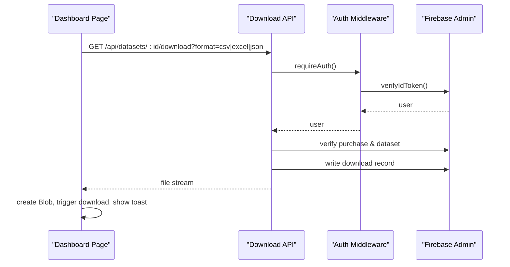
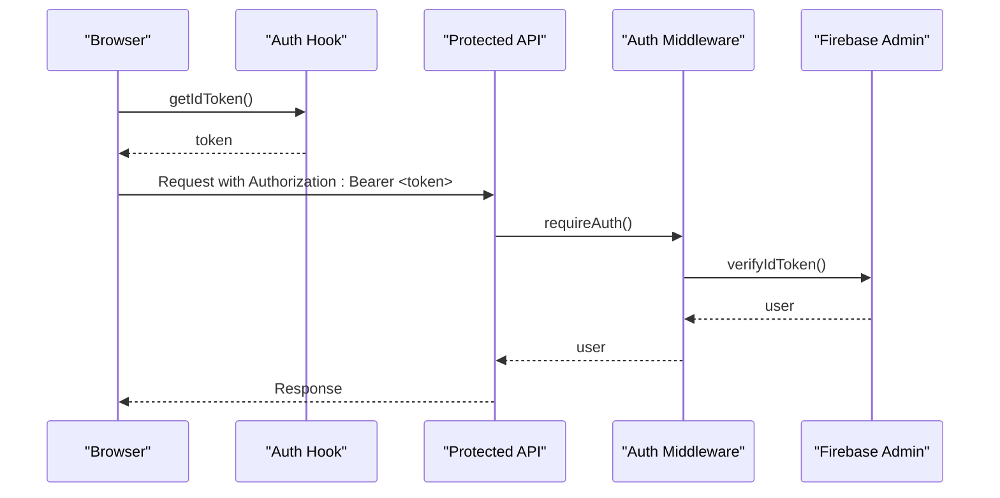
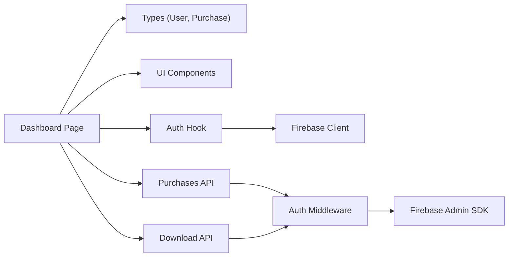

# User Dashboard

<cite>
**Referenced Files in This Document**
- [page.tsx](file://src/app/dashboard/page.tsx)
- [use-auth.tsx](file://src/hooks/use-auth.tsx)
- [auth-middleware.ts](file://src/lib/auth-middleware.ts)
- [route.ts](file://src/app/api/user/purchases/route.ts)
- [route.ts](file://src/app/api/datasets/[id]/download/route.ts)
- [layout.tsx](file://src/app/layout.tsx)
- [navbar.tsx](file://src/components/layout/navbar.tsx)
- [index.ts](file://src/types/index.ts)
- [firebase-admin.ts](file://src/lib/firebase-admin.ts)
- [globals.css](file://src/app/globals.css)
</cite>

## Table of Contents
1. [Introduction](#introduction)
2. [Project Structure](#project-structure)
3. [Core Components](#core-components)
4. [Architecture Overview](#architecture-overview)
5. [Detailed Component Analysis](#detailed-component-analysis)
6. [Dependency Analysis](#dependency-analysis)
7. [Performance Considerations](#performance-considerations)
8. [Accessibility and Responsive Design](#accessibility-and-responsive-design)
9. [Troubleshooting Guide](#troubleshooting-guide)
10. [Conclusion](#conclusion)

## Introduction
This document describes the authenticated user dashboard for Datafrica. It covers the dashboard layout and component organization, including purchase history, download management, and profile information. It also explains the user profile system, purchase history functionality, download management for accessing purchased datasets, authentication integration, API routes for retrieving user-specific data, and responsive design and accessibility considerations.

## Project Structure
The dashboard is a client-side Next.js page that renders user-specific content and interacts with backend APIs. Authentication is provided via a React context that integrates with Firebase. The dashboard consumes two primary APIs:
- Purchase history endpoint for the logged-in user
- Dataset download endpoint with format selection

**Diagram sources**
- [page.tsx:32-103](file://src/app/dashboard/page.tsx#L32-L103)
- [use-auth.tsx:34-108](file://src/hooks/use-auth.tsx#L34-L108)
- [route.ts:5-30](file://src/app/api/user/purchases/route.ts#L5-L30)
- [route.ts:7-147](file://src/app/api/datasets/[id]/download/route.ts#L7-L147)
- [auth-middleware.ts:4-28](file://src/lib/auth-middleware.ts#L4-L28)
- [firebase-admin.ts:12-49](file://src/lib/firebase-admin.ts#L12-L49)

**Section sources**
- [layout.tsx:26-49](file://src/app/layout.tsx#L26-L49)
- [page.tsx:32-103](file://src/app/dashboard/page.tsx#L32-L103)

## Core Components
- Dashboard page: orchestrates user greeting, stats cards, tabs for purchases and profile, and handles downloads.
- Auth hook: manages Firebase authentication state, user profile sync with Firestore, and ID token retrieval.
- Auth middleware: verifies Bearer tokens and enforces authentication on protected endpoints.
- Purchases API: returns the current user’s purchase history.
- Download API: validates purchase eligibility and generates downloadable files in CSV, Excel, or JSON formats.

Key responsibilities:
- Dashboard page: fetches purchases, renders purchase rows with status badges, and triggers downloads.
- Auth hook: ensures user context is available and provides getIdToken for protected requests.
- Auth middleware: decodes Firebase ID tokens and checks admin roles when required.
- Purchases API: queries Firestore purchases for the authenticated user.
- Download API: validates purchase status, optionally validates a one-time download token, records the download, and streams the generated file.

**Section sources**
- [page.tsx:32-312](file://src/app/dashboard/page.tsx#L32-L312)
- [use-auth.tsx:22-108](file://src/hooks/use-auth.tsx#L22-L108)
- [auth-middleware.ts:4-47](file://src/lib/auth-middleware.ts#L4-L47)
- [route.ts:5-30](file://src/app/api/user/purchases/route.ts#L5-L30)
- [route.ts:7-147](file://src/app/api/datasets/[id]/download/route.ts#L7-L147)

## Architecture Overview
The dashboard is rendered client-side and relies on:
- Client-side routing and state (Next/React)
- Firebase client SDK for authentication state
- Firebase Admin SDK (server-side) for secure database operations
- Protected APIs secured by Firebase ID tokens

**Diagram sources**
- [page.tsx:44-103](file://src/app/dashboard/page.tsx#L44-L103)
- [route.ts:5-30](file://src/app/api/user/purchases/route.ts#L5-L30)
- [route.ts:7-147](file://src/app/api/datasets/[id]/download/route.ts#L7-L147)
- [auth-middleware.ts:4-28](file://src/lib/auth-middleware.ts#L4-L28)
- [firebase-admin.ts:12-49](file://src/lib/firebase-admin.ts#L12-L49)

## Detailed Component Analysis

### Dashboard Layout and Sections
- Header: displays dashboard title and welcome message with user’s display name or email.
- Stats cards: total purchases, datasets available, and user info (email and role).
- Tabs:
  - My Purchases: lists purchase rows with status, date, amount, and format-specific download buttons (CSV, Excel, JSON).
  - Profile: shows name, email, role, and membership date.

Purchase row rendering includes:
- Status badge reflecting completion state.
- Creation date and formatted amount/currency.
- Buttons to download in different formats.
- Link to dataset preview page.

Profile section shows:
- Name, email, role, and member since date.

Responsive behavior:
- Grid layout adjusts from single column to three columns on medium screens.
- Tab layout stacks on small screens.

**Section sources**
- [page.tsx:116-312](file://src/app/dashboard/page.tsx#L116-L312)

### Purchase History Functionality
- Fetching purchases:
  - Uses the auth hook to obtain a Firebase ID token.
  - Calls the purchases API with an Authorization header.
  - On success, stores purchases in state; otherwise, sets loading to false and continues.
- Rendering:
  - Skeleton loaders while loading.
  - Empty state with a call-to-action to browse datasets.
  - Purchase rows with status badges and format buttons.

Data model:
- Purchase includes identifiers, amounts, currency, payment method, transaction ID, status, and timestamps.

**Section sources**
- [page.tsx:44-66](file://src/app/dashboard/page.tsx#L44-L66)
- [route.ts:5-30](file://src/app/api/user/purchases/route.ts#L5-L30)
- [index.ts:30-41](file://src/types/index.ts#L30-L41)

### Download Management System
- Triggering downloads:
  - The dashboard calls the dataset download endpoint with a format query parameter.
  - The request includes the Bearer token from the auth hook.
- Server-side validation:
  - Verifies the ID token.
  - Confirms the user purchased the dataset and the purchase status is completed.
  - Optionally validates a one-time download token if provided.
  - Records the download event.
  - Streams the file in requested format (CSV via Papa, Excel via SheetJS, JSON).
- Client-side handling:
  - On success, creates a Blob, constructs a temporary link, and triggers a browser download.
  - Shows success/error notifications.

**Diagram sources**
- [page.tsx:68-103](file://src/app/dashboard/page.tsx#L68-L103)
- [route.ts:7-147](file://src/app/api/datasets/[id]/download/route.ts#L7-L147)
- [auth-middleware.ts:19-28](file://src/lib/auth-middleware.ts#L19-L28)
- [firebase-admin.ts:12-49](file://src/lib/firebase-admin.ts#L12-L49)

**Section sources**
- [page.tsx:68-103](file://src/app/dashboard/page.tsx#L68-L103)
- [route.ts:7-147](file://src/app/api/datasets/[id]/download/route.ts#L7-L147)

### User Profile System
- Profile display:
  - Name, email, role, and membership date are shown in the profile tab.
- Profile updates:
  - The auth hook exposes updateProfile during sign-up and sign-in flows, ensuring the user’s display name is set in Firebase and persisted in Firestore as part of the user document.
- Role-based navigation:
  - The navbar conditionally shows the Admin panel link when the user role is admin.

**Section sources**
- [page.tsx:277-308](file://src/app/dashboard/page.tsx#L277-L308)
- [use-auth.tsx:69-82](file://src/hooks/use-auth.tsx#L69-L82)
- [navbar.tsx:38-45](file://src/components/layout/navbar.tsx#L38-L45)

### Authentication Integration
- Client-side:
  - The AuthProvider subscribes to Firebase Auth state and synchronizes a Firestore user document.
  - Provides getIdToken to the dashboard for protected API calls.
- Server-side:
  - requireAuth verifies the Bearer token and returns either the decoded user or a 401 response.
  - The dashboard fetches purchases and initiates downloads with the token.

**Diagram sources**
- [use-auth.tsx:94-99](file://src/hooks/use-auth.tsx#L94-L99)
- [auth-middleware.ts:19-28](file://src/lib/auth-middleware.ts#L19-L28)
- [firebase-admin.ts:30-35](file://src/lib/firebase-admin.ts#L30-L35)

**Section sources**
- [use-auth.tsx:34-108](file://src/hooks/use-auth.tsx#L34-L108)
- [auth-middleware.ts:4-28](file://src/lib/auth-middleware.ts#L4-L28)

### API Routes for User-Specific Data
- GET /api/user/purchases
  - Purpose: Retrieve the current user’s purchase history.
  - Behavior: Requires a valid ID token; queries Firestore purchases collection filtered by userId and orders by creation date descending.
- GET /api/datasets/[id]/download
  - Purpose: Serve a purchased dataset in CSV, Excel, or JSON format.
  - Behavior: Requires a valid ID token; verifies purchase status is completed; optionally validates a one-time download token; records the download; streams the file.

**Section sources**
- [route.ts:5-30](file://src/app/api/user/purchases/route.ts#L5-L30)
- [route.ts:7-147](file://src/app/api/datasets/[id]/download/route.ts#L7-L147)

## Dependency Analysis
- Dashboard depends on:
  - Auth hook for user context and token retrieval.
  - UI primitives from shared components (cards, tabs, buttons, badges, separators, skeletons).
- APIs depend on:
  - Auth middleware for token verification.
  - Firebase Admin SDK for Firestore reads/writes and storage operations.

**Diagram sources**
- [page.tsx:1-31](file://src/app/dashboard/page.tsx#L1-L31)
- [index.ts:3-41](file://src/types/index.ts#L3-L41)
- [use-auth.tsx:1-20](file://src/hooks/use-auth.tsx#L1-L20)
- [route.ts:1-30](file://src/app/api/user/purchases/route.ts#L1-L30)
- [route.ts:1-147](file://src/app/api/datasets/[id]/download/route.ts#L1-L147)
- [auth-middleware.ts:1-17](file://src/lib/auth-middleware.ts#L1-L17)
- [firebase-admin.ts:1-49](file://src/lib/firebase-admin.ts#L1-L49)

**Section sources**
- [page.tsx:1-31](file://src/app/dashboard/page.tsx#L1-L31)
- [index.ts:3-41](file://src/types/index.ts#L3-L41)
- [use-auth.tsx:1-20](file://src/hooks/use-auth.tsx#L1-L20)
- [route.ts:1-30](file://src/app/api/user/purchases/route.ts#L1-L30)
- [route.ts:1-147](file://src/app/api/datasets/[id]/download/route.ts#L1-L147)
- [auth-middleware.ts:1-17](file://src/lib/auth-middleware.ts#L1-L17)
- [firebase-admin.ts:1-49](file://src/lib/firebase-admin.ts#L1-L49)

## Performance Considerations
- Token caching: The auth hook retrieves and caches the ID token; avoid unnecessary re-fetches by reusing getIdToken within the same session.
- Conditional rendering: Skeleton loaders reduce perceived load time while data is being fetched.
- Minimal re-renders: State updates for purchases and loading flags are scoped to the dashboard page.
- File generation: CSV/Excel/JSON generation occurs server-side; ensure dataset sizes are reasonable to prevent long processing times.

## Accessibility and Responsive Design
- Responsive layout:
  - Stats cards stack on small screens and form a three-column grid on medium screens.
  - Tabs content adapts to screen width.
  - Navbar collapses into a mobile menu with theme toggle and user actions.
- Accessibility:
  - Semantic HTML and proper heading hierarchy.
  - Focus management in interactive elements (buttons, dropdowns).
  - Sufficient color contrast and readable typography via global styles.
  - Toast notifications provide feedback for actions.

**Section sources**
- [page.tsx:127-167](file://src/app/dashboard/page.tsx#L127-L167)
- [page.tsx:169-312](file://src/app/dashboard/page.tsx#L169-L312)
- [navbar.tsx:95-163](file://src/components/layout/navbar.tsx#L95-L163)
- [globals.css:115-120](file://src/app/globals.css#L115-L120)

## Troubleshooting Guide
Common issues and resolutions:
- Unauthorized access to purchases or downloads:
  - Ensure the Authorization header includes a valid Bearer token obtained from getIdToken.
  - Confirm the token is not expired and matches the authenticated user.
- No purchases displayed:
  - Verify the user has completed purchases and the purchases API returns data for the current user.
- Download fails:
  - Check that the purchase status is completed and the dataset exists.
  - If using a token, confirm it is unexpired and not already used.
  - Inspect network errors and toast messages for specific failure reasons.

**Section sources**
- [page.tsx:44-66](file://src/app/dashboard/page.tsx#L44-L66)
- [page.tsx:68-103](file://src/app/dashboard/page.tsx#L68-L103)
- [route.ts:5-30](file://src/app/api/user/purchases/route.ts#L5-L30)
- [route.ts:31-68](file://src/app/api/datasets/[id]/download/route.ts#L31-L68)

## Conclusion
The Datafrica user dashboard provides a focused, authenticated experience centered on purchase history, dataset downloads, and profile information. It leverages Firebase for authentication and Firestore for user and purchase data, with protected APIs enforcing access control. The UI is responsive and accessible, with clear feedback for user actions. The modular architecture allows for straightforward extension, such as adding profile editing capabilities or expanding download formats.